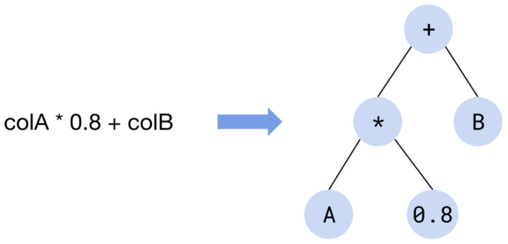
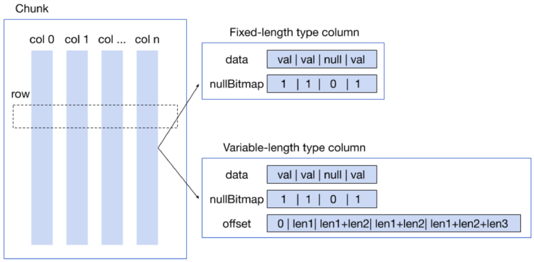
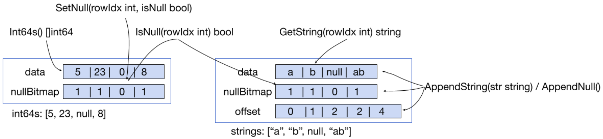
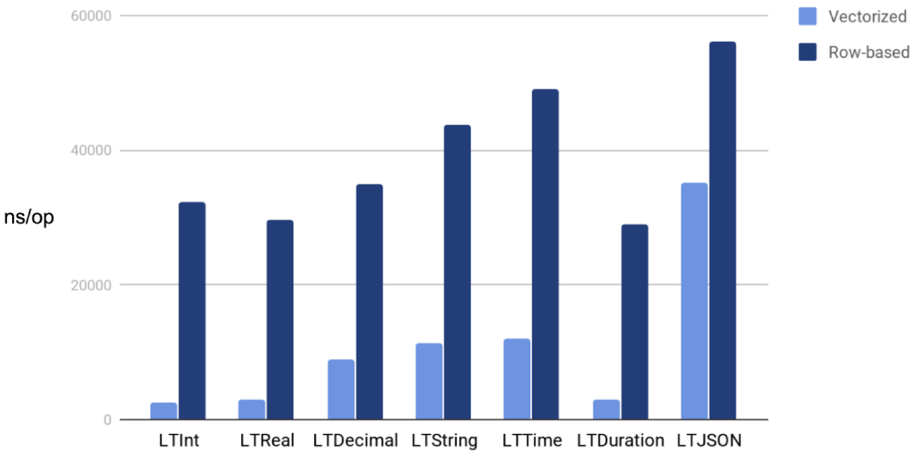
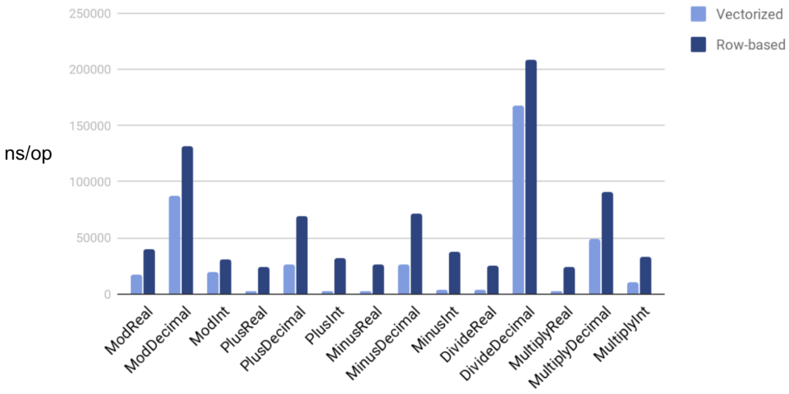
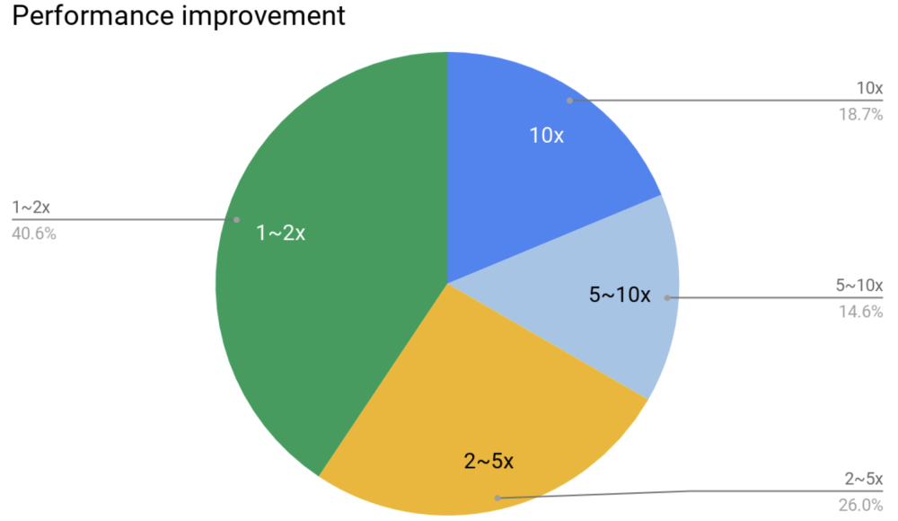

The query execution engine plays an important role in database system performance. [TiDB](https://en.wikipedia.org/wiki/TiDB), an open-source MySQL-compatible [Hybrid Transactional/Analytical Processing](https://en.wikipedia.org/wiki/Hybrid_transactional/analytical_processing_(HTAP)) (HTAP) database, implemented the widely-used [Volcano model](https://paperhub.s3.amazonaws.com/dace52a42c07f7f8348b08dc2b186061.pdf) to evaluate queries. Unfortunately, when querying a large dataset, the Volcano model caused high interpretation overhead and low CPU cache hit rates.

Inspired by the paper [MonetDB/X100: Hyper-Pipelining Query Execution](http://cidrdb.org/cidr2005/papers/P19.pdf), we began to employ vectorized execution in TiDB to improve query performance. (Besides this article, we also suggest you take Andy Pavlo's course on [Query Execution](https://www.youtube.com/watch?v=L5NhM7kw6Eg&list=PLSE8ODhjZXjbohkNBWQs_otTrBTrjyohi&index=12), which details principles about execution models and expression evaluation.)

At the end of 2017, we performed three optimizations on the TiDB SQL execution engine:

* Implemented a column-oriented memory layout to store data tuples in the execution engine. This approach is analogous to the memory layout used by Apache Arrow. See [pull request (PR) #4856](https://github.com/pingcap/tidb/pull/4856).
* Changed the once-per-tuple iteration (the Volcano model) to a once-per-batch iteration (1024 tuples). See [PR #5178](https://github.com/pingcap/tidb/pull/5178).
* Optimized various query operators based on the principles of vectorized query execution. See [PR #5184](https://github.com/pingcap/tidb/pull/5184).

Benefited by these optimizations, [TiDB 2.0](https://pingcap.com/blog/tidb-2-0-announcement/) significantly boosted analytical query performance, compared with TiDB 1.0. For information on the TPC-H benchmark we used, see [TiDB TPC-H 50G Performance Test Report](https://github.com/pingcap/docs/blob/release-2.1/benchmark/v2.1-performance-benchmarking-with-tpch.md).

Later, we released [TiDB 2.1](https://pingcap.com/blog/tidb-2.1-ga-Battle-tested-to-handle-an-unpredictable-world/) and [TiDB 3.0](https://pingcap.com/blog/tidb-3.0-announcement/), and our vectorized execution engine has become more stable. We're now developing TiDB 4.0, which includes vectorizing expressions to further improve TiDB's performance.

In this post, I'll deep dive into why we need vectorized execution, how we implement it, how we managed to vectorize more than 360 functions along with community contributors, and our thoughts about the future.

## Why do we need vectorized execution?

Previously, TiDB implemented the Volcano-style execution engine. This iterator model uses a standard data access interface. It has open()-next()-close() between algebra operators and processes data row by row. The Volcano model is simple and extensible.

But when evaluating large queries, the Volcano model causes high interpretation overhead. In addition, it cannot make the best of modern CPU hardware characteristics, such as CPU cache, branch prediction, and instruction pipelining.

Vectorized execution executes a sequential set of similar data items in memory using a single instruction. Compared with the Volcano model, the vectorization model greatly reduces the interpretation overhead. Therefore, we choose vectorized execution.

In this section, I'll use the TiDB expression `colA * 0.8 + colB` to show the overhead gap between row-based execution and vectorized execution.

According to arithmetic operators and their operator precedence, TiDB parses this expression into an expression evaluation tree.

In this tree, each non-leaf node represents an arithmetic operator, and the leaf node represents the data source. Each non-leaf node is either a constant (like `0.8`) or a field (like `colA`) in the table. The parent-child relationship between nodes indicates a computationally dependent relationship: the evaluation result of the child node is the input data for the parent node.


<div class="caption-center"> An expression evaluation tree </div>

The computing logic of each node can be abstracted as the following evaluation interface:

```
type Node interface {
    evalReal(row Row) (val float64, isNull bool)
}
```

Taking `*`, `0.8`, and `col` nodes as examples, all three nodes implement the interface above. Their pseudocode is as follows:

```
func (node *multiplyRealNode) evalReal(row Row) (float64, bool) {
    v1, null1 := node.leftChild.evalReal(row)
    v2, null2 := node.rightChild.evalReal(row)
    return v1 * v2, null1 || null2
}

func (node *constantNode) evalReal(row Row) (float64, bool) {
    return node.someConstantValue, node.isNull  // 0.8 in this case
}

func (node *columnNode) evalReal(row Row) (float64, bool) {
    return row.GetReal(node.colIdx)
}
```

### The interpretation overhead of row-based execution

Similar to the Volcano model, the expression implementation discussed above is iterating over rows.

How much is the interpretation overhead for row-by-row iteration? Let's take a look at the implementation of a function in TiDB.

The `builtinArithmeticMultiplyRealSig` function multiplies two floating-point numbers. The following code block describes the implementation of this function. The numbers on the right indicate the number of assembly instructions for the corresponding row, which are obtained after code assembling. Note that this block includes only rows that are iterated in normal conditions, and ignores logic for error processing.

```
func (s *builtinArithmeticMultiplyRealSig) evalReal(row chunk.Row) (float64, bool,
error) {                                                                              9
  a, isNull, err := s.args[0].EvalReal(s.ctx, row)                                    27
  if isNull || err != nil {                                                           3
     return 0, isNull, err
  }
  b, isNull, err := s.args[1].EvalReal(s.ctx, row)                                    25
  if isNull || err != nil {                                                           3
     return 0, isNull, err
  }
  result := a * b                                                                     2
  if math.IsInf(result, 0) {                                                          6
     return 0, true, types.ErrOverflow.GenWithStackByArgs(...)
  }
  return result, false, nil                                                           7
}
```

The following table lists each `builtinArithmeticMultiplyRealSig` function task and the number of assembly instructions to perform it. (If a task requires multiple lines of code, the number of instructions per line is shown in parentheses.)

<table>
  <tr>
   <td><strong>Task</strong>
   </td>
   <td><strong># of instructions</strong>
   </td>
  </tr>
  <tr>
   <td>Check the stack and call the process function
   </td>
   <td>9
   </td>
  </tr>
  <tr>
   <td>Obtain data of the first child node
   </td>
   <td>30 (27+3)
   </td>
  </tr>
  <tr>
   <td>Obtain data of the second child node
   </td>
   <td>28 (25+3)
   </td>
  </tr>
  <tr>
   <td>Perform multiplication and check for errors
   </td>
   <td>8 (2+6)
   </td>
  </tr>
  <tr>
   <td>Process the result returned by the function
   </td>
   <td>7
   </td>
  </tr>
</table>

As the table reveals, every time this function performs a multiplication, only 8 out of 82 (9+30+28+8+7=82) instructions are doing the "real" multiplication. That's only about 10% of the total instructions. The other 90% are considered interpretation overhead. Once we vectorized this function, its performance was improved by nearly nine times. See [PR #12543](https://github.com/pingcap/tidb/pull/12543).

### Batch processing reduces interpretation overhead

Like vectorized optimization for SQL operators, we can process and return one batch of data at a time. This decreases the interpretation overhead in the expression evaluation process.

Assume that there are 1024 rows in a batch of data. After optimization, every time a function is called, 1024 rows of data are processed and then returned. The interpretation overhead for function calling becomes 1/1024 of the original one.

Therefore, we can add the following interface to evaluate an expression in a batch way:

```
type Node interface {
  batchEvalReal(rows []Row) (vals []float64, isNull []bool)
}
```

## What does our vector-processing interface look like? Why?

The real source code is not exactly the same as the model shown above. It looks like this:

```
type VecNode interface {
  vecEvalReal(input *Chunk, result *Column)
}
```

You might wonder why.

To explain the reason, let me briefly introduce TiDB's `Chunk` structure, which is the data representation in memory during the query execution phase.

At the end of 2017, we were working on vector optimization and introduced the concept of a `Chunk`. A `Chunk` is composed of multiple columns.

There are two types of columns:

* Fixed-length columns, in which the data has a specified length that cannot be changed.
* Variable-length columns, in which the data length can change.


<div class="caption-center"> TiDB's Chunk structure </div>

No matter whether the data length is fixed or variable, data in columns are contiguously stored in memory in the `Column.data` field (which is an array). If the data length varies, `Column.offset` records the data offset. If the data is with fixed length, no offset is recorded.

The following figure illustrates the new vector access interface we've recently introduced for `Chunk`s:


<div class="caption-center"> New vector access interface </div>

* For fixed-length data, such as int64 numbers, the Golang `unsafe` package directly converts `Column.data` to `[]int64` in `Int64s() []int64`, and returns the result. The user who wants to read or modify `Column.data` can directly manipulate the array. This is the most efficient way to access fixed-length data.

* For variable-length data, such as a string, we can use only `GetString(rowIdx int) string` to obtain the data in the corresponding row, and only append data to update it.  Randomly modifying an element in the variable-length data column involves moving all the subsequent data. This creates a heavy overhead. To improve the overall performance, this operation is not implemented in `Column`.

Now that you understand the basics of TiDB `Chunk`s, let's come back to the interface design.

Based on the `Chunk` implementation and the Golang characteristics, we optimized the expression evaluation interface in these aspects:

* We directly passed `*Chunk` instead of `[]Row` to avoid creating a large number of `Row` objects. This reduced the pressure on Golang garbage collection (GC) and improved the performance.

* We accessed data (which was stored in `Column.data`) via `Column` instead of `Row` to reduce the number of function calls. This helped decrease interpretation overhead and speed up accessing data.

* We put columns for storing data in parameters and passed the parameters instead of directly returning `[]float64` and `[]bool` arrays. This improved the memory reuse rate and reduced the Golang GC overhead.

Based on these optimizations, our expression vectorization evaluation interface has become what it is today.

<div class="trackable-btns">
    <a href="https://pingcap.com/download" onclick="trackViews('10x Performance Improvement for Expression Evaluation Made Possible by Vectorized Execution and the Community', 'download-tidb-btn-middle')"><button>Download TiDB</button></a>
    <a href="https://share.hsforms.com/1e2W03wLJQQKPd1d9rCbj_Q2npzm" onclick="trackViews('10x Performance Improvement for Expression Evaluation Made Possible by Vectorized Execution and the Community', 'subscribe-blog-btn-middle')"><button>Subscribe to Blog</button></a>
</div>

## How do we implement vectorized execution?

This section covers how to implement vectorized execution for functions.

Take `multiplyRealNode` as an example:

```
func (node *multiplyRealNode) vecEvalReal(input *Chunk, result *Column) {
  buf := pool.AllocColumnBuffer(TypeReal, input.NumRows())
  defer pool.ReleaseColumnBuffer(buf)
  node.leftChild.vecEvalReal(input, result)
  node.rightChild.vecEvalReal(input, buf)

  f64s1 := result.Float64s()
  f64s2 := buf.Float64s()
  result.MergeNulls(buf)
  for i := range i64s1 {
     if result.IsNull(i) {
        continue
     }
     i64s1[i] *= i64s2[i]
  }
}
```

For this function:

1. The first two lines apply for `ColumnBuffer` in the cache pool to cache the data of the right child (second parameter). The data of the left child (first parameter) is stored in memory which is pointed to the `result` pointer.

2. `Columns.MergeNulls(cols...)` merges `NULL` flags of multiple columns. This method is like `result.nulls[i] = result.nulls[i] || buf.nulls[i]`. `Column` internally uses a bitmap to maintain `NULL` flags. When this function is called, a column does a bitwise operation to merge `NULL`s.

3. A loop directly multiplies the data of the left and right child nodes.

4. During the multiplication process, this function calls the left and right child interfaces to get their data.

This implementation method diminishes the interpretation overhead by batch processing and is more beneficial to modern CPUs:

* A vector of data is sequentially accessed. This reduces CPU cache misses.
* Most of the computational work is within a simple loop. This facilitates CPU branch prediction and instruction pipelining.

## Benchmark comparison between vectorized execution and row-based execution

In this section, I'll use the TiDB source code for benchmark testing and compare the performance before and after code vectorization.

We use the same data (1024 rows formed by two columns of floating-point numbers) to respectively compute `col0 * 0.8 + col1` in two ways: row-based execution and vectorized execution. The results are as follows:

```
BenchmarkVec-12           152166              7056 ns/op               0 B/op          0 allocs/op
BenchmarkRow-12            28944             38461 ns/op               0 B/op          0 allocs/op
```

The results above show vectorized execution is four times faster than row-based execution.

The following figure compares the performance of various less than (`LT`) functions before and after vectorization. The horizontal axis indicates the `LT` functions for testing, and the vertical axis represents the execution duration (in nanoseconds) to complete an operation.


<div class="caption-center"> Before-and-after performance comparison for various LT functions </div>

The following figure compares the performance of arithmetic functions before and after vectorization:


<div class="caption-center"> Before-and-after performance comparison for arithmetic functions </div>

After we tested more than 300 vectorized functions, we found that **over 50% of these functions more than doubled their performance, and 18.7% of functions achieved 10x performance**.


<div class="caption-center"> Performance improvement for vectorized functions </div>

## How do we vectorize 360+ built-in functions?

On our journey towards TiDB 4.0, expression vectorization is a huge project, as expressions involve more than 500 built-in functions. Since we have so many built-in functions in TiDB's code—and a fairly small staff—handcrafting these built-in functions one by one is a nearly impossible mission.

To develop our code more efficiently, we're vectorizing as many built-in functions as we can by using the Golang [`text/template`](https://golang.org/pkg/text/template/). This template generates the source code of vectorized functions. To get more people working on the project, we founded the [Vectorized Expression Working Group](https://github.com/pingcap/community/blob/master/working-groups/wg-vec-expr.md) in the developer community. In this approach, community contributors take the vast majority of work during the vectorizing progress.

With our joint efforts, we have refactored more than two-thirds of our built-in functions, and most of them have gained an impressive performance boost. Some have even achieved performance gains of one or two orders of magnitude.

### Vectorization using a template

When we vectorized built-in functions, we found that many functions had similarities. For example, most of the LT (`<`), GT (`>`), and LE (`<=`) functions have similar logic. They only differ in the operators they use. Therefore, it's possible to use a template to generate the code of these functions.

Currently, Golang doesn't support generic types and macro definition, so we use the [`text/template`](https://golang.org/pkg/text/template/) package to generate code.

Based on the syntax of the Golang template, we abstract the functions to be generated into a template. For example, here is the template for comparison functions like `LT` and `GT`:

```
var builtinCompareVecTpl = template.Must(template.New("").Parse(`
func (b *builtin{{ .compare.CompareName }}{{ .type.TypeName }}Sig) vecEvalInt(input *chunk.Chunk, result *chunk.Column) error {
    n := input.NumRows()
    buf0, err := b.bufAllocator.get(types.ET{{ .type.ETName }}, n)
    if err != nil {
        return err
    }
    if err := b.args[0].VecEval{{ .type.TypeName }}(b.ctx, input, buf0); err != nil {
        return err
    }
    ...
    for i := 0; i < n; i++ {
{{ if eq .type.ETName "Json" }}
        val := json.CompareBinary(buf0.GetJSON(i), buf1.GetJSON(i))
{{ else if eq .type.ETName "Real" }}
        val := types.CompareFloat64(arg0[i], arg1[i])
{{ else if eq .type.ETName "String" }}
        val := types.CompareString(buf0.GetString(i), buf1.GetString(i))
        ...

        if val {{ .compare.Operator }} 0 {
            i64s[i] = 1
        } else {
            i64s[i] = 0
        }
    }
    return nil
}
```

For different types of data and operators, the template generates the corresponding code. For the complete code, see [PR #12875](https://github.com/pingcap/tidb/pull/12875).

This template is in the `expression/generator` package. We can run the `main()` function in this template file to generate the corresponding built-in function code (`xx_vec_generated.go`) in the expression package.

### Vectorization with the community's help

Besides using a template to vectorize built-in functions, we also started our [vectorization campaign](https://github.com/pingcap/tidb/issues/12058) in the community to get more hands involved in vectorization. At the beginning of the campaign, we found that when we merged PRs, conflicts often occurred. Therefore, we wrote a script to generate vectorization interfaces for all built-in functions, and reserved these interfaces in the code:

```
func (b *builtinCastStringAsIntSig) vecEvalInt(input *chunk.Chunk, result *chunk.Column) error {
  return errors.Errorf("not implemented")
}

func (b *builtinCastStringAsDurationSig) vectorized() bool {
  return false
}
```

Since then, we've been asking contributors to fill or refactor the functions they're interested in.

Reserving function interfaces can avoid conflicts caused by different pull requests simultaneously modifying the same document when merging code.

We also wrote a testing framework. After a contributor vectorizes the function, they can use the framework to test the correctness and performance of a built-in function by writing just a few simple lines of configuration.

As shown in the code below, a contributor only needs to add related parameters to `vecBuiltinArithemeticCases`.

```
var vecBuiltinArithmeticCases = map[string][]vecExprBenchCase{
  ast.Div: {
     {retEvalType: types.ETReal, childrenTypes: []types.EvalType{types.ETReal, types.ETReal}},
  },
}

func (s *testEvaluatorSuite) TestVectorizedBuiltinArithmeticFunc(c *C) {
  testVectorizedBuiltinFunc(c, vecBuiltinArithmeticCases)
}

func BenchmarkVectorizedBuiltinArithmeticFunc(b *testing.B) {
  benchmarkVectorizedBuiltinFunc(b, vecBuiltinArithmeticCases)
}
```

Next, they can run following two functions that we've written. Then, they can perform correctness and performance tests.

```
> GO111MODULE=on go test -check.f TestVectorizedBuiltinArithmeticFunc
PASS: builtin_arithmetic_vec_test.go:30: testEvaluatorSuite.TestVectorizedBuiltinArithmeticFunc 0.002s
OK: 1 passed
PASS
ok      github.com/pingcap/tidb/expression      0.636s

> go test -v -benchmem -run=BenchmarkVectorizedBuiltinArithmeticFunc -bench=BenchmarkVectorizedBuiltinArithmeticFunc
BenchmarkVectorizedBuiltinArithmeticFunc/builtinArithmeticDivideRealSig-VecBuiltinFunc-12                 424515              2808 ns/op               0 B/op          0 allocs/op
BenchmarkVectorizedBuiltinArithmeticFunc/builtinArithmeticDivideRealSig-NonVecBuiltinFunc-12               47856             25272 ns/op               0 B/op          0 allocs/op
PASS
ok      github.com/pingcap/tidb/expression      4.116s
```

Both correctness and performance tests directly generate random data and compare the performance of vectorized execution and row-based execution.

The two operations above help contributors easily vectorize our built-in functions.

With the community's help, we've vectorized more than 360 functions in just two months. During this period, our community contributors have filed 256 PRs.

This campaign also resulted in nine Active Contributors (who merge at least eight PRs in one year) and two Reviewers (who merge at least 30 PRs in one year).

## What's next

By introducing vectorized execution, we've dramatically improved the performance of expression execution. Currently, vectorized execution is enabled on our master branch by default. Once all built-in functions of an expression support vectorized execution, this expression will use vectorized execution. In the future, we'll also use vectorized execution to improve TiDB's HTAP capabilities.

Note that all the performance test data above is in memory. If the data is stored on disk, reading it might cause high overhead. In that case, the benefits of vectorized execution may be less noticeable. But on the whole, vectorized execution has noticeably enhanced the performance of TiDB expression evaluation.

In addition, when we vectorized expressions, we found that vectorized execution could be applied to many other cases to improve the performance. For example:

* In hash joins, we vector-calculated hash keys for the inner data (see [PR #12076](https://github.com/pingcap/tidb/pull/12076)) and outer data (see [PR #12669](https://github.com/pingcap/tidb/pull/12669)). In some scenarios, the performance improved by 7% and 18% respectively. We would like to thank a community contributor named [sduzh](https://github.com/sduzh) who finished these improvements all by himself.

* In hash aggregation, we vector-encoded data. In a local test, the performance was 20% to 60% faster than before. For details, see [PR #12729](https://github.com/pingcap/tidb/pull/12729).

* In the `StreamAggregation` operator, we vector-divided data into groups. In a local test, the performance improved by about 60%. For details, see [PR #12903](https://github.com/pingcap/tidb/pull/12903).

We welcome you to join us in our [vectorization campaign for built-in functions](https://github.com/pingcap/tidb/issues/12058).

In a future post, we'll introduce how we use the vectorization idea to optimize other parts of the SQL execution engine. Stay tuned.
