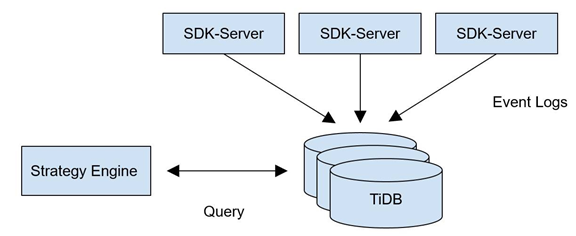
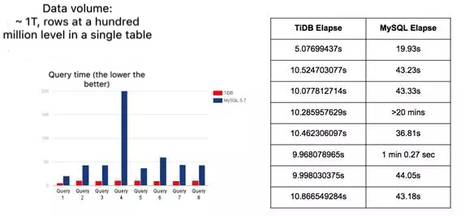

## Table of content

+ [Background](#background)
+ [MySQL, our first choice](#mysql-our-first-choice)
+ [Look for new solutions](#look-for-new-solutions)
+ [TiDB, give it a go](#tidb-give-it-a-go)
+ [Feedbacks from TiDB](#feedbacks-from-tidb)

## Background

[GAEA](http://www.gaea.com/en/) is a mobile gaming provider and aims to develop high-quality games for international players. GAEA uses its GaeaAD system to support the cross-platform real-time advertising system. GaeaAD performs a real-time match between the advertising data and the information reported by the game SDK. In other words, GaeaAD conducts a real-time analysis based on the data of the advertisements on different advertising channels and the amount of players brought by the corresponding channels, with the purpose of displaying and optimizing the conversion effects of advertising within minutes.

## MySQL, our first choice

Considering the amount of data and for a simplified implementation, GAEA chose the highly-available MySQL RDS storage solution at the very beginning of designing GaeaAD. At that time, we mainly used SQL Syntax to implement the matching logic, including many join table queries and aggregation operations. The system worked well and responded within one minute with tens of millions of rows of data.

## Look for new solutions

However, with the growth of business, GaeaAD receives more than tens of millions of rows of data per day and the amount multiplies during peak hours. Obviously, database has become a bottleneck. And at the moment, GAEA’s entire technical framework encounters three problems:

1. The time needed for a single match has increased to over 2 minutes from about 10 seconds. The slowest aggregation query, even takes 20 minutes to complete. This imposes a serious challenge on timeliness. What’s worse, one of the drawbacks of MySQL is the query time increases with the amount of data. Therefore, the larger the data volume, the slower the query.

2. With the accumulation of historical data, the amount of data stored in a single table soon reaches a hundred million rows. At that time, the read/write capabilities of the single table are close to its limit.

3. Due to the query performance mentioned above and the capacity limit of a standalone database, we have to delete data regularly. Thus, it is not possible to query the business data from a long time ago.

According to the data volume growth, we thought that distributed database would be a good solution. Vertically and horizontally splitting business, the middleware solutions based on MySQL and some predominant NoSQL solutions were all taken into consideration.

After a thorough assessment, we denied the solution of horizontally splitting business. Since the business logic contains lots of related queries and subqueries, it is impossible to achieve transparent compatibility if tables have been split. Besides, it is a core business system, we are not allowed to refactor it given the limited time and energy. The middleware solutions face similar problems with database sharding: even though it enables mass storage and real-time writing, it has a limited query flexibility. Moreover, the maintenance cost of multiple MySQL instances requires a second thought.

Then we continued to analyze the second choice, NoSQL. Since this system needs to support the concurrent real-time writing and query from the business-end, it is not suitable to use systems like Greenplum, Hive or SparkSQL, which are not designed for real-time writing. As for MongoDB, its document query access interface is a challenge for our business. Besides, we were not sure whether MongoDB could perform the efficient aggregate analysis under the condition of such a large amount of data.

In conclusion, what we want is a database that is as easy to use as MySQL, eliminating the trouble of modifying any business, and it meets the needs of distributed storage and a high performance of complex query.

We studied many distributed database solutions in the community and came upon TiDB. As the protocol layer of TiDB is compatible with MySQL and it supports complex query, we can power our applications without changing a single line of code. Besides, there is hardly any migration cost.

## TiDB, give it a go

In the process of test deployment, we used the Syncer tool, provided by TiDB, to deploy TiDB as a MySQL Slave to the MySQL master of the original business, testing the compatibility and stability of read/write. After a while, the system was proved to perform well in read/write so we decided to move the read request of the business layer to TiDB. Later, we also switch the write business to the TiDB cluster, making the system online smoothly.

The GaeaAD system works well for more than half a year since it has come online in October, 2016. Based on the hands-on experience, we summarized the following benefits brought by TiDB:

We replaced the highly-available MySQL RDS with the 3-node TiDB cluster. The average time needed for a single match reduces to about 30 seconds from over 2 minutes, and it even reaches to 10 seconds or so with the continuous optimization of TiDB’s engineers. In addition, we found that TiDB has superior advantages and outperforms MySQL especially when the data volume is large. We guess this owes to the existence of TiDB’s self-developed distributed SQL Optimizer. But when it comes to a small amount of data, this advantage is not that prominent because of the internal communication cost.

(A comparison between the query time of TiDB and MySQL in cases of different amounts of data)

1. TiDB supports automatic Sharding. The business side doesn’t need to split tables and TiDB no longer sets the Sharding key or partition table as a traditional database middleware product. Storage of the bottom layer automatically spreads across clusters according to the data distribution. The capacity and performance can be scaled horizontally through adding more nodes, greatly reducing the maintenance cost.

2. TiDB supports ongoing rolling upgrades. Up to now, we have about 10 online upgrades and never experienced one interrupt, which shows TiDB’s excellent availability.

3. TiDB supports the mutual backup with MySQL. This function solves the transition problem in business migration.

Currently, we are replacing MongoDB with TiDB as MongoDB is not easy to use, expensive to maintain and its query manner is not as flexible as traditional SQL. MongoDB once served as our data storage system of the real-time computing business of the BI system in the storm cluster. We are also planning to migrate the business that requires high real-time performance, large storage capacity and long storage cycle to TiDB, which seems to be a suitable scenario.

## Feedbacks from TiDB

TiDB helps GAEA in the following aspects:
1. TiDB supports many push-down expressions and makes full use of the computing resources of TiKV’s multiple instances and therefore, accelerates the computing speed. At the same time, TiDB filters as much unnecessary data as possible and reduces the network overhead.

2. TiDB supports HashJoin by default and tries hard to parallelize operators, making full use of the computing resources of the entire cluster.

3. TiDB reads data in a linear way and has optimized the IndexScan operator, shortening the startup time of the whole process.

**About the author:**

LIU Xuan, the senior development engineer of GAEA’s data platform, is responsible for the real-time data business and the data flow field. Graduated from College of Computer Science and Electronic Engineering of Hunan University, LIU was Baidu’s senior operation & maintenance engineer and was responsible for the database creating and maintenance of Search Service Group (SSG).
