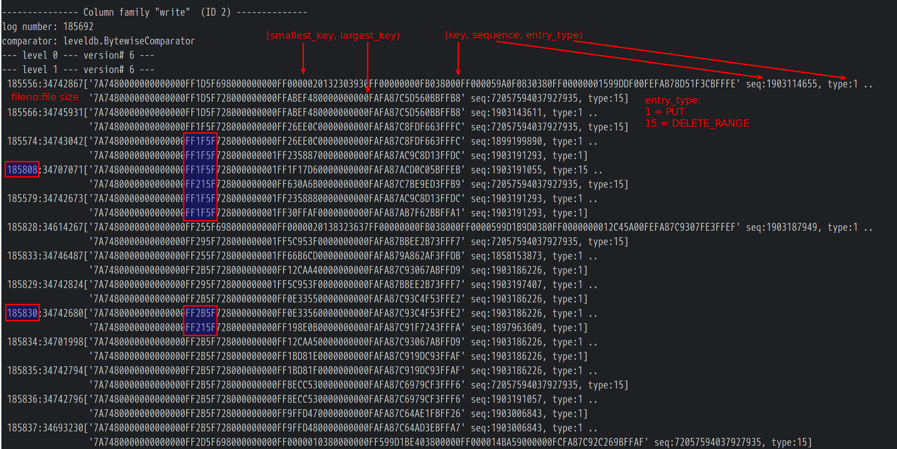
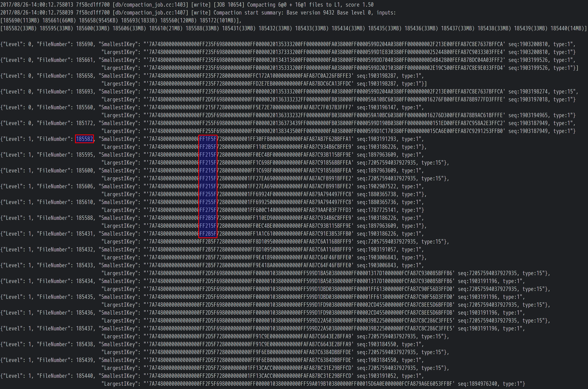
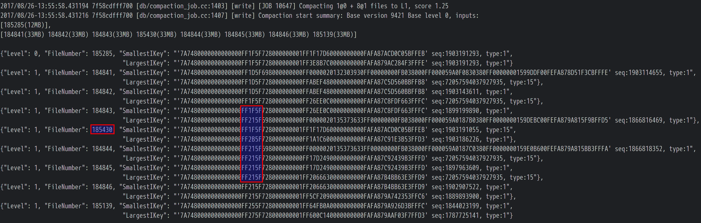
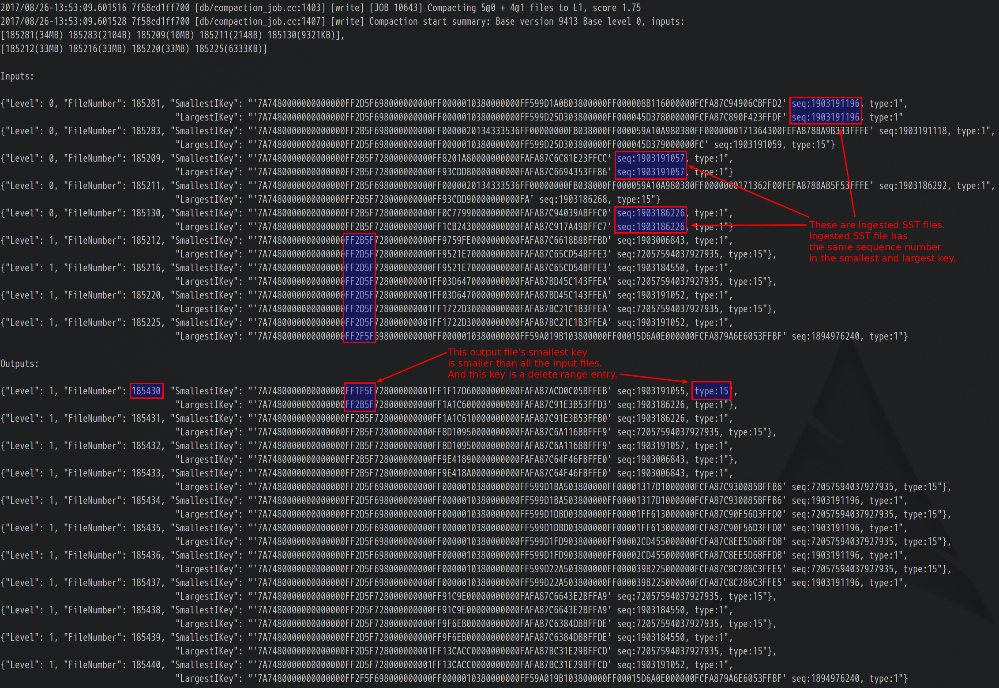

<span id="top"></span>

Data was corrupted. A cluster panicked. The crime scene was compromised. What happened? Detective Huang (huachao@pingcap.com) went all lengths to locate the criminal and solved it once and for all.

## Background
As a distributed open source HTAP database, [TiDB](https://github.com/pingcap/tidb) uses [TiKV](https://github.com/pingcap/tikv) as its storage engine. Inside TiKV, we use RocksDB as the local storage. RocksDB is a great project. It's mature, fast, tunable, and widely used in very large scale production environments. We have been working very closely with the RocksDB team. Recently, we found a bug in the DeleteRange feature in RocksDB.

Before we begin, let's introduce some basic knowledge about RocksDB first.

RocksDB is a log structured storage engine. All writes are append-only, and every write is assigned a globally increasing sequence number to distinguish it.

Let's use `(key,sequence,entry_type)` to denote an entry in RocksDB. If we put "a", "b", and "c", RocksDB will append three PUT entries to the disk: `(a,1,PUT),(b,2,PUT),(c,3,PUT)`. If we put it in a table, it goes like this:

<table>
  <tr>
    <td>key</td>
    <td>sequence</td>
    <td>entry_type</td>
  </tr>
  <tr>
    <td>c</td>
    <td>3</td>
    <td>PUT</td>
  </tr>
  <tr>
    <td>b</td>
    <td>2</td>
    <td>PUT</td>
  </tr>
  <tr>
    <td>a</td>
    <td>1</td>
    <td>PUT</td>
  </tr>
</table>

If we delete "c", RocksDB will not erase the `(c,3,PUT)` entry in place, but append a DELETE entry: `(c,4,DELETE)` instead, so the table becomes:

<table>
  <tr>
    <td>key</td>
    <td>sequence</td>
    <td>entry_type</td>
  </tr>
  <tr>
    <td>c</td>
    <td>4</td>
    <td>DELETE</td>
  </tr>
  <tr>
    <td>c</td>
    <td>3</td>
    <td>PUT</td>
  </tr>
  <tr>
    <td>b</td>
    <td>2</td>
    <td>PUT</td>
  </tr>
  <tr>
    <td>a</td>
    <td>1</td>
    <td>PUT</td>
  </tr>
</table>

Then if we try to get "c", RocksDB will encounter entry `(c,4,DELETE)` first and return that "c" is not found.

Of course, RocksDB cannot keep all the entries forever. It needs to compact and drop old entries when necessary. RocksDB organizes entries into SST (Sorted String Table) files, we can think of an SST as a big sorted array of key-value pairs in the disk, and SST files will be compacted into different levels later.

All the entries are appended to a WAL (Write Ahead Log) and a Memtable first. When the Memtable is large enough, it will be flushed to a new SST in Level-0. SST files in Level-0 can be overlapped with each other because they haven't been compacted yet. When the files in Level-0 are large enough, RocksDB will compact the SST files in Level-0 with overlapped SST files in Level-1, and then output new SST files to Level-1 without overlap. Then files in Level-1 will be compacted to the next level and so on. In short, only SST files in Level-0 can be overlapped, SST files under Level-0 must not overlap with each other in the same level.

Additionally, RocksDB logs some compaction information in its `LOG` file, including all the input and output file numbers of each compaction, and other useful statistics. RocksDB also records all deleted and added files of each compaction in the `MANIFEST` file, plus the information of all the files of each level. The `LOG` file and the `MANIFEST` file are two important sources to track RocksDB's behaviors, we will use them later.

Well, that's an overly simplified introduction to RocksDB, but enough to go on now.

## DeleteRange

Now we know how to delete a key in RocksDB, but what if we want to delete a range of keys? For example, if we want to delete keys in a range `[a,c)`, we can first scan keys in `[a,c)`, which are "a" and "b" in the above example, and delete them one by one. The result of the above example will be:

```
(a,1,PUT),(b,2,PUT),(c,3,PUT),(c,4,DELETE),(a,5,DELETE),(b,6,DELETE)
```
In the table, it looks like:
<table>
  <tr>
    <td>key</td>
    <td>sequence</td>
    <td>entry_type</td>
  </tr>
  <tr>
    <td>a</td>
    <td>6</td>
    <td>DELETE</td>
  </tr>
  <tr>
    <td>b</td>
    <td>5</td>
    <td>DELETE</td>
  </tr>
  <tr>
    <td>c</td>
    <td>4</td>
    <td>DELETE</td>
  </tr>
  <tr>
    <td>c</td>
    <td>3</td>
    <td>PUT</td>
  </tr>
  <tr>
    <td>a</td>
    <td>2</td>
    <td>PUT</td>
  </tr>
  <tr>
    <td>b</td>
    <td>1</td>
    <td>PUT</td>
  </tr>
</table>

That's how we delete a range in TiKV now, for example, to drop a table or destroy a replica. It's easy, but has two drawbacks:

1. A replica can contain a lot of keys, it's costly to scan them all
2. Deleting all keys appends a lot of delete entries. So as you can see, deleting data can result in more data temporarily (before compaction), and more IO amplification.

Let's see how the DeleteRange feature from RocksDB comes to rescue. In the above example, instead of scanning range `[a,c)` and delete "a" and "b" separately, we just append a DeleteRange entry `([a,c),5,DELETE_RANGE)`, which results in:

```
(a,1,PUT),(b,2,PUT),(c,3,PUT),(c,4,DELETE),([a,c),5,DELETE_RANGE)
```
In the table, it looks like:
<table>
  <tr>
    <td>key</td>
    <td>sequence</td>
    <td>entry_type</td>
  </tr>
  <tr>
    <td>[a,c)</td>
    <td>5</td>
    <td>DELETE_RANGE</td>
  </tr>
  <tr>
    <td>c</td>
    <td>4</td>
    <td>DELETE</td>
  </tr>
  <tr>
    <td>c</td>
    <td>3</td>
    <td>PUT</td>
  </tr>
  <tr>
    <td>a</td>
    <td>2</td>
    <td>PUT</td>
  </tr>
  <tr>
    <td>b</td>
    <td>1</td>
    <td>PUT</td>
  </tr>
</table>

Now, if we try to get "a", we will encounter the `DELETE_RANGE` first, and return that "a" is not found. That's good, we don't need to scan all data anymore, and the size of a DeleteRange entry can be ignored in face of a large range. So we planned to use the DeleteRange feature in TiKV and started to test it. 

## The BUG

Before telling the story, let's see how we check data in tests first. TiKV has a useful consistency check mechanism, which has helped to expose some serious bugs. When it is enabled, TiKV runs the consistency check periodically. Consistency check will calculate a hash of each replica and compare the hashes of all replicas to check whether they are consistent. If the hashes don't match, something must be terribly wrong, so it will panic.

Everything worked great until one of our test clusters panicked?

The panicked cluster, which we named it Cluster A, was running a branch with the DeleteRange feature, so that's why we started hunting the DeleteRange bug.

[Back to the top](#top)
### Round 1

There are 4 TiKV instances KV1, KV2, KV3, and KV4 in Cluster A, and the consistency check showed that we had an abnormal replica R2 in KV2, and two normal replicas R1 and R3 in KV1 and KV3. We used tikv-ctl to print out the diff of R2 and R1 to see what's wrong. The diff showed that R2 had lost some ranges of data, and some deleted data reappeared too. Since we were testing the DeleteRange branch in this cluster, we guessed that this could happen if a DeleteRange entry dropped some entries in a wrong way during the compaction.

We tried to collect more evidence to locate the problem, but unfortunately, the crime scene had been destroyed after we used tikv-ctl to open the underlying data directory, because tikv-ctl started RocksDB, which reorganized the data in some background compaction, and we hadn't made any backup.

However, the problem was still there, we did with what we got. We analyzed the log of the abnormal KV2 and found out that R2 sent a snapshot to R1 in 2017-08-15 11:46:17, and panicked in 2017-08-15 12:11:04. Since R1 was restored from R2's snapshot in 11:46:17 and R1 was OK in 12:11:04, it meant that R2 should be OK in 11:46:17, so what happened between 11:46:17~12:11:04? We assumed that one of the compaction in RocksDB between that time was wrong and started investigating RocksDB's `LOG` and `MANIFEST` files. The `LOG` file showed that some compactions were done in that time. We could do a cross-reference with the `MANIFEST` file to get more details. However, remembered that the crime scene had been destroyed? It meant that the `MANIFEST` file was truncated and the SST files generated in that time were deleted and we were stalled.

So we decided to deploy another test cluster, which we called it Cluster B, and hopefully, it would panic again soon so that we could have another fresh crime scene. Meanwhile, we kept investigating here and there, but still without any clue. We had no choice but tried to locate the bug in the source code of RocksDB directly. We believed that the bug was related to either the DeleteRange feature or the compaction, so we dived into there. After a few days, we got some suspicious places but still nothing solid, except to realize that the DeleteRange implementation was more complicated than we expected.

### Round 2

A few days later, Cluster B panicked again, so we were given another chance to hunt, let's go. This time, we protected the crime scene very well and made a backup before doing anything. 

The consistency check showed that we had an abnormal replica R3 in KV3, and two normal replicas R1 and R2 in KV1 and KV2. And yep, tikv-ctl showed that R3 had lost some data. The log of the abnormal KV3 showed a similar situation that R3 sent a snapshot to R1 in 13:42:59, and panicked in 14:01:34. This time we had the fresh `LOG` and `MANIFEST` files, we started to cross-reference them between 13:42:49~14:01:34. But there were a lot of files deleted and added  during the compaction at the time, it's still hard to find out what's wrong.

Luckily, we noticed in the `MANIFEST` file that something was wrong in Level-1 of column family "write":

1. Files in Level-1 should be sorted by their smallest and largest keys, and should not overlap with each other. **But file 185808 was overlapped with the file before and after it.**

2. The file's smallest key must be smaller than its largest key. **But file 185830's smallest key was larger than its largest key.** 



Once we confirmed that something must be wrong here, we reported this discovery to RocksDB with the `MANIFEST` file.

[Back to the top](#top)

Meanwhile, we tried to keep investigating this problem further. Since file 185830 was wrong, let's trace back to see which compaction generated this file. The `LOG` file showed that file 185830 was generated in compaction [JOB 10654] where the input files of [JOB 10654] (texts below were edited and combined together to make them more easy to trace):

1. Again, files in Level-1 should not overlap with each other. **But file 185582 was overlapped with some files in Level-1.**



We traced back and found out that file 185582 was generated by [JOB 10647], and again, one of the compaction input **file 185430 was overlapped with others**:



We traced back again and found out that file 185430 was generated by [JOB 10643]:



This time both the input and output files in Level-1 had no overlap, but we were surprised to find out that **the output file 185430's smallest key was smaller than all input files' smallest keys**, which was not reasonable. A possible explanation was that some input files were hiding a smaller DeleteRange entry than its smallest key. But which one? We noticed that there were three ingested SST files in the input, and we had used SST ingestion in TiKV for replica snapshot, so maybe our snapshot implementation was wrong? However, after carefully reviewing the snapshot related code, it seemed impossible that the snapshot (ingested SST files) could contain any DeleteRange entries. All the input files in this compaction seemed normal, and they were deleted after this compaction, so it's hard to trace back further. Well, we were sure the bug must be related to DeleteRange or compaction, which could be the cause of hidden DeleteRange entries and the wrong smallest key, it's time to dive into the source code again.

Finally, we narrowed down to a DeleteRange function in RocksDB and reviewed it again and again. The function adds DeleteRange tombstones into the SST file and sets the smallest and largest key of that SST file accordingly. However, in some cases, DeleteRange tombstones are not stored in order, but that function considers only the first added tombstone as the smallest candidate by mistake, which explains the hidden DeleteRange entry and wrong smallest key in our evidence. We successfully reproduced the problem with a minimal test snippet and reported to RocksDB. Finding the bug was hard, but fixing it was easy, we then sent a PR to fix it and was merged at last. If you are interested, here are the [issue](https://github.com/facebook/rocksdb/issues/2752) and the [PR](https://github.com/facebook/rocksdb/pull/2799).

## The End

The RocksDB team reacted quickly and released a bugfix version for us, we highly appreciate that. However, it turns out the DeleteRange feature cannot work well with another delete files in range feature we are using now (see this [issue](https://github.com/facebook/rocksdb/issues/2833)), and both the features are kind of dangerous, so we still need to wait and test them thoroughly.

RocksDB plays a significant role in TiKV, thanks for the support from the RocksDB team and their great work. We are happy to help to improve the stability and performance in the future. 

### Lessons learned:

1. Protect your crime scene well. Some bugs are hard to reproduce, so seize every opportunity.
2. Collect more evidence before diving into the details. It's inefficient to hunt with no clear direction. What's worse is that it's easy to go too deep in a wrong direction.
3. It's important to test new features (especially those with high risks) carefully under different conditions, some bugs rarely happen but can be destructive. Time tries truth.


[Back to the top](#top)
