<span id="top">This is the speech Li SHEN gave at the 3rd NEXTCON: Cloud+Data NEXT Conference Seattle on September 16th, 2017.</span>

- [Speaker introduction](#speaker-introduction)
- [Why we build a new relational database](#why-we-build-a-new-relational-database)
- [TiDB Project - Goal](#tidb-project---goal)
- [Architecture](#architecture)
- [The core components of TiDB](#the-core-components-of-tidb)
  - [The Storage stack](#the-storage-stack)
  - [Dynamic Multi-Raft](#dynamic-multi-raft)
  - [Safe Split](#safe-split)
  - [ACID Transaction](#acid-transaction)
  - [Something we haven't mentioned](#something-we-havent-mentioned)
  - [Placement Driver](#placement-driver)
  - [The SQL Layer](#the-sql-layer)
  - [What Happens behind a query](#what-happens-behind-a-query)
  - [SQL Layer Overview](#sql-layer-overview)
  - [Cost-Based Optimizer](#cost-based-optimizer)
- [Tools matter](#tools-matter)
- [Spark on TiKV](#spark-on-tikv)
- [Future plans](#future-plans)

## Speaker introduction


Hello everyone, I am glad to be here in this beautiful city and share this talk with you.
The talk's  name is “Scale the Relational Database with NewSQL”. It is about a new distributed relational database named [TiDB](https://github.com/pingcap/tidb). In this talk I'll draw a detailed picture of TiDB to help you understand why and how we build it.

First of all, I'd like to introduce myself and our company [PingCAP](https://pingcap.com/). My name is Shen Li, an infrastructure software engineer and the VP of Engineering at PingCAP.
Our company is a startup based in Beijing, China. We focus on building database solutions.
We are building a distributed transactional database TiDB and have more than thirty adoptions for production use in China.

So today we will cover the following topics:

- Motivations
- The goals of TiDB
- The core components of TiDB
- The tools around TiDB
- Spark on TiKV
- Future plans

[Back to the top](#top)

## Why we build a new relational database

Ok. Let's begin. I want to ask a question: what would you do when your RDBMS is becoming the bottleneck of your application? Maybe most of you guys have experienced the following situations:

- RDBMS is becoming the performance bottleneck of your backend service
- The amount of data stored in the database is overwhelming

+ You want to do some complex queries on a sharding cluster
  - e.g., simple `JOIN` or `GROUP BY`

- Your application needs ACID transaction on a sharding cluster

In the old days, all you can do is to either refactor your application or use database middleware, something like MySQL proxy. But once you decide to use the sharding solution, it's one-way path, and you will never get rid of the sharding keys and have to say goodbye to complex queries... So how to scale your relational database is a pain point for the entire industry.

[Back to the top](#top)

## TiDB Project - Goal

And there comes TiDB, when we were designing TiDB, we want to achieve the following goals:

- Make sharding and data movement transparent to users so that the developers can be freed to focus on application development.
- 100% OLTP and 80% OLAP support. TiDB aims to be a Hybrid database that supports both OLTP and OLAP workload. This is feasible because TiDB supports transactions and has our own full-featured distributed SQL engine (including the parser , optimizer and query executor).  We build it from the ground up.
- Twenty-four/Seven availability, even in case of datacenter outages. Thanks to the Raft consensus algorithm, TiDB can ensure the data strong consistency and availability all the time.
- TiDB has to be compatible with the MySQL protocol, by implementing the MySQL syntax and protocol. In this way,  our users can easily migrate their existing application to TiDB with nearly zero costs. And also use their familiar MySQL tools to manage the database.
- Open source, of course. You can find all our projects on GitHub.

[Back to the top](#top)

## Architecture


Let's see the TiDB architecture. In this diagram, there are three components:

- The SQL layer, which is TiDB servers. TiDB servers are stateless. They don't store data, just do the computing.
- The distributed storage layer, which is [TiKV](https://github.com/pingcap/tikv). TiKV is a distributed key-value database, acting as the underlying storage layer of TiDB and it's the place where data is actually stored. This layer uses Raft consensus algorithm to replicate data and guarantee data safety.
- And Placement Driver, aka PD. The brain of the entire cluster and provides a God's view.

These three components communicate with each other through gRPC.

[Back to the top](#top)

## The core components of TiDB

### The Storage stack


One thing I need to point out here is that TiDB doesn't depend on any distributed file system.

TiKV is the underlying storage layer where data is actually stored. More specifically, data is stored in RocksDB locally which is the bottom layer of the TiKV architecture as you can see from this diagram. On top of RocksDB, we build a Raft layer.
 So what is Raft? Raft is a consensus algorithm that equals to Paxos in fault-tolerance and performance. It has several key features such as leader election, auto failover, and membership changes. And Raft ensures that data is safely replicated with strong consistency.  

We have exposed the Raw Key-Value API at this layer, if you want a scalable, high-performance, highly available Key-Value database, and don't care about a cross-row ACID transaction; you can use raw KV API for higher performance.

The middle layer is MVCC, Multi-version concurrency control. The top two layers are transaction and gRPC API. The API here is the transactional KV API.

TiKV is written in Rust and the reason is that the storage layer is performance critical and stability is the first-class citizen of course. We only got c/c++ in the past, and now we have Rust is great for infrastructure system software like database, operation system… No extra cost for GC and runtime, high performance, and another great thing is that Rust does a lot of innovation works in preventing memory leaks and data race, that matters a lot for us.

[Back to the top](#top)

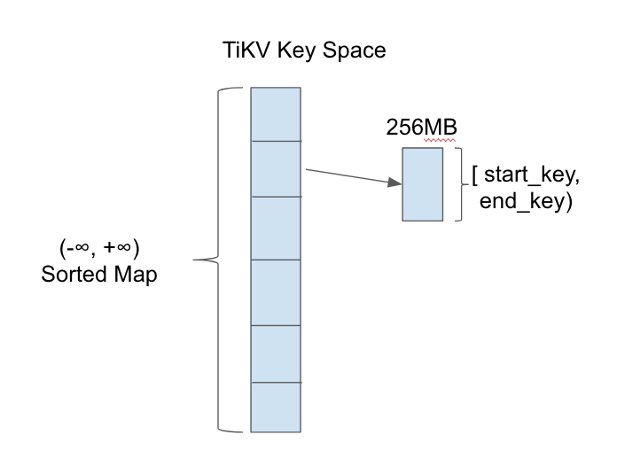

TiKV is a key-value storage engine. Keys and values are both byte arrays. Logically, we could regard TiKV as a giant sorted key-value map.
In order to achieve data distribution, we split the key space into multiple ranges. Each range has a metadata which contains start\_key and end\_key.

[Back to the top](#top)


Now we know that the actual data is stored in RocksDB. And we also know that the key space is split into ranges.
Region is a set of continuous key-value pairs in byte-order. Let's take a look at the diagram here: The data is split into a set of continuous key-value pairs which we name them from a to z. Region 1 stores “a” to “e”, Region 2 “f” to “j”, Region 3 “k” to “o”, etc. notice that region is a logical concept, all the regions in a physical node share the same RocksDB instance.

In each RocksDB instance, there are several regions and each region is replicated to other instances by Raft. The replicas of the same Region, Region 4 for example, make a Raft group.

The metadata of the Raft groups is stored in PD. And of course, PD is a cluster, replicating the metadata by Raft, too. I will introduce it later.

[Back to the top](#top)

### Dynamic Multi-Raft


In TiKV, we adopt a multi-raft model. What's multi-raft? It's a way to split and merge regions dynamically, and of course, safely. We name this approach “safe split/merge”.

For example, Region 1 from “a” to “e” is safely split into Region 1.1 “a” to “c” and Region 1.2 “d” to “e”, we need to guarantee no data is lost during the split.

This explains how one Region is split, but how about its replicas on other nodes? Let's go to next few slides.

[Back to the top](#top)

### Safe Split

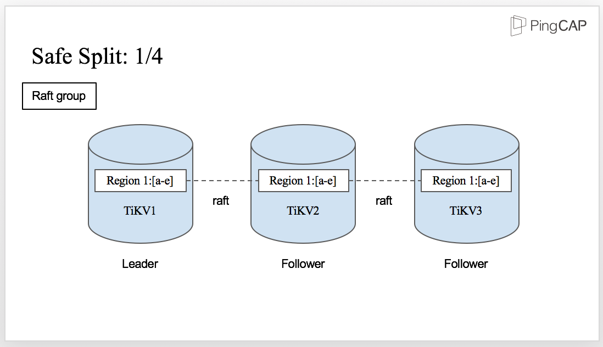
This is the initial state for Region 1. You can see there is a Raft group with three TiKV nodes.

Region 1 on TiKV1 is the Leader and the other two replicas are the followers.
However, there comes a situation that there are too much data in Region 1 and it needs to be split.

It's easy if there is only one Region 1. But in this case, we have three replicas.  How can all the replicas be split safely? The answer is also Raft. Let's see how it works.

[Back to the top](#top)


The split is initiated by the Leader, which means Region 1 is split to Region 1.1 and Region 1.2 firstly in the Leader as you can see from the diagram.

[Back to the top](#top)

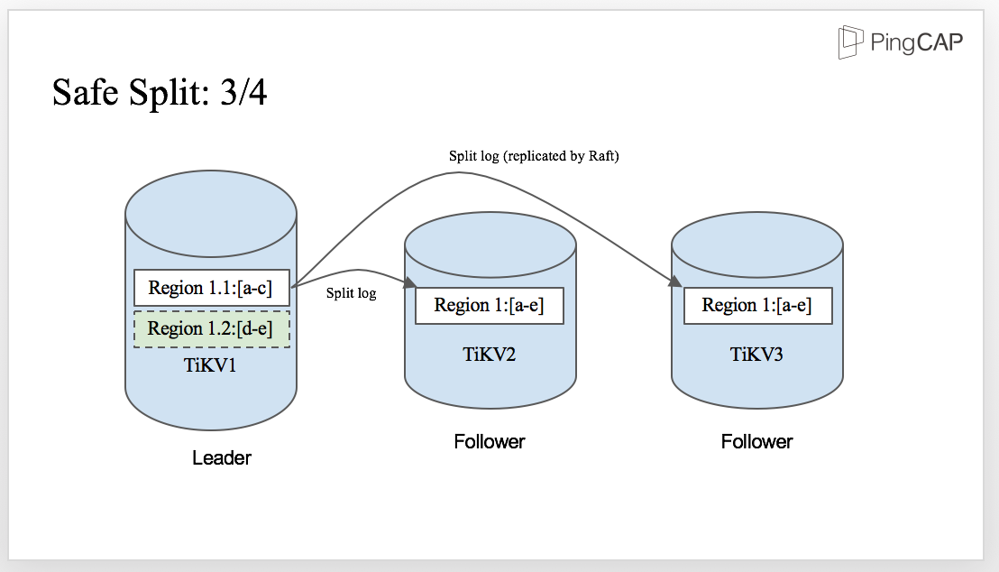

When the split-log is written to WAL in the Leader, the split log is replicated by Raft and sent to the followers. Then, the followers apply the split log, just like any other normal Raft log.

[Back to the top](#top)

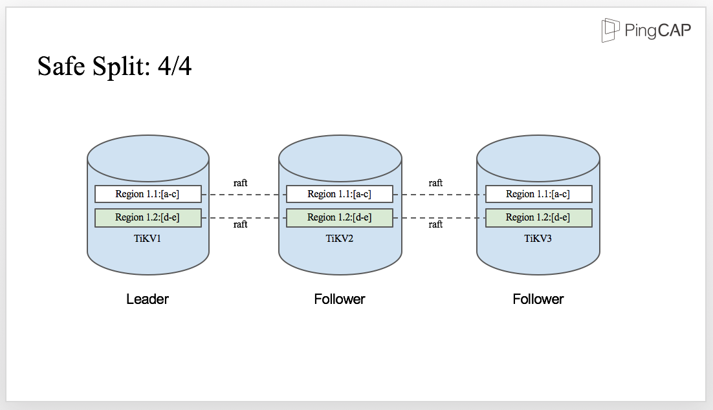

And finally, once the split-log is committed, all the replicas in the Raft group are safely split into two regions on each TiKV node. There is no data lost in the process,and the correctness of the split procedure is ensured.

[Back to the top](#top)

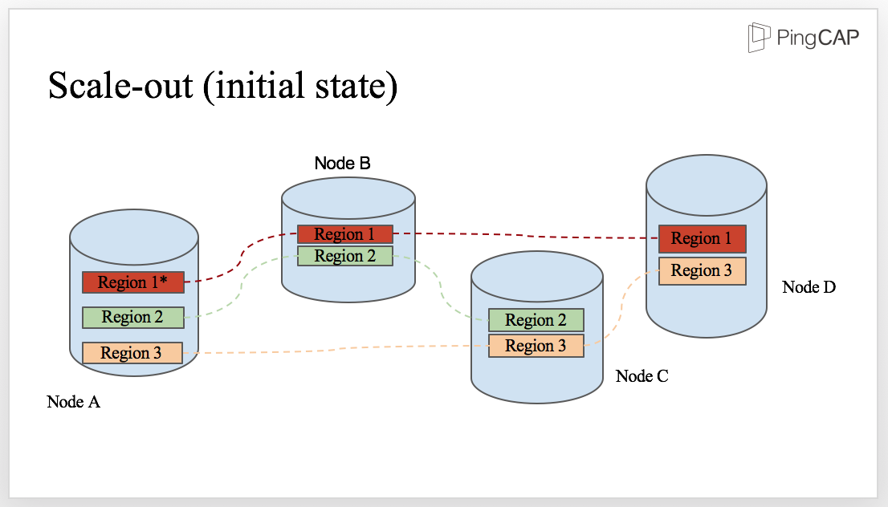

We've talked about split. Now let's see how TiKV scales out. Our project is as scalable as a NoSQL system, which means you can easily increase the capacity or balance the workload by adding more machines.
In this diagram, we have 4 physical nodes, namely Node A, Node B, Node C, and Node D. And we have 3 regions, Region 1, Region 2 and Region 3. We can see that there are 3 regions on Node A. Let's say that node A encountered a capacity problem, maybe disk is almost full.

[Back to the top](#top)

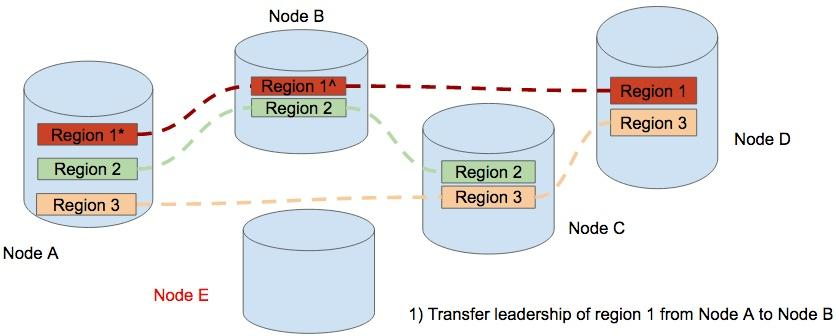

To balance the data, we add a new node, Node E. The first step is to transfer the leadership from the replica of Region 1 on Node A to the replica on Node B.

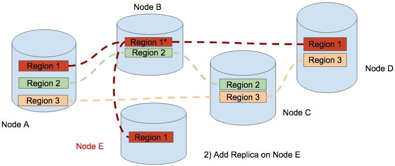

Step 2, a Replica of Region 1 is added to Node E. therefore Region 1 contains 4 replicas temporary.

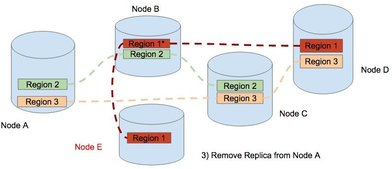

The final step, TiKV removes the replica of Region One from Node A. Now the data is balanced and the cluster scales out from 4 nodes to 5 nodes. In the process of scale-out, this data movement occurs in different regions. The result of the scheduling is that the regions are distributed equally among the physical nodes.

This is how TiKV scales out.

<div class="trackable-btns">
    <a href="/download" onclick="trackViews('Scale the Relational Database with NewSQL', 'download-tidb-btn-middle')"><button>Download TiDB</button></a>
    <a href="https://share.hsforms.com/1e2W03wLJQQKPd1d9rCbj_Q2npzm" onclick="trackViews('Scale the Relational Database with NewSQL', 'subscribe-blog-btn-middle')"><button>Subscribe to Blog</button></a>
</div>

### ACID Transaction

Our transaction model is inspired by Google's Percolator. It's mainly a decentralized 2-phase commit protocol with some practical optimizations. This model relies on a timestamp allocator to assign increasing timestamp for each transaction.

TiKV employs an optimistic transaction model and only locks data in the final 2 phase commit (2PC) stage, which is the time that client calls the `Commit()` function. In order to deal with the lock problem when reading/writing data in the 2pc stage, TiKV adds a simple Scheduler layer in the storage node to queue locally before returning to the client for retry. In this way, the network overhead is reduced.

The default isolation level of TiKV is Snapshot Isolation (SI) and it exposes the lock API, which is used for implementing SSI (Serializable snapshot isolation), such as `SELECT … FOR UPDATE` in MySQL, for the client.

### Something we haven't mentioned

Now, we have a distributed, transactional, auto-scalable key-value storage. What next?How to allocate the Timestamp and store the Metadata, how to make the balance decision?

That's what Placement Driver is for.

### Placement Driver

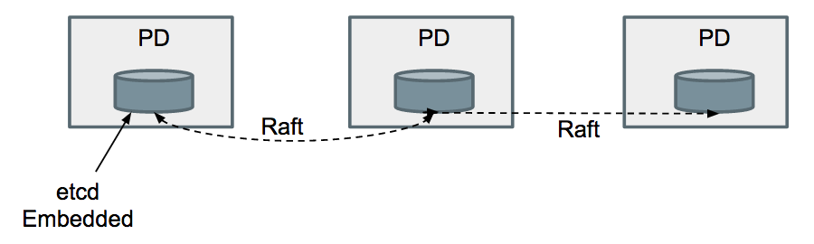
Placement Driver is the managing component of the entire cluster. We call it the brain of the TiKV cluster. It stores the metadata and handles timestamp allocation request for ACID transaction, just like the TrueTime for Spanner. But we don't have the hardware. What's more, it's controlling the data movement for dynamic workload balance and failover.

PD guarantees the following constraints:

- There should be exactly enough replicas for each raft group.
- Replicas in a single raft-group should not be on the same machine/rack/data-center, admin should add geo tags on the tikv node.
- Replicas should be balanced among the whole cluster.


[Back to the top](#top)

### The SQL Layer

The following diagram shows how to map the relational model to Key-Value model:


We take the performance of TiDB very seriously. TiDB has a full-featured SQL layer. For some operations, for example select count(*), there is no need for TiDB to get data from row to row first and then count. The quicker way is that TiDB pushes down these operations to the corresponding TiKV nodes, the TiKV nodes do the computing and then TiDB consolidates the final results.
Cost-based optimizer, aka CBO, is to optimize a plan by calculating the query cost. This optimizer is very complex. There are two key problems: one is how to get the true distribution information of the data; the other one is how to estimate the cost of a certain query plan based on this information.

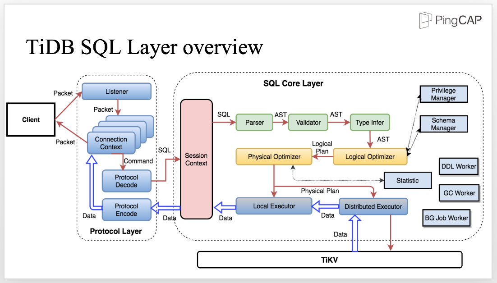

This diagram shows the architecture of the SQL layer. Let's take a look and see how the process works.
The client sends SQL to the Protocol Layer. Within the life cycle of a connection, we need to maintain the connection context and decode the protocol to get the structured request which will be further processed in the SQL core Layer.
Inside the SQL core layer, we need to maintain the session context which includes all the related information, such as the variable of the session scope. Meanwhile, the session context is also the entrance to the SQL Layer. After the SQL statement enters the SQL layer, the parser parses the SQL statement into AST, The next step is to process the AST, including validation, name resolution, type infer, privilege management, etc.
The next layer is the core layer of the SQL engine, the Optimizer. There are two optimizers, the logical optimizer and the physical optimizer. The first step is logical optimization which transfers each AST node into a logical plan andoptimizes the SQL logic. Based on the logical plan, the Physical Optimizer makes the physical plan which is then executed by the distributed executor. Here, the optimizer is like a boss who makes plans, and the executor is like the employees who execute the plan and perform the RPC call. During the execution, interactions with the storage layer are inevitable, such as accessing data, computing, and so on.

There are also other crucial components like Privilege Manager, Schema Manager, DDL Worker, GC worker, BG Job Worker, just to name a few.

[Back to the top](#top)

### What Happens behind a query

We have talked about the process. Let's see an example to show what's going on behind a query. Assuming we have a schema with two fields and an index. Now we need to run the following query: `SELECT COUNT(c1) FROM t WHERE c1 > 10 AND c2 = 'seatle';`

This is a very simple statement and it's easy to make the logical plan and the physical plan. Note that when it comes to the physical plan, you should calculate the query cost of the plan, which is the cost-based optimization that you've been quite familiar with.

The plan works well in a stand-alone database, but what happens in a distributed database that needs distributed computing in most cases? Let's see the next slide to show how the SQL statement is executed in TiDB.

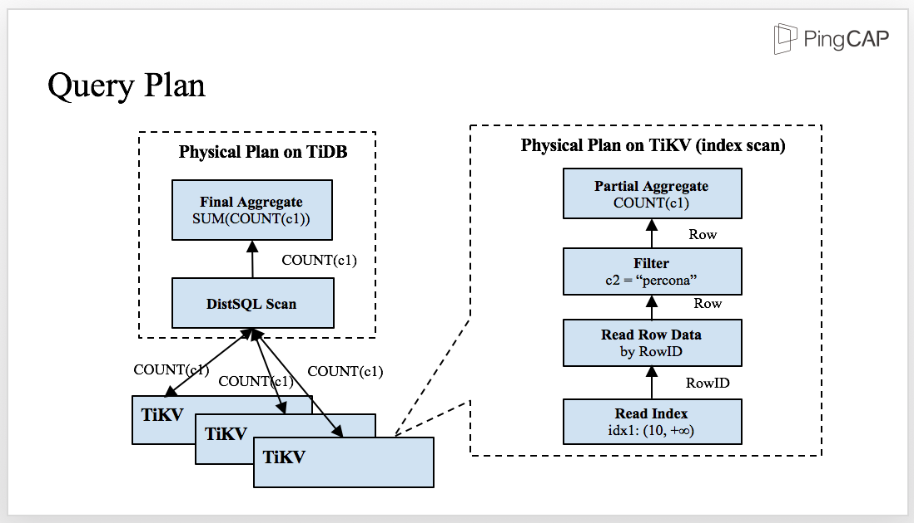

This is the physical plan of the SQL statement. The SQL layer and the storage layer, TiKV, work together. Some predicates and aggregators are pushed down to TiKV and then sent the partial result back to TiDB for final aggregation.

There are several advantages in this approach: First, there are more nodes involved in the computing and therefore, the computing becomes faster. Second, the network transmission is greatly reduced because after filtering and aggregating, the computing can easily access the data because the data is closer.

[Back to the top](#top)

### SQL Layer Overview

Now, let's see a more complex query: we have two tables, left and right. Now I write a simple join query, let's see what happens behind a join.

```sql
CREATE TABLE t1(id INT, email TEXT，KEY idx_id(id));
CREATE TABLE t2(id INT, email TEXT, KEY idx_id(id));
SELECT * FROM t1 join t2 WHERE t1.id = t2.id;
```

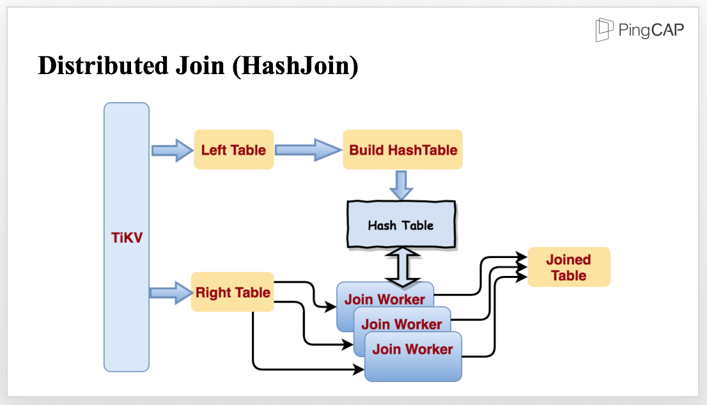

For this query, we may choose hashjoin, because HashJoin performs well in processing small and medium sized data. We have implemented the operator and optimized it for parallel data processing, and make it streaming.

To join the tables mentioned in the previous query, TiKV reads the tables in parallel. When reading the smaller table, TiKV starts to build a Hash Table in memory. When reading the bigger table, the data is sent to several Join Workers. When the Hash Table is finished, all the Join Workers will be notified to start Join in stream and output the Joined Table.

TiDB's SQL layer currently supports 3 kinds of join operators, hashjoin / sort merge join (when the optimizer thinks even the smallest table is too large to fit in memory and the predicates contain indexed column, optimizer would choose sort merge join) / index lookup join.

### Cost-Based Optimizer

For CBO, we implemented the following strategies:

- Predicate Pushdown
- Column Pruning
- Eager Aggregate
- Convert Subquery to Join
- Statistics framework

+ CBO Framework
  - Index Selection
  - Join Operator Selection
  - Stream Operators VS Hash Operators

## Tools matter

To help users exploit the best of TiDB, we have prepared the following tools: Syncer, TiDB Binlog, Mydumper/MyLoader(Loader).

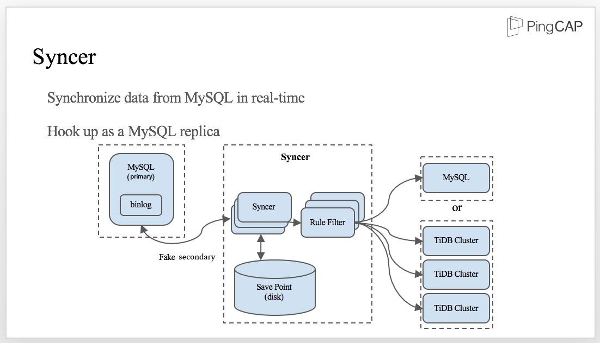

Syncer is a tool to synchronize data from MySQL in real time.

It is hook up as a MySQL replica: we have a MySQL primary with binlog enabled and Syncer acts as a fake secondary. At the very beginning, Syncer gets the position of the current binlog which is the initial synchronizing position. When new data is written into MySQL, Syncer obtains the binlog from the primary, synchronizes the data to the Save Point in the disk, and then applies the rule filter to send data to either MySQL or TiDB cluster.

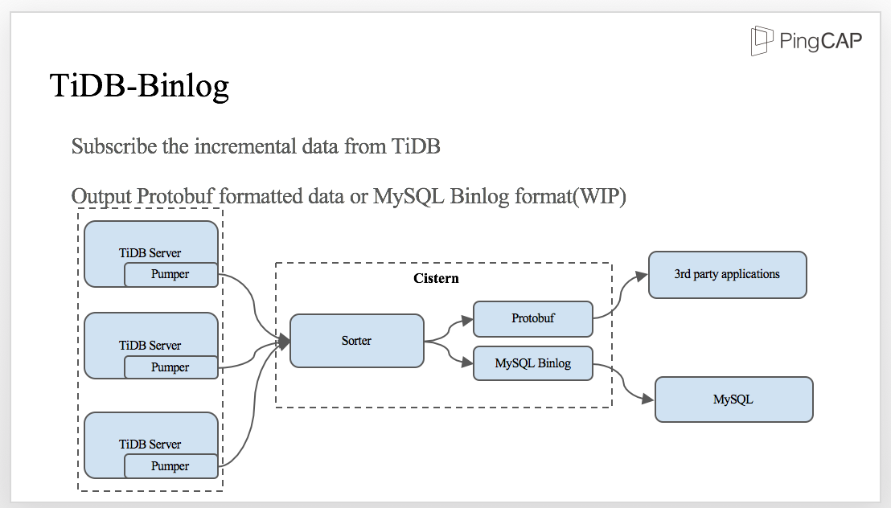

On the other hand, TiDB can output binlogs too. We build TiDB Binlog toolset to make it possible for 3rd party applications synchronize data from TiDB cluster. As TiDB-server is distributed, binlog pumper should be deployed in every TiDB-server instance and send it to a component we called 'Cistern'. Cistern will sort the transactions by TransactionID (aka. timestamp) in a short period of time, and output as protobuf for downstream application.

For data migration, we don't have our own tool. We use Mydumper/Loader for data backup and restore in parallel. You can use Mydumper to export data from MySQL and MyLoader to import the data into TiDB.

[Back to the top](#top)

## Spark on TiKV

TiSpark is Spark SQL on TiKV. Why on TiKV, not TiDB? That's because we make the Spark SQL layer run directly on top of the distributed storage layer and bypass TiDB.
We are using two Experimental methods，Extra Optimizer Rules and Extra Strategies，from Spark which corresponds to Spark Optimizer and Planner.
We hijack the logical Plan from Spark SQL and pick up the elements to be leveraged by TiKV and rewrite the plan. We need to see which predictors can be converted to index related access,  which can be converted to be Key Range related, and which can be pushed down.
TiDB, TiKV, TiSpark, the three components together serve as one platform. This platform provides you both the OLTP and OLAP capacity. You can use TiDB for OLTP and TiSpark for OLAP. This kind of capacity is also called HTAP, a term created by Gartner.


Whether it's Analytical or Transactional, now you can have both types of workloads on one unified platform. The biggest benefit is minimizing ETL. Previously, if you want to upload the data in a database to a Hadoop file system, it's very complicated. You have a base table, which is a full table dump, and after that, you set up a scheduled job, maybe run hourly or daily to capture the change of the data. So you have the deltas and the base data, and you merge them all together. But now, you don't need such complicated strategy. We just have one platform, you write data using TiDB and then read it back and analyse it through TiSpark. Besides, because everything is on one platform, the data you read is the data you write without any delay, not to mention you don't have to load data from one database to another data analysis platform. All you need is to maintain one platform and one platform only.

What's more, because we have Spark underneath, we are invited to the entire Spark eco-system. We can access the complicated analytical use cases, we can write Scala and Python program, and we can do machine learning. And when we support write we can also support Spark Streaming, etc.

We can utilize the capacity of the storage layer to the max. We can not only prune data, but also push down the operators. We can also use some features provided by the storage layer:

+ Different Transaction Isolation Levels
  - For OLTP: Snapshot Isolation
  - For OLAP: Read Committed to avoid lock resolving
+ Different resource schedule priority
  - Larger query tend to be assigned lower priority hence less resource when other queries running
  - Users can manually specify priority not to disturb OLTP

## Future plans

The final section of my speech is our roadmap to the future:

- Now TiDB project is in the status of Pre-GA. We will release GA version early in October
- We are still improving the Statistic collection framework & cost-based optimizer. (cost based optimizer)
- Another big thing is that the json type and document store for TiDB has already been put on our agenda. (the document store is introduced into MySQL in 5.7.12+ X-Plugin??)
- We are going to make TiDB integrate with Kubernetes, that makes it very easy to set up a large cluster.

OK, that's all. Thank you very much!

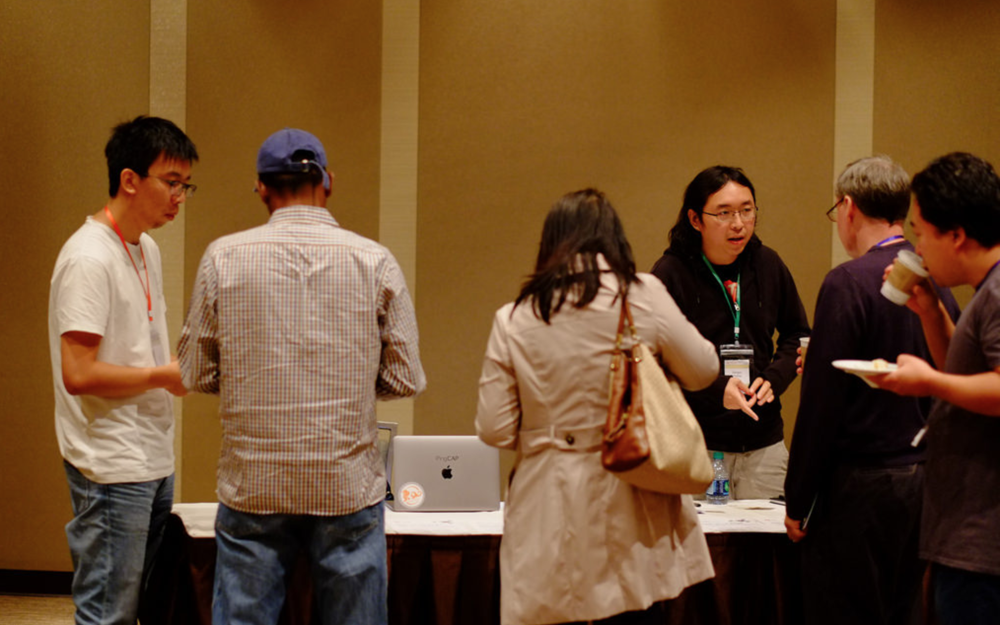

[Back to the top](#top)
