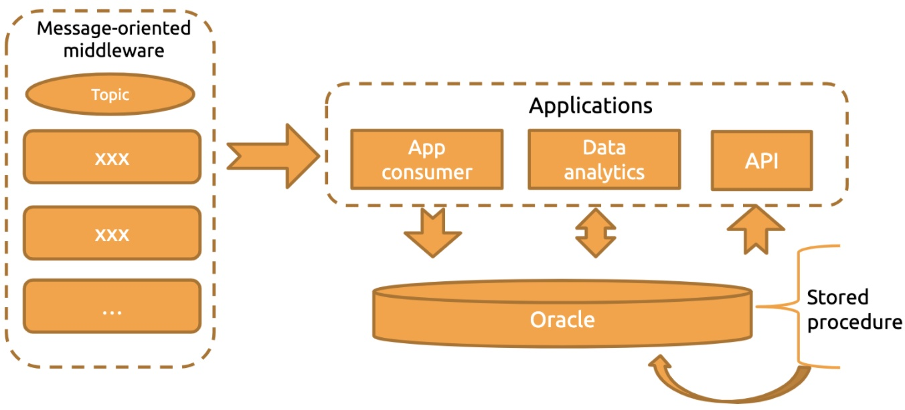
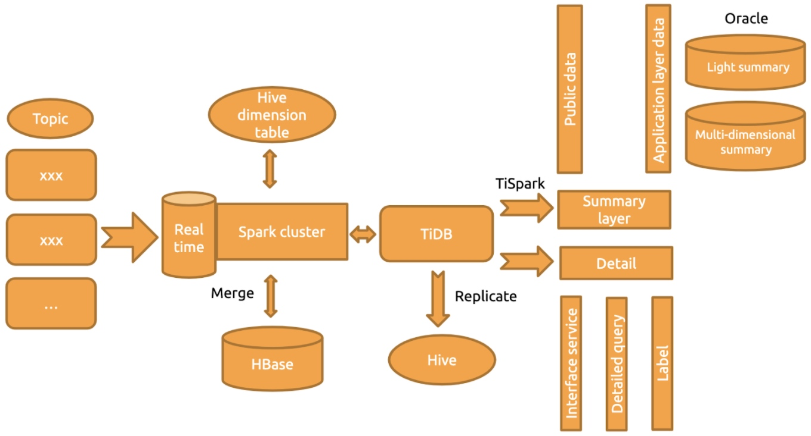
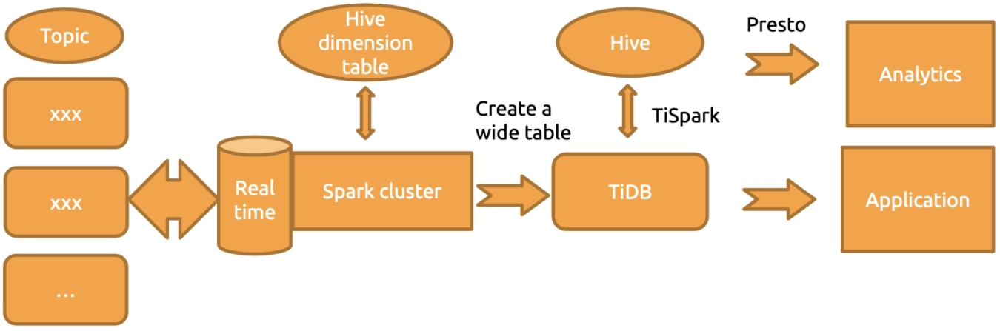

**Industry:** Logistics

**Author:** Youzhi Zhu (Big Data Architect at ZTO Express)

[ZTO Express](https://www.crunchbase.com/organization/zto-express) is a leading express delivery company in China and one of the largest express delivery companies in the world. As of December 31, 2016, we provide express delivery service as well as other value-added logistics services in China, covering over 96% of China's cities and counties. On Nov 11, 2019, the day of an annual Chinese shopping festival, our sales promotion achieved over 200 million orders.

As our business quickly grew, huge amounts of data flooded into our database. Oracle Exadata didn't meet our requirement for data storage. After we sharded our database, we couldn't perform data analytics in real time, and our database couldn't scale. Two other options, Apache Kudu and HBase, were not desirable for building a real-time data warehouse. We looked for a database that supported **horizontal scalability, distributed transactions with strong consistency, highly concurrent writes, and minute-level, multi-dimensional queries**.

Thanks to [TiDB](https://docs.pingcap.com/tidb/stable/overview), an open-source, distributed, Hybrid Transactional/Analytical Processing (HTAP) database, we **increased our IT efficiency by 300%**, and in the second quarter of 2020, we **reduced our cost per order by 17.1% year-on-year**.

In this post, I'll describe why we migrated from Oracle Exadata to TiDB and how TiDB helps scale out our database and supports our multi-dimensional analytics with query response times in minutes.

## Why we chose TiDB, a distributed SQL database

### Our pain points

As our business quickly developed, we had these pain points:

* As data volume in the Exadata database grew, Exadata's storage capacity faced big challenges. The data storage period in Exadata became shorter and shorter, while the application team required the data storage time to be longer and longer.
* The sharding solution couldn't meet our requirements for real-time data analytics. Data analytics relied on stored procedures, and the system's scalability and maintainability were poor.
* At peak hours, we had high risks of standalone machine performance bottlenecks and single-point failures. Data was replicated in [T+1](https://www.investopedia.com/terms/t/tplus1.asp) mode. We couldn't perform data analytics in real time.
* To build a real-time data warehouse, we tested HBase and Kudu. But Kudu was not compatible with the existing technology stack, and HBase had very limited support for multi-dimensional queries.

### TiDB met all our database requirements

Facing the problems above, we looked for a database with the following capabilities:

* It supports online horizontal scalability. Data is sliced by "[region](https://www.dummies.com/programming/big-data/hadoop/regions-in-hbase/)" and can be split and migrated like in HBase. It had better support hotspot auto-scheduling.
* To support the original Oracle application, it should support strongly-consistent distributed transactions and secondary indexes.
* It supports high-concurrency writes and updates and has the ability to quickly query the results based on the needs of the application team.
* Its technology ecology is closely integrated with Spark so that we can use Spark to quickly perform minute-level data analytics.
* It supports building large, wide tables and multi-dimensional query analytics.

[TiDB](https://docs.pingcap.com/tidb/stable/overview) is an open-source, cloud-native, distributed SQL database built by [PingCAP](https://pingcap.com/) and its open-source community. It is MySQL compatible and features horizontal scalability, strong consistency, and high availability. It's a one-stop solution for both Online Transactional Processing (OLTP) and Online Analytical Processing (OLAP) workloads. You can learn more about TiDB's architecture [here](https://docs.pingcap.com/tidb/v4.0/architecture).

TiDB met all our requirements for the database, so we adopted it.

## How we're using TiDB

In 2019, we deployed TiDB for production. Currently, our production environment has **more than 100 physical nodes**, serving both OLTP and OLAP applications. [TiSpark](https://docs.pingcap.com/tidb/stable/tispark-overview), TiDB's OLAP solution that runs on top of TiDB's storage engine, supported our online analytic queries with query response times within minutes. When we built a real-time extract, transform, load (ETL) wide table, TiSpark efficiently connected real-time data and offline data.

### Migrating from Exadata to TiDB

Before we adopted TiDB, the architecture of our core system at ZTO Express looked like this:

 Former architecture with Oracle 

We had a lot of data and many information sources in each data transfer point. In the architectural diagram above:

* On the left were message-oriented middleware with multiple topics.
* On the right, the application consumer consumed these middleware messages and stored them in Oracle. We had API and application data services to provide external service capabilities.

In this architecture, data analytics for large amounts of data relied on building many stored procedures on Oracle. But as data size increased, storage and computing issues became more and more severe. Unfortunately, we couldn't solve this problem by simply upgrading our Oracle hardware—and, in any case, that option was expensive. Therefore, we decided to look for a new solution.

After we adopted TiDB, our architecture looks like this:

 Current architecture with TiDB 

In this diagram:

* On the left are many messages. Spark connects these messages to the system in real time and performs `MERGE` and `JOIN` operations with data in Hive dimension tables in the distributed computing framework. At the same time, Spark performs `MERGE` operations with the data analyzed by offline T+1 calculation mode and the data stored in HBase.
* We save the final calculation result in TiDB. Every day, we replicate data in TiDB to Hive for data backup.
* [TiSpark](https://docs.pingcap.com/tidb/stable/tispark-overview#tispark-user-guide) is a thin layer built for running Apache Spark on top of TiDB or the TiKV storage layer to answer complex OLAP queries. We use TiSpark to perform data analytics on TiDB, which is called the summary layer. The summary layer includes public data and application layer data. We also put this data in Oracle, including a light summary layer and a multi-dimensional summary layer.
* We also provide detailed services based on TiDB, such as API interface services, detailed queries, and some labels.

In this architecture, every critical node supports horizontal scalability. Generally, there is no pressure on a single node or single critical path.

### Using TiDB plus TiSpark to create a real-time wide table

In 2017, we explored a method for building a real-time data warehouse. We tested Apache HBase and Kudu and found they were undesirable:

* Kudu uses Impala as the query engine, but we mainly use Presto as the query engine. There might be compatibility issues. Besides, the Kudu community is not active.
* HBase can't meet our requirements for all application queries.

In our logistics process, a lot of messages are connected to our system. We need to predict the full transportation path routing and latency for each parcel, and capture the data for each parcel being transferred. We need to handle large amounts of data with low latency, and we decided to use TiDB plus TiSpark to build our real-time wide table.

We built a wide table with more than 70 fields. In our wide table, OLTP data is written to TiDB in real time. TiSpark processes OLAP queries with query response times at minutes levels.

Before TiSpark, we tried DataX and Sqoop, but their ETL processing speed was much lower than TiSpark. Our test showed that **it took about 10 minutes for TiSpark to replicate 300 million rows of data to Hive**. In addition, data in the real-time wide table comes from more than 10 Kafka topics. When multiple messages are written to the system, it's difficult to guarantee the sequence of messages. TiSpark can help us integrate offline data in real-time analytics scenarios.

The figure below shows how we create a real-time wide table:

* Spark connects multiple messages to the cluster for computing, and performs `JOIN` operations with data in the Hive dimension table.
* After `JOIN`, we store the detailed data in TiDB, and then use TiSpark to calculate the data in TiDB and store it in Hive. We use the Presto cluster to provide data for analytics.
* We use TiSpark to flush back some offline data to TiDB for T+1 analytics, and we use TiDB to provide external application support services.

 Creating a real-time wide table 

We use this table to perform real-time analytics for the entire express delivery route, including real-time monitoring. Through this mechanism, we can know each parcel's status during transportation in near real time.

### TiDB operations and maintenance

TiDB uses Prometheus plus Grafana as its monitoring mechanism. The monitoring metrics can meet our needs. We use DataX to replicate data to Hive in T+1 mode for data backup. But because our cluster supports both online applications and developer queries, SQL queries once overwhelmed our database server. To solve this problem, we've taken the following measures:

* We monitor slow SQL queries performed by special accounts online. The system automatically kills these queries and then notifies the operations and maintenance staff and the people in charge of the application.
* We developed a platform for queries that lets users use Spark SQL statements to query data from TiDB and added concurrency control and security control features.
* Metrics are additionally connected to the Xiaomi monitoring. If a critical alert occurs, the monitoring system calls the relevant staff.

## How we benefited from TiDB

### Increasing our IT efficiency by 300%

In 2019, we completed 12.12 billion orders—a year-on-year increase of 42.2%, which exceeded the industry average growth rate by 16.9 percentage points. On November 11, 2019, TiDB supported our big sales promotion, with peak traffic reaching more than **120,000 queries per second (QPS)**. It also supported **inserts and updates of tens of billions of rows**. TiSpark supported our **online minute-level data analytics**. This guaranteed that our IT service ran steadily on our sales promotion day. 

In addition, our new database infrastructure based on TiDB has brought us the following benefits:

* The overall architecture is clear and **easy to maintain**. System scalability is enhanced.
* TiDB has **high performance for OLTP workloads**. The performance might be slightly lower than that of Oracle, but this is because TiDB is a distributed database.
* TiDB supports online **horizontal scalability**. To scale out or scale in, we can add or remove nodes in the storage or computing layer at any time. The scaling process is transparent to application operations and maintenance staff.
* The supported data storage period extended from 15 days to 45 days.
* **OLTP and OLAP workloads are separated**, and the pressure on a single node is gone.
* TiDB supports **data analytics of more application dimensions**.
* Our **hardware cost is reduced**.

### Reducing our cost per order by 17.1％

Currently, we have more than 100 TiDB physical nodes and more than 200 TiDB instances in the production environment. They mainly serve bills, the settlement center, the order center, the waybill center, the message center, and smart transshipment-related applications. 

The benefits we got from TiDB are as follows:

* Data-driven refined management measures continued to be effective. In the second quarter of 2020, **our cost per order dropped by 17.1%** year-on-year.
* Compared with Oracle, TiDB's flexible, efficient, and on-demand deployment plan remarkably reduced our total cost of ownership (TCO). 

## Issues and solutions

When we started using TiDB, we came across some problems. Along with the PingCAP team, we've resolved some of them.

### Hotspots affect write performance

Special applications have a lot of writes and updates in a specific time range. Currently, our main concern is index hotspots. We query many applications by time, so we need to create time-related indexes or composite indexes. Writes or updates in a continuous time period might cause index hotspots. This could affect write performance.

The PingCAP team will optimize this issue in the future, and we hope our problem can eventually be mitigated.

### Some problems were difficult to troubleshoot

When some SQL statements involved a large number of Coprocessor requests, and key-value instances became fully loaded, cluster write performance decreased. In this case, to find expensive SQL statements, we needed to view the log or run the `SHOW PROCESSLIST` command for troubleshooting. When there were many [TiDB servers](https://docs.pingcap.com/tidb/stable/tidb-architecture#tidb-server), troubleshooting was time-consuming. To solve this issue, we connected all logs to Elastic Stack (formerly the "ELK stack").

To address this issue, [TiDB 4.0](https://docs.pingcap.com/tidb/stable/release-4.0-ga) introduced [TiDB Dashboard](https://docs.pingcap.com/tidb/stable/dashboard-intro), a graphical interface with various built-in widgets that let users easily diagnose, monitor, and manage their clusters. It displays each query's SQL statement, its execution end time, query latency, and maximum memory usage. In one place, users can view details for all [slow queries](https://pingcap.com/blog/easier-troubleshooting-for-distributed-databases#slow-query-viewing) in the cluster.

 Troubleshooting slow queries more easily 

In addition, the PingCAP team is also developing a Timeline Tracing feature, which will be automatically enabled for all SQL statements. After this feature is implemented, users will be able to know the execution time for each SQL statement in each stage of its execution lifetime. This feature will come out in TiDB 5.0.

### Memory fragmentation

We have many `UPDATE`, `INSERT`, and `DELETE` statements. Previously, we used TiDB 3.0.3. After the system ran stably for a while, we found some issues in the monitoring metric chart. Metrics for some nodes, like the Raftstore CPU metric, were intermittently missing, while cluster performance-related monitoring metrics, such as the SQL duration metric, slowly climbed.

At first, we thought the problem was with monitoring itself. But with PingCAP engineers' help, we found the issue was due to memory fragmentation. Then, we performed a rolling restart of the cluster, and the problem was temporarily solved. TiDB 3.0.14 fixed this problem, and since we upgraded to that version, it's no longer an issue.

## What's next

Currently, we have many applications running stably in TiDB 3.0.14. In May 2020, [TiDB 4.0 GA](https://docs.pingcap.com/tidb/stable/release-4.0-ga) was released. Many of TiDB 4.0's features meet our urgent needs, such as [backups for large data volumes](https://pingcap.com/blog/back-up-and-restore-a-10-tb-cluster-at-1-gb-per-second), [large transactions](https://pingcap.com/blog/large-transactions-in-tidb), and [TiFlash](https://docs.pingcap.com/tidb/stable/tiflash-overview) (an extended analytical engine for TiDB to perform real-time HTAP analytics).

Now, our OLTP and OLAP applications are not truly physically separated on key-value nodes. When we have a large number of analytical queries and they span a wide range of time and involve large amounts of data, index filtering performance is poor. This causes full table scans. In this case, TiSpark demands a good many resources, and the pressure on key-value nodes is high. At the peak time, data analytics may affect write performance. Therefore, we pay close attention to TiFlash. Next, we will test TiDB 4.0 and build a real-time data warehouse.

If you'd like to learn more about our experience with TiDB, you can join the [TiDB community on Slack](https://slack.tidb.io/invite?team=tidb-community&channel=everyone&ref=pingcap-blog).

If you'd like to try TiDB in a cloud environment, consider [TiDB Cloud](https://pingcap.com/products/tidbcloud), the fully-managed database service with HTAP support. You can apply for a two-week free trial [here](https://pingcap.com/products/tidbcloud/trial/).
