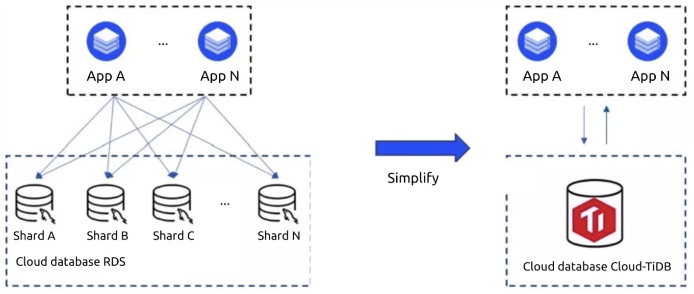
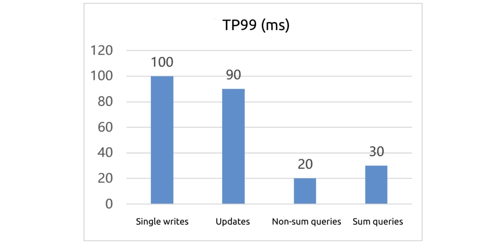
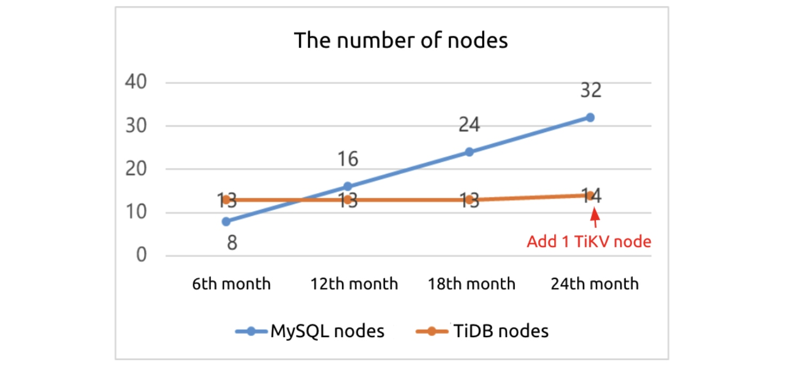
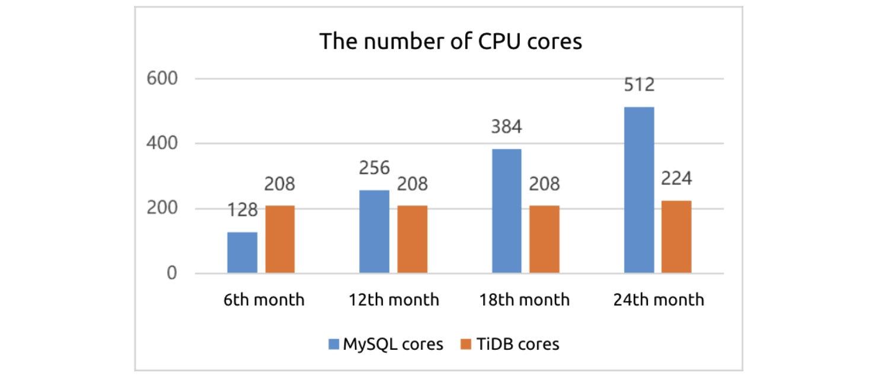
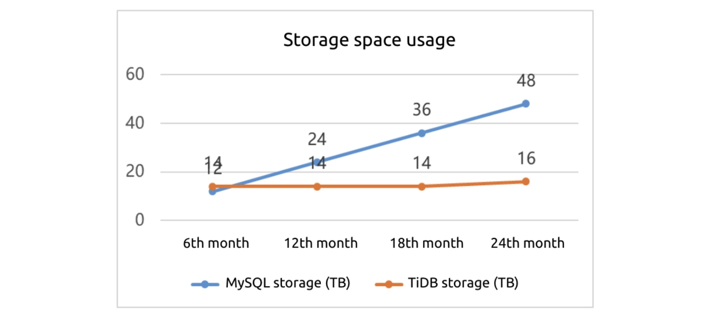
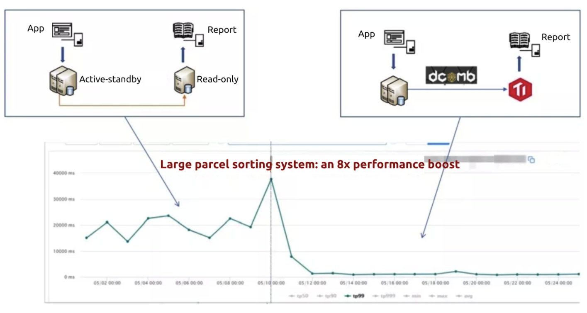

**Industry:** Logistics

**Author:** Mu Yang (JD Cloud Database Product Manager)

**Transcreator:** [Caitin Chen](https://github.com/anotherrachel); **Editor:** Tom Dewan

[JD.com](https://en.wikipedia.org/wiki/JD.com) is China's leading one-stop e-commerce platform and a member of the Global Fortune 500. It provides 500 million+ active customers with an unrivalled range of authentic, high-quality products. The vast majority of orders placed on JD can be delivered right to the customer's doorstep on the same day or the day after the order is placed.

As our business developed and data size boomed, we faced severe database challenges. **Stand-alone MySQL had limited storage capacity, complex queries took a long time to execute, and the database was hard to maintain.** We tried sharding, Elasticsearch, and ClickHouse®, but they were not ideal.

Finally, we found our optimal solution: [TiDB](https://docs.pingcap.com/tidb/stable), an open-source, NewSQL database. **TiDB helps** **scale out our databases** and **increases our large parcel sorting system's performance by 8x**. We estimate that in the next two years it can **reduce our IT costs of our logistics billing system by 67%**.

We have deployed dozens of TiDB clusters on the cloud to support multiple top-priority application systems. These clusters have passed the rigorous test of JD's big sales campaign with very stable performance.

In this post, I'll share our database challenges, why we chose TiDB instead of other solutions, and how we use it as a MySQL alternative in three applications.

## Our pain points

As our business developed, our data volume grew fast. We faced these challenges:

* **It was hard to scale out our databases.**

    Because our data size quickly increased, our databases needed to frequently scale out. Each time, to scale our databases, we had to apply for resources, assess risks, prepare plans, and communicate with the application team. This process was really troublesome for our architects.

* **Complex SQL queries slowed us down.**

    As our data volume increased and applications became complicated, our SQL query efficiency got lower. Developers needed to continuously optimize the system. This put a lot of pressure on them.

* **Database operations and maintenance were complicated.**

    To store so much data, we tried database sharding on many of our systems. It was difficult to operate and maintain this architecture, and we tended to make mistakes.

## Why we chose TiDB instead of sharding, Elasticsearch, ClickHouse, and other solutions

To solve our business pain points, we tried sharding, Elasticsearch, and ClickHouse. But they were unsatisfactory. Our experts from various application teams conducted thorough research, and we found that TiDB was an ideal solution. We cooperated with PingCAP and jointly launched Cloud-TiDB, a distributed database on the cloud, to provide TiDB services on JD Cloud.

### Drawbacks of database sharding

We found sharding has these disadvantages:

* It was suitable for simple applications rather than complex applications. It was intrusive to applications and required lots of code changes.
* It had limited application scenarios. For example, it didn't support cross-shard queries or complicated SQL queries.
* It was hard to reshard databases. We needed to follow the specified sharding rules to horizontally scale databases.
* It made our applications more complex, and it was hard for us to maintain a large-scale cluster.

### Drawbacks of Elasticsearch and ClickHouse

In some analytical and query scenarios, we tried to use Elasticsearch and ClickHouse. We found they had these limitations:

* We needed to replicate data from the transactional database MySQL to them.
* To use them, we needed to modify the application code.
* Elasticsearch had high usage costs.
* ClickHouse didn't support transactions or high-concurrency scenarios.

### What are TiDB and Cloud-TiDB?

TiDB is an open-source, distributed SQL database that supports Hybrid Transactional/Analytical Processing (HTAP) workloads. It is MySQL compatible and features horizontal scalability, strong consistency, and high availability. You can learn more about TiDB's architecture [here](https://docs.pingcap.com/tidb/stable/tidb-architecture).

Based on TiDB, we developed Cloud-TiDB along with [PingCAP](https://pingcap.com/) to run TiDB on JD Cloud.

Cloud-TiDB has these features:

* **One-click deployment**

    When we create a cluster, we can customize the node size and the number of nodes. We can upgrade the database version online. To perform these operations, we just click the mouse. It's easy.

* **Single-command scaling**

    To improve the cluster's storage capacity and processing capabilities, we can add TiDB, [TiKV](https://docs.pingcap.com/tidb/stable/tikv-overview), and [TiFlash](https://docs.pingcap.com/tidb/stable/tiflash-overview) nodes online. The scaling process does not impact the application.

* **Multi-dimensional monitoring and alerting**

    To help our developers and operations engineers better use TiDB, we combine cloud monitoring with TiDB's Grafana and Dashboard.

### Strengths of Cloud-TiDB

We chose Cloud-TiDB to support some of our applications with massive data, because:

* **It uses a distributed architecture to scale out large-scale databases**. It solves the bottleneck of stand-alone MySQL capacity and performance.
* **It's highly compatible with MySQL and has a low migration cost.** When we started running our applications on TiDB, we noticed benefits right away.
* **It's easy to operate and maintain**. It's reliable in financial scenarios.
* **It supports online scaling out and online data definition language (DDL)**. These operations almost don't affect applications.
* **It supports strong consistency and transactions**. We can use it in many scenarios that need strong consistency and transactions.

### TiDB vs. other solutions

We also compared TiDB with other distributed databases. In the following table, we call them Databases A and H. In general, TiDB is superior to them in the following areas:

* **Cluster scale**
    * TiDB can support hundreds of nodes.
    * The other distributed databases support a total of 16 nodes: 1 primary and 15 secondaries.
* **Node read and write scaling capabilities**
    * TiDB is a multi-active architecture. All TiDB nodes that provide external services can both read and write.
    * For the other products, only the primary node can write, and the secondary nodes can only read. Like MySQL, their write capability is limited due to a stand-alone database's performance and cannot be improved.
* **Storage capacity**
    * TiDB can store petabytes of data.
    * The other databases can store about 100 TB of data at most.
* **Real-time analytics**
    * TiDB supports real-time analytics.
    * The other databases do not have this capability.
* **Backup speed**
    * TiDB's backup speed is slightly lower. We hope TiDB can improve its backup efficiency in the future.
* **Freedom to switch cloud vendors**
    * TiDB is an open-source product. It is not bound by a cloud vendor. Based on TiDB, users can easily implement a multi-cloud strategy, and TiDB can be deployed on any cloud without vendor lock-in.
    * The other databases don't allow users to change the vendor.

<table>
  <tr>
   <td>
<strong>Feature or capability</strong>
   </td>
   <td><strong>Cloud-TiDB</strong>
   </td>
   <td><strong>Database A</strong>
   </td>
   <td><strong>Database H</strong>
   </td>
  </tr>
  <tr>
   <td>Cluster architecture
   </td>
   <td><strong>Supports hundreds of nodes</strong>
   </td>
   <td>1 primary and 15 secondaries
   </td>
   <td>1 primary and 15 secondaries
   </td>
  </tr>
  <tr>
   <td>Node read and write
   </td>
   <td><strong>Multi-active</strong>
 
<strong>All nodes that provide external services can both read and write.</strong>
   </td>
   <td>Only the primary node can write.
   </td>
   <td>Only the primary node can write.
   </td>
  </tr>
  <tr>
   <td>Storage capacity
   </td>
   <td><strong>Petabytes of data</strong>
   </td>
   <td>100 TB of data
   </td>
   <td>128 TB of data
   </td>
  </tr>
  <tr>
   <td>Cluster QPS
   </td>
   <td>1 million+
   </td>
   <td>1 million+
   </td>
   <td>1 million+
   </td>
  </tr>
  <tr>
   <td>MySQL compatibility
   </td>
   <td>Yes
   </td>
   <td>Yes
   </td>
   <td>Yes
   </td>
  </tr>
  <tr>
   <td>Scaling out in minutes
   </td>
   <td>Yes
   </td>
   <td>Yes
   </td>
   <td>Yes
   </td>
  </tr>
  <tr>
   <td>Backup in seconds
   </td>
   <td>No
   </td>
   <td><strong>Yes</strong>
   </td>
   <td>No
   </td>
  </tr>
  <tr>
   <td>Whole-cluster read latency
   </td>
   <td>No latency
   </td>
   <td>No latency
   </td>
   <td>Unknown
   </td>
  </tr>
  <tr>
   <td>Distributed transactions with strong consistency
   </td>
   <td>Yes
   </td>
   <td>Yes
   </td>
   <td>Yes
   </td>
  </tr>
  <tr>
   <td>Online Analytical Processing (OLAP) support
   </td>
   <td><strong>Yes</strong>
   </td>
   <td>No
   </td>
   <td>No
   </td>
  </tr>
</table>

    <a href="/download" onclick="trackViews('An 8x System Performance Boost: Why We Migrated from MySQL to a NewSQL Database', 'download-tidb-btn-middle')"><button>Download TiDB</button></a>
    <a href="/contact-us" onclick="trackViews('An 8x System Performance Boost: Why We Migrated from MySQL to a NewSQL Database', 'contact-us-middle')"><button>Request a Demo</button></a>

## How we use Cloud-TiDB in mission-critical applications

### TiDB replaces MySQL sharding in our logistics billing system

Our logistics billing system stores a large amount of data. Its three primary tables had 2 billion, 5 billion, and 10 billion rows of data. After the system was in production for six months, its largest tables' data reached 22 billion rows. Because the data size was large, we used sharded MySQL at the very beginning. However, after a while, we encountered some problems with MySQL sharding. For example:

* It didn't support complex SQL queries.
* It was difficult to implement cross-shard statistical reports.

The following diagram shows our original MySQL-based logistics billing system and how it looks now after we switched to TiDB:

 Replacing sharded MySQL with Cloud-TiDB 

After we migrated to TiDB, TiDB showed good performance:

* **Writes were about 100 milliseconds and so were updates.**
* **Both non-sum queries and sum queries took only 20-30 milliseconds.**

    
    
 TP99 query latency 

* **To migrate a system with tens of billions of rows of data from MySQL to TiDB, we didn't modify a single line of code.**

    We just changed our Java Database Connectivity (JDBC) username and password to seamlessly migrate from MySQL to TiDB. TiDB is highly compatible with MySQL; therefore, our costs of trial and error, testing, and migration were low, and we got benefits from TiDB quickly.

* **TiDB greatly reduced our IT infrastructure cost.**

    We estimate that over a two-year period **the cost of using TiDB will be only 37% of that of MySQL**. This is because TiDB has a high data compression ratio. Our test found that after migration, 10.8 TB of data in MySQL became only 3.2 TB in TiDB, and this was the total data volume of three copies. Therefore, the **space usage ratio of MySQL to TiDB is 3.4:1**.

    <table>
      <tr>
       <td>
    <strong>Cluster</strong>
       </td>
       <td><strong>Space usage</strong>
       </td>
       <td><strong>Ratio</strong>
       </td>
      </tr>
      <tr>
       <td>MySQL
       </td>
       <td>10.8 TB
       </td>
       <td>3.4
       </td>
      </tr>
      <tr>
       <td>TiDB
       </td>
       <td>3.2 TB
       </td>
       <td>1
       </td>
      </tr>
    </table>

    Before we switched to TiDB, our architecture was a four-shard MySQL cluster. According to the data growth rate, we needed to scale out our database every six months, and each time we needed to add four sets of active-standby instances. But after we switched to TiDB, we can scale out the database based on our actual needs.

    | Cluster | Scale | Scaling scheme |
    | ---------|:-----|:---------------|
    | MySQL    | 4 \* (16-core 64 GB 3 TB) \* 2   Active-standby | Add four sets of active-standby instances every six months |
    | TiDB    | 2 TiDB nodes, 7 TiKV nodes, 3 PD nodes, and 1 monitor node   Each node has 16 cores. | Add nodes based on actual needs |

    The following figure shows that in the 24th month:

    * MySQL will have 32 nodes while TiDB will have only 14.
    * MySQL will use 512 CPU cores while TiDB will use only 224, less than half of MySQL.
    * MySQL will use 48 TB of storage space while TiDB will use 16, only 1/3 of MySQL.

    
    
 MySQL nodes vs. TiDB nodes 

    
    
 MySQL cores vs. TiDB cores 

    
    
 MySQL space usage vs. TiDB space usage 

### TiDB, a MySQL alternative, in our large parcel sorting system

Previously, we used MySQL to support real-time kanbans (visual boards for workflow management) and mission-critical reports of our large parcel sorting system. As data size increased and SQL queries became complex, the kanban and report performance degraded, and the user experience was not good. We also tried MySQL sharding, but it was intrusive to the code, we needed to greatly adjust the architecture, and the risk was high.

When we switched from MySQL to TiDB, we used our self-developed system dcomb to replicate data in near real time. **With TiDB, the overall performance for hundreds of metrics increased by eight times.**

 Increasing performance by eight times 

### TiDB replaces MySQL + Elasticsearch in our waybill accounting system

The data in our waybill accounting system increased by tens of millions of rows each day. A single table could have close to 20 billion rows. We couldn't use MySQL to store so much data. **We once tried Presto. Its performance and storage capacity were okay, but it was expensive.** Later, we used Elasticsearch to query data, but **Elasticsearch was unstable**. In our business, billing items often change, so the table schemas need changes, too. The database maintenance workload was large.

After we migrated to TiDB:

* We didn't worry about massive data storage. **TiDB could hold tens of billions of rows of data without pressure**.
* **Compared to MySQL + Elasticsearch, the cost of TiDB was reduced by 30%**.
* TiDB performance met our business requirements. **To query a single table with tens of billions of rows of data, the TP99 latency was about 500 milliseconds.**
* It was easy to modify TiDB's table schemas. **This made our operations agile and reduced our maintenance cost**.

## Conclusion

TiDB has helped us:

* Reduce our IT infrastructure and operating costs.
* Greatly boost our application performance, which improves our user experience.
* Significantly improve our operations and maintenance efficiency. Our operations and maintenance engineers no longer need to stay up late to support systems. They can devote themselves to other more valuable tasks.

TiDB has been so successful for us, that it has become a benchmark for cost saving and efficiency within our company. We expect that by the end of 2021, at JD.com, the total cores of TiDB clusters will increase by 100%, and the total number of CPU cores will exceed 10,000.

If you want to know more details about our story or have any questions, you're welcome to join the [TiDB community on Slack](https://slack.tidb.io/invite?team=tidb-community&channel=everyone&ref=pingcap-blog) and send us your feedback.
