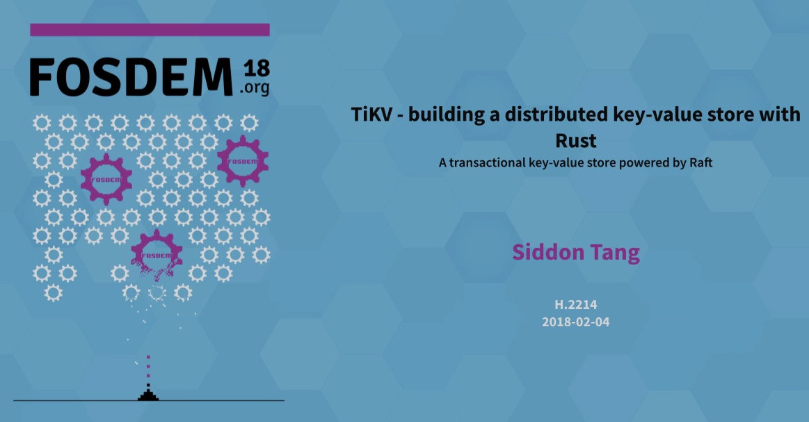
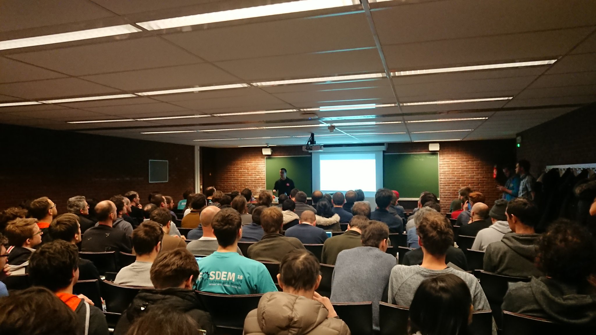
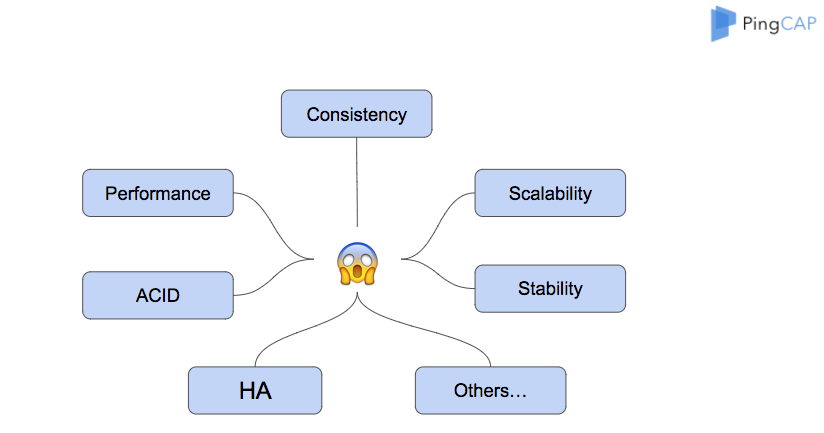
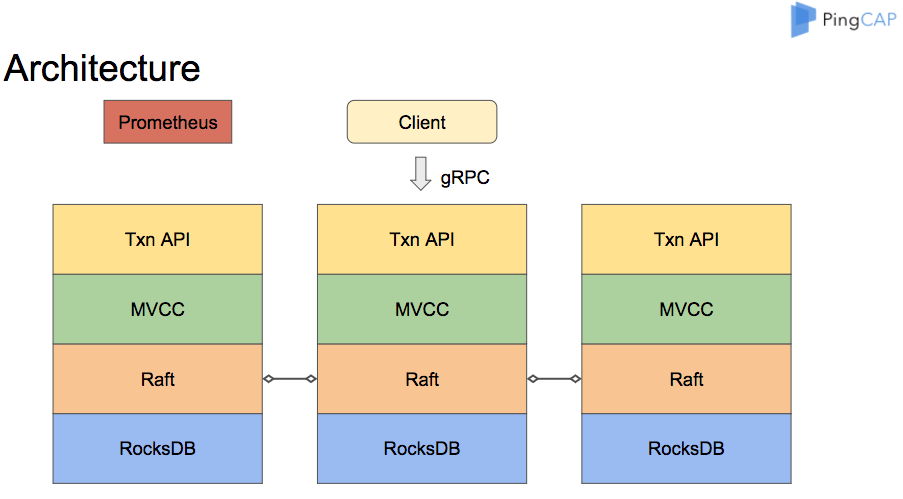
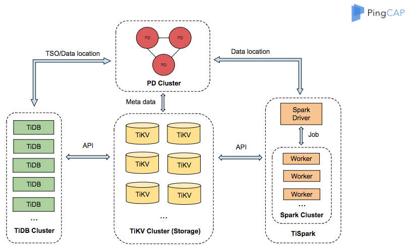

At the crack of dawn on February 1, I landed in Brussels, Belgium, for the first time in my life. The goal of my trip wasn’t to taste the local cuisine, tour world-famous museums, or grab a pint of the local brew (though I ended up doing all those things anyway). It was to deliver a talk three days later at "FOSDEM 2018 Rust Devroom" about our experience at PingCAP using Rust to build [TiKV](https://github.com/pingcap/tikv), a distributed transactional Key-Value storage engine.

[FOSDEM 2018 Rust Devroom](https://fosdem.org/2018/schedule/track/rust/) is the 1st edition of a dedicated Rust venue co-located with [FOSDEM 2018](https://fosdem.org/2018/). It was, by all accounts, *very* popular; at least a few hundred people visited the Rust Devroom, where my talk was supposed to be held. Because the room could only hold about 120 people, people had to line up to get into talks. When I showed up for my event, there was already a long line snaking through the hallway. I lined up with everyone else and almost didn’t get into my own talk!

 

*People lining up to listen to their favorite Rust talk. Photo credit: Andrew Hobden*

You can find the slides of my presentation [here](https://fosdem.org/2018/schedule/event/rust_distributed_kv_store/attachments/slides/2034/export/events/attachments/rust_distributed_kv_store/slides/2034/Siddon_Tang_Use_Rust_to_Build_a_Distributed_Transactional_Key_Value_Database.pdf) and the full video [here](https://ftp.osuosl.org/pub/fosdem/2018/H.2214/rust_distributed_kv_store.mp4). But we are all busy people, so just in case you don’t have time to go through it all, here’s a summary of the highlights and where you can go learn more!

Building TiKV, a distributed key-value store with Rust

*Building a distributed key-value store with Rust*

*Presenting in front of a group of Rustaceans at FOSDEM 2018. Photo credit: Andrew Hobden*

In my talk, I shared our experiences on the following topics from our process of building TiKV:

1. Why another database and the challenges of building a modern distributed transactional Key-Value store: consistency, horizontal scalability, scalability, stability, performance, ACID compliance, High Availability, etc.

2. How we build the TiKV core system using Rust, including the backend store, the gRPC framework, and the consensus replication mechanism.

	* Backend store: TiKV adopts [RocksDB](http://rocksdb.org/) as the backend storage engine for its high-performance and fast storage, and uses[ Raft](https://raft.github.io/) and [Multi-raft](https://www.pingcap.com/blog/2017-08-15-multi-raft/) to ensure data safety and horizontal scalability. We implemented t[he Raft Consensus algorithm in Rust](https://github.com/pingcap/raft-rs)**.**

	* Transaction: As a distributed Key-Value database, TiKV also supports transaction and is ACID compliant. To maintain consistency among the Multi-raft groups, TiKV adopts an optimized [two-phase commit (2PC) protocol](https://en.wikipedia.org/wiki/Two-phase_commit_protocol) and supports [Multiversion Concurrency Control (MVCC)](https://www.pingcap.com/blog/2016-11-17-mvcc-in-tikv/), [Snapshot Isolation](https://en.wikipedia.org/wiki/Snapshot_isolation), and [Optimistic Transaction](https://en.wikipedia.org/wiki/Optimistic_concurrency_control).

	* For different machines to communicate to each other, TiKV uses [gRPC](https://grpc.io/), a high-performance universal RPC framework. We develop a[ gRPC library for Rust built on C Core library and futures](https://github.com/pingcap/grpc-rs).

3. How we monitor the cluster and diagnose problems: to monitor the metrics of the cluster and gain insights, TiKV adopts [Prometheus](https://prometheus.io/) as the monitoring solution. We build a [Prometheus instrumentation library for Rust ](https://github.com/pingcap/rust-prometheus)[applications](https://github.com/pingcap/rust-prometheus), which is listed as a third-party client on the [Official Prometheus Client Libraries](https://prometheus.io/docs/instrumenting/clientlibs/).

4. How we use the failure injection test to guarantee data safety. Inspired by FreeBSD's [failpoints](https://freebsd.org/cgi/man.cgi?query=fail), TiKV implemented a fail point to inject errors by users at runtime in Rust.

The following diagram shows the TiKV architecture:

*TiKV Architecture*

Our team has big plans beyond just building a full-featured distributed transactional Key-Value database like TiKV. We have already built a stateless SQL layer, [TiDB](https://github.com/pingcap/tidb), mainly for [Online transaction processing (OLTP)](https://en.wikipedia.org/wiki/Online_transaction_processing) that works directly with TiKV, and [TiSpark](https://github.com/pingcap/tispark), an Apache Spark driver which sits on top of TiKV for handling heavy [Online analytical processing ](https://en.wikipedia.org/wiki/Online_analytical_processing)[(OLAP)](https://en.wikipedia.org/wiki/Online_analytical_processing) workloads. Our ultimate vision is to build a Hybrid Transactional/Analytical Processing database that empowers businesses to meet both workloads with a single database and enables real-time business analysis based on live transactional data.

*Architecture of TiDB, a Hybrid Transactional/Analytical Processing (HTAP) database*

TiKV, TiDB, and TiSpark have been widely adopted in production environments by companies, ranging from e-commerce and gaming to financial services and bike-sharing. We are working to publish specific use case stories from our customers soon, and the best way to receive them is to subscribe to our [blog](https://www.pingcap.com/blog/). Stay tuned for more!

Last but not least, we welcome everyone to fork, star, use, and contribute to the following projects that we’ve written in Rust for TiKV:

* [Rustwrapper for RocksDB](https://github.com/pingcap/rust-rocksdb)

* [Raft Consensus algorithm implemented in ](https://github.com/pingcap/raft-rs)[Rust](https://github.com/pingcap/raft-rs)

* [gRPC library for Rust built on C Core library and futures](https://github.com/pingcap/grpc-rs)

* [Prometheus instrumentation library for Rust applications](https://github.com/pingcap/rust-prometheus)

* [Fail points for Rust](https://github.com/pingcap/fail-rs)

We look forward to building a strong and vibrant Rust community together!
