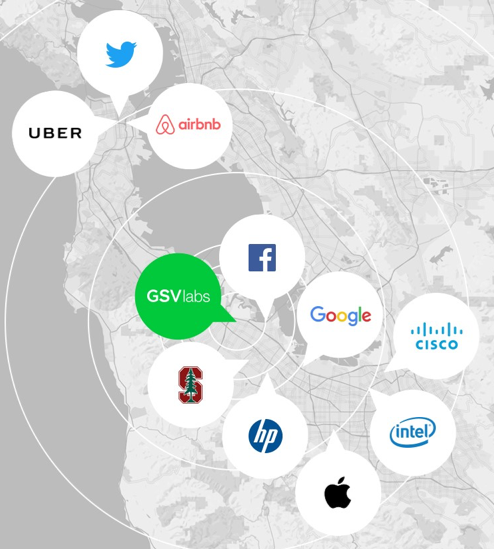
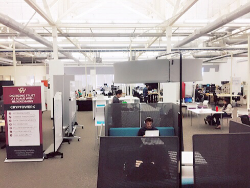

# PingCAP Plants its Seed in Silicon Valley

[PingCAP](https://pingcap.com), a cutting-edge distributed Hybrid Transactional/Analytical Processing (HTAP) database company, is excited to announce the opening of its Silicon Valley office, located at the [GSV Labs](http://gsvlabs.com/) in Redwood City, California. GSV (Global Silicon Valley) Labs is a global innovation platform that houses more than 170 startups, investors, and partners in its 60,000 square foot space in the heart of Silicon Valley. Its member startups work in a wide range of technologies and industries, from Big Data and healthcare, to VR and education. 

[Image source](http://gsvlabs.com/)

From day one, PingCAP was conceived and built to be a global technology company with global impact. With the [GA 1.0 release](https://pingcap.com/blog/2017-10-17-announcement/) of its flagship product [TiDB](https://github.com/pingcap/tidb) in October 2017, PingCAP has gained significant adoption in the APAC region from leading companies like [Mobike](https://www.crunchbase.com/organization/mobike) and [Gaea](http://www.gaea.com/en/). Opening a Silicon Valley office is a natural progression of its growth trajectory. 

*"Even before we wrote the first line of code, we wanted the impact of our vision to be global. That’s why we adopted the open source way from the beginning,"* said Max Liu, co-founder and CEO. *“I’m thrilled to be taking our first of many steps in pursuit of that mission.”*

With a physical presence in Silicon Valley, PingCAP plans to aggressively drive product adoption in the U.S., build a strong local community of developers and contributors, and recruit a team of top-notch engineers and evangelists to further develop and raise awareness of its products. To see current U.S.-based job openings, please visit: [Jobs at PingCAP](https://angel.co/pingcap-1/jobs).

