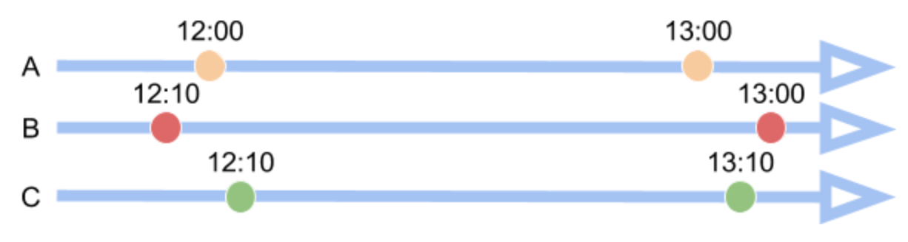
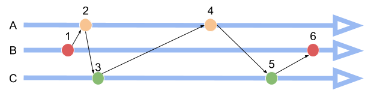
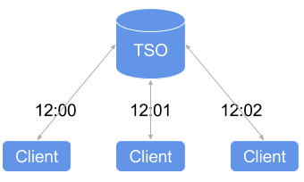

## Preface

At re:Invent 2017, Amazon Web Services (AWS) announced [Amazon Time Sync Service](https://aws.amazon.com/about-aws/whats-new/2017/11/introducing-the-amazon-time-sync-service/), a highly accurate and reliable time reference that is natively accessible from Amazon EC2 instances. It is much like the Google [TrueTime](https://static.googleusercontent.com/media/research.google.com/zh-CN//archive/spanner-osdi2012.pdf) published in 2012. Why do Google and AWS both want to make efforts to provide global time service? Is there any inspiration for building distributed database? This topic is important to think about.

Time synchronization remains a hard nut to crack in distributed systems, especially for distributed databases such as [TiDB](https://github.com/pingcap/tidb) where time is used to confirm the order of the transaction to guarantee the ACID compliance.

In this post, I will introduce the existing solutions to tackle the time synchronization issue in distributed systems, as well as their pros and cons. I will also share why we chose to use the timestamp oracle (TSO) from [Google Percolator](https://static.googleusercontent.com/media/research.google.com/en//pubs/archive/36726.pdf) in TiDB.

## Order of the events



[Linearizability](https://en.wikipedia.org/wiki/Linearizability) is important for distributed systems, especially for distributed databases. We can't allow reading stale value after the update. For example, if account A has $100, and transfers $10 to B. After the transaction finishes, we can't read $100 again from account A.

Another simple explanation is: if we write a data at time `T1` like `set a = 10`, after `T1`, we must always read `10` as the value of `a`, not `11` or any other values.

But how can we ensure we can read the newest data? How can we know the order of two events?

We usually use "happened before"(`hb` or `->`) to describe the relationship of two causal events. For two events `e1` and `e2`,  `e1 -> e2`, we can say that `e1` happened before `e2`, or `e1` causes `e2`.

If we have only one process, determining the order is easy, because all the events can only happen in the process in sequence. However, in a distributed system, things become more complex. The events may happen in different places, and it becomes hard to determine the order of all the events.

At first, we may consider using wall time, but the time is not the same in all the processes -- one process may run faster, and the other process may walk slower. So we can't use the time directly to check the order of the events. Luckily, we have other ways to do it.

## Logical clock



A simple way is to use [logical clock](http://www.ics.uci.edu/~cs230/reading/time.pdf) which was proposed by Lamport in 1978 for timestamping and ordering events in a distributed system. The algorithm is:

1. Every process starts with an initialized clock counter.

2. A process increments the value of its counter before each event in that process.

3. When a process sends a message, it includes the counter value with the message.

4. When a process receives a message, it increases its clock counter value to be bigger than both its current clock counter value and the value in the received message.

5. If two events have the same clock value, we may think they happen simultaneously so we should use process ID or any other unique ID to differentiate them.

Using this can easily determine the order of events. For example, assuming we have processes `P1`, `P2`, both with an initialized counter value `0`.

1. `P1` increases the counter value to `1` and executes event `A`.

2. `P2` wants to do something but needs to know the result of the event `A`, so it increases its counter to `1` and sends a message with counter `1` to `P1`.

3. `P1` receives the message and increases its counter to `2`, then increases the counter to `3` and replies to `P2`.

4. `P2` receives the message and increases the counter to `4` then executes event `B` with counter `5`.

We use `C(A)` and `C(B)` as the counter value of the events, if events `A` and `B` happen in one process, and `A` happens before `B`, we can know that `C(A) < C(B)`. If `A` and `B` happen in different processes, we can also know `C(A) < C(B)` based on the message, so if A happens before B, we can infer `C(A) < C(B)`. But if `C(A) < C(B)`,  it doesn't necessarily mean that A happens before B.

If the two events are not causally related (no communication between the processes), we can't determine the order of the events. We can use vector clock to fix this. But whether it's logical clock or vector clock, they both have a disadvantage: we can't know what time the event happens because both of the two clocks merely record the order of the events instead of the time.

To get the chronological order of the events, we have to go back to square one and use real time. But we can't depend on Network Time Protocol (NTP) directly because it has some errors and the time is not accurate, so what should we do?

## TrueTime

In Google [Spanner](http://static.googleusercontent.com/media/research.google.com/en//archive/spanner-osdi2012.pdf), it uses TrueTime API to fix the problem of time. Spanner uses GPS and Atomic Clock to correct the time and can guarantee clock uncertainty bound (ε) is very small. The ε value is less than 7ms in 2012; it may be less now.

The TrueTime API is very simple:

<table>
  <tr>
    <td>Method</td>
    <td>Return</td>
  </tr>
  <tr>
    <td>TT.now()</td>
    <td>TTinterval: [earliest, latest]</td>
  </tr>
  <tr>
    <td>TT.after(t)</td>
    <td>true if t has definitely passed</td>
  </tr>
  <tr>
    <td>TT.before(t)</td>
    <td>true if t has definitely not arrived</td>
  </tr>
</table>

Spanner can't get an accurate time point but only an interval. We can use function `now` to get an interval. Assuming event `A` happens at the time point `tt.a`, and `tt.b` is for event `B`. We can know that `tt.a.earliest <= tt.a <= tt.a.latest`. For event `A` and `B`, if `A` happens before `B`, we can infer `tt.a.latest < tt.b.earliest`.

Because TrueTime has the clock uncertainty bound  `ε`, so for every transaction commit, it must wait `2ε` time to guarantee linearizability, but `ε` is so small that the performance is still high.

The biggest hurdle to adopting TrueTime is that it depends on special hardware, such as GPS clocks and atomic clocks, which many companies do not have.

<div class="trackable-btns">
    <a href="/download" onclick="trackViews('Tick or Tock? Keeping Time and Order in Distributed Databases', 'download-tidb-btn-middle')"><button>Download TiDB</button></a>
    <a href="https://share.hsforms.com/1e2W03wLJQQKPd1d9rCbj_Q2npzm" onclick="trackViews('Tick or Tock? Keeping Time and Order in Distributed Databases', 'subscribe-blog-btn-middle')"><button>Subscribe to Blog</button></a>
</div>

## Hybrid Logical Clock

[Hybrid logical clock](https://www.cse.buffalo.edu/tech-reports/2014-04.pdf) (HLC) is another way for timekeeping and timestamping in distributed systems.

Based on NTP, HLC can only read time from NTP, but it won't change it. HLC contains two parts: physical clock + logical clock. For example, assuming:

* `pt`: the physical time

* `l`: the maximum of `pt` information learned so far

* `c`: the logical clock

To compare the order of two events, we can first check their `l` time, if equal, we can check `c` time, for any two events `e` and `f`, if `e` happened before `f`, we can know `(l.e, c.e) < (l.f, c.f)`.

The HLC algorithm for node `j`:

1. Initialize `l.j = 0` and `c.j = 0` when node `j` starts up.
2. Send a message to another node, or a local event happens:

    ```
    l'.j = l.j
    l.j = max(l'.j, pt.j)
    if (l.j = l'.j) then c.j = c.j + 1 else c.j = 0
    Timestamp with l.j, c.j
    ```

3. Receive a message from node `m`.

    ```
    l'.j = l.j

    l.j = max(l'.j, l.m, pt.j)
    if (l.j = l'.j = l.m) then c.j = max(c.j, c.m) + 1
        else if (l.j = l'.j) then c.j = c.j + 1
        else if (l.j = l.m) then c.j = c.m + 1
        else c.j = 0
    Timestamp with l.j, c.j
    ```

As we can see, HLC is very easy to implement and doesn't depend on hardware. But HLC is not the silver bullet to solve the time synchronization problem of distributed systems. HLC still needs to guarantee `|l.e - pt.e| <= ε` to make HLC bounded, because sometimes the user wants to use the physical timestamp to query the events directly, and if the HLC is not unbounded, we can't know whether the event happens or not at this time.

HLC still has a bound value `ε`, so for the transaction, we still need to handle the wait time problem which exists in Spanner with TrueTime.

To tolerate the NTP synchronization error to the greatest extent, we may use a big value for `ε`. Some system uses 250 ms or 500 ms by default. Obviously, these default values are big and can cause a high latency for the transaction. The large `ε` value has little impact when supporting multiple data centers because the network latency is high as well and might be even higher than the value of the clock offset. When we send a message to the remote node, we don't need to wait for too much time after we subtract the network transfer time.

But what can we do if the NTP is not working as expected? Start panicking? Or just ignore this error?

## Why we choose TSO?



As a distributed relational database, [TiDB](https://github.com/pingcap/tidb) supports cross-instance transactions by using an optimized two-phase commit protocol (2PC) from [Google Percolator](https://static.googleusercontent.com/media/research.google.com/en//pubs/archive/36726.pdf). In the practical implementation, we adopt a centralized control service -- [Placement Driver (PD)](https://github.com/pingcap/pd) -- to allocate the monotonically increasing timestamps, same as Percolator which uses a timestamp oracle (TSO) service to do so. We decide to use TSO from the beginning and use PD to allocate the timestamp. The main reason is that it is very easy to implement a correct and high-performance TSO service.

Using TSO to allocate timestamp is simple, but it has the following disadvantages:

1. Single point of failure
2. Network latency

For problem 1,  we embed [etcd](https://github.com/coreos/etcd) and use the [Raft](https://raft.github.io/) consensus algorithm to make the service highly available and consistent.

For problem 2, because we have no way to break the law of physics, the network latency cannot be avoided.

There might be some concern that the network latency might impact performance. This concern is valid, but it depends on the user's specific deployment scenario:

* If we deploy our entire TiDB cluster within one data center, the network latency is not a problem. In most cases, one network query only takes 0.1 or 0.2 ms. This is very fast and also means that using TSO can have lower latency than HLC or TrueTime.

* If we deploy a TiDB cluster across multiple data centers, we still have some ways to overcome this problem. We can deploy TiDB servers and PD servers together so that getting timestamp is still fast with minimal impact on performance between the client and the TiDB server.

## Summary

We don't rule out TrueTime or even HLC altogether, but given all the factors considered, we believe TSO is the best existing solution for us to solve the time synchronization problem right now even if it is not optimal.

Of course, if we could break the laws of physics, like transferring data at the superluminal speed, the network latency of TSO would no longer be a problem. But by the time we can do that, we may be racking our minds around how to synchronize time across multiple planets!
