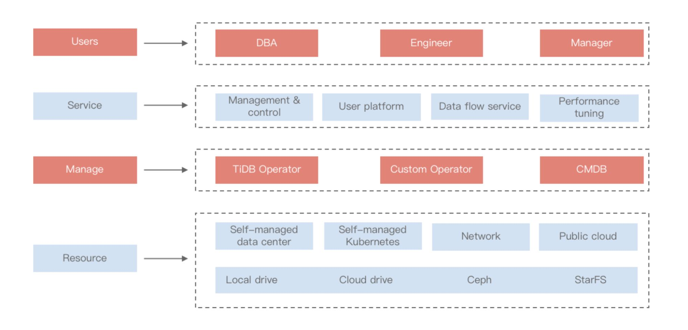

**Industry:** Consumer electronics

**Author:** Zidong Liu (Database Engineer at Xiaomi)

**Transcreator:** [Ran Huang](https://github.com/ran-huang); **Editor:** Tom Dewan

[Xiaomi Corporation](https://www.mi.com/global/) is a consumer electronics company founded in 2010, with smartphones and smart hardware connected by an Internet of Things (IoT) platform at its core. We have established a leading consumer AI+IoT (AIoT) platform, with 324.8 million smart devices connected to our platform, excluding smartphones and laptops.

Our hyper growth is accompanied by massive data volumes. We used MySQL in many applications, but we ran into some problems:

* **[Storage bottlenecks](#storage-bottleneck).** A single drive at Xiaomi could hold 2.6 TB data at most, but many of our businesses exceeded 2 TB.
* **[No guarantee of high availability](#no-guarantee-of-high-availability).** We tried various methods to achieve high availability, but they were not reliable.
* **[Heavy writes led to inconsistency](#heavy-writes-result-in-inconsistency).** MySQL wrote data only to the source node, so heavy writes resulted in high latency between the source and replicas.

To address these issues, **we migrated from MySQL to [TiDB](https://pingcap.com/products/tidb), an open source, cloud-native, distributed SQL database that is compatible with the MySQL protocol.** We also integrated TiDB into our private cloud platform and provided service for various Xiaomi applications. **TiDB not only solves the problems above, but also provides better disaster recovery, boosts analytical performance, and lowers our maintenance costs.**

In this article, I'll explain how we outgrew MySQL and how TiDB is a better alternative for us. Then, I'll share our experience with TiDB and our ambitions for building a hybrid cloud infrastructure with TiDB.

## How we outgrew MySQL

As our company grew, our MySQL-centric infrastructure gradually lagged behind our business expansion. The traditional standalone DBMS no longer met our expectations.

### Storage bottleneck

One major issue was storage bottlenecks. At most, a single drive used by MySQL at Xiaomi could store 2.6 TB of data. Yet many applications' data already exceeded 2 TB, with only a few hundred GB available. A common way to increase storage was to shard the database. However, if you didn't understand the application logic thoroughly, sharding could be a costly move. Many of our applications were older, so even if we wanted to refactor the code, it was hard to figure out where to begin.

A distributed, MySQL compatible database like TiDB efficiently solves this problem. **It's distributed, so scaling out to store more data is a piece of cake. It's MySQL compatible, so migrating from MySQL doesn't require drastic code changes.**

### No guarantee of high availability

MySQL's high availability solutions were complicated. Under the source-replica architecture, a cluster has one source node and multiple replica nodes. Without the source node, the cluster could not function.

We tried many methods to achieve high availability, such as combining a load balancer, [Orchestrator](https://github.com/openark/orchestrator), and middleware. They worked out sometimes. However, whenever the source node crashed on a mission-critical application, our maintenance staff would be so worried about whether the database service pulled through that they couldn't sleep.

### Heavy writes result in inconsistency

In MySQL, the source node accepted writes, and other nodes replicated data from the source. When the application performed heavy writes, the source node easily reached a bottleneck. That brought about high latency between the source and replicas. Latency was a nagging pain. With high latency, data might not be replicated quickly across nodes, and applications read inconsistent data from different nodes—a disaster.

TiDB is suitable for [highly concurrent writes](https://docs.pingcap.com/tidb/stable/high-concurrency-best-practices). It uses the Raft consensus algorithm to distribute Leader replicas across nodes, so applications can write data on multiple nodes.

### Complicated middleware maintenance

Xiaomi does business in manufacturing, internet, IoT, financial payments, and so on. We use many applications, each of which may have its own middleware solution. It was a huge burden to maintain all of them.

TiDB makes everything easier. Because TiDB eliminates the need for manual sharding, we don't need middleware.

## TiDB's added bonuses

Not only does TiDB solve all our problems, it also brings added bonuses we didn't expect:

* **Community support.** TiDB has an active [developer and user community](https://pingcap.com/community). With their kind support and comprehensive [documentation](https://docs.pingcap.com/tidb/stable), we built our platform within a single quarter.
* **Convenient ecosystem tools.** [TiDB's ecosystem tools](https://docs.pingcap.com/tools/) save a lot of time and effort in deployment and maintenance:
    * [TiUP](https://docs.pingcap.com/tidb/stable/tiup-overview), a package manager for TiDB and other tools. It allows you to spin up a cluster in a few minutes and install any component with a single line of commands.
    * [TiDB Dashboard](https://docs.pingcap.com/tidb/dev/dashboard-intro), a built-in web UI that allows you to graphically monitor and diagnose your TiDB cluster.
    * [BR](https://docs.pingcap.com/tidb/dev/backup-and-restore-tool), a tool for distributed backup and recovery.
* **Cross-data-center disaster recovery**. In our practice, TiDB performs excellently when deployed across data centers. The latency is minimal. We can easily deploy TiDB in three data centers across two cities for disaster tolerance.
* **Data encryption at rest and in flight**. TiDB supports both [encryption at rest](https://docs.pingcap.com/tidb/stable/encryption-at-rest) (transparent data encryption) and [encryption in flight](https://docs.pingcap.com/tidb/stable/enable-tls-between-clients-and-servers) (Transport Layer Security). Applying these features can greatly simplify application logic.
* **HTAP triples performance. **Some of our core applications have Hybrid Transactional and Analytical Processing (HTAP) workloads. After we enabled [TiDB's HTAP feature](https://pingcap.com/blog/tidb-5.0-a-one-stop-htap-database-solution), our overall analytical performance increased by more than three times:

<table>
  <tr>
   <td>
<strong>Metrics</strong>
   </td>
   <td><strong>Before HTAP</strong>
   </td>
   <td><strong>After HTAP</strong>
   </td>
  </tr>
  <tr>
   <td>Spark job duration
   </td>
   <td>35 min
   </td>
   <td><strong>8 min</strong>
   </td>
  </tr>
  <tr>
   <td>P99th latency
   </td>
   <td>300~400 ms
   </td>
   <td><strong>~100 ms</strong>
   </td>
  </tr>
  <tr>
   <td>CPU utilization
   </td>
   <td>TiKV: 100%
   </td>
   <td><strong>TiFlash: 30%</strong>
   </td>
  </tr>
  <tr>
   <td>IO utilization
   </td>
   <td>TiKV: 80%
   </td>
   <td><strong>TiFlash: 30%~50%</strong>
   </td>
  </tr>
</table>

## Our experience with TiDB

### Current status: 20+ clusters, 100+ nodes

**In the 10 months since we started using TiDB, it's grown to encompass more than 20 clusters and more than 100 TiKV nodes, covering various industries from e-commerce to supply chain to big data.**

TiDB expanded rapidly within Xiaomi because many application teams were impressed with its scalability. When they encountered a storage bottleneck, it was easy to persuade them to migrate their applications to TiDB. The application scale doubled within just three months.

### Challenges we met

Migrating to TiDB wasn't smooth all the way through. We also met challenges:

* The upstream data had various problems, such as customized sharding, duplicate primary keys, triggers, and stored procedures. The application teams needed to refactor the app logic, so the migration was prolonged.
* Complex SQL statements led to suboptimal execution plans. Though TiDB supported [SQL plan management](https://docs.pingcap.com/tidb/stable/sql-plan-management) to execute SQL bindings, it was still an effort to tune SQL performance.
* Due to nonstandard interfaces of our internal tools, we maintained our own forks of TiDB ecosystem tools. We plan to adapt our internal tools to integrate with TiDB.
* Hardware selection was confusing. In our benchmarking, a certain type of NVMe drive performed worse than an SSD, which was counterintuitive. We will dive deeper into hardware compatibility.

### Building hybrid cloud

TiDB is also part of our hybrid cloud architecture. Hybrid cloud means combining private cloud and public cloud and providing a uniform environment for all applications. We plan to put at least 50% of our databases on the cloud.

The following figure shows our planned architecture, of which TiDB and its tools are an integral part:

Our hybrid cloud architecture

## Our plans for the future

Big thanks to the TiDB community for your strong support over the past year. Going forward, we will continue to grow with the community. We plan to:

* Migrate more of our mission-critical applications from MySQL to TiDB.
* Contribute more to TiDB projects and incubate multiple committers.
* Collaborate with [PingCAP](https://pingcap.com/about) on building a hybrid cloud infrastructure.
* Use TiDB in multiple financial-grade applications.
