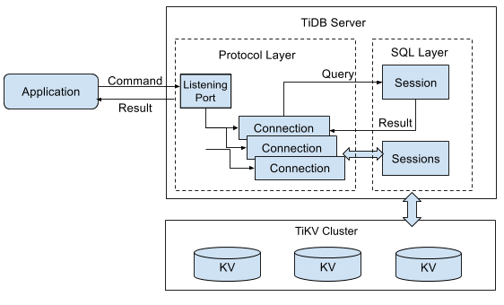
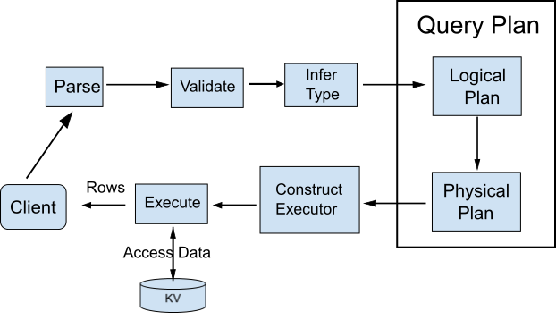

The target audience of this document is the contributors in the TiDB community. The document aims to help them understand the TiDB project. It covers the system architecture, the code structure, and the execution process.

## Table of content

- [System architecture](#system-architecture)
- [Overview of the code structure](#overview-of-the-code-structure)
- [The protocol layer](#the-protocol-layer)
- [The SQL layer](#the-sql-layer)
- [The optimizer](#the-optimizer)
- [The executor](#the-executor)
- [The distributed executor](#the-distributed-executor)

## System architecture


As is shown in the architecture diagram, the TiDB Server is between the Load Balancer (or Application) and the storage engine layer at the bottom. Within the TiDB server, there are three layers:

- The MySQL Protocol layer

    This layer has two functions:

    + At the beginning, it receives the requests from the MySQL client, parses the MySQL Protocol packages to the corresponding commands in TiDB Session.
    + In the end, it transfers the result to the MySQL protocol format and returns it to the Client.

- The SQL layer

    This layer has the following functions:

    + Parse and execute the SQL statement
    + Make and optimize the query plans
    + Generate the optimizer
    + Access data through the Storage Engine API layer
    + Return the result to the MySQL Protocol layer

    This layer is very important and see [The SQL layer](#the-sql-layer) for further information.

- The Storage Engine API layer

    This layer provides transactional (distributed or standalone) storage. There is an abstraction layer between the KV layer and the SQL layer and it enables the SQL layer to see the unified interface and ignore the differences among the KV storage engines.

## Overview of the code structure

See the following list for all the packages and their main functions:

- [tidb](https://github.com/pingcap/tidb)

    This package can be considered to be the interface between the MySQL Protocol Layer and the SQL layer. There are three main files:

    + [`session.go`](https://github.com/pingcap/tidb/blob/master/session/session.go): Each session object corresponds to a connection of the MySQL client. The MySQL protocol layer manages the binding between the connection and the session. All the MySQL queries/commands are executed by calling the Session interface.
    + [`tidb.go`](https://github.com/pingcap/tidb/blob/master/session/tidb.go): This file includes some functions to be called by `session.go`.
    + [`bootstrap.go`](https://github.com/pingcap/tidb/blob/master/session/bootstrap.go): If a TiDB Server is started but the system is not yet initialized, the `bootstrap.go` file will initiate the system. See the following section for the detailed information.

- [docs](https://github.com/pingcap/tidb/tree/master/docs)

    This package contains some brief documents of TiDB. See [Documents](https://github.com/pingcap/docs) for all the detailed documents.

- [executor](https://github.com/pingcap/tidb/tree/master/executor)

    This is the TiDB executor. A SQL statement will be transferred to the combination a series of executors (operators). The main interface exposed in this package is `Executor`:

    ```go
    type Executor interface {
        // Returns the next row of data (If the result is empty, then there is no more data)
        Next() (*Row, error)
        // Close the current Executor and clean up
        Close() error
        //Change the result Schema from the executor, including the details of each Field
        Schema() expression.Schema
    }
    ```

    All kinds of executors implement this interface. The executing engine in TiDB adopts the `Volcano` model where the executors interact with each other through the above 3 interfaces. Each executor only needs to access the data through the `Next` interface and the meta data through the `Schema` interface.

- [plan](https://github.com/pingcap/tidb/tree/rc2.3/plan)

    This is the core of the entire SQL layer. After a SQL statement is parsed to an abstract syntax tree (AST), the query plan is generated and optimized (including logical optimization and physical optimization) in this package.

    This is the core of the entire SQL layer. After a SQL statement is parsed to an abstract syntax tree (AST), the query plan is generated and optimized (including logical optimization and physical optimization) in this package.

    This is the core of the entire SQL layer. After a SQL statement is parsed to an abstract syntax tree (AST), the query plan is generated and optimized (including logical optimization and physical optimization) in this package.

    The following functions are also included in this package:

    + [`validator.go`](https://github.com/pingcap/tidb/blob/rc2.3/plan/validator.go): Validates the AST.
    + [`preprocess.go`](https://github.com/pingcap/tidb/blob/rc2.3/plan/preprocess.go): Currently, there is only `name resolve`.
    + [`resolver.go`](https://github.com/pingcap/tidb/blob/rc2.3/plan/resolver.go)`: Parses the name. To parse and bind the identifier of database/table/column/alias to the corresponding column or Field.
    + [`typeinferer.go`](https://github.com/pingcap/tidb/blob/rc2.3/plan/typeinferer.go): Infers the type of the result. For SQL statements, the type of the result does not need inference.
    + [`logical_plan_builder.go`](https://github.com/pingcap/tidb/blob/rc2.3/plan/logical_plan_builder.go): Makes optimized logical query plans.
    + [`physical_plan_builder.go`](https://github.com/pingcap/tidb/blob/rc2.3/plan/physical_plan_builder.go): Makes the physical query plans based on the logical plans.

- [privilege](https://github.com/pingcap/tidb/tree/master/privilege)

    The authority control related interface which is implemented in the [`privilege/privileges`](https://github.com/pingcap/tidb/tree/master/privilege/privileges) directory.

- [sessionctx](https://github.com/pingcap/tidb/tree/master/sessionctx)

    Stores the state information in the session, such as the session variables. The information can be obtained from the session. It is included in a separate directory for clear dependency and to avoid the problems of circular dependencies.

- [table](https://github.com/pingcap/tidb/tree/master/table)

    The `table` interface which is a layer of abstraction of the tables in the database. It provides many operations to the table such as getting the information of the column or reading a row of data. The implementation is in the [table/tables](https://github.com/pingcap/tidb/tree/master/table/tables) directory.

    The directory also includes the abstraction of Column and Index.

- [tidb-server](https://github.com/pingcap/tidb/tree/master/tidb-server)

    The [main.go](https://github.com/pingcap/tidb/blob/master/tidb-server/main.go) file of the TiDB Server which is mainly the codes to start the server.

- [server](https://github.com/pingcap/tidb/tree/master/server)

    The implementation of the MySQL Protocol which is to parse the protocol and to pass the command/query.

- [ast](https://github.com/pingcap/tidb/tree/rc2.3/ast)

    The SQL statement will be parsed to be an abstract syntax tree. The data structure is defined in the [ast](https://github.com/pingcap/tidb/tree/rc2.3/ast) directory. Each node must implement the `visitor` interface and call the `Accept` method in the node to traverse the tree.

    If new syntax support is needed, besides adding the rule to [parser](https://github.com/pingcap/tidb/tree/rc2.3/parser), you also need to add the data structure to this directory.

- [ddl](https://github.com/pingcap/tidb/tree/master/ddl)

    The related codes for asynchronous schema changes which is similar to the implementation in [Google F1](http://static.googleusercontent.com/media/research.google.com/zh-CN//pubs/archive/41344.pdf).

- [domain](https://github.com/pingcap/tidb/tree/master/domain)

    [domain](https://github.com/pingcap/tidb/tree/master/domain) can be considered as a storage space where databases and tables are created. Somewhat like Name Space, the databases with the same name can exist in different domains. Domains bind with the information schema detail.

- [expression](https://github.com/pingcap/tidb/tree/master/expression)

    The definition of the expressions. See the following for the most important interface:

    ```go
    type Expression interface {
    ...
    }
    ```

    The following lists the expressions that implement the interface:

    - Scalar Function: Scalar Function expressions
    - Aggregate Function: Aggregate Function expressions
    - Column: Column expressions
    - Const: Constant expressions

* [infoschema](https://github.com/pingcap/tidb/tree/master/infoschema)

    The implementation of `InformationSchema` which provides the details of the `db/table/column`.

* [kv](https://github.com/pingcap/tidb/tree/master/kv)

    Key-Value related interface definition and some of the implementations, including `Retriever / Mutator / Transaction / Snapshot / Storage / Iterator`, etc. A unified abstraction of the underlying Key-Value storages.

* [model](https://github.com/pingcap/tidb/tree/rc2.3/model)

    The DDL / DML related data structure supported by TiDB, including `DBInfo / TableInfo / ColumnInfo / IndexInfo`, etc.

* [parser](https://github.com/pingcap/tidb/tree/source-code/parser)

    The syntax parsing module, including lexical analysis ([lexer.go](https://github.com/pingcap/tidb/blob/rc2.3/parser/lexer.go)) and syntax analysis ([parser.y](https://github.com/pingcap/tidb/blob/rc2.3/parser/parser.y)). The main interface to the external is `Parse ()` which is to parse the SQL text into AST.

* [store](https://github.com/pingcap/tidb/tree/master/store)

    The implementation of the Key-Value store at the bottom. If you want to plug in a new storage engines, you can package the storage engine and put the code in this package. The new storage engine needs to implement the interface defined in the [kv](https://github.com/pingcap/tidb/tree/master/kv) package.

    The implementation of the Key-Value store at the bottom. If you want to plug in a new storage engines, you can package the storage engine and put the code in this package. The new storage engine needs to implement the interface defined in the [kv](https://github.com/pingcap/tidb/tree/master/kv) package.

    The implementation of the Key-Value store at the bottom. If you want to plug in a new storage engines, you can package the storage engine and put the code in this package. The new storage engine needs to implement the interface defined in the [kv](https://github.com/pingcap/tidb/tree/master/kv) package.

    Currently, there are two storage engines: TiKV, a distributed storage engine, and localstore/{goleveldb/boltdb}, a stand-alone storage engine.

    For more information about the KV and store, see [How to Plug in a New Storage Engine](https://github.com/ngaut/builddatabase/blob/master/tidb/storage.md) (Currently in Chinese).

* [terror](https://github.com/pingcap/parser/tree/master/terror)

    The error system for TiDB. For more information, see [Detailed specification](https://docs.google.com/a/pingcap.com/document/d/1L7th17VTZCOeb4RfFqgs9cya6yORKqWcjB2fYqckOFU/edit?usp=sharing) (Currently in Chinese).

* context

    The `context` interface. `Session` is the implementation of the `context` interface. The reason that we have an interface is to avoid the circular dependencies. All the state information of `session` can be accessed using this interface.

* inspectkv

    The auxiliary check package for TiDB SQL data and Key-Value storage. In the future, it will be used to access TiKV from the external and will be re-defined and developed.

* [meta](https://github.com/pingcap/tidb/tree/master/meta)

    The definition of the metadata related constants and common functions for TiDB. In [meta/autoid](https://github.com/pingcap/tidb/tree/master/meta/autoid), an API is defined for ID auto-increment within a globally unique session. The meta information depends on this tool.

* [mysql](https://github.com/pingcap/tidb/tree/rc2.3/mysql)

    MySQL related constant definitions.

* [structure](https://github.com/pingcap/tidb/tree/master/structure)

    A layer of encapsulation on top of Key-Value which supports rich Key-Value types, such as string, list, hash, etc. The package is mainly used in asynchronous Schema changes.

* [util](https://github.com/pingcap/tidb/tree/master/util)

    Some utility classes. The 7 package is very important because it contains the definitions of the data types and the operations toward different kinds of data type objects.

* [distsql](https://github.com/pingcap/tidb/tree/master/distsql)

    The execution interface for distributed SQL. If the storage engine at the bottom supports distributed executor, it can send requests through this interface. See [The distributed executor](#the-distributed-executor) for further information.

<div class="trackable-btns">
    <a href="/download" onclick="trackViews('About the TiDB Source Code', 'download-tidb-btn-middle')"><button>Download TiDB</button></a>
    <a href="https://share.hsforms.com/1e2W03wLJQQKPd1d9rCbj_Q2npzm" onclick="trackViews('About the TiDB Source Code', 'subscribe-blog-btn-middle')"><button>Subscribe to Blog</button></a>
</div>

## The protocol layer

The protocol layer is the interface to interact with the applications. Currently, TiDB supports the MySQL protocol only. All the related codes are in the [server](https://github.com/pingcap/tidb/tree/master/server) package.

The main function of the protocol layer is to manage the client connections, parse the MySQL commands, and return the execution results. This layer is implemented according to the MySQL protocol, see [MySQL Client/Server Protocol](https://dev.mysql.com/doc/internals/en/client-server-protocol.html) on the MySQL website for further information.

For a single connection, the entry point method is the [dispatch](https://github.com/pingcap/tidb/blob/master/server/conn.go#L350) of the `clientConn` class, where the protocol is parsed and different processing functions are called.



## The SQL layer

The following sections are about how the TiDB SQL layer works and how a SQL statement changes from a piece of text to an execution result set. The introduction is focused on the SQL layer only and the Key-Value layer is not covered.

Generally speaking, a SQL statement goes through the following process:

Parse statement -> Validate statement -> Optimize statement -> Generate access plan -> Execute access plan

The following diagram shows how TiDB processes a SQL statement:



The entry point of the process is in the [`session.go`](https://github.com/pingcap/tidb/blob/master/session/session.go) file. TiDB-Server calls the `Session.Execute()` interface, inputs the SQL statement and implements `Session.Execute()`.

1. First, call `Compile()` to parse the SQL statement using `tidb.Parse()` and get a list of `stmt` where each statement is an AST and each syntax unit is a Node of the AST. The structure is defined in the [ast](https://github.com/pingcap/tidb/tree/source-code/ast) package.
2. After the AST is got, call the the `Compiler` in the [executor](https://github.com/pingcap/tidb/tree/master/executor) package. Input the AST and get `Compiler.Compile()`. During this process, the statement validation, query plan generation and optimization are all completed.
3. In `Compiler.Compile()`, call `plan.Validate()` in plan/validator.go to validate the statement and then go to the `Preprocess` process. At the current stage, `Preprocess` has only finished name parsing and bound the column or alias name to the corresponding field. Take the "select c from t;" statement for an example, `Preprocess` binds the name `c` to the corresponding column in the table `t`. See plan/resolver.go for the detailed implementation. After this, enter `optimizer.Optimize()`.
4. In the `Optimize()` method, infer the result of each node in AST. Take the "select 1, 'xx', c from t;" statement as an example, for the select fields, the first field is "1" whose type is `Longlong`; the second field is "'xx'" whose field is `VarString`; the third field is "c" whose type is the type of column `c` in the table `t`. Note that besides the type information, the other information like charset also needs to be inferred. See plan/typeinferer.go for the detailed implementation.
5. After the type inference, use the `planBuilder.build()` method for logical optimization which is to do equivalent transformation and simplification for AST based on the algebraic operation. For example, "select c from t where c > 1+1\*2;" can be equivalently transformed to "select c from t where c > 3;".
6. After the logical optimization, the next step is physical optimization. The process involves generating query plan tree and transforming the tree according to the index, rules and the cost model to reduce the cost of the query process. The entry point is in the `doOptimize()` method in the [plan/optimizer.go](https://github.com/pingcap/tidb/blob/rc2.3/plan/optimizer.go) file.
7. When the query plan is generated, it will be transformed to the executor. Use the `Exec` interface to get the `RecordSet` object and call the `Next()` method to get the query result.

## The optimizer

The optimizer is the core of the database and it determines how a statement is executed. The optimizer to a database is what a commander-in-chief to an army. As we all know, the commander-in-chief's failure is the disaster of the entire army. The same applies to the optimizer and database. For the same statement, the running time varies significantly using different query plans. The research on the optimization is an active academic field. There is no limit on optimization and you can never overestimate the efforts and importance it takes.

There are following types of optimization methods:

- Rule based optimizer: optimize a plan by using a set of rules to determine the execution plan for a given query.

    This type of optimizer is easy to implement. It only takes some frequently used rules and it works well for most of the common queries. But you cannot choose the best solution based on the true data scenario. Take the "select \* from t where c1 = 10 and c2 > 100" statement as an example, when selecting index, if you only follow the rules, you must use the index in `c1` for the query. But if all the values of `c1` in `t` are `10`, it will be a bad query plan. If there is information about how the data is distributed in the table, it will help choose a better plan.

- Cost based optimizer: optimize a plan by calculating the query cost

    This type of optimizer is more complex. There are two key problems: one is how to get the true distribution information of the data; the other one is how to estimate the cost of a certain query plan based on this information.

- History based optimizer: optimize a plan according to the history query information

    This type of optimizer is seldom used, especially in OLTP databases.

The codes for the TiDB optimizer is included in the [plan](https://github.com/pingcap/tidb/tree/rc2.3/plan) package. The package is mainly to transform an AST to a query plan tree. The nodes of the tree are different types of logical operator and physical operator. All sorts of optimization towards the query plan are all based on the methods of calling the root node, optimizing all the related nodes recursively, then transforming and trimming each node on the tree.

The most important interfaces are included in the [plan.go](https://github.com/pingcap/tidb/blob/rc2.3/plan/plan.go) file, including:

- Plan: the interface to all the query plans
- LogicalPlan: the logical query plan which needs to be implemented by all the logical operator
- PhysicalPlan: the physical query plan which needs to be implemented by all the physical operator

The entry point of the logical optimization is `planbuilder.build()`. The input is AST and the output is the logical query plan tree. And then perform logical optimization on this tree as follows:

- Call the `PredicatePushDown`interface of `LogicalPlan` and push down the predicate as much as possible
- Call the `PruneColumns` interface of `LogicalPlan` and cut the unnecessary columns
- Call `aggPushDownSolver.aggPushDown` and push down the aggregate operation before `Join`

After you get the logically optimized query plan tree, the next step is to get it physically optimized. The entry point is to call the `convert2PhysicalPlan(&requiredProperty{})` towards the root node of the logical query plan tree. The `requiredProperty` is the requirement about the order and number of rows of the returned result.

Starting from the root node, each node on the logical query plan tree is called recursively and transformed from a logical operator to a physical operator until a better query path is found based on the query cost of each node.

## The executor

Although the optimizer is the core component, an excellent database cannot make it without an excellent executor. The executor is to a database is what brilliant soldiers to an army. No matter how good the commander-in-chief is, without good soldiers, the army can't win in the battlefield.

Compared with MySQL, TiDB has two advantages: one is the massively parallel processing (MPP) framework which enables computing on multiple TiKV and TiDB nodes to improve the efficiency and speed as much as possible; the other one is that a single operator can compute parallel as much as possible such as the operators like `Join`/ `Union`. TiDB starts several threads at the same time. The entire data computing process makes a pipeline and cut the waiting time of each operator as much as possible. This is why TiDB is better than MySQL when processing large amounts of data.

The most important interface is in the [executor.go](https://github.com/pingcap/tidb/blob/master/executor/executor.go) file:

```go
// Executor executes a query.
type Executor interface {
    Next() (*Row, error)
    Close() error
    Schema() expression.Schema
}
```

The physical query plan tree from the optimizer is transformed to an executor. Each node on the tree will implement the interface. The executors pass data through the `Next` interface. Take "select c1 from t where c2 > 10;" as an example, the final executor are the three executors: `Projection->Filter->TableScan`. The `Projection` on the top layer continuously calls the `Next` interface until the `TableScan` layer at the bottom and access data from the table.

## The distributed executor

As a distributed database, there is a distributed computing framework inside TiDB. A running query is distributed and parallelized as much as possible. The entry point of the framework is in the [distsql](https://github.com/pingcap/tidb/tree/master/distsql) package. The following API and two interfaces are the most important part:

```go
// Select do a select request, returns SelectResult.
// conncurrency: The max concurrency for underlying coprocessor request.
// keepOrder: If the result should returned in key order. For example if we need keep data in order by
//            scan index, we should set keepOrder to true.
func Select(client kv.Client, req *tipb.SelectRequest, keyRanges []kv.KeyRange, concurrency int, keepOrder bool) (SelectResult, error)

// SelectResult is an iterator of coprocessor partial results.
type SelectResult interface {
    // Next gets the next partial result.
    Next() (PartialResult, error)
    // SetFields sets the expected result type.
    SetFields(fields []*types.FieldType)
    // Close closes the iterator.
    Close() error
        ...
}

// PartialResult is the result from a single region server.
type PartialResult interface {
    // Next returns the next row of the sub result.
    // If no more row to return, data would be nil.
    Next() (handle int64, data []types.Datum, err error)
    // Close closes the partial result.
    Close() error
}
```

`Select()` is the most important interface of `DistSQL`. There are two parameters:

1. The first parameter is `kv.Client`. As long as a Key-Value engine is transactional, meets the Key-Value interface and some interfaces of the `Client`, the engine can work with TiDB. Currently, some partners are working together with TiDB to run TiDB on other Key-Value storage engines and support distributed SQL.

2. The second parameter is `SelectRequest`, which is constructed by the executor on the upper layer. It puts the computing logic, such as whether to sort or aggregate the expressions, in `req` which is a `Protobuf` structure, sends to the `Select` interface, and finally sends to the computing TiKV region server.


The distributed executor is mainly about distributing tasks and collecting results. The `Select` interface returns a data structure, which is called `SelectResult`. The structure can be considered to be an iterator. Because there are many region servers at the bottom layer, the results returned from each node is `PartialResult`. On top of these results is an encapsulated `SelectResult` which is an iterator of `PartialResult`. The next `PartialResult` can be obtained by using the `next` method.

The internal implementation of the `SelectResult` can be considered to be a pipeline. TiDB can send requests to each region server concurrently and return the results to the upper layer. The order is determined by the order of the returned results from the bottom layers and the `KeepOrder` parameter of the `Select` interface.

See the related code in the [distsql](https://github.com/pingcap/tidb/tree/master/distsql) package and the [store/tikv/coprocessor.go](https://github.com/pingcap/tidb/blob/master/store/tikv/coprocessor.go) file.
