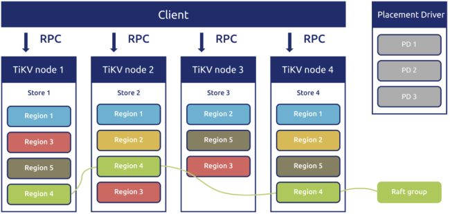
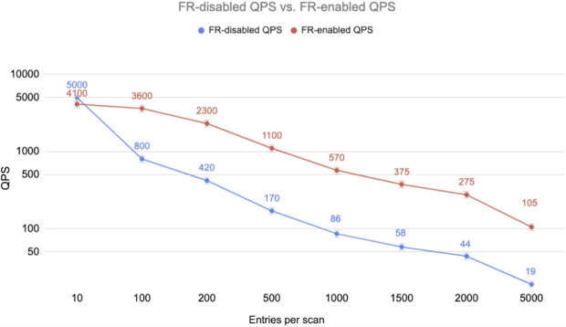

On Dec 20, 2019, we released [TiDB 3.1 Beta](https://pingcap.com/docs/v3.1/releases/3.1.0-beta/). In this version, [TiDB](https://en.wikipedia.org/wiki/TiDB) introduced two significant features, [Follower Read](https://pingcap.com/docs/v3.1/reference/performance/follower-read/) and [Backup & Restore (BR)](https://pingcap.com/docs/v3.1/how-to/maintain/backup-and-restore/br/), and enriched [optimizer hints](https://pingcap.com/docs/v3.1/reference/performance/optimizer-hints/). 

For TiDB 3.1 Beta, Follower Read is a highlight open-source feature. To understand how important this feature is, you'll need a bit of background. TiDB's storage engine, [TiKV](https://pingcap.com/docs/v3.1/architecture/#tikv-server), stores data in basic units called [Regions](https://pingcap.com/docs/v3.1/glossary/#regionpeerraft-group). Multiple replicas of a Region form a [Raft group](https://pingcap.com/docs/v3.1/glossary/#regionpeerraft-group). When a read hotspot appears in a Region, the Region [leader](https://pingcap.com/docs/v3.1/glossary/#leaderfollowerlearner) can become a read bottleneck for the entire system. In this situation, enabling the Follower Read feature can significantly reduce the load on the leader and improve the read throughput of the whole system by balancing the load among multiple [followers](https://pingcap.com/docs/v3.1/glossary/#leaderfollowerlearner). 

We wrote only [26 lines of code](https://github.com/tikv/tikv/pull/5051) to implement Follower Read. In our test for the scan scenario, when this feature is enabled, queries per second (QPS) may achieve about 5x improvement.

In this post, I'll guide you through why we introduced Follower Read, how we implement it, and our future plans for it. 

Note that this post assumes that you have some basic knowledge of the [Raft consensus algorithm](https://raft.github.io/) and [TiDB's architecture](https://pingcap.com/docs/v3.1/architecture/).

## What is Follower Read

[The Follower Read feature](https://pingcap.com/docs/v3.1/reference/performance/follower-read/#overview) lets any follower replica in a Region serve a read request under the premise of [strongly consistent reads](https://pingcap.com/docs/v3.1/reference/performance/follower-read/#strongly-consistent-reads). 

This feature improves the throughput of the TiDB cluster and reduces the load on the Raft leader. It contains a series of load balancing mechanisms that offload TiKV read loads from the leader replica to the follower replica in a Region. 

TiKV's Follower Read implementation guarantees the linearizability of single-row data reading. Combined with [snapshot isolation](https://en.wikipedia.org/wiki/Snapshot_isolation) in TiDB, this implementation also provides users with strongly consistent reads.

## Why we introduced Follower Read

In the TiKV architecture, we use the Raft algorithm to ensure data consistency. But in the previous mechanism, only the leader in a Region handled heavy workloads, and the calculation resources of followers were not put to use. Therefore, we introduced Follower Read to handle read requests on followers to reduce the load on the leader.

### The TiKV architecture

TiKV uses the Raft algorithm to guarantee data consistency. The goal of TiKV is to support 100+ TB of data, but it is impossible for one Raft group to do that. Therefore, we need to use multiple Raft groups, which is Multi-Raft. See our previous post [The Design and Implementation of Multi-Raft](https://pingcap.com/blog/2017-08-15-multi-raft/).


<div class="caption-center"> Implementing Raft in the TiKV architecture </div>

TiKV divides data into Regions. By default, each Region has three replicas and these Region replicas form a Raft group. As data writes increase, if the size of the Region or the number of keys reaches a threshold, a [Region Split](https://pingcap.com/docs/v3.1/glossary/#region-split) occurs. Conversely, if data is deleted and the size of a Region or the amount of keys shrinks, we can use Region Merge to merge smaller adjacent Regions. This relieves some stress on Raftstore.

### The problem with the TiKV architecture   

The Raft algorithm achieves consensus via an elected leader. A server in a Raft group is either a leader or a follower, and, if a leader is unavailable, it can be a candidate in an election. The leader replicates logs to the followers. 

Although TiKV can spread Regions evenly on each node, only the leader can provide external services. The other two followers only receive the data replicated from the leader, or vote to elect a Raft leader when doing a failover. Simply put, at the Region level, **only the leader deals with heavy workloads, while followers are maintained as cold standbys**.

Sometimes when there is some hot data, the resources of the Region leader's machine are fully occupied. Although we can forcibly split the Region and then move the data to another machine, this operation always lags, and the calculation resources of followers are not used.

Here comes a question: can we handle the client's read request on followers? If yes, we can relieve the load on the leader. 

The solution is Follower Read. 

## How we implement Follower Read

The implementation of Follower Read is based on the `ReadIndex` algorithm. Before elaborating on Follower Read, let me introduce `ReadIndex` first.

### The `ReadIndex` algorithm

This section discusses how the `ReadIndex` algorithm solves the linearizability issue.

#### The linearizability issue for the Raft algorithm

How do we ensure that we can read the latest data on followers? Can we just return the data about the latest committed index on followers to the client?

The answer is no, because Raft is a quorum-based algorithm. To commit a log, you don't need to successfully write data to all the replicas of a Region (also known as [peers](https://pingcap.com/docs/v3.1/glossary/#regionpeerraft-group)).  Instead, when a log is committed to the _majority_ of peers, it means that it is successfully written to TiKV. In this case, the local data on a follower might be stale. This violates linearizability.

In fact, in trivial Raft implementation, even if the leader handles all loads, the stale data problem may still occur. For example, when a network partition occurs, the old leader is isolated in the minority of nodes. At the same time, the majority of nodes have elected a new leader. But the old leader doesn't know that, and it may return stale data to the client during its leader lease.

#### `ReadIndex` as the solution to the linearizability issue

The quorum reads mechanism helps solve this problem, but it might consume a lot of resources or take too long. Can we improve its effectiveness? The crucial issue is that the old leader is not sure whether it is the latest leader. Therefore, we need a method for the leader to confirm its leader state. This method is called the `_ReadIndex` algorithm_. It works as follows:

1.  When the current leader processes a read request, the system records the current leader's latest committed index.

2. The current leader ensures that it's still the leader by sending a heartbeat to the quorum.

3. After the leader confirms its leader state, it returns this entry.

This way, linearizability is not violated. Although the `ReadIndex` algorithm needs network communication for the majority of the cluster, this communication just transmits metadata. It can remarkably reduce network I/O, and thus increase the throughput. Furthermore, TiKV goes beyond the standard `ReadIndex` algorithm and implements `LeaseRead`, which guarantees that the leader lease is shorter than the election timeout of re-electing a new leader.

### Implementation and issues of Follower Read

This section shows how we implement Follower Read and some of this feature's issues.

#### The current implementation of Follower Read

How do we ensure that we can read the latest data on followers? Maybe you'll consider this common policy: the request is forwarded to the leader, and then the leader returns the latest committed data. The follower is used as a proxy. The idea is simple and safe to implement. 

You can also optimize this policy. The leader only needs to tell followers the latest committed index, because in any case, even if a follower hasn't stored this log locally, the log is applied locally sooner or later.

Based on this thought, TiDB currently implements the Follower Read feature this way:

1. When the client sends a read request to a follower, the follower requests the leader's committed index. 

2. After the follower gets the leader's latest committed index and applies the index to itself, the follower returns this entry to the client. 

#### Issues for Follower Read

Currently, the Follower Read feature has two issues:

**Issue #1: linearizability**

TiKV uses an asynchronous Apply, which might violate linearizability. Although the leader tells followers the latest committed index, the leader applies this log asynchronously. A follower may apply this s log before the leader does. As a result, we can read this entry on the follower, but it may take a while to read it on the leader.

Although we can't ensure linearizability for the Raft layer, Follower Read can guarantee snapshot isolation for the database distributed transaction layer. If you're familiar with the [Percolator algorithm](http://www.matrixscience.com/help/percolator_help.html), you can get that:

* When we execute a point get query, we use `UINT64_MAX` as the timestamp to read data. Because only one row of data in only one Region is accessed, we can guarantee snapshot isolation for a transaction.
* If the data for the committed timestamp (ts) can be read on the follower, but other SQL statements within the same transaction temporarily can't read this ts on the leader, a lock inevitably occurs. The subsequent processing of the lock can guarantee snapshot isolation.  

The two facts above ensure that when Follower Read is enabled, TiDB's transaction still implements snapshot isolation. Thus, transaction correctness isn't affected.

**Issue #2: read latency**

Our current Follower Read implementation still uses a [remote procedure call](https://en.wikipedia.org/wiki/Remote_procedure_call) (RPC) to ask the leader for the committed index. Therefore, even though we use Follower Read, read latency remains high.

For this issue, even though this solution doesn't significantly improve latency, it helps improve read throughput and reduce the load on the leader.

Therefore, the Follower Read feature is a fine optimization.

## Benchmarks for Follower Read

We ran a test to simulate an application scenario where there is a long distance between the client and the leader. The test shows that **when Follower Read is enabled in the scan scenario and the size of data to access reaches a certain amount, QPS achieves about 5x improvement**. 

### The test environment

<table>
  <tr>
   <td><strong>Instance</strong>
   </td>
   <td><strong>Instance count</strong>
   </td>
   <td><strong>Configuration</strong>
   </td>
  </tr>
  <tr>
   <td>PD
   </td>
   <td>1
   </td>
   <td>16 core 2.2 GHz/SSD 500 GB
   </td>
  </tr>
  <tr>
   <td>TiKV
   </td>
   <td>2
   </td>
   <td>16 core 2.2 GHz/SSD 500 GB
<p>
172.16.4.223: leader
<p>
172.16.5.203: follower
   </td>
  </tr>
</table>

<div class="trackable-btns">
    <a href="/download" onclick="trackViews('Achieving 5x QPS with Only 26 Lines of Code', 'download-tidb-btn-middle')"><button>Download TiDB</button></a>
    <a href="https://share.hsforms.com/1e2W03wLJQQKPd1d9rCbj_Q2npzm" onclick="trackViews('Achieving 5x QPS with Only 26 Lines of Code', 'subscribe-blog-btn-middle')"><button>Subscribe to Blog</button></a>
</div>

### The Yahoo! Cloud Serving Benchmark (YCSB) workload

In the scan scenario:

```
threadcount=256

recordcount=15000000

workload=core

readallfields=true

readproportion=0

updateproportion=0

scanproportion=1.0

insertproportion=0

scanlengthdistribution=uniform

requestdistribution=uniform
```

We added the following latency commands in the test environment:

* A 30 ms latency between the leader and the follower that implements Follower Read
* A less than one ms latency between the client and the follower that implements Follower Read

### Test results

In the table below, the Follower Read (FR) test numbers are approximate.

<table>
  <tr>
   <td><strong>Entries per scan</strong>
   </td>
   <td><strong>QPS (FR disabled)</strong>
   </td>
   <td><strong>QPS (FR enabled)</strong>
   </td>
  </tr>
  <tr>
   <td>10
   </td>
   <td>5.0k
   </td>
   <td>4.1 k
   </td>
  </tr>
  <tr>
   <td>100
   </td>
   <td>800
   </td>
   <td>3.6 k
   </td>
  </tr>
  <tr>
   <td>200
   </td>
   <td>420
   </td>
   <td>2.3 k
   </td>
  </tr>
  <tr>
   <td>500
   </td>
   <td>170
   </td>
   <td>1.1 k
   </td>
  </tr>
  <tr>
   <td>1000
   </td>
   <td>86
   </td>
   <td>570
   </td>
  </tr>
  <tr>
   <td>1500
   </td>
   <td>58
   </td>
   <td>375
   </td>
  </tr>
  <tr>
   <td>2000
   </td>
   <td>44
   </td>
   <td>275
   </td>
  </tr>
  <tr>
   <td>5000
   </td>
   <td>19
   </td>
   <td>105
   </td>
  </tr>
</table>

Graphing FR test results:


<div class="caption-center"> Before-and-after QPS comparison </div>

The test shows that when Follower Read is enabled in the scan scenario and the size of data to access reaches a certain amount, QPS achieves about 5x improvement. 

### The reason behind the benchmark result

This test simulates an application scenario where there is a long distance between the client and the leader: a 30 ms latency between the leader and the follower and also between the leader and the client. Before Follower Read reads data, it obtains `ReadIndex` from the leader by sending a Raft message to the leader, while Raft messages between TiKV instances are sent in batches. Therefore, multiple Follower Read requests only need to communicate with the leader once. Compared with directly sending read requests to the leader, this approach needs fewer communication cycles with the leader. In the same concurrency condition, Follower Read brings a higher read throughput.

## What's next for Follower Read

This feature seems simple, but it's really important. In the future, we'll use it in even more ways to improve TiDB's performance.

### Strategies for varied-heat data

You might ask me a question: if I run a large query on a table, will it affect the ongoing [online transaction processing](https://en.wikipedia.org/wiki/Online_transaction_processing) (OLTP) transaction？Although we have an I/O priority queue built in TiKV, which prioritizes important OLTP requests, it still consumes the resources of the machine with the leader state. 

A corner case is a small hot table with many more read operations than write operations. Although hot data is cached in memory, when the data is extremely hot, a CPU or network I/O bottleneck occurs.

Our previous post [TiDB Internal (III) - Scheduling](https://pingcap.com/blog/2017-07-20-tidbinternal3/) mentions that we use a separate component called [Placement Driver](https://pingcap.com/docs/v3.1/architecture/#placement-driver-server) (PD) to schedule and load-balance Regions in the TiKV cluster. Currently, the scheduling work is limited to splitting, merging, and moving Regions, and transferring the leader. But in the near future, TiDB will be able to dynamically use different replica strategies for data of different heat degrees. 

For example, if we find a small table extremely hot, PD can quickly let TiKV dynamically create multiple (more than three) read-only replicas of this data, and use the Follower Read feature to divert the load from the leader. When the load pressure is mitigated, the read-only replicas are destroyed. Because each Region in TiKV is small (96 MB by default), TiDB can be very flexible and lightweight when doing this.

### Local Read based on Follower Read

Currently, even though TiDB is deployed across data centers and distributes data replicas among these data centers, it is the leader that provides services for each piece of data. This means that applications need to be as close to the leader as possible. Therefore, we usually recommend that users deploy applications in a single data center, and then make PD focus leaders on this data center to process read and write requests faster. Raft is only used to achieve high availability across data centers. 

For some read requests, if we can process these requests on a nearby node, we can reduce the read latency and improve read throughput.

As mentioned above, the current implementation of Follower Read does little to reduce read latency. Can we get the local committed log without asking the leader? Yes, in some cases. 

As we discussed in our previous post [MVCC in TiKV](https://pingcap.com/blog/2016-11-17-mvcc-in-tikv/), TiDB uses [multi-version concurrency control](https://en.wikipedia.org/wiki/Multiversion_concurrency_control) (MVCC) to control transaction concurrency. Each entry has a unique, monotonically increasing version number. 

Next, we'll combine Follower Read with MVCC. If the version number of the data in the latest committed log on the local node is greater than that of the transaction initiated by the client, the system returns the data in the latest committed log on the local node. This won't violate the [atomicity, consistency, isolation, durability](https://en.wikipedia.org/wiki/ACID) (ACID) properties of transactions. 

In addition, for some scenarios where data consistency is not a strict requirement, it makes sense to directly support reads of low isolation level in the future. When TiDB supports reads of low isolation level, its performance might improve dramatically.

## Conclusion

The Follower Read feature uses a series of load balancing mechanisms to offload read requests on the Raft leader onto its followers in a Region. It ensures the linearizability of single-row data reads and offers strongly consistent reads when combined with TiDB's snapshot isolation.

Follower Read helps reduce the load on the Region leader and substantially enhances the throughput of the entire system. If you'd like to try it out, see our [user document](https://pingcap.com/docs/v3.1/reference/performance/follower-read/).

We've just taken the first step to craft Follower Read, and we'll make continuous efforts to optimize this feature in the future. If you're interested in it, you're welcome to test it or contribute to [our project](https://github.com/tikv).
