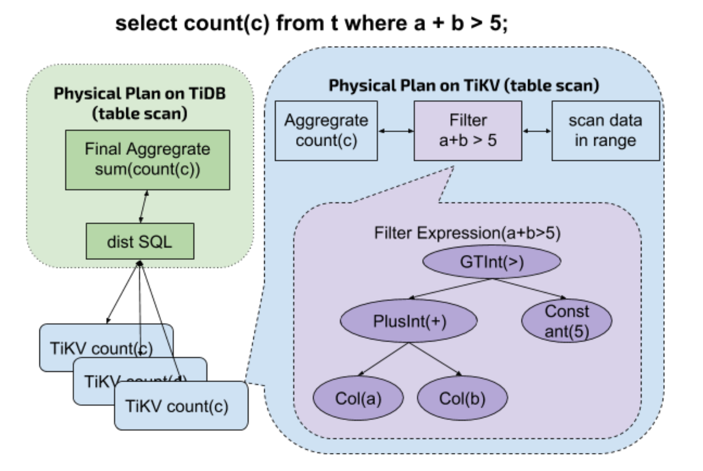

*Note: This post is out of date.*

This guide is intended to show how you can land your first Pull Request (PR) in Rust to contribute to TiKV in less than 30 minutes. But before we do that, here's some helpful background.

[TiDB](https://github.com/pingcap/tidb) ("Ti" = Titanium) is an open-source distributed scalable Hybrid Transactional and Analytical Processing ([HTAP](https://en.wikipedia.org/wiki/Hybrid_transactional/analytical_processing_(HTAP))) database, built by the company PingCAP (that's us!) and its active open-source community (that's you!). It's designed to provide infinite horizontal scalability, strong consistency, and high availability with MySQL compatibility. It serves as a one-stop data warehouse for both OLTP (Online Transactional Processing) and OLAP (Online Analytical Processing) workloads.

What powers this experience is [TiKV](https://github.com/pingcap/tikv), a distributed transactional key-value store (all built in Rust!), which is now deployed in more than 200 companies in production (see the [constantly-updated list of adopters](https://pingcap.com/docs/adopters)). One key reason why TiDB can process complex SQL queries so quickly is a Coprocessor API layer between TiDB and TiKV, which takes advantage of the distributed nature of a distributed database to "push down" partial queries in parallel, where partial results are generated and reassembled for the client. This is a key differentiator between TiDB and other distributed databases.

So far, TiDB can only push down some simple expressions to TiKV to be processed, e.g. fetching the value in a column and doing comparison or arithmetic operations on simple data structures. To get more juice out of distributed computing resources, we need to include more expressions to push down. The first type is MySQL built-in functions. How do we accomplish that in short order? That's where *you*--our intrepid systems hacker, Rust lover, and distributed system geek--come in!

So follow along this guide to contribute a built-in MySQL function to TiKV in Rust in 30 minutes. And when you do, you will receive some special gifts from us reserved just for our beloved contributors, as a small token of our gratitude. Let's get started!

## How the Coprocessor Works

Before diving into our step-by-step guide on how to contribute, it's worth understanding how TiDB's Coprocessor works at a high-level. After TiDB receives a SQL statement, it parses the statement into an abstract syntax tree (AST), then generates an optimal execution plan using its Cost-Based Optimizer. (Learn more details on how TiDB generates a query plan [HERE](https://pingcap.com/docs/sql/understanding-the-query-execution-plan/).) The execution plan is split into multiple subtasks and the Coprocessor API pushes down these subtasks to different TiKV nodes to be processed in parallel.

Here's an illustration on how a statement like `select count(*) from t where a + b > 5` gets pushed down:



After TiKV receives these subtask expressions, the following steps are performed in a loop:

1. Obtain the complete data of the next row, parse and decode the data record based on the requested columns.

2. Use the predicate specified in the `where` clause to filter data.

3. If the data passes the filter predicate, the aggregation result will be computed.

After different TiKV nodes compute and return results of their respective subtasks, they are returned to TiDB. TiDB then aggregates on all the results sent from TiKV and sends the final result to the client.

## How to add a MySQL built-in function to TiKV

Now that you have an overview of how Coprocessor in TiDB/TiKV works, here's how to contribute MySQL built-in functions to further strengthen TiKV's coprocessing power!

### Step 1: Select a function for pushdown

Go to the [`push down scalar functions` issue page](https://github.com/pingcap/tikv/issues/3275), choose a function you like from the unimplemented function signature list, then tell us so we can create an issue and assign it to you to prevent duplication of work.

### Step 2: Find the logic of corresponding implementation in TiDB

Search the related `builtinXXXSig` (XXX is the function signature you want to implement) in the [`expression`](https://github.com/pingcap/tidb/tree/master/expression) directory of TiDB.

Take [`MultiplyIntUnsigned`](https://github.com/pingcap/tikv/pull/3277) as an example, which we will use throughout this guide, you can find the corresponding function signature (`builtinArithmeticMultiplyIntUnsignedSig`) and its [implementation](https://github.com/pingcap/tidb/blob/master/expression/builtin_arithmetic.go#L532).

### Step 3: Define the function

1. The name of the file where the built-in function exists in TiKV should correspond to the same name in TiDB.

    For example, since all the pushdown files in the [`expression`](https://github.com/pingcap/tidb/tree/master/expression) directory in TiDB are named `builtin_XXX`, in TiKV the corresponding file name should be `builtin_XXX.rs`. In this example, the current function is in the [builtin_arithmetic.go](https://github.com/pingcap/tidb/blob/master/expression/builtin_arithmetic.go#L532) file in TiDB, so the function should be placed in builtin_arithmetic.rs in TiKV.

    **Note:** If the corresponding file in TiKV does not exist, you need to create a new file in the corresponding directory with the same name as in TiDB.

2. The function name should follow the Rust snake_case naming conventions.

    For this example, `MultiplyIntUnsigned` will be defined as `multiply_int_unsigned`.

3. For the return value, you can refer to the `Eval` functions which are implemented in TiDB and their corresponding return value types, as shown in the following table:

    | `Eval` Function in TiDB       | Return Value Type in TiKV|
    | ------------- |:-------------|
    | evalInt    | `Result<Option<i64>>` |
    | evalReal    | `Result<Option<i64>>` |
    | evalString | `Result<Option<Cow<'a, [u8]>>>` |
    | evalDecimal    | `Result<Option<Cow<'a, Decimal>>>` |
    | evalTime    | `Result<Option<Cow<'a, Time>>>` |
    | evalDuration    | `Result<Option<Cow<'a, Duration>>>` |
    | evalJSON    | `Result<Option<Cow<'a, Json>>>` |

    Thus, in TiDB's `builtinArithmeticMultiplyIntUnsignedSig`, it implements the `evalInt` method, so the return value type of this function `multiply_int_unsigned` should be `Result<Option<i64>>`.

4. All the arguments of the `builtin-in` function should be consistent with that of the `eval` function of the expression:

    * The statement context is `ctx:&StatementContext`
    * The value of each column in this row is `row: &[Datum]`

Putting all this together, the definition of the pushdown function `multiply_int_unsigned` should look like this:

```rust

    pub fn multiply_int_unsigned(

       &self,

       ctx: &mut EvalContext,

       row: &[Datum],

    ) -> Result<Option<i64>>

```

### Step 4: Implement the function logic

Implement the function logic based on the corresponding logic in TiDB.

For this example, you can see that the implementation of `builtinArithmeticMultiplyIntUnsignedSig` of TiDB is:

```go

func (s *builtinArithmeticMultiplyIntUnsignedSig) evalInt(row types.Row) (val int64, isNull bool, err error) {

  a, isNull, err := s.args[0].EvalInt(s.ctx, row)

  if isNull || err != nil {

     return 0, isNull, errors.Trace(err)

  }

  unsignedA := uint64(a)

  b, isNull, err := s.args[1].EvalInt(s.ctx, row)

  if isNull || err != nil {

     return 0, isNull, errors.Trace(err)

  }

  unsignedB := uint64(b)

  result := unsignedA * unsignedB

  if unsignedA != 0 && result/unsignedA != unsignedB {

     return 0, true, types.ErrOverflow.GenByArgs("BIGINT UNSIGNED", fmt.Sprintf("(%s * %s)", s.args[0].String(), s.args[1].String()))

  }

  return int64(result), false, nil

}

```

To implement the same function in Rust for TiKV, it should be:

```rust
pub fn multiply_int_unsigned(
  &self,
  ctx: &mut EvalContext,
  row: &[Datum],
) -> Result<Option<i64>> {
  let lhs = try_opt!(self.children[0].eval_int(ctx, row));
  let rhs = try_opt!(self.children[1].eval_int(ctx, row));
  let res = (lhs as u64).checked_mul(rhs as u64).map(|t| t as i64);
  // TODO: output expression in error when column's name pushed down.
  res.ok_or_else(|| Error::overflow("BIGINT UNSIGNED", &format!("({} * {})", lhs, rhs)))
      .map(Some)
}
```

### Step 5: Add argument check

When TiKV receives a pushdown request, it checks all the expressions first including the number of the expression arguments.

In TiDB, there is a strict limit for the number of arguments in each built-in function. For the number of arguments, see [`builtin.go`](https://github.com/pingcap/tidb/blob/master/expression/builtin.go) in TiDB.

To add argument check:

1. Go to `scalar_function.rs` in TiKV and find the `check_args` function of `ScalarFunc`.

2. Add the check for the number of the expression arguments as the implemented signatures do.

<div class="trackable-btns">
    <a href="/download" onclick="trackViews('Landing Your First Rust Pull Request in TiKV', 'download-tidb-btn-middle')"><button>Download TiDB</button></a>
    <a href="https://share.hsforms.com/1e2W03wLJQQKPd1d9rCbj_Q2npzm" onclick="trackViews('Landing Your First Rust Pull Request in TiKV', 'subscribe-blog-btn-middle')"><button>Subscribe to Blog</button></a>
</div>

### Step 6: Add pushdown support

TiKV calls the `eval` function to evaluate a row of data and the `eval` function executes the sub-function based on the returned value type. This operation is done in `scalar_function.rs` by `dispatch_call`.

For our example function, `MultiplyIntUnsigned`, the final return value type is `Int`, so `INT_CALLS` can be found in `dispatch_call`. Then take the code of other signatures in `INT_CALLS` as reference and add `MultiplyIntUnsigned => multiply_int_unsigned`. It indicates that when the function signature `MultiplyIntUnsigned` is being parsed, the implemented function `multiply_int_unsigned` will be called. The pushdown logic of `MultiplyIntUnsigned` is now implemented.

### Step 7: Add at least one test

1. Go to `builtin_arithmetic.rs` where the `multiply_int_unsigned` function resides.

2. Add the unit test for the function signature in the `test` module which is at the end of `builtin_arithmetic.rs`. Make sure that the unit test covers all the code which is added above. You can see the related test code in TiDB for reference.

For this example, the test code implemented in TiKV is as follows:

```rust
#[test]
fn test_multiply_int_unsigned() {
    let cases = vec![
        (Datum::I64(1), Datum::I64(2), Datum::U64(2)),
        (
            Datum::I64(i64::MIN),
            Datum::I64(1),
            Datum::U64(i64::MIN as u64),
        ),
        (
            Datum::I64(i64::MAX),
            Datum::I64(1),
            Datum::U64(i64::MAX as u64),
        ),
        (Datum::U64(u64::MAX), Datum::I64(1), Datum::U64(u64::MAX)),
    ];

    let mut ctx = EvalContext::default();

    for (left, right, exp) in cases {
        let lhs = datum_expr(left);
        let rhs = datum_expr(right);
        let mut op = Expression::build(
            &mut ctx,
            scalar_func_expr(ScalarFuncSig::MultiplyIntUnsigned, &[lhs, rhs]),
        ).unwrap();
        op.mut_tp().set_flag(types::UNSIGNED_FLAG as u32);
        let got = op.eval(&mut ctx, &[]).unwrap();
        assert_eq!(got, exp);
    }

    // test overflow
    let cases = vec![
        (Datum::I64(-1), Datum::I64(2)),
        (Datum::I64(i64::MAX), Datum::I64(i64::MAX)),
        (Datum::I64(i64::MIN), Datum::I64(i64::MIN)),
    ];

    for (left, right) in cases {
        let lhs = datum_expr(left);
        let rhs = datum_expr(right);
        let mut op = Expression::build(
            &mut ctx,
            scalar_func_expr(ScalarFuncSig::MultiplyIntUnsigned, &[lhs, rhs]),
        ).unwrap();
        op.mut_tp().set_flag(types::UNSIGNED_FLAG as u32);
        let got = op.eval(&mut ctx, &[]).unwrap_err();
        assert!(check_overflow(got).is_ok());
    }
}
```

### Step 8: Run the test

Run `make expression` and ensure that all the test cases can pass the test.

### Step 9: File a PR for TiKV

After you finish the above steps, you can file a PR for TiKV! After we merge, you are now a honored TiKV contributor! See our [Contribution Guide](https://github.com/pingcap/tidb/blob/master/CONTRIBUTING.md) for a more comprehensive run-down of becoming a contributor.

### Wrapping Up

We hope this guide provides an easy entry point to contributing to our Coprocessor, one of TiDB and TiKV's core features. If you run into any issues or problems with this guide, please let us know on our [Twitter](https://twitter.com/PingCAP), [Reddit](https://www.reddit.com/r/tidb), [Stack Overflow](https://stackoverflow.com/questions/tagged/tikv), or [Google Group](https://groups.google.com/forum/#!forum/tidb-user). Look forward to seeing your PR, and once it's merged, expect a special gift of gratitude from our team!
