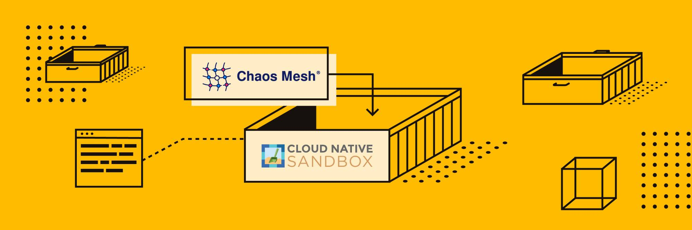
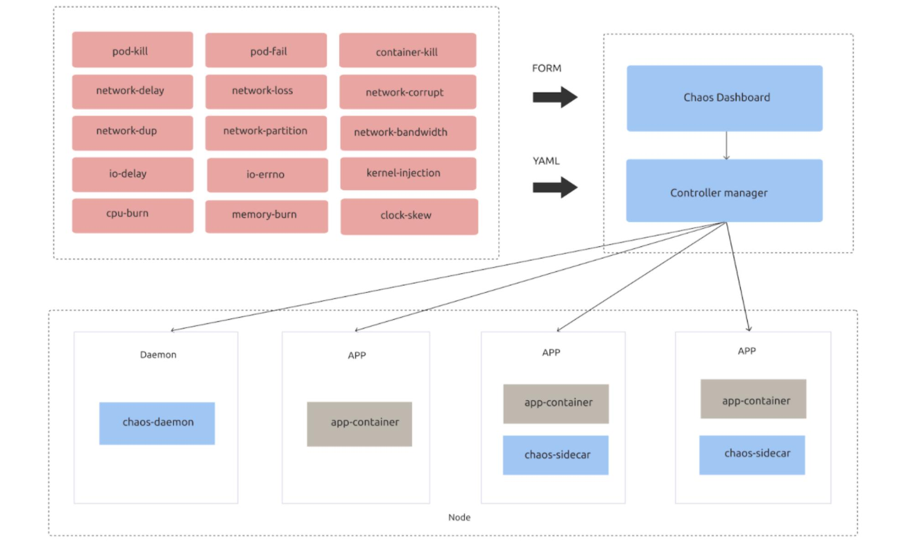

**Author:** [Siddon Tang](https://github.com/siddontang) (Chief Engineer at PingCAP)

**Transcreator:** [Calvin Weng](https://github.com/dcalvin); **Editor:** [Queeny Jin](https://github.com/queenypingcap)

We're thrilled to announce that [Chaos Mesh®](https://chaos-mesh.org/) is now officially accepted as a CNCF Sandbox project. It is also the second CNCF project from [PingCAP](http://www.pingcap.com), following [TiKV](http://tikv.org), the distributed Key-Value storage engine which is currently up for CNCF graduation. We'd like to thank all the contributors and adopters, without whom this could not be possible.

Chaos Mesh originated from our internal chaos engineering platform at PingCAP to ensure the resilience of [TiDB](https://docs.pingcap.com/tidb/stable/overview), the open-source distributed database system. As our CTO, Ed Huang put it, "the traditional deterministic testing has fallen short of our expectations of ensuring system resilience in the era of distributed systems and Kubernetes. As systems evolve and testing requirements multiply, we need an easy to use, scalable, and universal chaos testing platform, not just for TiDB, but also for other distributed systems on Kubernetes."

Chaos Mesh is a versatile Chaos Engineering platform that orchestrates chaos experiments on Kubernetes environments. By covering comprehensive fault injection methods in Pod, network, file system, and even the kernel, Chaos Mesh aims at providing a neutral, universal Chaos Engineering platform that enables cloud-native applications to be as resilient as they should be. Chaos Mesh uses CRD to define chaos objects, making it naturally integrated with the Kubernetes ecosystem. Chaos Mesh also features the Chaos Dashboard - a friendly Web UI for managing, monitoring Chaos Experiments.

 Chaos Dashboard 

Within only 7 months since it was open-sourced on December 31st, 2019, Chaos Mesh has already received almost 2,000 GitHub stars, with 44 contributors from multiple organizations. As a young project, the adoption in production has been the key recognition and motivation that drives us forward constantly. Here is a list of our adopters so far:

* [PingCAP](https://www.pingcap.com)
* [Xpeng Motor](https://en.xiaopeng.com/)
* [NetEase Fuxi Lab](https://www.crunchbase.com/organization/netease-fuxi-lab)
* [JuiceFS](http://juicefs.com/?hl=en)
* [Dailymotion](https://www.dailymotion.com/)
* [Meituan](https://about.meituan.com/en)
* [Celo](https://celo.org/)

As manifested in the CNCF mission:

_"These techniques enable loosely coupled systems that are resilient, manageable, and observable. Combined with robust automation, they allow engineers to make high-impact changes frequently and predictably with minimal toil."_

We firmly believe Chaos Mesh is one of the essential enablements to this mission, and it's also a great addition to the CNCF landscape. Being a CNCF Sandbox project marks a major step forward for the project. It means that Chaos Mesh has become part of the great vendor-neutral cloud-native community. With the guidance and help from CNCF, Chaos Mesh will strive to develop a community with transparent, meritocracy-based governance for open communication and open collaboration, while driving the project forward, towards our ultimate goal of establishing the Chaos Engineering standards on Cloud.

If you are interested in the project, check out our [website](https://chaos-mesh.org/), join our [Slack](https://slack.cncf.io/) discussions, or attend our [monthly meeting](https://docs.google.com/document/d/1H8IfmhIJiJ1ltg-XLjqR_P_RaMHUGrl1CzvHnKM_9Sc/edit) to know more, or better yet, become part of the community.
