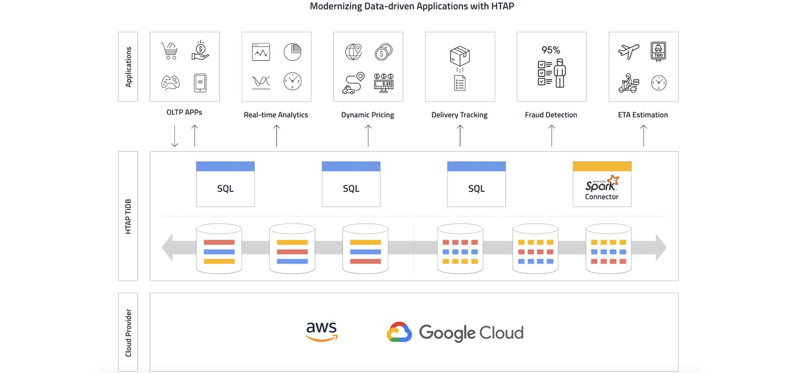

**Author:** PingCAP

**Editors:** [Calvin Weng](https://github.com/dcalvin), Tom Dewan

Today, we're glad to announce that [TiDB Cloud](https://pingcap.com/tidb-cloud/), our fully managed database service powered by [TiDB](https://docs.pingcap.com/tidb/stable/overview), now supports Hybrid Transactional/Analytical Processing (HTAP) workloads. With this support, TiDB Cloud allows you to create an HTAP-enabled TiDB cluster in the cloud of your choice with just a few clicks, and enables your company to modernize your legacy data-driven applications with a scalable, real-time, and simplified infrastructure.

## Why HTAP?

HTAP is an emerging application architecture that combines both Online Transactional Processing (OLTP) and Online Analytical Processing (OLAP) in the same database. HTAP supports the needs of many new application use cases which require both scalability and real-time analytics.

Legacy database infrastructures are designed for either transaction processing with operational DBMSs or analytical processing with data warehouses. To get real-time insights from your transactional data, you have to maintain a complicated and expensive extract, transform, load (ETL) process to load your transaction data into an analytic database. This normally results in hours, or even days of delay, so you're making decisions for the future based on data from the past. This problem creates data silos, holds back your business, and prevents developers from moving faster with new applications and emerging needs.

With a hybrid approach, the HTAP architecture bypasses the ETL process and eliminates the need for a data warehouse. This approach enables your live transactional data to be readily available for analytics. Your modern, adaptive applications can benefit from fresh data and a much simplified information management infrastructure.

 HTAP in TiDB Cloud 

## Enable HTAP with TiDB Cloud

By introducing [TiFlash](https://docs.pingcap.com/tidb/stable/tiflash-overview), the columnar storage engine, TiDB consolidates real-time analytics and transactions in the same database, with unlimited scalability, strong consistency, and high availability. The following use cases have been tested in production:

* **Real-time analytics alongside transactional workloads.** You can rely on TiDB's transactional processing capabilities to serve your mission-critical applications such as billing, CRM, and sales campaigns. At the same time, you can observe your business by running the real-time reports and business intelligence with fresh and strongly-consistent data. And your two workloads won't interfere with each other.
* **Data serving and reporting combined.** TiDB's indexing and columnar format makes it perfectly capable of performing both ad-hoc and small range queries as well as real-time aggregated reporting.
* **Real-time data warehousing.** TiDB collects data from multiple sources and aggregates it in real time. TiDB can use that data to make real-time queries, such as providing reports and real-time charts, empowering a customer support system that integrates different data sources for better and quicker insights.

With HTAP support in TiDB Cloud, the process of legacy modernization could not be simpler.   Just imagine: creating an HTAP-enabled TiDB cluster in the cloud of your choice with just a few clicks and having the best of both the OLTP and OLAP worlds in a one-stop solution.

Want to see for yourself? Apply now for a two-week free trial [here](https://pingcap.com/products/tidbcloud/trial/).
