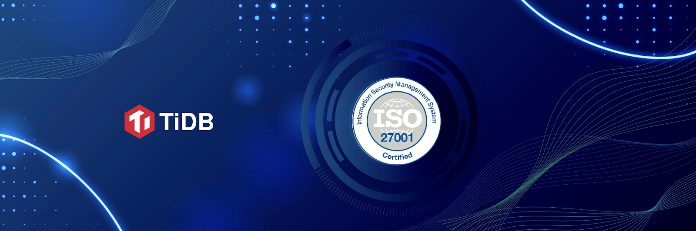

PingCAP is proud to announce today that the company has achieved the International Organization for Standardization (ISO) 27001:2013 certification for TiDB Cloud. Following an extensive audit process, the certification was issued by British Standards Institution (BSI), an ANAB-accredited certification body headquartered in London. 

ISO/IEC 27001:2013 is a globally recognized standard that sets out the policies and requirements for establishing, implementing, maintaining and continually improving an information security management system (ISMS). In order to get certified, a neutral, independent agency conducts the audit and assesses all the operations in the context of the business, including business continuity, marketing process, cybersecurity, privacy protection, HR, IT systems, etc.

[TiDB Cloud](https://pingcap.com/products/tidbcloud/) is the fully-managed service of TiDB, a distributed SQL database. With TiDB Cloud, customers can easily use TiDB on Amazon Web Services and Google Cloud to quickly build modern, mission critical applications. 

"Data security has always been a top priority for us, especially in the context of a cloud database",  Says Li Shen, head of Global Businesses at PingCAP, "Certification to ISO 27001, plus the completion of [SOC 2 Type 2](https://pingcap.com/blog/pingcap-successfully-completes-soc2-type2-examination-for-tidb-cloud) a month earlier, demonstrates our commitment in providing our customers with a comprehensive and mature information security management system that excels in managing and protecting customer data, enabling them to accelerate their digital transformation in confidence."

While PingCAP is extremely proud to have achieved this certification, we understand that the work does not stop here. We are committed to continually improving and maintaining the suitability, adequacy, and effectiveness of our security controls and measures as we develop the TiDB Cloud service. Continuous examinations are a great way to identify room for improvement so that we not only earn our customers' trust but continue to strengthen it over time.