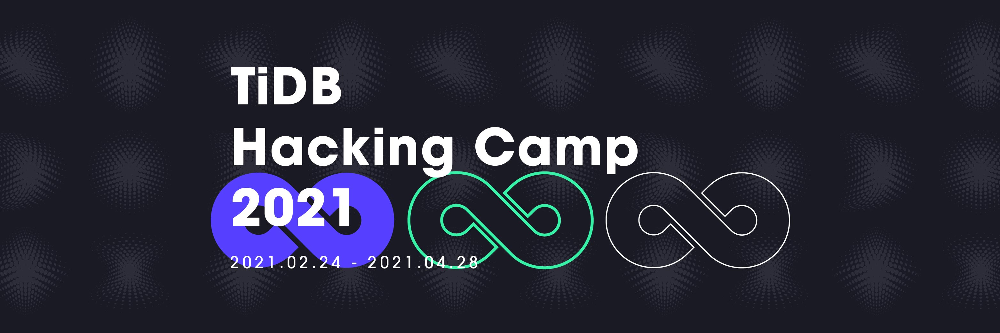

The curtain fell on TiDB Hackathon 2020, but hacking never stops. After two days of  fierce competition, TiDB Hackathon 2020 ended up with many star projects, such as  UDF (a user defined function framework based on WASM),  TiGraph (a graph database on TiDB), and zh.md (an automatic language lint tool for Chinese documents). Developers have built a rich open source ecosystem around TiDB and greatly improved TiDB’s performance.

To **move things forward,** PingCAP is now launching an 8-week **TiDB Hacking Camp**, an incubation program to actually land these projects in the community.

During the camp, each participating project will be paired with a community mentor. Together they will lay out a practical landing plan for the project, which will be followed through during the camp. Each team is required to present their project progress to the community periodically. At the end of the camp, each project will be evaluated by its mentor to determine whether it is ready to graduate. All members of graduated projects will win customized TiDB gifts for their great work.

## Participants and benefits

### Who can participate

* TiDB Hackathon 2020 projects
* TiDB ecosystem partners
* Individual developers who are familiar with Rust, Go and distributed systems

### How to participate

* TiDB Hackathon 2020 projects & TiDB ecosystem partners: Send an email to [zhangyanqing@pingcap.com](mailto:zhangyanqing@pingcap.com) and note “Hacking Camp”.
* Individual developers: Join the corresponding Slack channel or WeChat group of each project.

### What will you get

* Guidance from experienced mentors
* Open-source collaboration experience.
* Marketing campaign and promotion for the project.
* Customized TiDB gifts.
* Honor of becoming an open-source project maintainer.

## Timeline

* February 23, 2021: Open Call & Sign-up
* May 15 - 20, 2021: Project Milestones Presentation I
* April 20 - 25, 2021: Project Milestones Presentation II
* April 28, 2021: Hacking Camp Graduation Ceremony

## Shortlisted projects (first batch)

### UDF

Team Name: ' or 0=0 or '

UDF is a user defined function engine. With UDF, users can write customized functions to realize complex execution logic in TiDB and directly run these functions in the database, which allows them to do more things on the TiDB platform.

[GitHub Repo](https://github.com/tidb-hackathon-2020-wasm-udf) / [WeChat Group](https://img2.pingcap.com/manual/51ed3c9e-7f60-43bc-8a1d-643bba4222d1.png)

### TiDE

Team Name: B.A.D

TiDE is a Visual Studio Code extension for TiDB, which allows developers to develop TiDB clusters and debug locally or remotely without knowing the internal mechanism of TiDB. It greatly improves developers' experience of developing and debugging TiDB projects.

[GitHub Repo](https://github.com/tidb-incubator/tide) / [Slack Channel](https://slack.tidb.io/invite?team=tidb-community&channel=tide&ref=website)

### ching-wei

Team Name: zhangyushao

Ching-wei is a continuous integration (CI) tool which smartly reproduces bug issues in TiDB and proactively tag them before any manual efforts. The tool can also link each issue with an environment to facilitate the later manual recheck by the developer.

[GitHub Repo](https://github.com/ti-community-infra/tichi/tree/issue-helper) / [Slack Channel](https://slack.tidb.io/invite?team=tidb-community&channel=tichi-chingwei&ref=website)

### zh.md

Team Name:  zh.md

zh.md is a lint tool for Chinese documentation. Based on the abstract syntax trees and word segmentation, it automatically scans the documentation to diagnose existing issues and evaluate the quality. It uses statistics and NLP tools to assist writers to write style-compliant documents.

[GitHub Repo](https://github.com/tidb-incubator/zh.md) / [Slack Channel](https://slack.tidb.io/invite?team=tidb-community&channel=zh-md&ref=website)

### Ti-Improve

Team Name: Ti-Improve

Ti-Improve is a test tool for TiDB. Based on AWS infrastructures, it uses S3 to store backup files, Lambda to execute specific tests, CodePipeline to schedule the execution, CloudWatch to observe TiDB's performance, and Chaos Mesh® to inject faults.

[GitHub Repo](https://github.com/titaas) / [Slack Channel](https://slack.tidb.io/invite?team=tidb-community&channel=ti-improve&ref=website)

## Words from Mentors

Shawn Ma | ' or 0=0 or '

_"Wish our community hackers from all over the world a fun journey with these TiDB projects!"_

Bing Duan | zh.md

_"May zh.md help Chinese technical writers work 10 times more efficiently."_

Jinlong Liu | TiDE

_"Nothing's impossible to a willing mind."_

Yulong Zhai | zhangyushao

_"These projects will fully boost the PingCAP community and attract more like-minded partners to hack together!"_

Liyuan Feng  | Ti-Imporve

_"We hope Ti-Improve could be production ready soon because it will greatly improve the QA efficiency for the whole community."_

## Sponsors

* [Zhihu](https://www.zhihu.com/)
* [TiKV](https://tikv.org/)
* [Chaos Mesh®](https://chaos-mesh.org/)
* [Palfish](https://www.ipalfish.com/)

Come and join us in the TiDB Hacking Camp, and have fun hacking!