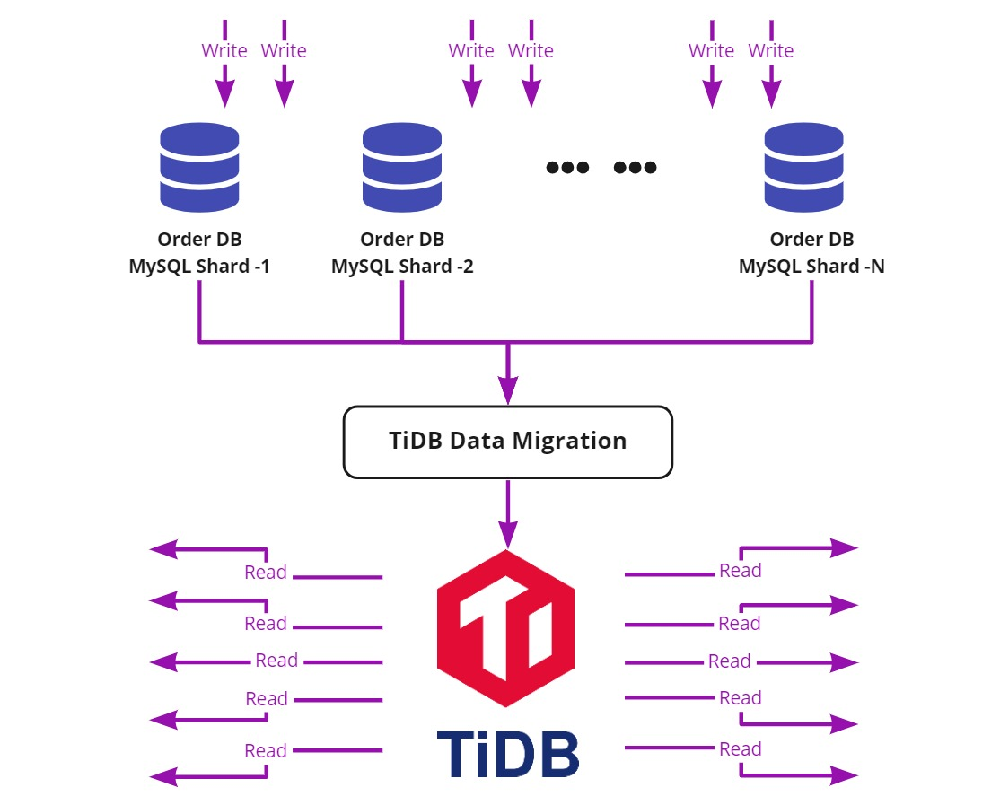

**Author:** PingCAP

**Transcreator:** [Yajing Wang](https://github.com/anotherrachel); **Editors:** Tom Dewan, [Queeny Jin](https://github.com/queenypingcap)

We are proud to announce the release of TiDB 5.2. As an enterprise-grade database, TiDB's Online Transactional Processing (OLTP) and Online Analytical Processing (OLAP) capabilities for massive data have been battle-tested and well-accepted in various global industries such as finance, the Internet, logistics, retailing, and online gaming.

Enterprises across these industries, large or small, are increasingly facing challenges to either adapt to or to take lead in the ever-changing market. To keep their competitive advantages, they need to make informed decisions based on fresh data and get a single and real-time source of truth about their business. However, they are facing enormous challenges:

* The complexity of extracting insights from a disparate sprawl of **data silos**.

* Legacy database infrastructure unable to handle **unpredictable traffic surges**.

* **The complexity** of the technology stack demanding high maintenance.

* **Constantly changing data** to meet the demands of their intelligent, real-time services.

* Achieving faster **insights at scale** to accommodate their business growth.

* Maintaining business continuity with high availability while maintaining security and compliance issues.

Based on their feedback, TiDB 5.2 focuses on real-world scenarios, aiming to push the boundaries of transactional and analytical processing even further to meet the demands of massive, real-time data processing. **The test results showed that TiDB 5.2 outperformed TiDB 5.1 in stability, real-time performance, and usability—whether it was under the heavy workload of a large-scale cluster or highly concurrent writes and reads.** We believe TiDB 5.2 will continue to help companies unlock business potential and expedite digital transformation.

This post shows only a few of the highlights in TiDB 5.2. For a full list of features and improvements, check out the [TiDB 5.2 Release Notes](https://docs.pingcap.com/tidb/stable/release-5.2.0).

    <a href="https://pingcap.com/download" onclick="trackViews('TiDB 5.2 - Translytical Processing Made Easier and Faster', 'download-tidb-btn-middle')"><button>Get TiDB Now</button></a>
     <a href="https://pingcap.com/contact-us" onclick="trackViews('TiDB 5.2 - Translytical Processing Made Easier and Faster', 'contact-us-middle')"><button>Request a Demo</button></a>

    

      

        <a href="https://pingcap.com/download" class="button is-primary is-outlined is-rounded">Get TiDB Now</a>
        <a href="https://pingcap.com/contact-us" class="button is-primary is-outlined is-rounded">Request a Demo</a>
      

    

## TiDB 5.2 highlight

In recent years, more and more companies have struggled with how to query and analyze full data in real time. To meet their business requirements, they resort to different data storage solutions for different scenarios, settling for online and offline data separation; however, this can result in data silos and complex data stacks. It's becoming increasingly challenging to have a single view of the business. TiDB is created to solve this problem by simplifying the data stack and bringing databases the way it's supposed to be. TiDB 5.2 takes one step further by providing the following new and exciting features:

* [Frictionless customer experience under heavy workloads](#frictionless-customer-experience-under-heavy-workloads)

* [More intelligent data retrieval](#more-intelligent-data-retrieval)

* [Real-time insights for faster business decisions](#real-time-insights-for-faster-business-decisions)

* [Lower operational cost under high concurrent workloads](#lower-operational-cost-under-high-concurrent-workloads)

## Frictionless customer experience under heavy workloads

Mission-critical applications require low query latency to maintain a consistent and frictionless customer experience, especially when there are heavy write workloads. They are mostly point queries, along with some short-range, index-based queries. In this case, a primary and secondary architecture can be adopted to address MySQL's scalability limit. The DM data migration tool aggregates upstream data from multiple MySQL shards into a TiDB cluster. **The TiDB server then handles intensive queries from the data transfer process, making sure transactions are successfully processed.**

### Improved stability of large-scale clusters under heavy write workloads

This release balances the range of data regions when executing data definition language (DDL) statements and enables you to index large tables faster.

When a storage node is slow, the Leader is automatically transferred to other normally functional nodes to manage traffic. If a single node jitters, this ensures the entire cluster's overall throughput.

The memory usage of Raft log caches and Raft messages are strictly limited, which prevents OOM issues for TiKV under heavy write workloads.

### Optimized cluster resource usage

TiDB 5.2 allows you to prioritize hotspots and balance cluster resources based on the QPS. You can make cluster CPU distribution more balanced, avoiding the bottlenecks caused by a single node. To verify its performance, we simulated a scenario in which hotspots were observed within a small table. The results showed that the CPU usage was significantly optimized, while the number of QPS nearly doubled. You can also schedule hotspots for TiFlash's analytical processing (AP) engine, which is a huge step farther for load balancing in HTAP scenarios.

### Enhanced data migration efficiency

Earlier versions of DM consume more CPU resources. For example, when a DM node performs binlog replication and then hits 1,000 to 3,000 QPS, it consumes 35% to 50% of its CPU resources. To resolve this problem, DM v2.0.6 made several improvements, including relay log reads and writes, and data transcoding. According to the test results, DM v2.0.6 can lower CPU usage by up to 50%.

This release also optimizes data replication latency. When replicating writes from MySQL shards and aggregating them into TiDB (estimated 200,000 QPS after aggregation), DM can reduce replication latency to less than one second 99% of the time.

## More intelligent data retrieval

For e-commerce platforms, big sales days can mean tens of times more queries than usual, and slow query performance. In this case, queries usually are for short-range, index-based data. Possible factors also include diversified query statements, multi-table join queries, data aggregation, subqueries, the TopN operator, and pagination limit. In addition, businesses have different amounts of data, which also affects data processing.

**To improve query efficiency, we need a more intelligent optimizer, so that the database can select the optimal execution plan with the correct index, and return the results more quickly and stably.**

### Improved indexing selection

TiDB uses statistics to decide which index to choose. In TiDB 5.2, when statistics are outdated or missing, the TiDB optimizer will first enable heuristic rules to reduce the number of possible indexes, which improves the accuracy of index selection.

We also enhanced the cost estimation process to make the optimizer automatically select the correct index instead of manually [creating bindings for SQL statements](https://docs.pingcap.com/tidb/stable/sql-plan-management#create-a-binding).

### Improved usability of SQL Plan Management

SQL Plan Management (SPM) is a set of functions that execute SQL bindings to manually intervene with SQL execution plans. This release improves the usability of SPM by allowing you to:

* Sort SQL statements by the timestamp when the binding is created.

* Confirm whether a SQL statement creates a binding by executing `EXPLAIN`.

* Use a blocklist to shield some automatically captured bindings for statements.

## Real-time insights for faster business decisions

When businesses need to make quick decisions, real-time business intelligence is crucial. But how can we maintain this agility as data size grows?

**TiFlash supports query execution in MPP mode, which maximizes computing resources and achieves query performance in real time.** The more functions or operators TiFlash supports, the more SQL statements TiDB can push down to TiFlash for calculations. In other words, the efficiency of related queries will be considerably improved even if only one more function or operator is supported in each release.

TiDB 5.2 adds dozens of functions and operators that can be pushed down (such as MOD, LENGTH, LOG, ROUND, DATE, and INET_ATON), further improving TiFlash's SQL syntax support. You can see [the full list in the release notes](https://docs.pingcap.com/tidb/stable/release-5.2.0#improvements). The test results showed that:

* In single-threaded processing, the latency for simple queries can be reduced from tens of seconds to less than one second. The latency of complex queries can be reduced from minutes to about one second.

* In multi-threaded processing, the latency for simple queries can be reduced to less than one second. The latency of complex queries can be reduced to about 10 seconds.

**We plan to support the remaining MySQL functions and operators over the next year and continue to optimize query response time.**

## Lower operational cost under high concurrent workloads

For fast-growing businesses and data-driven innovation scenarios, you can trust TiDB to manage high concurrent workloads thanks to its horizontal scalability and real-time HTAP capabilities. This release further improves real-time analysis for big data, which reduces operational costs and enhances stability. TiFlash now offers better write performance, MPP execution, concurrency support, and cluster maintenance.

## TiDB use cases

All these exciting features and improvements makes TiDB applicable for the following use cases:

* Scenario 1: Highly concurrent and intensive queries from customers undermine the stability of mission-critical applications, further impairing the customer experience.

    * Improved stability of a large-scale cluster under a high write rate by accelerating online index creation for large tables, implementing automated Leader transfer, and optimizing TiKV memory usage.

    * Enhanced cluster resource usage by optimizing the hotspot scheduling algorithm and implementing QPS-based statistics. TiFlash, the columnar storage engine, now also supports hotspot scheduling.

    * Increased data migration efficiency by cutting the data replication latency of the TiDB Data Migration tool (DM). Under a load pressure of 200,000 queries per second (QPS), is it under one second 99% of the time.

* Scenario 2: When performing real-time queries, the data retrieval process might become unstable, and the efficiency will differ based on the data size to query.

    * Improved index selection by introducing the heuristic query optimization and improving cost estimation accuracy.

    * Improved the usability of SQL Plan Management when creating bindings.

* Scenario 3: Complex real-time queries hinder timely business decisions.

    * Reduced query response time by implementing more operators for push-down and thus fully utilizing the massive parallel processing (MPP) engine.

* Scenario 4: Real-time analytical capabilities and stability are challenged when there is huge concurrent write pressure, causing extra operation and maintenance costs.

    * Boosted write performance when the traffic during peak hours has doubled or even tripled.

    * Increased MPP robustness by preventing deadlocks.

    * Enhanced capability for high concurrent full-table queries up to 30 or more under heavy write workloads. This can reduce or eliminate out-of-memory (OOM) errors.

    * Reduced the impact on the application side when maintaining TiFlash cluster. The system can recover from an unstable state automatically or with manual intervention. New queries from the front-end will not be interrupted during scaling.

## Try it out!

**If this is the first time you have heard about TiDB**, you can [download TiDB 5.2 and give it a try](https://en.pingcap.com/download). For more information, you can check our [documentation](https://docs.pingcap.com/tidb/stable) and [case studies](https://en.pingcap.com/case-studies).

**If you're running an earlier version of TiDB and want to try 5.2**, read [Upgrade TiDB Using TiUP](https://pingcap.com/docs/stable/upgrade-tidb-using-tiup/). You're also welcome to join our [community on Slack](https://slack.tidb.io/invite?team=tidb-community&channel=everyone&ref=pingcap-blog) and share your thoughts with us.

As Max Liu, one of our founders, puts it: **"Leave the complexity to TiDB and the simplicity to users."** This release is a big step for TiDB in pushing the boundary of OLTP and OLAP user scenarios. We will continue to optimize TiDB according to users' feedback.

We'd like to thank our TiDB community for their committed work and TiDB users who helped us improve. Special thanks go to Li Auto, Tencent Interactive Entertainment Group, Xiaomi, and all the companies that tested TiDB 5.2.0 and gave us feedback. Our joint efforts and open collaboration will further drive TiDB to become a leading world-class database.
