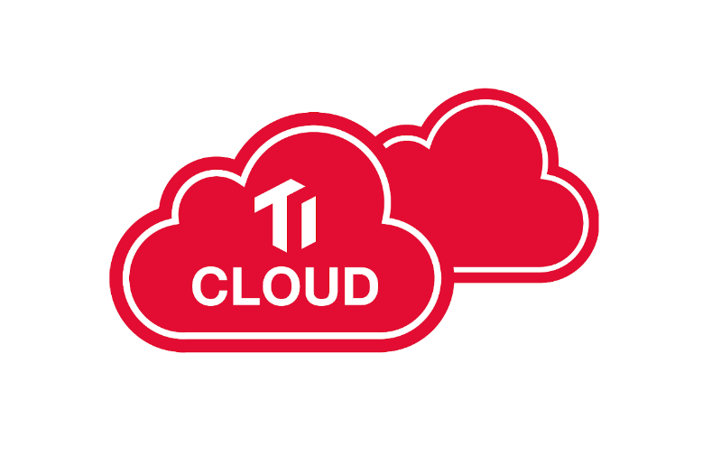

Today, we are excited to announce that [TiDB Cloud](https://pingcap.com/products/tidbcloud/) is now available for public preview. It is a suite of product offerings that enables customers to easily use TiDB in any cloud environment, either as a fully-managed service delivered by PingCAP or on a self-served marketplace. TiDB is the first open source, NewSQL, hybrid transactional and analytical processing ([HTAP](https://en.wikipedia.org/wiki/Hybrid_transactional/analytical_processing_(HTAP))) database in the market that’s available in either public, private, or hybrid cloud setting.

 TiDB Platform Architecture 

## Product Offerings

The TiDB Cloud offerings we are launching today have two options:

- **[PingCAP Managed TiDB Cloud](https://pingcap.com/tidb-cloud/) (public preview):** available on any public or private cloud. This is a comprehensive, fully-managed solution, where the PingCAP cloud team will deliver a full suite of services and enterprise-grade tools to deploy, manage, maintain, backup, and upgrade a TiDB deployment for you. This option is for companies who want to get the most value out of TiDB for their specific use cases, with the least amount of operational overhead and cost.

- **[TiDB on GCP Marketplace](https://console.cloud.google.com/marketplace/details/pingcap-public/pingcap-tidb-operator):** available on Google Cloud Platform (GCP) Marketplace using Google Kubernetes Engine (GKE). This is a production-ready standard TiDB deployment that can be launched with just a few clicks on the GCP Marketplace. (We will bring this option to more public cloud marketplaces in the near future.) This option is simple, low-cost, and uses GCP’s persistent disks.

## Key Features

- **Always Online:** With TiDB Cloud, your database is always online, 24 / 7, with no need to schedule downtime for maintenance. While online, it supports rolling upgrades, online DDL, cluster resizing, and automatic data rebalancing with hotspots removal.

- **Flexible Scaling:** TiDB has a cloud-native architectural design, where the stateless computing resources (TiDB, TiSpark) and the stateful storage layer (TiKV) are loosely coupled and can be scaled out (or in) depending on your use case and workloads. Thus, in TiDB Cloud, you have the ultimate pay-per-usage control over your database resources.

- **Cross-Cloud Experience:** By leveraging Kubernetes and the [TiDB Operator](https://github.com/pingcap/tidb-operator), TiDB Cloud delivers a consistent user experience and simple portability between different cloud platforms. There’s no cloud vendor lock-in; total independence.

## Cloud Native, Customer First

As a NewSQL database with a cloud-native architecture, the cloud is TiDB’s natural habitat. In the future, more and more of our services, tools, and core technology innovation will be focused on making TiDB a joy to use in the cloud. As the core team building TiDB from day 1, PingCAP has accumulated a wealth of expertise in architecting, tuning, and operating a distributed database in the cloud. We are ready to deliver that expertise and value to all our customers, from e-commerce platforms to SaaS solutions to social networks. We will work hard to provide a world-class infrastructure solution that will set our customers up to become the next big thing. You can sign up for [TiDB Cloud now](https://pingcap.com/tidb-cloud/), and we look forward to delivering TiDB in your favorite cloud environment.
