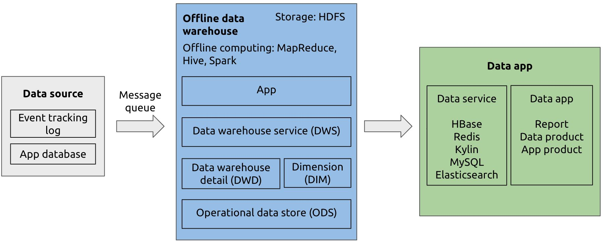
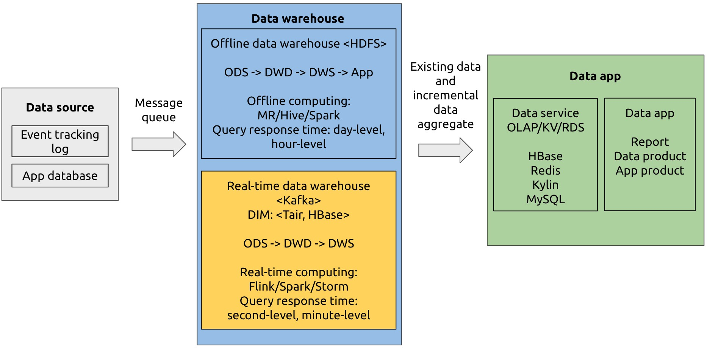
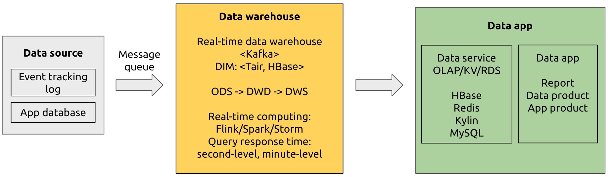
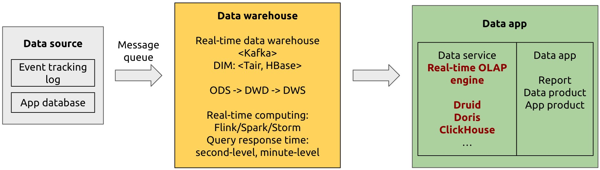
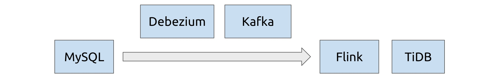
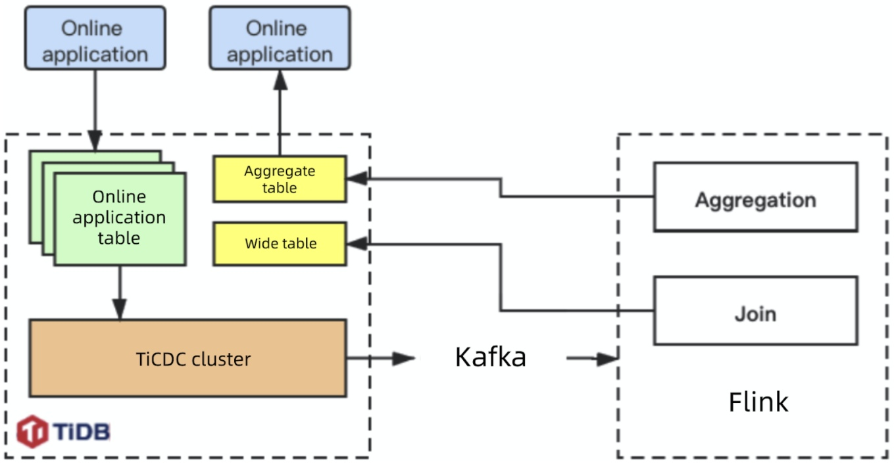
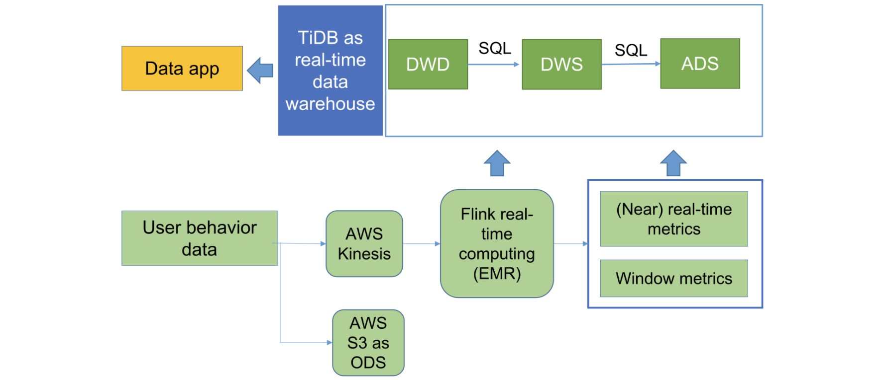
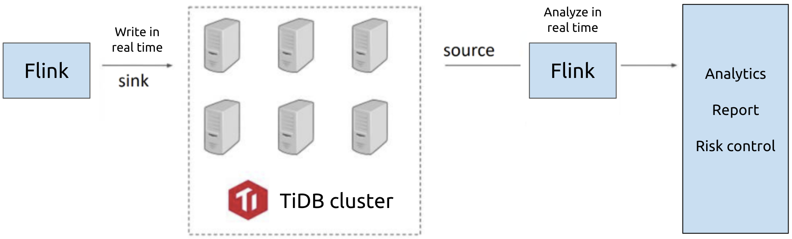

**Author:** [Zhi Qi](https://github.com/LittleFall) (Real-time Analytics R&D engineer at PingCAP)

**Transcreator:** [Caitin Chen](https://github.com/CaitinChen); **Editor:** Tom Dewan

When a data-driven company grows to a certain size, traditional data storage can no longer meet its needs. For real-time business intelligence, you need a real-time data warehouse. Companies can use real-time data warehouses to implement real-time Online Analytical Processing (OLAP) analytics, real-time data panels, real-time application monitoring, and real-time data interface services.

**Some people think that a real-time data warehouse architecture is complex and difficult to operate and maintain.** Today, I will explain why that isn't true. [Apache Flink](https://flink.apache.org/flink-architecture.html) is a framework and distributed processing engine for stateful computations over unbounded and bounded data streams. [TiDB](https://docs.pingcap.com/tidb/stable/overview) is an open-source, distributed, Hybrid Transactional/Analytical Processing (HTAP) database. **Thanks to Flink 1.11's enhanced support for the SQL language and TiDB's HTAP capabilities, we've combined Flink and TiDB to build an efficient, easy-to-use, real-time data warehouse that features horizontal scalability and high availability.**

In this article, I'll describe what a real-time data warehouse is, the Flink + TiDB real-time data warehouse's architecture and advantages, this solution's real-world case studies, and a testing environment with Docker Compose.

## What is a real-time data warehouse?

### Offline data warehouse

In the 1990s, [Bill Inmon](https://en.wikipedia.org/wiki/Bill_Inmon) defined a data warehouse as a subject-oriented, integrated, time-variant, and non-volatile collection of data that supports management decision making. A data warehouse collected data through a message queue and calculated it once a day or once a week to create a report. It was also known as an offline data warehouse.

 An offline data warehouse architecture 

### Real-time data warehouse

As technology improved, people had new requirements such as real-time recommendations and real-time monitoring analysis. The corresponding decision-making period gradually changed from days to seconds. To meet these needs, the real-time data warehouse came into being.

A real-time data warehouse has three main data processing architectures: the Lambda architecture, the Kappa architecture, and the real-time OLAP variant architecture.

The Lambda architecture maintains batch and stream layers, so it costs more to develop than the other two. Compared with the Kappa architecture, the real-time OLAP variant architecture can perform more flexible calculations, but it needs more real-time OLAP computing resources.

#### The Lambda architecture

The Lambda architecture has a real-time data warehouse and an offline data warehouse, while a stream processing engine directly computes data with high real-time requirements. The Lambda architecture aggregates offline and online results for applications.

 Lambda architecture for real-time data warehousing 

#### The Kappa architecture

The Kappa architecture eliminates the offline data warehouse layer and only uses the real-time data warehouse. It unifies computing engines and reduces development costs.

 Kappa architecture for real-time data warehousing 

#### The real-time OLAP variant architecture

The real-time OLAP variant architecture transfers part of the computing pressure from the streaming processing engine to the real-time OLAP analytical engine. The result is more flexible, real-time data warehouse computing.

 Real-time OLAP variant architecture 

Next, we'll introduce an example of the real-time OLAP variant architecture, the Flink + TiDB solution for real-time data warehousing.

## Flink + TiDB as a real-time data warehouse

Flink is a big data computing engine with low latency, high throughput, and unified stream- and batch-processing. It is widely used in scenarios with **high real-time computing requirements** and provides exactly-once semantics.

TiDB 4.0 is a true HTAP database. In the real-time data warehouse architecture, you can use TiDB as application data source to perform transactional queries; you can also use it as a real-time OLAP engine for computing in analytical scenarios.

Combining Flink and TiDB into a real-time data warehouse has these advantages:

* **Fast speed.** You can process streaming data in seconds and perform real-time data analytics.
* **Horizontal scalability.** You can increase computing power by adding nodes to both Flink and TiDB.
* **High availability.** With TiDB, if an instance fails, the cluster service is unaffected, and the data remains complete and available. Flink supports multiple backup and restore measures for jobs or instances.
* **Low learning and configuration costs.** TiDB is compatible with the MySQL 5.7 protocol. In Flink 1.11, you can use the Flink SQL syntax and powerful connectors to write and submit tasks.

Let's look at several commonly-used Flink + TiDB prototypes.

### MySQL as data source

By using [Ververica](https://www.ververica.com/)'s [flink-connector-mysql-cdc](https://github.com/ververica/flink-cdc-connectors), you can use Flink not only as a collection layer to collect MySQL binlog to generate dynamic tables, but also as a stream computing layer to implement stream computing, such as stream join and pre-aggregation. Finally, through the JDBC connector, Flink writes the calculated data into TiDB.

 An architecture with MySQL as data source 

This architecture is simple and convenient. When you've prepared corresponding databases and tables for both MySQL and TiDB, you can write Flink SQL statements to register and submit tasks. You can try this architecture in the section [Try Flink + TiDB with Docker Compose](#try-flink--tidb-with-docker-compose).

### Connecting Kafka to Flink

If data has been stored in Kafka through other channels, Flink can obtain the data through the [Flink Kafka Connector](https://ci.apache.org/projects/flink/flink-docs-release-1.11/zh/dev/table/connectors/kafka.html).

If you want to store MySQL change logs or other data sources in Kafka for Flink processing, it's recommended that you use Canal or Debezium to collect data source change logs. Flink 1.11 can parse these tools' change logs. You don't need to implement an additional parser.

 An architecture incorporating Kafka, with MySQL as data source 

### TiDB as data source

[TiCDC](https://pingcap.com/docs/dev/ticdc/ticdc-overview/) is TiDB's change data capture framework. It's an open-source feature that replicates TiDB's incremental changes to downstream platforms. You can use it to output TiDB change data to the message queue, and then Flink can extract it.

 TiCDC outputs TiDB's incremental changes to Flink 

In [TiDB 4.0.8](https://docs.pingcap.com/tidb/stable/release-4.0.7), you can connect TiDB to Flink through the [TiCDC Open Protocol](https://docs.pingcap.com/zh/tidb/stable/ticdc-open-protocol). In later versions, TiCDC will support the canal-json output format for Flink's use.

  <a href="/download" onclick="trackViews('Apache Flink + TiDB: A Scale-Out Real-Time Data Warehouse for Analytics Within Seconds', 'download-tidb-btn-middle')"><button>Download TiDB</button></a>
  <a href="/contact-us" onclick="trackViews('Apache Flink + TiDB: A Scale-Out Real-Time Data Warehouse for Analytics Within Seconds', 'contact-us-middle')"><button>Request a Demo</button></a>

## Case studies

Now that we've got a basic understanding of the Flink + TiDB architecture, let's look at some real-world case studies. You might find them inspiring for your own work.

### Xiaohongshu

[Xiaohongshu](https://en.wikipedia.org/wiki/Xiaohongshu) is a popular social media and e-commerce platform in China. The Xiaohongshu app allows users to post and share product reviews, travel blogs, and lifestyle stories via short videos and photos. By July 2019, it had over 300 million registered users. In a previous [post](https://pingcap.com/case-studies/how-we-use-a-scale-out-htap-database-for-real-time-analytics-and-complex-queries), a Xiaohongshu engineer discussed why the company chose TiDB and how TiDB's real-time HTAP capabilities helped manage their data.

In Xiaohongshu's application architecture, Flink obtains data from TiDB and aggregates data in TiDB. As the following diagram shows:

* In the upper left corner, the online application tables perform OLTP tasks.
* The TiCDC cluster extracts TiDB's real-time change data and sends change logs to Kafka.
* Flink reads change logs from Kafka and performs calculations, such as joining wide tables or aggregation tables.
* Flink writes the results to TiDB's wide table for analytics.

 Xiaohongshu's Flink + TiDB architecture 

This process is a closed loop based on TiDB. TiDB transfers subsequent analytic tasks' `JOIN` operations to Flink and uses stream computing to relieve pressure.

Currently, this solution supports Xiaohongshu's content review, note label recommendations, and growth audit applications. It meets the challenge of high-throughput online applications and is running stably.

### Beike Finance

[Beike Finance](https://www.crunchbase.com/organization/beike-finance) is the leading consumer real estate financial service provider in China. It uses AI algorithms to efficiently apply multi-dimensional, massive data to enhance users' product experience and provide them with rich and customized financial services.

Beike's data services use Flink for real-time calculation of typical dimension table `JOIN` operations:

1. Syncer (a tool that replicates data from MySQL to TiDB) collects the dimension table data from the application data source and replicates it to TiDB.
2. Canal collects the binlog of the application data source's flow table data and stores it in Kafka's message queues.
3. Flink reads change logs of the flow table in Kafka and performs a stream `JOIN`. When the dimension table data is needed, Flink searches TiDB.
4. Flink writes the joined wide table into TiDB for data analytical services.

In this process, the primary tables in the data service can be joined in real time. Then, the service team only needs to query a single table. The Beike data team uses this architecture to develop a system that each core application uses. The data service obtains cross-system data. Beike Finance doesn't need to develop application system APIs or memory aggregation data code.

### PatSnap

[PatSnap](https://www.crunchbase.com/organization/patsnap) is a global patent search database that integrates 130 million patent data records and 170 million chemical structure data records from 116 countries. Its users can search, browse, translate patents, and generate patent analysis reports.

When PatSnap replaced their original Segment + Redshift architecture with Kinesis + Flink + TiDB, they found that they didn't need to build an operational data store (ODS) layer.

As a precomputing unit, Flink builds a Flink extract-transform-load (ETL) job for the application. This fully controls data saving rules and customizes the schema; that is, it only cleans the metrics that the application focuses on and writes them into TiDB for analytics and queries.

PatSnap builds three layers on top of TiDB: data warehouse detail (DWD), data warehouse service (DWS), and analytical data store (ADS). These layers serve application statistics and list requirements. They are based on user, tenant, region and application metrics, as well as time windows of minutes or days. The upper application can directly use the constructed data and perform real-time analytics within seconds.

 PatSnap data analytics platform architecture 

After PatSnap adopted the new architecture, they found that:

* Inbound data, inbound rules, and computational complexity were greatly reduced.
* Queries, updates, and writes were much faster.
* Reasonable data layering greatly simplified the TiDB-based real-time data warehouse, and made development, scaling, and maintenance easier.
* This solution met requirements for different ad hoc queries, and they didn't need to wait for Redshift precompilation.

Currently, PatSnap is deploying this architecture to production. They use it for user behavior analysis and tracking and summarizing the overall data on company operations and tenant behavior analysis.

### NetEase Games

NetEase Games, affiliated with [NetEase, Inc.](https://en.wikipedia.org/wiki/NetEase), is a leading provider of self-developed PC-client and mobile games. As one of the seven largest game companies in the world, it has over 250 games in operation, some of which maintain millions of daily active users. In a [post](https://pingcap.com/case-studies/why-we-chose-tidb-over-other-mysql-based-and-newsql-storage-solutions) last year, they discussed why they chose TiDB over other MySQL-based and NewSQL storage solutions.

In NetEase Games' billing application architecture:

* Flink writes data from the data source to TiDB in real time.
* TiDB serves as the analytics data source and the Flink cluster performs real-time stream calculations on the data to generate analytical reports.

NetEase Games has also developed the Flink job management platform to manage the job life cycle.

 NetEase Games' billing architecture 

### Zhihu

[Zhihu](https://en.wikipedia.org/wiki/Zhihu), which means "Do you know?" in classical Chinese, is the Quora of China: a question-and-answer website where all kinds of questions are created, answered, edited, and organized by its user community. As [China's biggest knowledge sharing platform](https://walkthechat.com/zhihu-chinas-largest-qa-platform-content-marketers-dream/), it has over 220 million registered users and 30 million questions with more than 130 million answers on the site.

In a 2019 [post](https://pingcap.com/case-studies/lesson-learned-from-queries-over-1.3-trillion-rows-of-data-within-milliseconds-of-response-time-at-zhihu), they showed how they kept their query response times at milliseconds levels despite having over 1.3 trillion rows of data. Their 2020 [post](https://pingcap.com/case-studies/horizontally-scaling-hive-metastore-database-by-migrating-from-mysql-to-tidb) described how they used TiDB to horizontally scale Hive Metastore to meet their growing business needs.

As a [PingCAP](https://pingcap.com/) partner and an in-depth Flink user, Zhihu developed a TiDB + Flink interactive tool, [TiBigData](https://github.com/pingcap-incubator/TiBigData), and contributed it to the open-source community. In this tool:

* TiDB is the Flink source for batch replicating data.
* TiDB is the Flink sink, implemented based on JDBC.
* Flink TiDB Catalog can directly use TiDB tables in Flink SQL. You don't need to recreate them.

## Try Flink + TiDB with Docker Compose

To better understand our solution, and to test it for yourself, we provide a MySQL-Flink-TiDB test environment with Docker Compose in [flink-tidb-rdw](https://github.com/LittleFall/flink-tidb-rdw) on GitHub.

After you start Docker Compose, you can write and submit Flink tasks through the Flink SQL client and observe task execution via localhost:8081.

If you are interested in the Flink + TiDB real-time data warehouse or have any questions, you're welcome to join our [community on Slack](https://slack.tidb.io/invite?team=tidb-community&channel=everyone&ref=pingcap-blog) and send us your feedback. You can also contact me at [qizhi@pingcap.com](mailto:qizhi@pingcap.com) to discuss questions with me.

## More articles for your reference

* [How We Use a Scale-Out HTAP Database for Real-Time Analytics and Complex Queries](https://pingcap.com/case-studies/how-we-use-a-scale-out-htap-database-for-real-time-analytics-and-complex-queries)

    In this post, [Xiaohongshu](https://en.wikipedia.org/wiki/Xiaohongshu) shares why they chose TiDB and how TiDB's real-time HTAP capabilities help them manage their data.

* [How We Build an HTAP Database That Simplifies Your Data Platform](https://pingcap.com/blog/how-we-build-an-htap-database-that-simplifies-your-data-platform)

    This post describes HTAP and how TiDB makes the most of the HTAP architecture.

* [TiDB: A Raft-based HTAP Database](http://www.vldb.org/pvldb/vol13/p3072-huang.pdf)

    This is the first paper in the industry on the implementation of a distributed real-time HTAP database.
