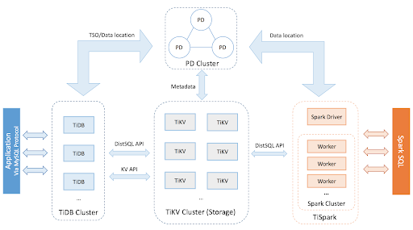
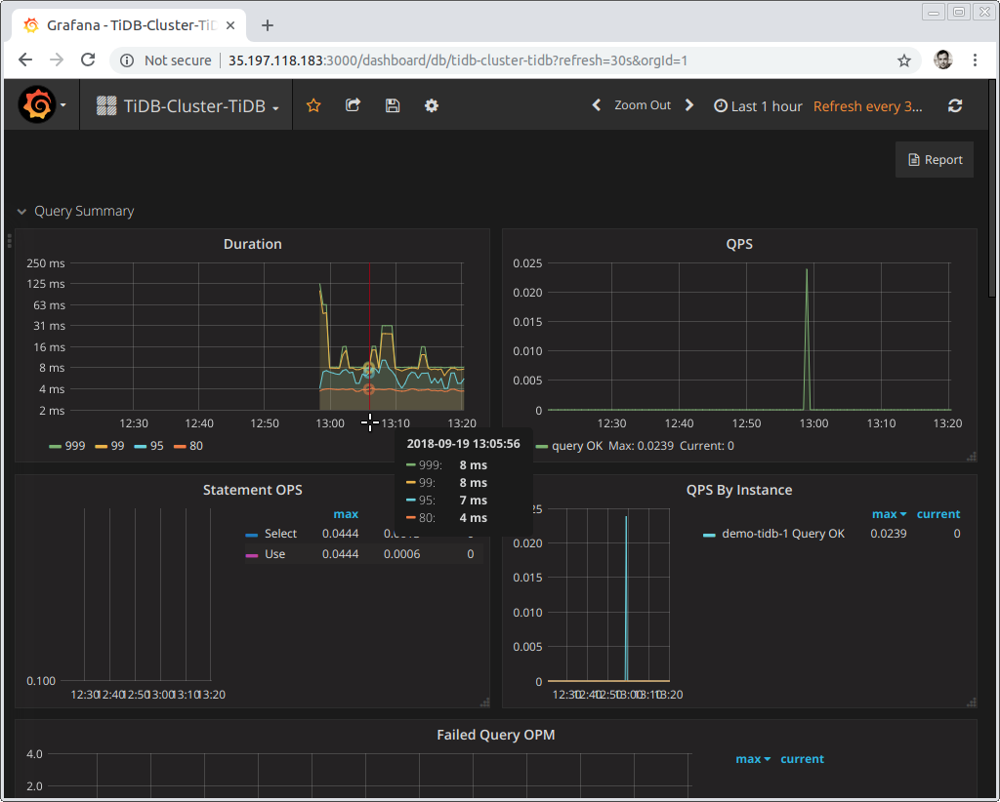

TiDB is an open source cloud-native distributed database that handles hybrid transactional and analytical processing ([HTAP](https://en.wikipedia.org/wiki/Hybrid_transactional/analytical_processing_(HTAP))) workloads--a member of the NewSQL class of databases that's reinventing how a relational database can be designed, built, and deployed at massive scale. ("Ti" for those of you wondering stands for "Titanium".) Since PingCAP started building TiDB just three and a half years ago, it has become one of the fastest-growing databases in the world, supported by a strong, vibrant community (at time of writing: 15,000+ GitHub stars, 200+ contributors, 7200+ commits, 2000+ forks). TiDB was recently recognized by InfoWorld's Bossie Awards 2018, as one of the [best open source software projects](https://www.infoworld.com/article/3306454/big-data/the-best-open-source-software-for-data-storage-and-analytics.html?nsdr=true#slide10) in the data storage and analytics space.

In this article, I'll walk through the core features and architectural design of TiDB, the three main use cases that TiDB is fulfilling for its 300+ production users, and a preview of its cloud-based product offering.

## Core Features

TiDB's core features include elastic horizontal scalability, distributed transactions with ACID guarantee, high availability, and real-time analysis on live transaction data. While these terms are commonly thrown out as marketing speaks in the database industry, they are actually difficult technical challenges that our team and community have been working hard on since day 1. Here's how TiDB's unique architecture and implementation deliver on these features.

The entire TiDB platform has the following components:

- TiDB: stateless SQL layer that is MySQL compatible, built in Go
- TiKV: distributed transactional key-value store (now a [Cloud Native Computing Foundation (CNCF) project](https://www.cncf.io/blog/2018/08/28/cncf-to-host-tikv-in-the-sandbox/)), built in Rust
- TiSpark: an Apache Spark plugin that works within the TiDB platform and can connect to TiKV or another specialized, columnar storage engine (something we are working on...stay tuned.)
- Placement Driver (PD): a metadata cluster powered by etcd that manages and schedules TiKV

 TiDB Platform Architecture 

### How they work together

TiKV is the foundational layer, where all the data is persistent, broken up into smaller chunks (we call them "Region"), and automatically replicated and made strongly consistent by executing the Raft consensus protocol. Working with PD, it can replicate data across nodes, datacenters, and geographical locations. It can also dynamically remove hotspots as them form, and split or merge Regions to improve performance and storage usage. We implement range-based sharding inside TiKV instead of hash-based, because our goal from the beginning is to support a full-featured relational database, thus must support various types of Scan operations, like Table Scan, Index Scan, etc.

TiDB's stateless SQL layer handles 100% of your Online Transaction Processing (OLTP) workloads and 80% of the common ad-hoc Online Analytical Processing (OLAP) workloads, with constant performance improvements (see our latest [TPC-H benchmarks](https://pingcap.com/docs/v2.1/benchmark/tpch-v2/)). This stateless SQL layer leverages the distributed nature of TiKV to execute parallel processing via a Coprocessor layer, by pushing down partial queries to different TiKV nodes simultaneously to retrieve results; that's why our performance is so good!

For more complex OLAP workloads, say constantly iterative analysis for training machine learning models or real-time business intelligence gathering throughout the day, TiSpark fills the void by drawing data directly from TiKV.

The interface is good ol' SQL that many people know, love, and miss. (TiDB speaks MySQL, TiSpark exposes SparkSQL).

## Modular, Cloud-Native Architecture

As you might have noticed, the entire TiDB platform's design is modularized--all components are in separate code bases and are loosely coupled.  A user can deploy the entire TiDB platform as a complete package (most of our users do!), or just parts of it depending on their needs. This modular architecture is intentional: it empowers users to have maximum flexibility and fits perfectly with the standard of a cloud-native architecture (per the [CNCF's official definition of "cloud-native"](https://github.com/cncf/toc/blob/master/DEFINITION.md), cloud-native techniques are ones that "enable loosely coupled systems that are resilient, manageable, and observable").

As a TiDB user, you can scale your stateless SQL server or TiSpark (i.e. your compute resources) out or in *independent of* scaling TiKV (i.e. your storage capacity), so you can make the most out of the resources you are consuming to fit your workloads. You can almost analogize TiDB stateless SQL servers as a microservice that sits on top of TiKV, which is a stateful application where your data is persisted. This design also makes isolating bugs easier, and rolling upgrades and maintenance quicker and less disruptive.

One initial trade-off is some added complexity to deployment and monitoring--there are just more pieces to keep track of. However, with the rise of Kubernetes and the Operator pattern (pioneered by CoreOS), deploying and managing TiDB is simple, straightforward, and increasingly automated.

That's why we built TiDB Operator, and recently open-sourced it, so you can deploy, scale, upgrade, and maintain TiDB in any cloud environment--public, private or hybrid. TiDB installs Prometheus and Grafana by default, so monitoring comes "out of the box". ([Here's a tutorial on TiDB Operator.](https://www.infoworld.com/article/3297700/kubernetes/introducing-the-kubernetes-operator-for-tidb.html))

 Sample Grafana Dashboard Monitoring a TiDB Deployment 

Ultimately, flexible scalability for your technical needs is crucial for business success. It's the difference between becoming the next Facebook versus Friendster. That's the value that TiDB brings to our users, so they can focus on delivering the best product for *their* users.

And the three main use cases where TiDB shines are: MySQL Scalability, HTAP real-time analytics, and unifying data storage.

    <a href="/download" onclick="trackViews('TiDB: Architecture and Use Cases of A Cloud-Native NewSQL Database', 'download-tidb-btn-middle')"><button>Download TiDB</button></a>
    <a href="https://share.hsforms.com/1e2W03wLJQQKPd1d9rCbj_Q2npzm" onclick="trackViews('TiDB: Architecture and Use Cases of A Cloud-Native NewSQL Database', 'subscribe-blog-btn-middle')"><button>Subscribe to Blog</button></a>

## Use Case 1: MySQL Scalability for explosive business growth

Because TiDB speaks MySQL--compatible with both its wire protocol and ecosystem tools like Mydumper and MyLoader--it's a natural fit for MySQL users who have trouble scaling. To be clear, TiDB is *not* a replacement of MySQL; it *complements* MySQL. MySQL is still a great option as a single instance database, so if your data size or workload is small, stick with MySQL. But, as our co-founder and CTO Ed Huang talked about [in another post](https://pingcap.com/blog/9-why's-to-ask-when-evaluating-a-distributed-database), if you are scratching your heads thinking about the following:

- Considering how to replicate, migrate, or scale your database for extra capacity;
- Looking for ways to optimize your existing storage capacity;
- Getting concerned about slow query performance;
- Researching middleware scaling solutions or implementing manual sharding policy;

That's the right time to think about using TiDB, which takes care of all these concerns out of the box for you. That's why Mobike, one of the world's largest dockless bikesharing platforms, uses TiDB ([read case study here](https://pingcap.com/case-studies/tidb-in-mobike/)). Operating 9 million smart bikes in 200+ cities serving 200 million users, it's not hard to imagine the scaling bottlenecks their team was experiencing when their business took off like wildfire. Luckily, TiDB came to the rescue and by deploying TiDB along with PingCAP's suite of enterprise tools like [Syncer](https://pingcap.com/docs/tools/syncer/#syncer-user-guide), which automatically syncs MySQL primaries with a TiDB cluster (almost acting like MySQL secondaries), the architects and infrastructure engineers at Mobike can now rest easy, knowing that their data management capacity will just grow as the business grows.

Another key differentiator between TiDB and other MySQL compatible databases is that we built TiDB's MySQL layer from scratch, instead of just using a MySQL fork which is what databases like AWS's Aurora have done. We chose the hard way, because MySQL is a 20-year-plus technology that was never meant for and thus cannot take advantage of the power of a distributed system. For example, MySQL *cannot* generate query plans that push down partial queries into multiple machines simultaneously to do parallel processing, but TiDB can! TiDB's SQL parser, cost-based optimizer, and Coprocessor layer are all entirely built from the ground up to leverage the computing resources and parallelism of a distributed database, so MySQL users can have more power at their disposal.

## Use Case 2: HTAP Real-Time Analytics

[HTAP](https://en.wikipedia.org/wiki/Hybrid_transactional/analytical_processing_(HTAP)) (hybrid transaction and analytical processing) was a term first coined by Gartner back in 2014 that describes an emerging architecture that breaks down the wall between transactional and analytical data workloads to enable businesses with real-time analytics, and thus real-time decision-making capabilities. Since then, other industry analyst firms have come up with their own respective term for this architecture with subtle differences--451 Research's "[HOAP](https://www.memsql.com/static/451_Reprint_HOAP_DataMkt_04DEC2017.pdf)" (hybrid operational-analytic processing), Forrester's "[Translytical](https://www.forrester.com/report/The+Forrester+Wave+Translytical+Data+Platforms+Q4+2017/-/E-RES134282)", IDC's "ATP" (analytical transaction processing). Regardless of which one of these terms you prefer, it's clear that the future of data platform architecture must break down this wall, so companies can derive value from their data with both accuracy and real-time-like speed.

With TiDB's architecture, that future is here and that wall has been broken. As one of the few open source HTAP (or HOAP, Translytical, ATP) databases on the market, the way TiDB decouples its compute layer and storage layer, allowing different stateless SQL engines that are good at different things (TiDB and TiSpark) connect to the same persistent data store (TiKV), makes real-time analytics and decision-making natural. Cumbersome ETL processes are removed, T+1 delays are no longer just part of life, and the data that lives inside TiDB can now be used more creatively than ever before.

That's why Yiguo.com, a large fresh-produce delivery platform that serves 5 million users, is using TiDB ([read case study here](https://www.datanami.com/2018/02/22/hybrid-database-capturing-perishable-insights-yiguo/)). By upgrading its infrastructure from SQL Server and strengthening its existing MySQL deployment with TiDB, it can run complex joins with great performance throughout the day on [Singles' Day](https://en.wikipedia.org/wiki/Singles%27_Day), China's (and perhaps the world's) largest online shopping day, to garner insights and make decisions in real-time.

Now every company, whether you are an e-commerce platform or a fast-growing SaaS startup, can tap into TiDB to make quicker and better data-driven decisions, either for itself or its customers. What was a futuristic proclamation just a few years ago is now a no-brainer reality.

## Use Case 3: Unifying Data Storage

As previously noted, TiDB's core design advantages as a distributed database are its limitless ability to scale compute and storage capacity horizontally and flexibly in adapting to different workloads while being your "single source of truth." Effectively, TiDB can unify all your data management needs into one system, dramatically reducing the human and technology cost associated with maintaining this layer in your infrastructure stack.

One of the largest food delivery platforms in the world, Ele.me, is using TiDB and TiKV in exactly this way. To satisfy the load of serving more than 260 million users' cravings and appetite, Ele.me's infrastructure used to have a hodgepodge of databases--Mongo, MySQL, Cassandra, Redis. Over time, this makeshift stack became untenable, because of its mounting maintenance cost to its team. Thus, Ele.me turned to the TiDB platform, and now 80 percent of its live traffic is served by a single TiKV deployment, spanning four datacenters with 100+ nodes holding dozens of TBs of data, always on, always available.

Simplifying your infrastructure stack presents a huge value-add to any company's IT operations, and TiDB's offerings are a natural fit to help drive down cost. As TiDB's integration matures with Kubernetes via the [TiDB Operator](https://www.infoworld.com/article/3297700/kubernetes/introducing-the-kubernetes-operator-for-tidb.html), the value of this use case will continue to grow, especially for large or growing enterprises that must think about how to architect its infrastructure for the future.

## Multi-Cloud TiDB-as-a-service and TiDB Academy

Since PingCAP began building TiDB more than three years ago, the database has been battle-tested in many scenarios. Today, more than 300 companies are relying on TiDB in production to meet their OLTP/OLAP, database scalability, real-time analytics, and unified storage needs. However, there are still many to-do's on the [TiDB roadmap](https://github.com/pingcap/tidb/projects/63).

One of those items is a fully-managed TiDB-as-a-service offering that can be used in any cloud setting—public, private, or hybrid. PingCAP has been working on an enterprise-grade, fully-managed TiDB offering based on Kubernetes, and the first version was recently released. You can sign up for it [HERE](https://pingcap.com/products/tidbcloud).

Another project PingCAP just launched is TiDB Academy--a set of self-paced, hands-on courses designed to help database administrators, devops pros, and system architects understand the architecture, design choices, strengths, and trade-offs of TiDB. The first course, "Distributed Database with TiDB for MySQL DBAs," is ready for enrollment.

And if you just want to give TiDB a spin, check out our [TiDB Quick Start Guide](https://pingcap.com/docs/QUICKSTART/).

*A version of this article was published on InfoWorld. Reprinted with permission. © IDG Communications, Inc., 2018. All rights reserved. <https://www.infoworld.com/article/3313327/database/how-tidb-combines-oltp-and-olap-in-a-distributed-database.html>*
