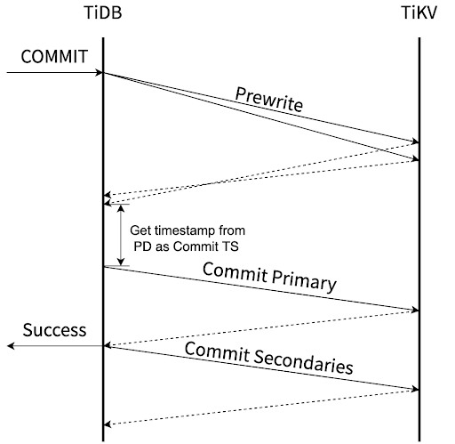
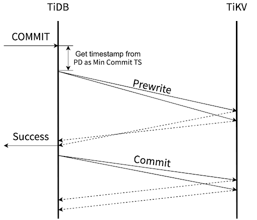
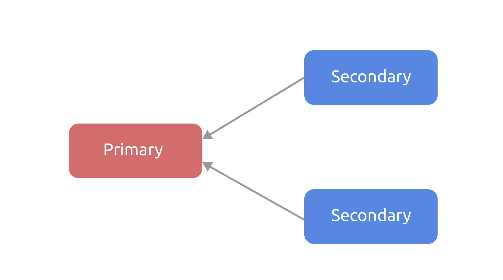
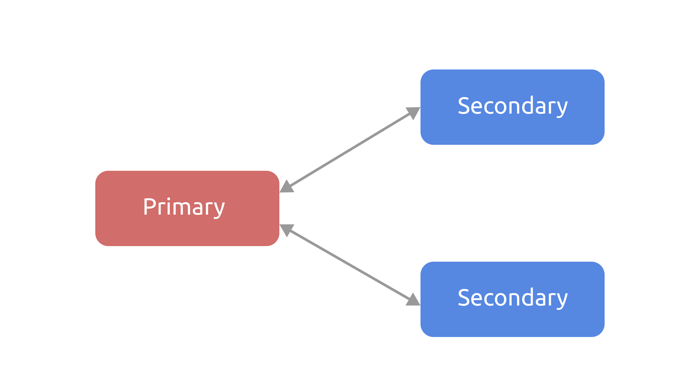
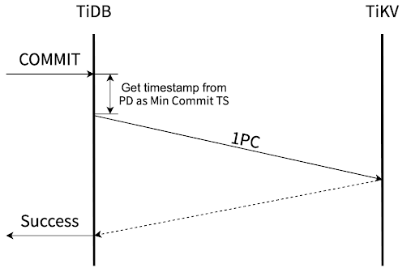
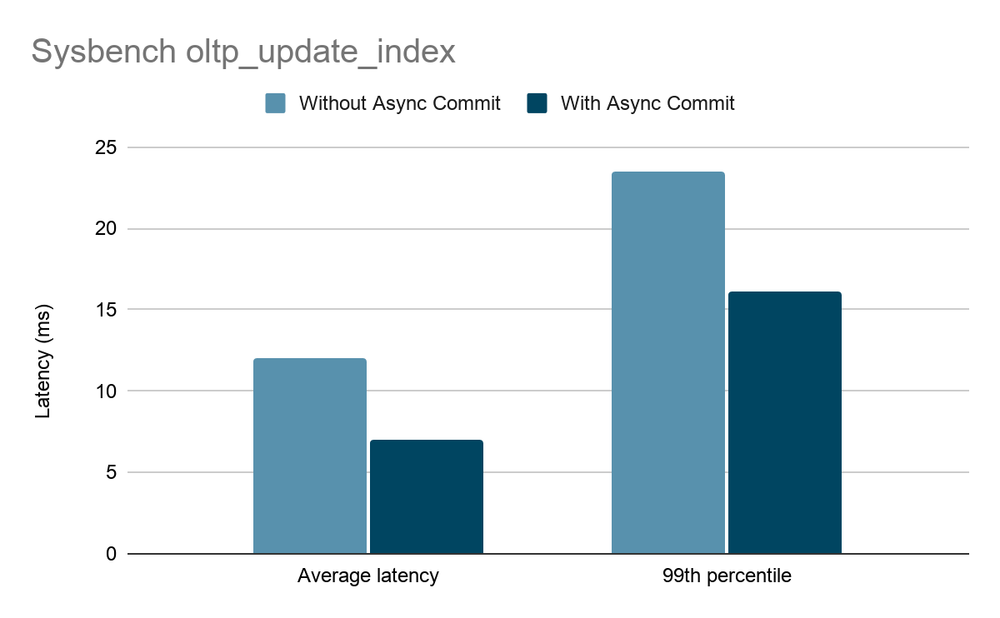
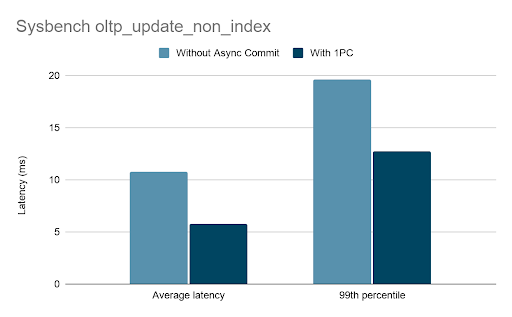

**Author:** [Yilin Chen](https://github.com/sticnarf) (Software Engineer at PingCAP, TiKV Commiter)

**Editor:** Tom Dewan; [Charlotte Liu](https://github.com/CharLotteiu)

TiDB is an open source, distributed, scale-out MySQL alternative database that supports Hybrid Transactional and Analytical Processing (HTAP) workloads. It provides native support for distributed transactions.

As TiDB's developers, we have been working on implementing low-latency distributed transactions. Recently, TiDB 5.0 takes a big step to greatly reduce the latency of transaction commits—introducing the **Async Commit** feature.

This article describes Async Commit's design ideas and its key implementation details.

## Additional delay of Percolator

TiDB transactions are based on the Percolator transaction model. To learn more about Percolator's transaction model, you can refer to [Google's Percolator paper](https://research.google/pubs/pub36726/).

The following diagram shows the commit process in TiDB before Async Commit is introduced.

 The commit process before Async Commit is introduced 

After the user sends a COMMIT statement to TiDB, TiDB has to go through at least the following steps before returning the commit result to the user:

1. Concurrently prewrites all keys.
2. Gets a timestamp from Placement Driver (PD) as the commit timestamp (Commit TS).
3. Commits the primary key.

The critical path for the entire commit process includes at least two round trips between TiDB and TiKV. Only secondary keys are committed asynchronously in the background.

In TiDB's transaction model, TiDB nodes are like the coordinators of transactions, and TiKV nodes are the participants. In common two-phase commit implementations, the coordinator's data is stored locally, while in TiDB's transaction model, all transaction-related data is stored on TiKV. Therefore, theoretically the state of a transaction is determined at the end of the first phase, but TiDB needs to complete part of the second phase—storing the state of the transaction on TiKV—before it can return the determined transaction state to the user.

However, this also means that there is room for improvement in TiDB's original transaction model. Can the Percolator transaction model be improved so that the state of a transaction can be determined without additional remote procedure calls (RPCs) after the first phase is completed?

## Determine the transaction state earlier

Before the introduction of Async Commit, a transaction commit was successful only after the primary key of the transaction was committed. The aim of Async Commit is to advance the determination of the transaction state to the moment when prewrites are completed. In this way, the entire second phase of the commit can be done asynchronously. For an Async Commit transaction, this means that the commit is successful as long as all the keys in the transaction have been successfully prewritten.

The following diagram shows the commit process of an Async Commit transaction. You can see that the original part of getting the Commit TS is missing. Instead, TiDB gets a timestamp from PD as the Min Commit TS before the prewrites. The reasons for the change will be explained in the following sections.

 The commit process of an Async Commit transaction 

To reach the goal of advancing the time when the transaction state is determined, there are two main issues that need to be addressed:

* How to determine if all keys have been prewritten?
* How to determine the Commit TS of a transaction?

### How to find all the transaction keys

Before Async Commit was introduced, the state of a transaction was determined by the primary key only, so you only needed to store a pointer to the primary key on all secondary keys. If you encountered an uncommitted secondary key, you could determine the state of the current transaction by querying the state of the primary key.

 The secondary keys store pointers to the primary key 

As for an Async Commit transaction, we need to know the states of all keys to determine the transaction state; that is, we must be able to query every key of the transaction from any key in the transaction. Therefore, we also store the pointers to each secondary key in the entry of the primary key:

 The primary key stores pointers to the secondary keys 

The primary key actually stores a list of all secondary keys. Obviously, if a transaction contains a large number of keys, we cannot store them all on the primary key. So an Async Commit transaction cannot be too large. Currently, we only use Async Commit for transactions that contain up to 256 keys, and the total size of all keys must be no more than 4096 bytes.

What's more, committing a large transaction takes a long time, so the latency improvement from reducing one round trip between TiDB and TiKV is not significant. Therefore, we also do not consider using a multi-level structure to support Async Commit for larger transactions.

### How to determine the Commit TS of a transaction

The state of an Async Commit transaction must be determined when the prewrites complete. Therefore, as part of the transaction state, the Commit TS must also be determined at that time.

By default, TiDB transactions meet the requirements of snapshot isolation and linearizability. To ensure that these properties also hold true for Async Commit transactions, it is critical to determine the appropriate Commit TS for an Async Commit transaction.

For each key of an Async Commit transaction, TiDB calculates and records the Min Commit TS of this key on TiKV during the prewriting process. The largest Min Commit TS among all the keys of the transaction is the Commit TS of this transaction.

The following two sections describe how Min Commit TSs are calculated and how they guarantee snapshot isolation and linearizability for Async Commit transactions.

### Guarantee snapshot isolation

TiDB implements snapshot isolation with multiversion concurrency control (MVCC). TiDB transactions also get a Start TS from the Timestamp Oracle (TSO) at the beginning of the commit. To realize snapshot isolation, we need to ensure that the snapshots read with the Start TS as the snapshot timestamp are always consistent.

For this reason, every snapshot read from TiDB updates the Max TS on TiKV[^1]. During the prewriting process, the Min Commit TS must be larger than the current Max TS[^2]; that is, larger than the timestamp of all previous snapshot reads. So Max TS + 1 can be chosen as the value of the Min Commit TS. After this Async Commit transaction commits successfully, it does not break snapshot isolation because its Commit TS is larger than the timestamps of all previous snapshot reads.

In the following example, transaction T1 writes both key `x` and key `y` and transaction T2 reads key `y`. T2 updates the Max TS to 5 when reading `y`. Therefore, when T1 prewrites `y` afterwards, the value of Min Commit TS is at least 6. After T1 prewrites `y` successfully, which means T1 commits successfully, T1's Commit TS is also at least 6. So when T2 reads `y` again, it does not read the value updated by T1, and the snapshot of transaction T2 remains consistent.

<table>
  <tr>
   <td>T1: Begin(Start TS = 1)
   </td>
   <td>
   </td>
  </tr>
  <tr>
   <td>T1: Prewrite(x)
   </td>
   <td>T2: Begin(Start TS = 5)
   </td>
  </tr>
  <tr>
   <td>
   </td>
   <td>T2: Read(y) => Max TS = 5
   </td>
  </tr>
  <tr>
   <td>T1: Prewrite(y) => Min Commit TS = 6
   </td>
   <td>
   </td>
  </tr>
  <tr>
   <td>
   </td>
   <td>T2: Read(y)
   </td>
  </tr>
</table>

### Guarantee linearizability

Linearizability includes two aspects:

* Real-time
* Sequential consistency

The aspect of "real-time" requires that transaction changes must be able to be read by a new transaction immediately after the previous transaction successfully commits. The snapshot timestamp of the new transaction is obtained from the TSO on PD, which requires the Commit TS not be too large. The value of Commit TS can only be up to the maximum timestamp allocated by the TSO plus one.

As mentioned in the snapshot isolation section, one possible value for Min Commit TS is Max TS + 1. The timestamps used to update Max TS are from the TSO, so Max TS + 1 is definitely less than or equal to the minimum unallocated timestamp on the TSO. Thus, the requirement of "real-time" is satisfied.

Sequential consistency means that the logical order of transactions does not violate the physical order of precedence. For example, let's assume that there are two transactions, T1 and T2. If T1 is committed before T2, T1's Commit TS should be smaller than or equal to that of T2.[^3]

To guarantee sequential consistency, TiDB gets a timestamp from TSO on PD as the minimum constraint of Min Commit TS before the prewriting process. Because the real-time property is guaranteed, the timestamp obtained by T2 before the prewriting process must be greater than or equal to the Commit TS of T1. Therefore, we can guarantee that no causal reverse happens, and sequential consistency is guaranteed.

In summary, the Min Commit TS of each key takes the maximum value between the Max TS + 1 that TiDB gets when prewriting, and the timestamp obtained from the PD before the prewriting process. The Commit TS of a transaction is the maximum Min Commit TS of all keys. They together guarantee both snapshot isolation and linearizability for Async Commit transactions.

### One-phase commit (1PC)

If a transaction only updates a non-index column of a record, or inserts a record without a secondary index, it only involves a single region. In this scenario, is it possible to complete the transaction commit in only one phase without using the distributed transaction protocol? Well, this is certainly possible, but the difficulty lies in how to determine the Commit TS for a one-phase commit transaction.

With Async Commit providing a basis for calculating the Commit TS, the difficulty of the one-phase commit implementation is solved. We calculate the Commit TS of a one-phase commit transaction in the same way as Async Commit and commit the transaction directly through a single RPC with TiKV.

 The one-phase commit process 

One-phase commits do not use the distributed commit protocol, which reduces the number of TiKV write operations. So if a transaction[^4] involves only one region, using one-phase commit not only reduces transaction latency, but also improves data throughput.

TiBD 5.0 introduces the one-phase commit feature as part of Async Commit.

## Causal consistency

As mentioned above, getting the Min Commit TS from the TSO ensures sequential consistency. So what happens if this step is eliminated? Would it save another round trip latency between PD and TiDB?

In this case, however, there are examples that violate the sequential consistency. Suppose that key `x` and key `y` are stored on different TiKV nodes. Transaction T1 modifies `x`, and transaction T2 modifies `y`. T1 starts earlier than T2, but the user notifies T1 to commit after T2 commits successfully. For the user, the commit of transaction T1 starts after the commit of transaction T2 completes; however, _logically_ T1 should commit later than T2 if sequential consistency is satisfied.

Also, if you omit the operation of getting the Min Commit TS before the prewriting process, the Commit TS of T1 may be 2, which is smaller than the Commit TS of T2. If there is a transaction T3 with a Start TS of 3 at the same time, you can observe the fact that T2 is logically later than T1 by reading key `x` and key `y` in T3. Therefore, there is no linearizability in this example.

<table>
  <tr>
   <td>T1: Begin(Start TS = 1)
   </td>
   <td>
   </td>
   <td>
   </td>
  </tr>
  <tr>
   <td>
   </td>
   <td>
   </td>
   <td>T3: Begin(Start TS = 3)
   </td>
  </tr>
  <tr>
   <td>
   </td>
   <td>T2: Begin(Start TS = 5)
   </td>
   <td>
   </td>
  </tr>
  <tr>
   <td>
   </td>
   <td>T2: Prewrite(y) => Min Commit TS = 6
   </td>
   <td>
   </td>
  </tr>
  <tr>
   <td>
   </td>
   <td>Notify T1 to commit
   </td>
   <td>
   </td>
  </tr>
  <tr>
   <td>T1: Prewrite(x) => Min Commit TS = 2
   </td>
   <td>
   </td>
   <td>
   </td>
  </tr>
  <tr>
   <td>
   </td>
   <td>
   </td>
   <td>T3: Read(x, y)
   </td>
  </tr>
</table>

If TiDB does not get the Min Commit TS from the TSO, the concept of a snapshot may be quite different from what is expected. In the following example, T2, which starts later than T1, notifies T1 to commit, and T1's Commit TS may be smaller than T2's Start TS.

For users, T2 reading the T1's changes to `x` is not expected. In this scenario, the property of repeatable readability is not violated, but it is debatable whether the requirement of snapshot isolation is still met [^5].

<table>
  <tr>
   <td>T1: Begin(Start TS = 1)
   </td>
   <td>
   </td>
  </tr>
  <tr>
   <td>
   </td>
   <td>T2: Begin(Start TS = 5)
   </td>
  </tr>
  <tr>
   <td>
   </td>
   <td>T2: Read(y)
   </td>
  </tr>
  <tr>
   <td>
   </td>
   <td>Notify T1 to commit
   </td>
  </tr>
  <tr>
   <td>T1: Prewrite(x) => Min Commit TS = 2
   </td>
   <td>
   </td>
  </tr>
  <tr>
   <td>
   </td>
   <td>T2: Read(x)
   </td>
  </tr>
</table>

We refer to such weaker consistency as causal consistency: the order of causally-related transactions is the same as the order in which they physically commit, but the commit order between transactions that are not causally related is uncertain. Two transactions are causally related only when the data they lock or write to intersects. Causality here only includes causality that can be known by the database—not external causality such as the "side-channel notifications" in the example above.

As it is not very usual for such a special scenario to occur, we still offer users a way to skip getting the Min Commit TS. Transactions opened with `START TRANSACTION WITH CAUSAL CONSISTENCY ONLY` do not get the Min Commit TS when committing. If your scenario does not involve controlling the commit order of two concurrent transactions outside the database, you can try to lower the consistency level to save one operation of TiDB getting the timestamp from the PD TSO, and thus reduce the time.

## Performance enhancement

Async Commit moves the transaction completion point to the end of prewrite, making the commit of the primary key asynchronous. The more time consuming the primary key commit step is in the transaction, the more significant the improvement brought by Async Commit will be. Smaller transactions with fewer interactions can often gain large improvement through Async Commit.

In the sysbench oltp_update_index scenario, a transaction only writes two keys, row record, and index. It is also an auto-commit transaction with no additional interaction, so theoretically Async Commit can significantly reduce its latency.

Our tests also prove this. As shown in the below chart, when we enable Async Commit and test sysbench oltp_update_index at a fixed 2,000 TPS, the average latency is reduced by 42% and the 99th percentile latency is reduced by 32%.

 Sysbench test result with the Async Commit feature enabled 

As for transactions that involve only one region, the optimization of one-phase commit can reduce the latency of the transaction commit even more significantly. It can also improve the data throughput because it reduces the amount of writes to TiKV.

The chart below shows the result of testing sysbench oltp_update_non_index with a fixed 2,000 TPS. In this scenario, a transaction writes to only one Region. With one-phase commit enabled, the average latency is reduced by 46% and the 99th percentile latency is reduced by 35%.

 Sysbench test result with the one-phase commit feature enabled 

Conversely, there are some scenarios where Async Commit does not significantly improve performance:

* If the transaction contains many statements and has long interaction logic, and the time percentage of the transaction commit is low, the improvement brought by Async Commit is limited.
* If the transaction involves many keys and many write operations, for which the time taken for prewrite is significantly longer than the time taken for committing the primary key, Async Commit is less useful in reducing the latency for this transaction.
* Async Commit does not reduce the amount of reads and writes to TiKV, so it does not improve the throughput. If the system itself is close to the throughput limit, Async Commit cannot bring significant improvement.

## Summary

Async Commit reduces the latency of a single write to TiKV for TiDB transaction commits, which is a major improvement over the original Percolator transaction model. Newly-created TiDB 5.0 clusters have Async Commit and one-phase commit enabled by default. Upgrading to a 5.0 cluster from an older version requires the user to manually enable the Async Commit and one-phase commit features: set the global system variables `tidb_enable_async_commit` and `tidb_enable_1pc` to `ON`.

If you'd like to learn more about the Async Commit design, you can read the [design document](https://github.com/tikv/sig-transaction/tree/master/design/async-commit). In the future, we will continue to improve the performance of TiDB transactions and improve your TiDB experience so that more people can benefit from TiDB.

### Join our community

If you are interested in discussing and planning the future development of TiKV distributed transactions, you're welcome to join the [Transaction SIG](https://developer.tidb.io/sig/transaction) and find us in the [TiKV Community Slack](https://slack.tidb.io/invite?team=tikv-wg&channel=sig-transaction&ref=community-sig) space.

<!-- Footnotes themselves at the bottom. -->
## Notes

[^1]:
     In order to ensure that the Max TS of the new leader is large enough after the region leader transfers, TiKV also gets the latest timestamp from PD to update the Max TS after the region leader transfers and the region is merged.

[^2]:
     In the prewriting process, to prevent that a more recent snapshot read breaks this constraint, TiKV adds a memory lock to the prewrite key and temporarily blocks the read requests whose Start TSs are greater than or equal to the Min Commit TS.

[^3]:
     If the T1 and T2 commitment processes overlap, the logical order of their commits cannot be determined.

[^4]:
     To be precise, the one-phase commit feature should only be used when a transaction can be completed by a single TiKV request. In order to improve commit efficiency, larger transactions will be split into many requests, and in this case, even if they all involve the same single region, one-phase commit is not used.

[^5]:
     If you agree that the logical commit time of T1 is earlier than the start time of T2 (because the linearizability is not satisfied), then this case meets the snapshot isolation requirement.
