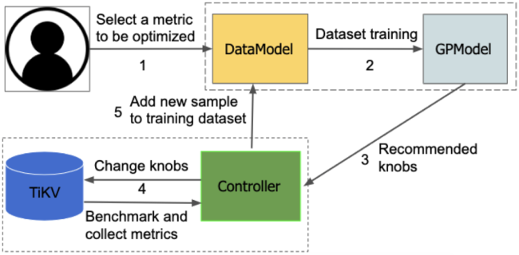
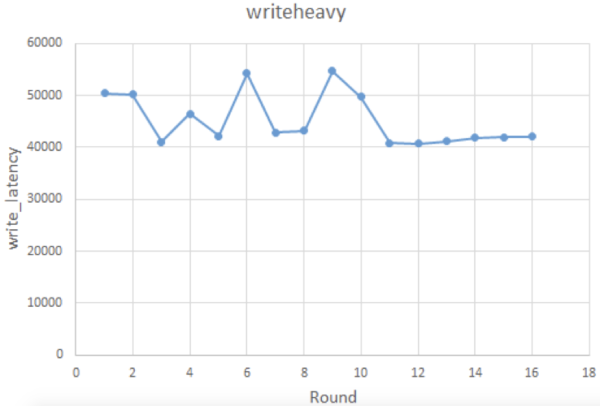
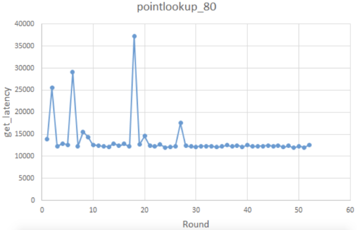
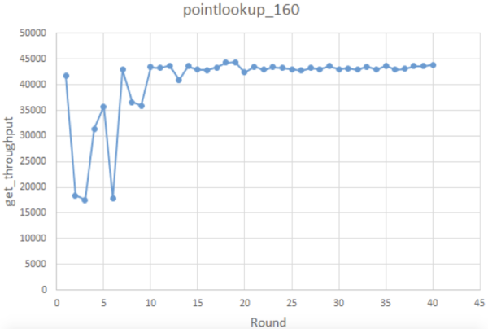
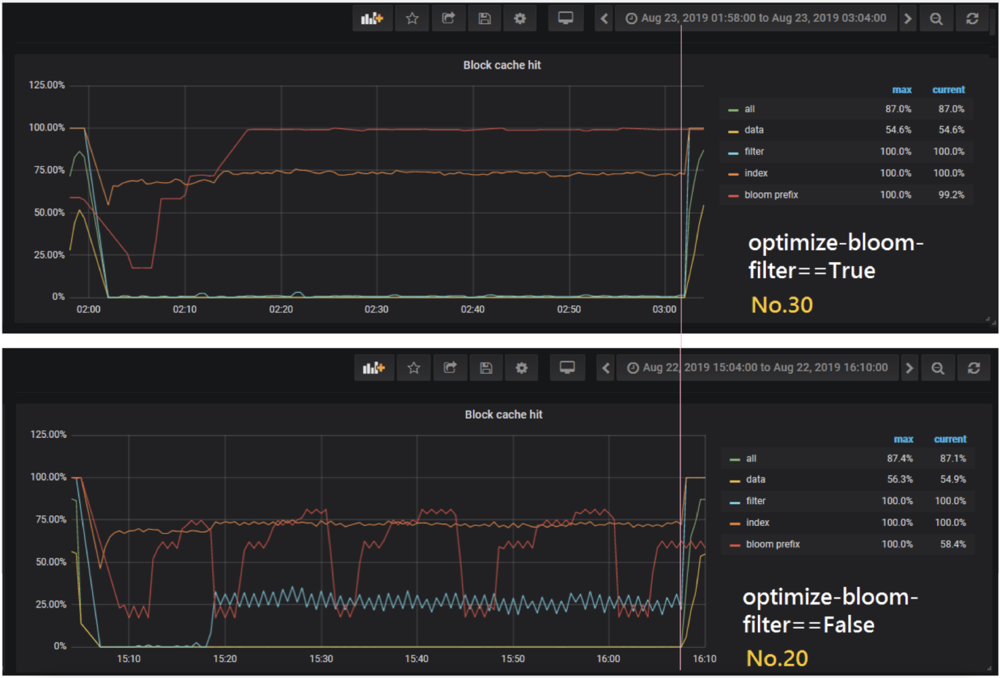
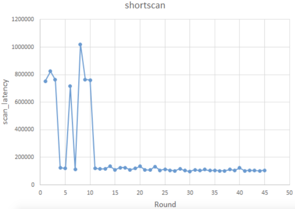

The fast advancement of AI and machine learning (ML) technologies are reshaping the way people manage and tune databases. Among the important players, Oracle's [Autonomous Database](https://www.oracle.com/database/autonomous-database/index.html) has been an important development. Microsoft applies AI in [Azure SQL Database Automatic tuning](https://docs.microsoft.com/en-us/azure/sql-database/sql-database-automatic-tuning). On the academic side, we have Carnegie Mellon University's [OtterTune](https://www.cs.cmu.edu/~ggordon/van-aken-etal-parameters.pdf), which collects and analyzes configuration knobs and recommends possible settings by learning from previous tuning sessions. And Tencent implemented [CDBTune](http://dbgroup.cs.tsinghua.edu.cn/ligl/papers/sigmod19-cdbtune.pdf), an end-to-end automatic tuning system for cloud databases based on deep reinforcement learning (RL). Given all these innovations, AI tuning for databases is really taking shape.

As the team behind [TiDB](https://en.wikipedia.org/wiki/TiDB), an open source distributed NewSQL database, we are always striving to make our databases easier to use. Our key-value (KV) storage engine, [TiKV](https://pingcap.com/docs/stable/architecture/#tikv-server), uses [RocksDB](https://github.com/facebook/rocksdb) as the underlying store. Optimally configuring RocksDB can be difficult. [Even the most experienced RocksDB developers don't fully understand the effect of each configuration change](https://github.com/facebook/rocksdb/wiki/RocksDB-Tuning-Guide#final-thoughts). Inspired by the pioneering breakthroughs of automatic tuning, we developed AutoTiKV, a machine-learning-based tuning tool that automatically recommends optimal knobs for TiKV. The goal is to decrease tuning costs and make life easier for DBAs. In the meanwhile, we would love to see where the ship of AI tuning leads us.

So far, our exploration of automatic tuning has been rewarding—machine learning technologies applied to a database can not only yield optimal and efficient tuning, but also help us understand the system better. In this post, I'll discuss AutoTiKV's design, its machine learning model, and the automatic tuning workflow. I'll also share the results of experiments we ran to verify whether the tuning results are optimal and as expected. Finally, I'll share some interesting and unexpected findings.

AutoTiKV is an open source tool developed by [TiKV](https://github.com/tikv/tikv), a Cloud Native Computing ([CNCF](https://www.cncf.io/)) incubating project. The project is available on [GitHub](https://github.com/tikv/auto-tikv).

## Our story of exploration and exploitation

Automatically tuning a database works similarly to automated machine learning (AutoML), in which automated hyperparameter tuning plays an essential role. Generally, there are three types of tuning methods:

* [Random search](https://en.wikipedia.org/wiki/Random_search). This method does not involve guided sampling based on current results. Its efficiency is relatively low.
* [Multi-armed bandit](https://en.wikipedia.org/wiki/Multi-armed_bandit). This approach takes into account both the "exploration" and "exploitation" properties. Bandit combined with Bayesian optimization forms the core of traditional AutoML.
* [Deep reinforcement learning](https://en.wikipedia.org/wiki/Deep_reinforcement_learning). The advantage of this method is the shift from "learning from data" to "learning from action." However, data training may be difficult, and sometimes the results are hard to reproduce.

Currently, most database automatic tuning research, including OtterTune's, adopts the latter two methods. We drew our inspiration from OtterTune, with the following adaptations:

* AutoTiKV runs on the same machine as the database, instead of on a centralized training server like OtterTune. This avoids the problem of data inconsistency caused by different machine configurations.
* We refactored OtterTune's architecture to reduce its coupling to specific DBMSs, so that it's more convenient to port the entire model and pipeline to other systems; AutoTiKV is more suitable for lightweight KV databases.
* AutoTiKV can adjust knobs with the same names in different sessions, making it extremely flexible. In contrast, OtterTune can only adjust global knobs.

### The machine learning model

AutoTiKV uses the same Gaussian process regression (GPR) as OtterTune does to recommend new knobs. This is a nonparametric model based on the Gaussian distribution. The benefits of GPR are:

* Compared with other popular methods like neural networks, GPR is a nonparametric model which is less compute intensive. Also, in conditions with fewer training samples, GPR outperforms neural networks.
* GPR estimates the distribution of the sample—the mean of X, m(X), and its standard deviation, s(X). If there is not much data around X, s(X) is overly large. This indicates a large deviation between sample X and the other data points. We can understand intuitively that if there is insufficient data, the uncertainty is large, and this is reflected in the large standard deviation. Conversely, when the data is sufficient, the uncertainty is reduced, and the standard deviation decreases.

But GPR itself can only estimate the distribution of the sample. To get the final prediction, we need to apply the estimation to Bayesian optimization, which can be roughly divided into two steps:

* Estimate the distribution of functions using GPR.
* Use the acquisition function to guide the next sample; that is, give the recommended value.

When looking for new recommended values, the acquisition function balances the two properties of exploration and exploitation:

* Exploration: The function explores new points in unknown areas where there is currently insufficient data.
* Exploitation: The function uses the data for model training and estimation to find the optimal prediction in the known areas with sufficient data.

In the recommendation process, these two properties need to be balanced. Excessive exploitation can cause results to fall into partial optimal values (repeated recommendations of the known optimal points while there may be better points to be found). Too much exploration can lead to low search efficiency (always exploring new areas without in-depth attempts in the current area). The core idea of balancing these two properties is:

* When there is enough data, use the existing data for recommendation.
* When there is not enough data, explore in the area with the least number of points so you can obtain the maximum amount of information in the least known area.

Applying GPR with Bayesian optimization can help us achieve this balance. As mentioned earlier, GPR can help us estimate m(X) and s(X), where m(X) can be used as the characterization value for exploitation, and s(X) can be used as the characterization value for exploration.

We use the Upper Confidence Bound (UCB) algorithm as the acquisition function. Suppose we need to find an X to make the Y value as large as possible, and U(X) is the definition of the acquisition function. Therefore, U(X) = m(X) + k*s(X), where k > 0 is an adjustable coefficient. We only need to find the X to make U(X) as large as possible.

* If U(X) is large, either m(X) or s(X) may be large.
* If s(X) is large, it means the difference among the data is large, and there is not much data around X. Therefore, the algorithm must explore new points in unknown areas.
* If m(X) is large, it indicates that the mean value of the estimated Y is large, and the algorithm should find better points using the known data.
* Coefficient k affects the proportion of exploration and exploitation. A larger k value means more exploration in new areas.

In the implementation, several candidate knobs are randomly generated at the beginning, and then their U(X) values are calculated based on the above model. The one with the largest U(X) value is identified as the recommendation result.

### How AutoTiKV works

The following diagram and description show how AutoTiKV works:


<div class="caption-center"> How AutoTiKV works </div>

1. You select the metric to be optimized; for example, throughput or latency.
2. All the training data (knob-metric pairs) are saved in the DataModel, where random knobs are generated as the initial data sets in the first 10 rounds. The DataModel sends the training data to the GPModel process.
3. GPR is implemented in GPModel module. It trains the model, and provides the recommended knobs.
4. The Controller includes functions that control TiKV directly. It changes TiKV knobs based on recommendations, runs benchmarking, and gets performance metrics.
5. The metrics and the corresponding knobs are sent back to the DataModel as a newly generated sample. The training data is updated incrementally.

By default, the entire process runs 200 rounds. You can also customize the number of rounds, or you can set the process to run until the results stabilize. AutoTiKV supports restarting TiKV after modifying parameters, or you can choose not to restart if it's not required. You can declare the parameters to be adjusted and the metrics to be viewed in [`controller.py`](https://github.com/tikv/auto-tikv/blob/master/controller.py). The information of the DBMS is defined in [`settings.py`](https://github.com/tikv/auto-tikv/blob/master/settings.py).

## Experiment design

To evaluate AutoTiKV, we simulated some typical TiKV workloads. For each type of workload, we selected the metric to optimize and a corresponding set of knobs for recommendation.

### Test environment

The experiment was conducted using the following environment:

* CPU: AMD Ryzen5-2600
* RAM: 32 GB
* Storage: 512 GB NVME SSD
* Operating system: Ubuntu 18.04
* Installer: tidb-ansible: v.3.0.1
* Database capacity: 80 GB

### Workload

We simulated the following typical workloads using [go-ycsb](https://github.com/pingcap/go-ycsb), a Yahoo! Cloud Server Benchmark ([YCSB](https://github.com/brianfrankcooper/YCSB)) Go port:

* write-heavy
* range-scan (both long and short)
* point-lookup [2]

### Related knobs

We selected the following parameters as configuration knobs:

<table>
  <tr>
   <td>Parameter
   </td>
   <td>Workload/expected behaviors
   </td>
   <td>Valid range/value set
   </td>
  </tr>
  <tr>
   <td>disable-auto-compactions
   </td>
   <td>write-heavy: turning on is better
<br/>
point-lookup, range-scan: turning off is better
   </td>
   <td>{'{1, 0}'}
   </td>
  </tr>
  <tr>
   <td>block-size
   </td>
   <td>point-lookup: the smaller the better
<br/>
range-scan: the larger the better
   </td>
   <td>{'{4k,8k,16k,32k,64k}'}
   </td>
  </tr>
  <tr>
   <td>bloom-filter-bits-per-key
   </td>
   <td>point-lookup, range-scan: larger the better
   </td>
   <td>[5,10,15,20]
   </td>
  </tr>
  <tr>
   <td>optimize-filters-for-hits
   </td>
   <td>point-lookup, range-scan:
<br/>
turning off is better
   </td>
   <td>{1,0}
   </td>
  </tr>
</table>

Argument description:

* **block-size**

    Sets the size of the data block where RocksDB saves the data. When RocksDB looks up a key, it needs to load the whole block where this key resides. For point-lookups, a larger block increases read amplification and decreases the performance. However, for range-scans, a larger block makes more efficient use of the disk bandwidth.

* **disable-auto-compactions**

    Determines whether to disable auto compaction. Compaction takes up disk bandwidth and decreases the write speed. However, without compaction, Level0 files accumulate, which affects the read performance.

* **bloom-filter-bits-per-key**

    Sets the number of bits in the[Bloom filter](https://en.wikipedia.org/wiki/Bloom_filter). For read performance, the bigger the better.

* **optimize-filters-for-hits**

    Disables (true) or enables (false) Bloom filters at the bottom layer of the log-structured merge-tree (LSM) tree. Bloom filters at the bottom layer can be large and may take up block cache. If the key to query exists in the store, there is no need to enable Bloom filters for the bottom layer.

### Target metrics

We selected the following target metrics for optimization:

* **Throughput**

    Depending on the specific workload, it is divided into write-throughput, get -throughput, and scan-throughput.

* **Latency**

    Depending on the specific workload, it is divided into write-latency, get-latency, and scan-latency.

Throughput and latency are obtained from the output of go-ycsb.

## Evaluation

The evaluation is based on the performance of the corresponding metrics and the comparison between the recommended configurations and the expected behaviors.

For all experiments, the first 10 rounds used the randomly-generated configurations, while the rest of the rounds used configurations recommended by AutoTiKV.

### Workload 1: write-heavy

**Workload specifics:**

```
workload=writeheavy

knobs={disable-auto-compactions, block-size}

metric=write_latency
```

The results are shown in the figure below:


<div class="caption-center"> write-heavy </div>

The recommended result in this experiment is to enable compaction (`disable-auto-compactions==false`) and set the block size to 4 KB (`block-size==4k`). Theoretically, you need to disable compaction to improve the write performance. However, because TiKV uses Percolator for distributed transactions, a write process also involves read operations (for example, detecting write conflicts). This means turning off compaction can degrade write performance. Similarly, a smaller block size improves the performance for both point-lookup and write.

### Workload 2: point-lookup A

**Workload specifics:**

```
workload=pntlookup80

knobs={'bloom-filter-bits-per-key', 'optimize-filters-for-hits', 'block-size', 'disable-auto-compactions'}

metric=get_latency
```

The results are shown in the figure below:


<div class="caption-center"> get_latency for point-lookup 80 </div>

The recommended results are:

```
bloom-filter-bits-per-key==20

block-size==4K

disable-auto-compactions==false
```

The recommendation for the `optimization-filters-for-hits` option was somewhat wavering—it recommended two different values alternatively—but it didn't affect the get-latency metric much in this case.

The overall recommended results are just as expected. Regarding the `optimization-filters-for-hits` option, it should be noted that the block cache was large enough in the experiment, so the size of the Bloom filter had little effect on the cache performance. On the other hand, the options we configured were for the defaultCF (column family. Refer to [How TiKV reads and writes](https://tikv.org/blog/how-tikv-reads-writes/) for more details on column families in TiKV). For TiKV, before a query is performed in defaultCF, the corresponding key should already be known to exist. Therefore, whether to enable the Bloom filter had little effect.

### Workload 3: point-lookup B

**Workload specifics:**

```
workload=pntlookup80

knobs={rocksdb.writecf.bloom-filter-bits-per-key, rocksdb.defaultcf.bloom-filter-bits-per-key, rocksdb.writecf.optimize-filters-for-hits, rocksdb.defaultcf.block-size, rocksdb.defaultcf.disable-auto-compactions} metric=get_throughput
```

In this experiment, we made several adjustments based on [Workload 2: point-lookup A](#workload-2-point-lookup-a), as described below:

* Set `optimize-filters-for-hits` in the writeCF. The default value for defaultCF is 0.
* Set `bloom-filter-bits-per-key` in defaultCF and writeCF respectively, and use them as two knobs.
* Adjust the workload by setting the [`recordcount`](https://github.com/brianfrankcooper/YCSB/wiki/Core-Properties) of the run phase to twice of that of the load phase to measure the effect of the Bloom filter as much as possible. This way, half of the keys for the query won't exist, so the recommended value for `optimize-filters-for-hits` should be `disable`.

The results are shown in the figure below, along with an interesting finding:


<div class="caption-center"> get_latency for point-lookup 160 </div>

The recommended knobs fall into two main sets:

* Set 1

    ```
    rocksdb.writecf.bloom-filter-bits-per-key ['rocksdb', 'writecf'] bloom-filter-bits-per-key **20**
    rocksdb.defaultcf.bloom-filter-bits-per-key ['rocksdb', 'defaultcf'] bloom-filter-bits-per-key **10**
    rocksdb.writecf.optimize-filters-for-hits ['rocksdb', 'writecf'] optimize-filters-for-hits **True**
    rocksdb.defaultcf.block-size ['rocksdb', 'defaultcf'] block-size **4KB**
    rocksdb.defaultcf.disable-auto-compactions ['rocksdb', 'defaultcf'] disable-auto-compactions **False**
    ```

* Set 2

    ```
    rocksdb.writecf.bloom-filter-bits-per-key ['rocksdb', 'writecf'] bloom-filter-bits-per-key **15**
    rocksdb.defaultcf.bloom-filter-bits-per-key ['rocksdb', 'defaultcf'] bloom-filter-bits-per-key **15**
    rocksdb.writecf.optimize-filters-for-hits ['rocksdb', 'writecf'] optimize-filters-for-hits **False**
    rocksdb.defaultcf.block-size ['rocksdb', 'defaultcf'] block-size **4KB**
    rocksdb.defaultcf.disable-auto-compactions ['rocksdb', 'defaultcf'] disable-auto-compactions **False**
    ```

After analyzing the TiKV system configurations, we concluded that the Bloom filter didn't affect much because the writeCF was small, and the block cache size was sufficiently big.

Something interesting drew our attention during this experiment. If we look at the data sets of sample 20 (used in the 20th round) and sample 30 (used in the 30th round):

* 20, 2019-08-22 16:09:26, [3. 1. 0. 0. 0.], [4.24397000e+04 1.20590000e+04 8.68403016e+10 5.07300000e+01]
* 30, 2019-08-23 03:03:42, [3. 1. 1. 0. 0.], [4.30542000e+04 1.18890000e+04 8.68628124e+10 5.10200000e+01]

The only difference between their knobs is that the Bloom filter (`optimize-filters-for-hits==True`) is enabled for sample 20, while it's disabled for sample 30. However, the throughput of sample 20 is even a bit lower than sample 30, which is completely different from our expectations. To find out what happened, we took a closer look at the Grafana charts of the two samples. (In both cases, `block-cache-size` was 12.8 GB.)


<div class="caption-center"> Block cache hit comparison </div>

In the figure, the left side of the pink vertical line is the load stage, and the right side is the run stage. It can be seen that the cache hits in these two cases are actually not much different, with sample 20 slightly lower. This is because the Bloom filter itself also consumes space. If the block cache size is sufficient, but the Bloom filter takes up a lot of space, the cache hit is affected. This finding, though not expected, is a positive demonstration that the ML model can help us in ways we would not otherwise be able to figure out from experience or intuition.

### Workload 4: short range-scan

**Workload specifics:**

```
workload=shortscan

knobs={'Bloom-filter-bits-per-key', 'optimize-filters-for-hits', 'block-size', 'disable-auto-compactions'}

metric=scan_latency
```

The results are shown in the figure below:


<div class="caption-center"> Short range-scan </div>

The recommended results are:

```
optimize-filters-for-hits==False

block-size==32KB or 64KB

disable-auto-compactions==False
```

According to [Intel's solid-state drive (SSD) white paper](https://www.intel.com/content/dam/www/public/us/en/documents/white-papers/ssd-server-storage-applications-paper.pdf), an SSD's random read performance is similar for 32 KB and 64 KB block sizes. The number of bits in the Bloom filter has little effect on the scan operation. Therefore, the results of this experiment are also in line with expectations.

### Beyond the recommendations

As indicated in the above experiments, although most of the recommended knobs are in line with our expectations, there were some deviations that helped us locate some important issues:

* Some parameters have little effect on the results. For example, the scenario in which the parameter in question works is not triggered at all, or the hardware associated with it does not have a performance bottleneck.
* Some parameters require the workload to run long enough to take effect. Therefore, dynamic adjustments may not show their effects immediately. For example, you must wait until the workload fills in the block cache to see the effect of increased block cache size on the overall cache hit.
* The effect of some parameters is in contrary to expectations. It was later found that the parameter in question actually has side effects in certain scenarios (such as the above example of the Bloom filter).
* Some workloads are not entirely read or written, and some other operations may be involved. DBAs are likely to ignore this when they manually predict the expected effect (such as the [write-heavy](#workload-1-write-heavy) case). In an actual production environment, DBAs can't know in advance what kind of workload they will encounter. This is probably where automatic tuning should kick in.

## Limitations

AutoTiKV has only been around for about 4 months. Due to constraints on time and effort, there are still some limitations in the current implementation, compared to OtterTune:

* AutoTiKV omits the workload mapping step by using only one default workload. OtterTune uses this step to pick from the repository the training sample most similar to the current workload.
* AutoTiKV gives recommendations for user-specified knobs, while OtterTune uses lasso regression to automatically select important knobs to be tuned.

## What does the future hold?

A complex system requires a lot of trade-offs to achieve the best overall results. This requires a deep understanding of all aspects of the system. AutoTiKV, as our initial exploration of automatic database tuning technologies, not only yields some positive signals in recommending knobs, but also help us identify some issues.

What does the future hold for AutoTiKV? We will continuously improve it, focusing on the following:

* Adapting to dynamically changing workloads
* Avoiding trapping into local optimal results of the ML model by working with a larger search space
* Drawing on different ML models to improve the efficacy of results and reduce the time required for recommendations

Of course, AutoTiKV means much more than just TiKV tuning. We would love to see this work be the start of a brand new world, and a new era of intelligent databases. We look forward to seeing AI and machine learning technologies applied in other projects such as TiDB and TiFlash. An AI-assisted SQL tuner/optimizer? Stay tuned!
