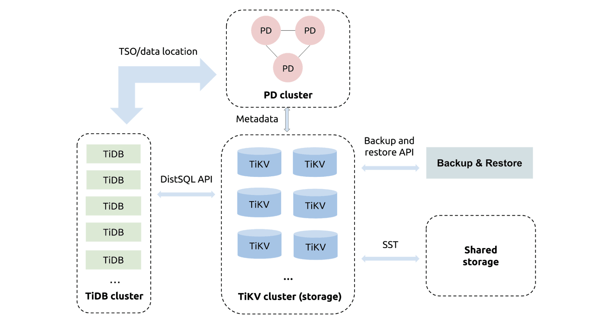
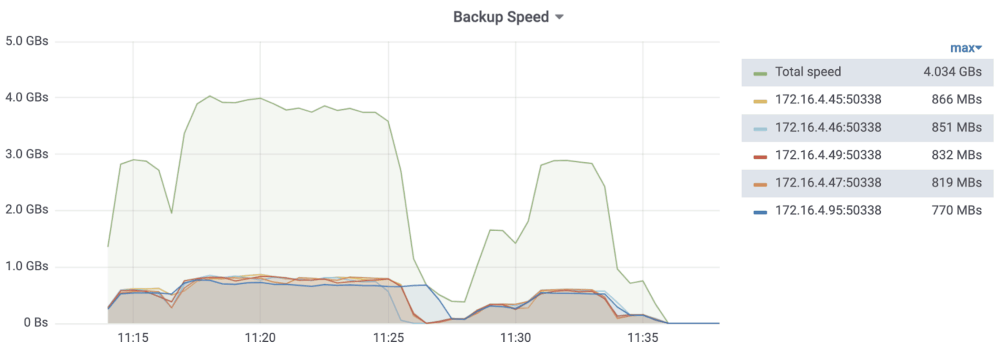
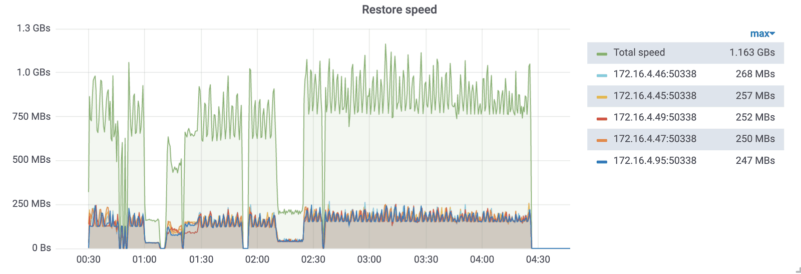

Backing up or restoring large-scale distributed databases is time-consuming. When it takes a lot of time to backup or restore a database, Garbage Collection might break the snapshot used in the backup or restore process. Thus, some changes might be missing. This threatens data safety.

As an open-source, distributed SQL database, [TiDB](https://en.wikipedia.org/wiki/TiDB) fulfills the requirement for **backing up and restoring large-scale clusters**. [TiDB 4.0 release candidate (RC)](https://pingcap.com/docs/stable/reference/tools/br/br/) introduced [Backup & Restore](https://github.com/pingcap/br) (BR), a distributed backup and restore tool, that offers **high backup and restore speeds**—1 GB/s or more for 10 TB of data.

In this post, I'll share how we use BR to improve backup and restore speeds for large-scale TiDB clusters. If you specialize in database development, this post might inspire your backup and restore design work. If your application deals with huge amounts of data and you also attach great importance to data security and the efficiency of backup and restore, you can try [TiDB](https://docs.pingcap.com/tidb/v4.0/overview) with [BR](https://pingcap.com/docs/v3.1/reference/tools/br/br/).

## Why Backup & Restore?

TiDB is an open-source, MySQL-compatible, [NewSQL](https://en.wikipedia.org/wiki/NewSQL) database that supports [Hybrid Transactional/Analytical Processing](https://en.wikipedia.org/wiki/Hybrid_transactional/analytical_processing_(HTAP)) (HTAP) workloads. Backup and restore has long been a challenging problem for large-scale TiDB clusters. Because data is distributed in different nodes, TiDB doesn't have a consistent physical snapshot.

Mydumper and myloader are widely used as backup and restore tools in the MySQL community. Since TiDB is [compatible with the MySQL protocol](https://pingcap.com/docs/stable/key-features/#mysql-compatible-syntax), we used them too.

However, mydumper does not work well with very large TiDB clusters. It cannot reasonably utilize cluster resources to improve backup speed. This seriously affects application requests. It might even cause TiDB's out of memory (OOM) errors.

We also had issues restoring data. We optimized [Loader](https://pingcap.com/docs/stable/reference/tools/loader/), a tool similar to myloader, for TiDB. According to our [test](https://pingcap.com/docs/tidb-data-migration/stable/benchmark-v1.0-ga/#benchmark-result-with-different-pool-size-in-load-unit), it took about 19 hours for Loader to restore 1 TB of data. This speed does not meet our requirement for high restore efficiency. The main reason is that we execute SQL INSERT statements to restore data. The whole process is long and involves too many unnecessary calculations. Therefore, resources cannot be fully utilized.

In short, although we can use mydumper and Loader, they do not perfectly meet our needs. Therefore, we developed a new backup and restore tool, BR.

## Backup & Restore's key features

BR is a command-line tool for fast distributed backup and restore of the TiDB cluster data. Compared with [mydumper](https://pingcap.com/docs/v3.1/how-to/maintain/backup-and-restore/mydumper-lightning) and Loader, BR is more suitable for TiDB clusters with 1TB of data or more.

In this section, I'll briefly introduce BR's key features: horizontal scalability and strong consistency.

First, however, it's helpful to learn a bit about [TiDB's architecture](https://docs.pingcap.com/tidb/v4.0/architecture). Inside the TiDB platform, the main components are as follows:

* [TiDB server](https://pingcap.com/docs/stable/architecture/#tidb-server) is a stateless SQL layer.
* [TiKV server](https://pingcap.com/docs/stable/architecture/#tikv-server) is the distributed transactional key-value storage layer where the data persists.
* [Placement Driver (PD) server](https://pingcap.com/docs/stable/architecture/#placement-driver-server) manages the cluster.

 TiDB with Backup & Restore 

### Horizontal scalability

BR enables backup and restore to horizontally scale; that is, you can increase BR's backup and restore speeds by adding new TiKV instances.

TiDB's storage engine, [TiKV](https://pingcap.com/docs/stable/architecture/#tikv-server), stores data in basic units called [Regions](https://pingcap.com/docs/v3.1/glossary/#regionpeerraft-group). In contrast to mydumper, BR pushes down backup and restore tasks to each TiKV instance for execution. If a backup task involves multiple Regions, BR only needs to send a request to each TiKV instance so that each instance can automatically back up its own data.

During data backup and restore, BR evenly distributes CPU and I/O pressures on each TiKV instance. This way, we can easily back up and restore a TiDB cluster with hundreds of instances.

### Strong consistency

Both TiDB and BR are strongly consistent and support snapshot isolation level consistency.

Data is distributed across multiple TiKV instances. To achieve snapshot isolation, BR only needs to get a timestamp of a TiDB transaction and send it to all TiKV instances. TiKV instances back up the data that we can read via this timestamp, including both user data and TiDB's metadata, such as table schemas. Therefore, BR backup achieves data consistency in both the storage layer (TiKV server) and SQL layer (TiDB server).

## Benchmarks for a 10-TB data cluster

As shown in the figures below, BR was able to back up a cluster with 10 TB of data at an average speed of 2.7 GB/s, an average of 548 MB/s for the five TiDB instances. BR's maximum speed during the test was slightly over 4 GB/s, with the maximum backup speed for each instance ranging from 770 MB/s to 866 MB/s.

BR restored the 10-TB data cluster at an average speed of 0.7 GB/s, an average of 150 MB/s for the five TiDB instances. BR's maximum store speed during the test was about 1.2 GB/s, with the maximum restore speed for each instance ranging from 247 MB/s to 268 MB/s.

The following figures show the test's backup and restore speeds.

### Backup speed

We backed up two tables. In the figure below, the green curve represents the overall backup speed for all the TiKV instances, and the other curves represent the backup speed for each instance.

 Backup speed 

At 11:15 and 11:28, index data are backed up. Because index entries are short, the backup speeds decrease.

### Restore speed

After backup, we restored the two tables. The green curve represents the overall restore speed, and the other curves represent the restore speed for each TiKV instance.

BR split restore tasks into multiple subtasks, and the subtasks were executed serially. So we can see glitches in the figure. They might be potential issues that need further optimization.

 Restore speed 

At 1:00 and 1:15, index data are restored. Because index entries are short, the restore speeds decrease.

## Try Backup & Restore

If you're running a terabyte-scale TiDB cluster, and you want to quickly back up and restore data, give BR a try.

Here are some documents for your reference:

* [The BR tool manual](https://pingcap.com/docs/v3.1/reference/tools/br/br/)
* [Examples of BR backup and restore scenarios](https://pingcap.com/docs/v3.1/reference/tools/br/use-cases/)

BR is still in the beta stage and will be generally available in our upcoming TiDB 4.0, which is about to be released later this year. If you find any problems using it, please feel free to [file an issue](https://github.com/pingcap/br/issues).

## What's next for Backup & Restore

TiDB boasts an active open-source community. Thanks to our creative contributors and [PingCAP](https://pingcap.com/) engineers for adding the following features to BR. These features are under development:

* Backup and restore for RawKV-modeTiKV

    [xinhua5](https://github.com/xinhua5) actively participated in the [RawKV Backup & Restore Project](https://github.com/pingcap/br/issues/86) that will let BR backup and restore RawKV-mode TiKV clusters.

* Incremental backup and restore

    A full backup can take up a lot of space. [Incremental backup and restore](https://github.com/pingcap/br/issues/90) will not only solve this issue, but also enable you to quickly repair a cluster when [TiDB Binlog](https://pingcap.com/docs/stable/reference/tidb-binlog/overview/) is corrupted.

* Backup to common cloud storage

    In the era of cloud, cloud storage is the prevailing trend. BR already offers backup to [AWS S3](https://en.wikipedia.org/wiki/Amazon_S3) and will soon support [backup to Google Cloud Storage](https://github.com/pingcap/br/issues/89).

* Online restore

    Currently, BR only lets you restore offline data to a new cluster. But soon you'll be able to [restore online data](https://github.com/pingcap/br/issues/87). This will help import data to TiDB in [online analytical processing](https://en.wikipedia.org/wiki/Online_analytical_processing) (OLAP) scenarios.
