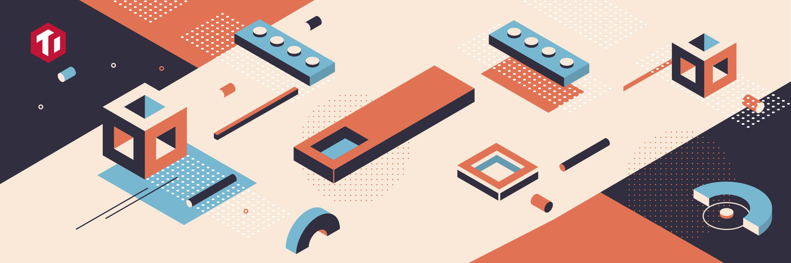
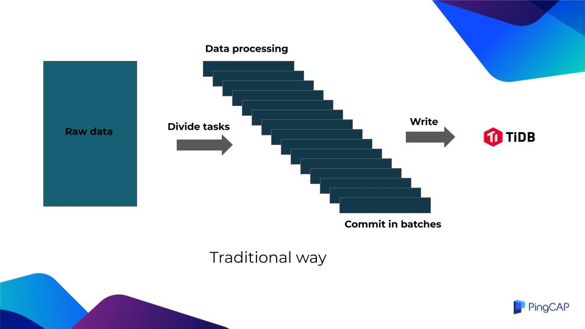
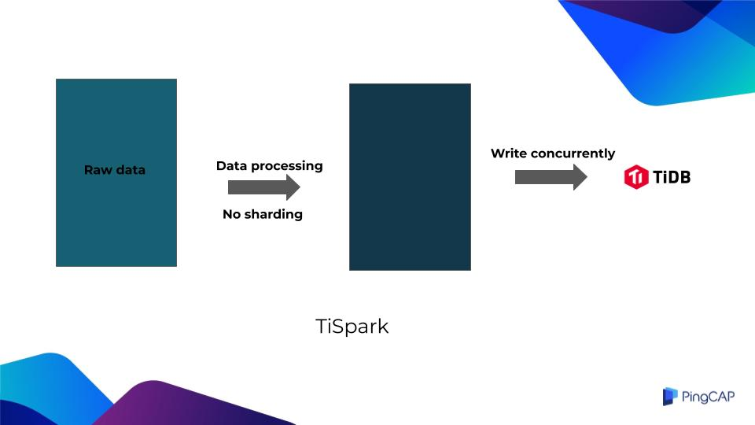
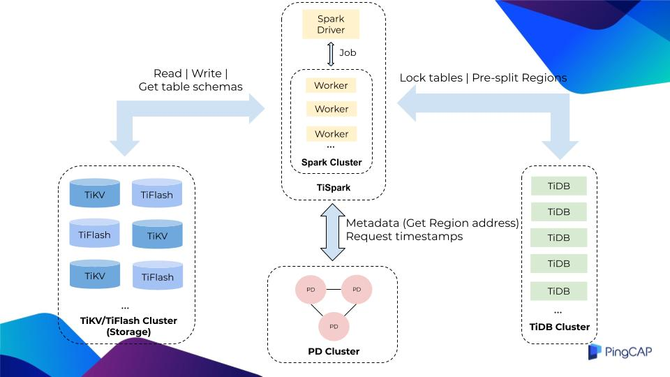

TiSpark is an Apache Spark plugin that works with the TiDB platform to answer complex online analytical processing (OLAP) queries. It is widely used by our customers to batch process their massive data and discover analytical insights.

I'm a senior solution architect at PingCAP and a former developer of TiSpark. In this post, I will explain why TiSpark is better than the traditional batch processing solution, how you can benefit from TiSpark, and how it works.

## Batch processing: the traditional way vs. TiSpark

Let's first review the traditional batch processing architecture.



The traditional batch processing system first gets raw data, which can be CSV files, or data read from TiDB, MySQL, or other heterogeneous databases.

Then it divides the raw data into small batches of subtasks. The data is processed separately for each batch, and is then committed and written to TiDB.

However, the system has one fatal problem: **it cannot guarantee the atomicity, consistency, isolation, durability (ACID) of transactions through the database**.

The application side must introduce a complex mechanism of task tables to track if all the subtasks succeed. Once a subtask fails, the system might roll back the entire task. In extreme cases, manual intervention is required.

As a result, this mechanism slows down the entire data processing task.

Sometimes it gets so slow that commercial banks cannot accept it. This is because the batch processing in banking must be completed within the day; otherwise, it will impact the next day's opening.

But if we're talking about TiSpark, it's a different story.



TiSpark treats the loaded raw data as a whole for data processing, without breaking up a large data set into small subsets.

Once processed, the data is concurrently written to the TiKV server using the two-phase commit protocol, without passing through the TiDB server.

To sum up, batch processing using TiSpark has the following advantages:

* **Extremely fast.** TiSpark bypasses TiDB and concurrently writes data to TiKV in a many-to-many way. This enables horizontal scalability. If the bottleneck is in TiKV or Apache Spark, you can simply add a TiKV or Spark node to expand storage space or computing power.
* **Easy configuration.** The only thing you configure is to tell Spark how to use TiSpark. The batch processing logic in TiSpark is mostly compatible with Spark's DataSource API, so once you understand the DataSource API and DataFrame API, the configuration will be a no-brainer.
* **Transactions guaranteed.** Data writing will either succeed or fail. An actual case shows that TiSpark can write 60 million lines of TPC-H `LINEITEM` data within 8 minutes.

## Diving deep into TiSpark

### Architecture

The following figure shows the role of TiSpark in the entire TiDB cluster:



The components in the figure are color coded:

<table>
  <tr>
   <td><strong>Component</strong>
   </td>
   <td><strong>Color</strong>
   </td>
  </tr>
  <tr>
   <td>TiDB distributed storage engines. TiKV is the row store, and TiFlash is the column store.
   </td>
   <td>Blue
   </td>
  </tr>
  <tr>
   <td>Placement Driver (PD) scheduling component.
   </td>
   <td>Pink
   </td>
  </tr>
  <tr>
   <td>TiDB computing component.
   </td>
   <td>Green
   </td>
  </tr>
  <tr>
   <td>Spark cluster.
   </td>
   <td>Yellow
   </td>
  </tr>
</table>

When TiSpark receives a task and processes the data, it locks the tables before writing the data. This prevents TiSpark from rolling back its transaction due to conflicts with other transactions. We don't want to see any rollbacks like this because TiSpark is usually processing hundreds of millions of rows of data, which is time-consuming.

This table locking behavior only applies to TiDB **v3.0.14 and above**. In version 4.0.x, TiDB changed the transaction protocol, and now supports large transactions up to **10 GB**. If TiSpark is compatible with the protocol modification, there is no need to lock the tables.

Next, TiSpark categorizes, counts, samples, and calculates the data to be written, and evaluates how many new Regions need to be generated in this batch write. It then passes the information to TiDB. TiDB then interacts with other components and splits into the correct amount of Regions in advance.

Pre-splitting Regions avoids the following issues:

* Hot spots
* TiSpark's writing performance degradation caused by Region splitting in the meantime

During the writing process, TiSpark also interacts with PD in two ways:

* **Gets meta information.** TiKV stores key-value pairs, so TiSpark converts all data rows into key-value pairs before writing. TiSpark needs to know which Region to write the key-value pairs to; that is, it needs to obtain the corresponding address of the Region.
* **Requests a timestamp from PD to guarantee transactions.** You can regard this timestamp as a transaction ID. Next, TiSpark uses Spark Worker to concurrently write the generated key-value pairs to TiKV.

### Implementation

Now that you understand the basics of TiSpark. Let's dive deeper to see its implementation details.

First, we used Java to implement a TiKV client in TiSpark. This client has rich functionalities and can be separately used by Java-implemented applications to interact with TiKV.

* **The client implements a coprocessor interface.** It can interact with TiKV or TiFlash and push down some calculations, such as limit, order, and aggregation calculations. The client also processes some predicates, indexes, and key-value fields. For example, it can optimize a query with an index to avoid full table scan.
* **The client implements a two-phase commit protocol**, ensuring that TiSpark's writes conform to the ACID properties of transactions. The client also maintains some statistics and index information, which help Spark choose a better execution path when making execution plans.

The TiKV client enables TiSpark to interact with TiKV and TiFlash. **Another key problem is how to tell Spark the result of this interaction.**

TiSpark uses Spark's Extensions Point as the entry, which reduces the cost of maintaining a full set of Spark code and allows us to customize the optimizer of Spark Catalyst. For example, we can easily inject the logic of accessing TiKV or TiFlash into Spark's execution plan.

TiSpark guarantees ACID properties of transactions for both single-table writes and multi-table writes. For single-table writes, TiSpark is fully compatible with the Spark DataSource API, because Spark's dataframe is similar to a single table. For multi-table writes, you can use an additional interface maintained by TiSpark to map database tables to Spark's DataFrames. For example, you can map a table to a dataframe through its database name and table name, and then put this information in a map. Suppose you have three tables to be written, then there should be three elements in the map.

Our intention is that this interface will not change no matter how many versions of TiSpark are updated in the future.

If you are familiar with Spark, you may wonder: DataFrames in Spark is like a single table. Due to their incompatible table structure, is it difficult to merge them?

Well, worry not. TiKV's data format is key-value pairs. During multi-table writes, we will merge them only after the DataFrames are converted into key-value pairs.

### Application

How does TiSpark combine with your existing distributed application system?

Suppose you have a distributed application system which consists of three parts:

* **Service application framework**: receives batch tasks written by application developers
* **Asynchronous task application framework**: schedules batch tasks
* **Batch application framework**: executes batch tasks

You can integrate TiSpark into the batch application framework to schedule and process the batch tasks.

TiSpark processes data through **DataFrame interfaces** or **Spark SQL**.

Let's say there is a user table that stores user loans and interest rates. Based on this data, we need to calculate the interest that users need to pay in the current month.

The following code block shows how to implement the batch processing logic using DataFrame interfaces and Spark SQL separately:

```py
// DataFrame API implementation
val dfWithDeducted = df.withColumn("toBeDeducted",
                    df("loan") * df("interestRate"))

val finalDF = dfWithDeducted
                    .withColumn("balance",
                        dfWithDeducted("balance")
                        - dfWithDeducted("toBeDeducted"))
                    .drop("toBeDeducted")

// Spark SQL implementation
val df = spark.sql("select *, (balance - load * interestRate) as newBala from a").drop("balance")
val finalDF = df.withColumnRenamed("newBala", "balance")
```

1. Locate the loan column and the interest rate column using the DataFrame interface.
2. Use a simple arithmetic operation to calculate the interest.
3. Create a new column called `toBeDeducted` using the `withColumn` interface.
4. Subtract this `toBeDeducted` value from its original balance and get the new balance.
5. Drop the `toBeDeducted` column.

Another example is the rewards points system for credit cards.

Three tables are used to calculate a credit card's reward points:

* **Reward points table:** stores the user's current points.
* **Consumption table:** stores the monthly consumption amount of the user.
* **Rules table:** stores consumption rebate rules. When purchasing from different merchants, the consumption rebate rules are different. Jewellery merchants' rebate rule is 1:2; that is, $1 equals 2 points.

We can join the three tables in Spark to generate a new DataFrame. Then we perform some arithmetic calculations through the corresponding column names of the DataFrame, such as multiplying the consumption amount by the coefficient in the rules table. After that, we execute the batch task.

When the execution is complete, we can process the DataFrame according to different table structures. Finally, TiSpark quickly writes the processed data to TiKV without the participation of TiDB.

### Visualization

When you submit a task to TiSpark, you can monitor the progress of the task. The figure below shows a batch processing task that writes 4 million rows of data:


From the monitor page, you can see what the task is processing, and that it should be completed in about 5 minutes.

The following table summarizes each job ID and task:

<table>
  <tr>
   <td><strong>Job ID</strong>
   </td>
   <td><strong>Task</strong>
   </td>
  </tr>
  <tr>
   <td>0–6
   </td>
   <td>Preparation work.
   </td>
  </tr>
  <tr>
   <td>7–10
   </td>
   <td>To ensure the atomicity of the transaction, selects a primary key in the two-phase commit.
   </td>
  </tr>
  <tr>
   <td>11
   </td>
   <td>Writes the data.
   </td>
  </tr>
</table>

## Contact me

I hope this blog post will bring you more knowledge about TiSpark. If you have more questions about TiSpark or its batch processing solution, please [email me](mailto: yangzhexuan@pingcap.com). I'd be glad to discuss with you about how to integrate TiSpark into your application. :-)
