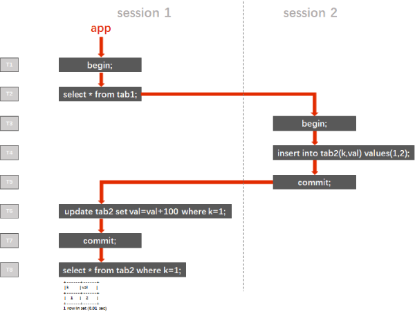

## 1. Introduction: target audiences and why this blog exists

Target audience: Database architects, database administrators, infrastructure engineers, or application developers.

As an open source distributed database, in most cases, TiDB can serve as a scale-out MySQL database without manual sharding. However, because of its distributed nature, there are some differences between traditional relational databases like MySQL and TiDB. For detailed information, see [TiDB Compatibility with MySQL](https://pingcap.com/docs/dev/reference/mysql-compatibility/).

This article shows you how to efficiently develop high-quality applications with TiDB. You'll get an in-depth look at several TiDB features that will save you hours of work and prevent some common coding errors. You'll also learn important best practices from the many TiDB users that have come before you.

This article is also useful if you're migrating your current applications to TiDB.

## 2. Transaction in TiDB and what it means to you

This section is an in-depth look at transaction-related issues in TiDB and provides solutions to prevent or resolve them.

### 2.1 Snapshot isolation in TiDB: Jepsen tested! And a few caveats

TiDB supports snapshot isolation (SI) as is shown in [TiDB Passes Jepsen Test for Snapshot Isolation and Single-Key Linearizability](https://pingcap.com/blog/tidb-passes-jepsen-test-for-snapshot-isolation-and-single-key-linearizability/). For more information about the TiDB transaction model and translation level, see [Transaction Model](https://pingcap.com/docs/dev/reference/transactions/transaction-model/) and [TiDB Transaction Isolation Levels](https://pingcap.com/docs/dev/reference/transactions/transaction-isolation/).

### 2.2 Solution to hot record scenarios where the same row is modified concurrently

TiDB uses the optimistic locking mechanism. This means that TiDB automatically retries the transactions that meet conflicts when being committed and backs off when TiDB handles concurrent transactions. However, if you specify the `SELECT FOR UPDATE` statement or disable the `tidb_disable_txn_auto_retry` variable, this backoff mechanism becomes invalid, and the transactions committed later are rolled back.

`SELECT FOR UPDATE` is applied in hot record scenarios including the following:

- Counter, in which the value of a field is continuously increased by 1.
- Seckilling, in which newly-advertised goods quickly sell out.
- Account balancing in some financial scenarios with "hot Region", in which the same row of data is modified concurrently.

Generally, traditional standalone DBMSs use pessimistic locking to implement `SELECT FOR UPDATE`. After a transaction starts, they check locks. If the lock required by the transaction and the current lock on the data are incompatible, a lock wait occurs, and the transaction can be executed after the current lock is released. TiDB executes `SELECT FOR UPDATE` just like setting the lock wait time to 0 in a pessimistic locking system, and a transaction encountering lock conflicts fails to commit.

To sum up, TiDB doesn't apply to scenarios where the same row of data is modified concurrently. Using `SELECT FOR UPDATE` in a transaction can guarantee data consistency, but only the transaction committed earliest among the concurrently-executed transactions can be executed successfully. TiDB rolls back the remaining requests.

The best practice to handle a hot record scenario is to transfer and implement the counter feature in the cache (like Redis and Codis).

In a database with pessimistic locking applied, the concurrent `SELECT FOR UPDATE` transactions queue up and are executed serially. Therefore, the performance is not good. However, handling the counter with the cache improves performance.

### 2.3 "Nested transaction"

#### 2.3.1 Nested transactions in most RDBMS products

According to the [ACID](https://en.wikipedia.org/wiki/ACID) (Atomicity, Consistency, Isolation, Durability) theory, concurrent transactions should be isolated from each other to avoid mutual interference. This means that transactions cannot be "nested."

At the read committed (RC) isolation level, if multiple reads exist in the same transaction, the data is read each time the data is committed. When multiple transactions execute concurrently, multiple read results in a transaction may be very different. These are called "non-repeatable reads."

Most RDBMS products use RC as the default isolation level. However, sometimes database application developers don't pay attention to the isolation level setting. They even treat non-repeatable reads as a feature, and develop applications based on "nested transactions."

#### 2.3.2 Nested transaction model does not apply to TiDB

This section gives an example to explain why the nested transaction model does not apply to TiDB.

**2.3.2.1 Example for a set of nested transactions**

The following diagram shows the implementation logic for a set of nested transactions. At the top, session 1 and session 2 are two sessions initiated by the application. Down the left side, T1- T8 constitute a timeline. The logic is as follows:

1. The application opens session 1 at T1, and then performs a query. (Note that in the MySQL protocol, the first statement that follows `begin` and accesses the table data is the start of a transaction.)

2. From T3 to T5, the application opens session 2, writes a row of data, and then commits the data.

3. The application continues to manipulate session 1.

    1. At T6, it tries to update the data just written.
    2. At T7, it commits the transaction opened at T2.
    3. At T8, session 1 executes a query statement to check the `val` value of the corresponding row for `k=1` that is written by session 2 at T4.



At the RC isolation level, the returned result for the query at T8 is `102`, which seems to meet the feature requirement for a nested transaction. But this process does not conform to reality. The diagram above only uses a single thread to simulate a nested transaction. But in the concurrent requests in practical application scenarios, multiple transactions are alternately executed and committed in the timeline. In this case, we can't predict the execution result of the nested transactions.

At the snapshot isolation (SI) or repeatable read (RR) isolation levels, the returned result of any reads before being committed or rolled back corresponds to the consistency status when the transaction starts. The data accessible to the transaction in session 1 at T2 is determined. This is just like taking a snapshot of the database at T2. Even though session 2 is open from T3 to T5, and some data is written in and committed, this does not affect the data read by session 1 at T6. At T6, the row with `k=1` has not been read, so Row 0 is updated. At T8, the returned value for the query is 2. At the SI or RR isolation levels, the degree of isolation is higher, and for concurrent requests, the results are predictable.

**2.3.2.2 Solution to the example**

For these cases of nested transactions, if you only require that session 1 update the table after session 2 writes data into the table, you only need to control the application logic by adding a commit step after querying the statement at T2. This commits the query transaction in a timely manner. We then perform the rest of the steps on the timeline after T2.

### 2.4 No support for the `PROPAGATION_NESTED` in the Java Spring Framework (relying on the savepoint mechanism)

The Java Spring Framework supports`PROPAGATION_NESTED` propagation, and it starts a nested transaction, which is a subtransaction started independently of the existing transaction. When a nested transaction starts, the database records a savepoint. If the nested transaction fails to be executed, the database rolls back the transaction to the savepoint status. The nested transaction is part of the outer transaction, and it is committed with the outer transaction. The following commands show a savepoint mechanism:

```
mysql> BEGIN;
mysql> INSERT INTO T2 VALUES(100);
mysql> SAVEPOINT svp1;
mysql> INSERT INTO T2 VALUES(200);
mysql> ROLLBACK TO SAVEPOINT svp1;
mysql> RELEASE SAVEPOINT svp1;
mysql> COMMIT;
mysql> SELECT * FROM T2;
+------+
|  ID   |
+------+
|  100 |
+------+
```

TiDB does not support the savepoint mechanism, and therefore it does not support the `PROPAGATION_NESTED` propagation behavior. If a `PROPAGATION_NESTED` propagation behavior is applied to an application based on the Java Spring Framework, you need to adjust the client by removing the nested transaction logic.

### 2.5 Large transactions

TiKV, the storage engine of TiDB is based on RocksDB which adopts the log-structured merge-tree (LSM-tree). For large transactions in a log-based database, you must manually set the available log capacity to a larger value to prevent a single transaction from filling the log.

TiDB sets a hard limit for the number of transactions. Due to the two-phase commit in TiDB, modifying data in large transactions might cause some problems. Therefore, to reduce this impact, TiDB sets a limit for the transaction size.

TiKV stores data in key-value pairs, and the transaction limit is based on the size and number of these pairs. One row of data a table in TiDB (or in the concept of other traditional relational databases) is mapped into a key-value pair, and so is an index. When a table has only two indexes, three key-value pairs are written to the database each time a row of data is inserted. Based on these assumptions, the transaction limit is as follows:

- The number of SQL statements in a transaction does not exceed 5,000. This is the default, but you can configure it.
- The size of each key-value pair does not exceed 6 MB.
- The total size of key-value pairs does not exceed 100 MB.
- The total number of key-value pairs does not exceed 300,000.

To stay within these limits, you must reduce the number of transactions on certain operations. These include transactions with `Create`, `Delete`, and `Update` operations on large amounts of data. The best practice is to rewrite large transactions as paged SQL statements and to commit these statements in phases. TiDB uses `Order by` along with the offset of `limit` to implement the paging feature. For example:

```
update tab set value='new_value' where id in (select id from tab order by id limit 0,10000);
commit;
update tab set value='new_value' where id in (select id from tab order by id limit 10000,10000);
commit;
update tab set value='new_value' where id in (select id from tab order by id limit 20000,10000);
commit;
...
```

## 3. Auto-increment IDs in TiDB: monotonically increasing but not necessarily increasing sequentially

This section introduces allocating principles for auto-increment IDs in TiDB, the best practice for designing auto-increment IDs, and how to use auto-increment IDs in TiDB.

### 3.1 Allocating principles for auto-increment IDs in TiDB

TiDB's auto-increment ID feature is only guaranteed to be automatically monotonic(incremental and unique), but it is not guaranteed to be allocated sequentially. Currently, TiDB allocates IDs in batches. If data is inserted into multiple TiDB servers simultaneously, the allocated IDs are not sequential. When multiple threads concurrently insert data into multiple tidb-server instances, the data inserted later may have a smaller auto-increment ID. TiDB lets you specify `AUTO_INCREMENT` for the integer field, but allows only one `AUTO_INCREMENT` field in a single table.

### 3.2 Best practice for auto-increment ID design

Generally, the purpose for setting auto-increment IDs is to use them as the unique restriction for data in a table. Thus, auto-increment IDs are designed as the primary key or unique index, and the property of these columns should be `not null`.

The type for auto-increment ID columns should be integer. Among multiple integer types, it is recommended to use `bigint`. The reason is that auto-increment IDs of the `int` type are usually used up even in a standalone database. TiDB handles much more data than a standalone database, and it allocates auto-increment IDs in a multi-threading framework. As a result, the `int` type can't meet the demand. Generally, auto-increment IDs don't store negative numbers, and adding the "unsigned" property for a column can double the ID storage capacity. The range for unsigned `int`s is from 0 to 4294967295, while the range for unsigned `bigint`s is from 0 to 18446744073709551615.

In conclusion, the best practice for auto-increment ID design is:

```
`auto_inc_id` bigint unsigned not null primary key auto_increment comment 'auto-increment ID'
```

### 3.3 How to auto-increment IDs in TiDB

As mentioned previously, auto-increment IDs are mostly designed as primary keys or unique indexes. You shouldn't manually assign values for auto-increment IDs. This may cause frequent update requests for maximum values of many global auto-increment IDs, thereby affecting write performance.

While writing data, you don't have to specify the auto-increment ID column in TiDB. TiDB automatically assigns values for it. Of course, you can specify an incremental ID column for writing. Just set the value to write as `NULL`, and TiDB automatically assigns values for it.

<div class="trackable-btns">
    <a href="/download" onclick="trackViews('Best Practices for Developing Applications with TiDB', 'download-tidb-btn-middle')"><button>Download TiDB</button></a>
    <a href="https://share.hsforms.com/1e2W03wLJQQKPd1d9rCbj_Q2npzm" onclick="trackViews('Best Practices for Developing Applications with TiDB', 'subscribe-blog-btn-middle')"><button>Subscribe to Blog</button></a>
</div>

```
mysql> create table autoid(`auto_inc_id` bigint unsigned not null primary key auto_increment comment 'auto-increment ID', b int);
Query OK, 0 rows affected (0.25 sec)

mysql> insert into autoid(b) values(100);
Query OK, 1 row affected (0.19 sec)

mysql> insert into autoid(b) values(200);
Query OK, 1 row affected (0.03 sec)

mysql> insert into autoid(b) values(300);
Query OK, 1 row affected (0.06 sec)

mysql> insert into autoid values(null,1000);
Query OK, 1 row affected (0.04 sec)

mysql> insert into autoid values(null,2000);
Query OK, 1 row affected (0.03 sec)

mysql> insert into autoid values(null,3000);
Query OK, 1 row affected (0.03 sec)

mysql> select * from autoid;
+-------------+------+
| auto_inc_id | b    |
+-------------+------+
|           1 |  100 |
|           2 |  200 |
|           3 |  300 |
|           4 | 1000 |
|           5 | 2000 |
|           6 | 3000 |
+-------------+------+
6 rows in set (0.01 sec)
```

## 4. Constraints in TiDB

This section describes constraints used in TiDB and digs deep into a constraint check issue in TiDB.

### 4.1 Primary key and unique index

TiDB uses primary keys and unique indexes as UNIQUE constraints for table data. This approach is similar to other database management systems. However, be aware of the following differences:

- In TiDB, when you create a table, you must state the primary key. As of the current version (V2.1.0 and earlier), after you create a table, you can't add, modify, or delete the primary key. This constraint doesn't affect unique indexes.
- The `Drop Column` operation doesn't let you delete primary key columns.

### 4.2 Foreign keys, not supported by TiDB, but shown in `information_schema`

TiDB doesn't support foreign keys. However as a reference, the parser imports them and shows the relations in the `information_schema`. You can only perform cascade operations on multiple tables with foreign keys within an application.

### 4.3 By default, `INSERT` only performs UNIQUE constraint check upon committing

TiDB adopts an optimistic transaction model. During the commit phase, TiDB tries to land all write operations into the storage engine, which makes a heavier commit load compared to other databases that use pessimistic transaction models.

The following DML statements involve read operations on table data:

- `UPDATE`
- `DELETE`
- `MERGE/UPSERT` (not supported by TiDB)
- `INSERT` (`INSERT IGNORE`, `INSERT ON DUPLICATE KEY UPDATE`, `INSERT IGNORE ON DUPLICATE KEY UPDATE`)

When the table contains a primary key or a unique index, SQL semantics imply a UNIQUE constraint check of the table. This requires the verification to be performed once the DML statements above read the data. TiDB implements this requirement.

In DML, only `INSERT` statements are pure write operations. There are exceptions, however. The following special `INSERT` statements aren't pure writes:

- `INSERT IGNORE`
- `INSERT ON DUPLICATE KEY UPDATE`
- `INSERT IGNORE ON DUPLICATE KEY UPDATE`

A primary key or a unique index on the table implies the SQL semantics in the INSERT statement to read the corresponding record in the table. If nothing is returned for the read. This line of the record is available for the write; if any data is returned, it means this line doesn't satisfy the UNIQUE constraint of the table.

To improve execution efficiency, TiDB doesn't compare the records in the table when it executes `INSERT` statements. Instead, it verifies that records are unique when it commits the transaction. This approach saves some read operations. The performance advantages are especially prominent when there are many records involved in the `INSERT` statement, such as a batch insert.

However, this implementation is not flawless. When there are too many write records in a single transaction, if there is any conflict of primary key or unique index between the data for write and existing data in the table, TiDB waits until the commit to report the error and rolls back the whole transaction. In the meantime, some applications may capture the information returned by the `INSERT` statement. Based on the captured information, TiDB determines subsequent execution logics for the application. By default, TiDB does not return errors for duplicate primary keys or unique indexes during the execution of the `INSERT` statement. This type of information is only returned upon `COMMIT`.

To conclude, TiDB by default doesn't behave as shown in the screenshot below. The first error occurs because the transaction contains two records with the same primary key, which indicates that TiDB performs uniqueness verification on all records involved in the transaction. The second error happens when the transaction is committed, which indicates that TiDB by default only compares the `INSERT` records involved in the transaction with the records in the table when it commits the transaction.

```
mysql> create table t1 (a int key);
Query OK, 0 rows affected (0.23 sec)

mysql> insert into t1 values(1);
Query OK, 1 row affected (0.15 sec)

mysql> begin;
Query OK, 0 rows affected (0.00 sec)

mysql> insert into t1 values(1);
Query OK, 1 row affected (0.00 sec)

mysql> insert into t1 values(1);
ERROR 1062 (23000): Duplicate entry '1' for key 'PRIMARY'
mysql> commit;
ERROR 1062 (23000): Duplicate entry '1' for key 'PRIMARY'
```

TiDB provides a switch – `tidb_constraint_check_in_place` – to control this behavior. The default value, `0`, means that uniqueness verification is only performed when the transaction is committed instead of while an `INSERT` statement is executed. If you're sure about uniqueness verification during the `INSERT` execution, you can set this variable to `1`. It's recommended that you set it at the session level for every application so that the write performance of batch insert operations won't be affected, as shown below:

```
set @@session.tidb_constraint_check_in_place=1;
```

So far, we have only noticed that Oracle GoldenGate (OGG) users need to set this system variable, because OGG does the constraint check in place. For OGG users, update the Java Database Connectivity (JDBC) connection string as shown below:

```
jdbc:mysql://192.168.1.20:4000/dbname?tidb_constraint_check_in_place=1
```

## 5. TiDB supported indexes: primary key indexes, unique indexes, and secondary indexes

This section describes how TiDB uses indexes and their current restrictions. It also describes how composite indexes are designed in TiDB.

Indexes are also data that take up storage. Like the data in a table, indexes in TiDB are also stored as key-value (KV) pairs in the storage engine. An index row is a key-value pair. If we have a table with 10 indexes, 11 KV pairs are written each time we insert a row of data.

TiDB supports primary key indexes, unique indexes, and secondary indexes. These indexes can be composed of either a single column or multiple columns (which is called a composite index).

The current version of TiDB (V2.1.0) doesn't support bi-directional indexes, full-text indexes, or global indexes for partitioned tables.

TiDB lets you use indexes when the query predicate is among the following:

```
=, >, <, >=, <=, like ‘...%', not like ‘...%', in, not in, <>, !=, is null, is not null
```

The optimizer determines whether to use indexes.

You can't use an index when the query predicate is among the following:

```
like ‘%...'，like ‘%...%'，not like ‘%...'，not like ‘%...%'，<=>
```

> **Note:**
>
> - The current version of TiDB (V2.1.0) hasn't implemented `<=>` so it can't use indexes as "is null."
> - The current version of TiDB doesn't support using two indexes simultaneously in one table for the query against the same table. The related optimizations are still under development.

### 5.1 Design of composite indexes

A composite index in TiDB is structured as `key tablekeyname (a,b,c)`. Like other databases, the ground rule for designing composite indexes is to place data with a high degree of discrimination in front as much as possible. This approach facilitates SQL execution by filtering out fewer rows within a shorter time. It's worth noting that in the current version of TiDB (V.2.1.0 or earlier), the range query for a front column in the composite index terminates the use of subsequent index columns. You can get a better idea about this feature by reviewing the following sample query:

```sql
select a,b,c from tablename where a<predicate>'<value1>' and b<predicate>'<value2>' and c<predicate>'<value3>';
```

<div class="trackable-btns">
    <a href="/download" onclick="trackViews('Best Practices for Developing Applications with TiDB', 'download-tidb-btn-middle')"><button>Download TiDB</button></a>
    <a href="https://share.hsforms.com/1e2W03wLJQQKPd1d9rCbj_Q2npzm" onclick="trackViews('Best Practices for Developing Applications with TiDB', 'subscribe-blog-btn-middle')"><button>Subscribe to Blog</button></a>
</div>

- If the predicate of condition **a** is `=`or `in`, composite index `(a,b,c)` can be used with query condition **b**, for example:

    ```sql
    select a,b,c from tablename where a=1 and b<5 and c='abc'
    ```

- If the predicate is `=` or `in` for both condition **a** and condition **b**, composite index (a,b,c)` can be used for condition **c**, for example:
  
    ```sql
    select a,b,c from tablename where a in (1,2,3) and b=5 and c='abc'
    ```

- If the predicate of condition **a** is neither `=` nor `in` , composite index `(a,b,c)` is not available for condition **b**, in which case an indexless data scan per condition **b** is performed against the filtered data of condition **a**. For example:

    ```sql
    select a,b,c from tablename where a>1 and b<5 and c='abc'
    ```

    This is because in TiDB, if the front column in the composite index is used in a range query, queries in subsequent columns proceed as indexless scans within the filtered data of the previous column.

To conclude, when you design composite indexes in TiDB, you should place columns with a high degree of discrimination in front as much as possible, and columns for frequent range queries in the back.

Also, composite index `(a,b,c)` is available for the query structured as `select c, count(*) from tablename where a=1 and b=2 group by c`, and the `where` clause complies with the above principle.

## 6. Write optimization in batch job scenarios

Write-back in batch job scenarios is a general cause of write hotspots. TiKV is a range-based key-value system, where the key determines which Region is written. The value of a key depends on the following:

- When the primary key is an integer (`int`, `bigint`…), the key is the primary key.
- When TiDB creates a hidden column (`_tidb_rowid`) for the table, the key is the hidden column.

### 6.1 Use `SHARD_ROW_ID_BITS` to scatter the write hotspot

You can use `SHARD_ROW_ID_BITS` to set the number of bits of the shards in the hidden column.

For the tables with non-integer primary keys or without primary keys, TiDB uses an implicit auto-increment ROW ID. When a large number of `INSERT` operations occur, the data is written into a single Region, causing a write hotspot.

To mitigate the hotspot issue, you can configure `SHARD_ROW_ID_BITS`. The ROW ID is scattered, and the data is written into multiple different Regions. However, setting an overly large value might lead to an excessively large number of remote procedure call (RPC) requests, which increase the CPU and network overheads.

- `SHARD_ROW_ID_BITS = 4` indicates 16 shards
- `SHARD_ROW_ID_BITS = 6` indicates 64 shards
- `SHARD_ROW_ID_BITS = 0` indicates the default, 1 shard
- `CREATE TABLE` sample statement: `CREATE TABLE t (c int) SHARD_ROW_ID_BITS = 4`
- `ALTER TABLE` sample statement: `ALTER TABLE t SHARD_ROW_ID_BITS = 4`

### 6.2 Partitioned table

You can use a partitioned table to scatter the data from one table into multiple physical tables. With properly-designed partition rules, you can use the partitioned table to further avoid write hotspot issues.

## 7. Some notes on SQL syntax

This section describes some SQL syntax best practices in TiDB.

### 7.1 `create table as select` is not supported

The current version of TiDB does not support the `create table as select …` statement. To achieve the same result, you must modify two statements in combination: `create table like …`and `insert into select …`. `create table like…` supports replicating the schema of the corresponding table.

### 7.2 Use full `GROUP BY`to guarantee stable result sets

For convenience, if you disable `ONLY_FULL_GROUP_BY`, MySQL lets the `SELECT` substatement reference the nonaggregated fields that are not stated in the `GROUP BY` substatements. This makes a non-full `GROUP BY` syntax. In other databases, this is deemed a syntax error that may cause unstable result sets.

In the following three SQL statements, the first one uses the full `GROUP BY` syntax, with all the fields referenced in the `SELECT` substatement stated in the `GROUP BY` substaments. It has the most stable result sets with three combinations of `class` and `stuname` fields.

The second and third SQL statements are identical, but they yield different results. The statement only states a `class` field in the `GROUP BY` statement, so the result sets are only aggregated for `class`. Since there are two unique values for `class`, the result sets only contains two rows of data, while there are three combinations of `class` and `stuname` fields. Class 2018_CS_03 has two students, and there is no semantic restriction as to which one is returned for each execution. Either one is semantically expected.

```
mysql> select a.class, a.stuname, max(b.courscore) from stu_info a join stu_score b on a.stuno=b.stuno group by a.class, a.stuname order by a.class, a.stuname;
+------------+--------------+------------------+
| class      | stuname      | max(b.courscore) |
+------------+--------------+------------------+
| 2018_CS_01 | MonkeyDLuffy |             95.5 |
| 2018_CS_03 | PatrickStar  |             99.0 |
| 2018_CS_03 | SpongeBob    |             95.0 |
+------------+--------------+------------------+
3 rows in set (0.00 sec)

mysql> select a.class, a.stuname, max(b.courscore) from stu_info a join stu_score b on a.stuno=b.stuno group by a.class order by a.class, a.stuname;
+------------+--------------+------------------+
| class      | stuname      | max(b.courscore) |
+------------+--------------+------------------+
| 2018_CS_01 | MonkeyDLuffy |             95.5 |
| 2018_CS_03 | SpongeBob    |             99.0 |
+------------+--------------+------------------+
2 rows in set (0.01 sec)

mysql> select a.class, a.stuname, max(b.courscore) from stu_info a join stu_score b on a.stuno=b.stuno group by a.class order by a.class, a.stuname;
+------------+--------------+------------------+
| class      | stuname      | max(b.courscore) |
+------------+--------------+------------------+
| 2018_CS_01 | MonkeyDLuffy |             95.5 |
| 2018_CS_03 | PatrickStar  |             99.0 |
+------------+--------------+------------------+
2 rows in set (0.01 sec)
```

Therefore, to guarantee stable result sets, use the full `GROUP BY` syntax.

MySQL provides a `ONLY_FULL_GROUP_BY` SQL mode to control whether to check the full `GROUP BY` syntax, which is also supported in TiDB.

```
mysql> select a.class, a.stuname, max(b.courscore) from stu_info a join stu_score b on a.stuno=b.stuno group by a.class order by a.class, a.stuname;
+------------+--------------+------------------+
| class      | stuname      | max(b.courscore) |
+------------+--------------+------------------+
| 2018_CS_01 | MonkeyDLuffy |             95.5 |
| 2018_CS_03 | PatrickStar  |             99.0 |
+------------+--------------+------------------+
2 rows in set (0.01 sec)

mysql> set @@sql_mode='STRICT_TRANS_TABLES,NO_ENGINE_SUBSTITUTION,ONLY_FULL_GROUP_BY';
Query OK, 0 rows affected (0.01 sec)

mysql> select a.class, a.stuname, max(b.courscore) from stu_info a join stu_score b on a.stuno=b.stuno group by a.class order by a.class, a.stuname;
ERROR 1055 (42000): Expression #2 of ORDER BY is not in GROUP BY clause and contains nonaggregated column '' which is not functionally dependent on columns in GROUP BY clause; this is incompatible with sql_mode=only_full_group_by
```

### 7.3 Use `ORDER BY` to guarantee the output sequence of result sets

According to SQL semantics, you must use the `ORDER BY` syntax to output result sets in a specified sequence. For standalone databases, because the data are all stored on one server, results are stably returned when data is not reorganized. Some databases can still output result sets in the order of primary keys or indexes. TiDB is a distributed database where data is stored in multiple servers, and the TiDB server layer does not cache data. Therefore, the display order of the result sets for SQL statements without `ORDER BY` may be unpredictable. To output the result sets in sequence, explicitly add the fields for sorting in the `ORDER BY` clause, as defined by SQL semantics.

In the following example, the user only adds one field in the `ORDER BY` clause. Therefore, TiDB sorts the results by this field only.

```
mysql> select a.class, a.stuname, b.course, b.courscore from stu_info a join stu_score b on a.stuno=b.stuno order by a.class;
+------------+--------------+-------------------------+-----------+
| class      | stuname      | course                  | courscore |
+------------+--------------+-------------------------+-----------+
| 2018_CS_01 | MonkeyDLuffy | PrinciplesofDatabase    |      60.5 |
| 2018_CS_01 | MonkeyDLuffy | English                 |      43.0 |
| 2018_CS_01 | MonkeyDLuffy | OpSwimming              |      67.0 |
| 2018_CS_01 | MonkeyDLuffy | OpFencing               |      76.0 |
| 2018_CS_01 | MonkeyDLuffy | FundamentalsofCompiling |      88.0 |
| 2018_CS_01 | MonkeyDLuffy | OperatingSystem         |      90.5 |
| 2018_CS_01 | MonkeyDLuffy | PrincipleofStatistics   |      69.0 |
| 2018_CS_01 | MonkeyDLuffy | ProbabilityTheory       |      76.0 |
| 2018_CS_01 | MonkeyDLuffy | Physics                 |      63.5 |
| 2018_CS_01 | MonkeyDLuffy | AdvancedMathematics     |      95.5 |
| 2018_CS_01 | MonkeyDLuffy | LinearAlgebra           |      92.5 |
| 2018_CS_01 | MonkeyDLuffy | DiscreteMathematics     |      89.0 |
| 2018_CS_03 | SpongeBob    | PrinciplesofDatabase    |      88.0 |
| 2018_CS_03 | SpongeBob    | English                 |      79.0 |
| 2018_CS_03 | SpongeBob    | OpBasketball            |      92.0 |
| 2018_CS_03 | SpongeBob    | OpTennis                |      94.0 |
| 2018_CS_03 | PatrickStar  | LinearAlgebra           |       6.5 |
| 2018_CS_03 | PatrickStar  | AdvancedMathematics     |       5.0 |
| 2018_CS_03 | SpongeBob    | DiscreteMathematics     |      72.0 |
| 2018_CS_03 | PatrickStar  | ProbabilityTheory       |      12.0 |
| 2018_CS_03 | PatrickStar  | PrincipleofStatistics   |      20.0 |
| 2018_CS_03 | PatrickStar  | OperatingSystem         |      36.0 |
| 2018_CS_03 | PatrickStar  | FundamentalsofCompiling |       2.0 |
| 2018_CS_03 | PatrickStar  | DiscreteMathematics     |      14.0 |
| 2018_CS_03 | PatrickStar  | PrinciplesofDatabase    |       9.0 |
| 2018_CS_03 | PatrickStar  | English                 |      60.0 |
| 2018_CS_03 | PatrickStar  | OpTableTennis           |      12.0 |
| 2018_CS_03 | PatrickStar  | OpPiano                 |      99.0 |
| 2018_CS_03 | SpongeBob    | FundamentalsofCompiling |      43.0 |
| 2018_CS_03 | SpongeBob    | OperatingSystem         |      95.0 |
| 2018_CS_03 | SpongeBob    | PrincipleofStatistics   |      90.0 |
| 2018_CS_03 | SpongeBob    | ProbabilityTheory       |      87.0 |
| 2018_CS_03 | SpongeBob    | Physics                 |      65.0 |
| 2018_CS_03 | SpongeBob    | AdvancedMathematics     |      55.0 |
| 2018_CS_03 | SpongeBob    | LinearAlgebra           |      60.5 |
| 2018_CS_03 | PatrickStar  | Physics                 |       6.0 |
+------------+--------------+-------------------------+-----------+
36 rows in set (0.01 sec)
```
