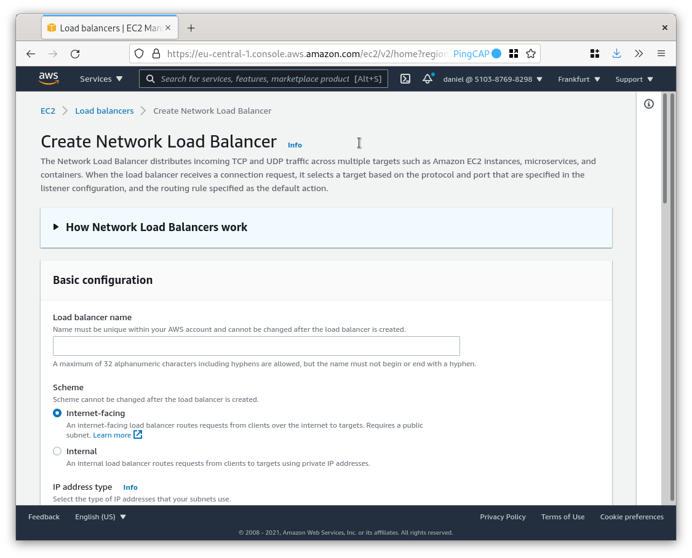

**Author:** Daniël van Eeden (Technical Support Engineer at PingCAP)

**Editors:** [Ran Huang](https://github.com/ran-huang), Tom Dewan


Load balancing distributes connections from applications to TiDB Server instances. This helps to distribute the load over multiple machines and, depending on the load balancing option, can automatically reroute connections if a TiDB instance becomes unavailable.

## Load balancing types

There are many different ways to implement a load balancer. This section describes the most common types.

<table>
  <tr>
   <td><strong>Load balancer type</strong>
   </td>
   <td><strong>Usage scenarios</strong>
   </td>
   <td><strong>Benefits</strong>
   </td>
   <td><strong>Drawbacks</strong>
   </td>
  </tr>
  <tr>
   <td>Connector-based, such as MySQL Connector/J and MySQL Connector/C++
   </td>
   <td>Load balancing a specific application
   </td>
   <td>No need for extra components
   </td>
   <td>Connector-specific implementation and behavior
   </td>
  </tr>
  <tr>
   <td>DNS (Round-robin or SRV)
   </td>
   <td>Simple load balancing that doesn't require application changes
   </td>
   <td>Reuses existing components and methods
   </td>
   <td>Doesn't automatically remove failed nodes from service
   </td>
  </tr>
  <tr>
   <td>Kubernetes load balancer (e.g., metallb or Amazon Elastic Load Balancing)
   </td>
   <td>Load balancing in the cloud
   </td>
   <td>Well-integrated with Kubernetes
   </td>
   <td>Requires Kubernetes
   </td>
  </tr>
  <tr>
   <td>Software-based load balancer
   </td>
   <td>A daemon that implements load balancing
   </td>
   <td>Flexible
   </td>
   <td>Often service-specific
   </td>
  </tr>
  <tr>
   <td>Hardware-based load balancer (e.g., F5)
   </td>
   <td>A hardware load balancer
   </td>
   <td>Can use hardware acceleration
   </td>
   <td>Expensive
   </td>
  </tr>
</table>

The first type of load balancing that is available is **connector-based load balancing**. Many of the MySQL connectors like MySQL Connector/J and MySQL Connector/C++. The benefits of this approach are that there is no extra network hop, and the application has more information about which server it is connected to. The drawbacks are that there is no central administration, and, when you change the configuration, you have to change it on all your application hosts. Depending on the programming language you use, the load balancing might not be available or not offer more advanced options. Connector-based load balancing can work with most third-party applications because it is often configured in the connection string—for example, Java Database Connectivity (JDBC) URL.

You could also use **DNS round-robin**. However, this is not advisable because it doesn't prevent connections from going to an unavailable machine. This means that if not all servers are available, your application might have to retry connections more often. Some of the newer MySQL connectors support [DNS SRV](https://dev.mysql.com/doc/refman/8.0/en/connecting-using-dns-srv.html). This is somewhat similar to round-robin DNS but allows you to set priorities. The benefit of DNS SRV is that it is an industry standard, and this makes the client-side configuration easier.

If you are using Kubernetes, you probably want to use the [LoadBalancer](https://docs.pingcap.com/tidb-in-kubernetes/stable/access-tidb#loadbalancer) service type that works with Amazon ELB and similar services from other cloud vendors. For on-premise Kubernetes, you can use something like [metallb](https://metallb.universe.tf/).

Even if you're not using Kubernetes to deploy on a cloud service, you can still use the load balancing service from your cloud provider.

Another common option is to use a **software-based** load balancer, such as ProxySQL, HAProxy, or MySQL Router.

The last type of load balancing uses **hardware-based** load balancers. These are physical machines where you plug in a network cable. These are often costly but also offer high throughput.

## General load balancing requirements for TiDB

The requirements that TiDB puts on load balancers are in some ways different from what a typical MySQL setup requires.

Where load balancers might offer advanced features like read/write splitting for MySQL, TiDB doesn't need this. The load balancer does not have to inspect the MySQL protocol. A TCP-level load balancer works fine for TiDB.

The load balancer only needs access to the TiDB servers (by default on TCP port 4000) and doesn't need access to Placement Driver (PD) or TiKV servers. When you use the [status API](https://docs.pingcap.com/tidb/stable/tidb-monitoring-api#use-the-state-interface) (TCP port 10080 by default), access to this port is also required.

We recommend that you use `http://<ip_of_tidb>:10080/status` as the health check because it supports the _graceful shutdown_ feature. This feature allows you to drain client connections before you shut down a TiDB Server, and it reduces the impact on applications. To benefit from this feature, you must set the [`graceful-wait-before-shutdown` variable](https://docs.pingcap.com/tidb/stable/tidb-configuration-file#graceful-wait-before-shutdown-new-in-v50) to a non-zero value.

You should avoid health checks that check for `read_only` or other MySQL or InnoDB-specific variables. These variables are often implemented as "noop" on TiDB.

## Where to put your load balancer

For software-based load balancers, you can put your load balancer on the same host as your application or on separate hosts. Both have their benefits.

Installing the load balancer on the same host as a _sidecar_ to your application is good for performance because it doesn't need an extra network hop. However, you'll have to administer many instances of your load balancing software which makes this slightly more complicated.

Installing the load balancer on separate hosts typically increases latency because you need an extra network hop. Depending on your network, there is also a risk that connectivity to and from the load balancer could become saturated. However, compared to the sidecar approach, this method is less complicated to administer.

When you're deciding between these options, high availability is also an important consideration. With the first setup, an unavailable load balancer only impacts a single application host. With the second solution, you probably have to take some steps to make your load balancer software highly available, which complicates the configuration.

## Testing load balancing

Before you deploy load balancing in production, you should first test the configuration to make sure everything works as expected. You should also test bigger configuration changes, upgrades, and other maintenance tasks before you do these on a production setup.

You can perform local testing with `tiup playground --db 2`. This gives you two TiDB instances, which allow you to see how connections switch from one to the other while testing.

When you connect via a load balancer, you might want to use this query to check on which instance you landed:

```sql
SELECT @@hostname, @@port
```

When you use `mysql -h localhost...`, `mysql` will try to connect over a UNIX socket even if a TCP port is provided. Depending on your configuration, this might not work. Instead, use `mysql -h 127.0.0.1...` to ensure the connection uses TCP.

<div class="trackable-btns">
    <a href="/download" onclick="trackViews('Best Practices for TiDB Load Balancing', 'download-tidb-btn-middle')"><button>Get TiDB Now</button></a>
    <a href="/contact-us" onclick="trackViews('Best Practices for TiDB Load Balancing', 'contact-us-middle')"><button>Request a Demo</button></a>
</div>

## Configuration examples

This section includes configuration examples for some of the most popular load balancing solutions with TiDB.

### ProxySQL

ProxySQL is an open-source, high-performance proxy for the MySQL protocol. ProxySQL knows the MySQL protocol; this brings a lot of MySQL-specific features like query caching and query rewriting.

The first step is to install ProxySQL. For more details and instructions for other platforms, see [Download and Install ProxySQL](https://proxysql.com/documentation/installing-proxysql/).

```shell
sudo dnf install proxysql
```

To configure ProxySQL, you can either use the configuration file (`/etc/proxysql.cnf`) or the admin interface. The admin interface uses the MySQL protocol and is available on port 6032. The default credentials are `'admin'/'admin'`.

```shell
mysql -h 127.0.0.1 -P 6032 -u admin -padmin --prompt 'admin> '
```

The next step is to tell ProxySQL about the TiDB servers:

```
admin> INSERT INTO mysql_servers(hostgroup_id, hostname, port) VALUES (1, '127.0.0.1', 4000);
Query OK, 1 row affected (0.00 sec)

admin> INSERT INTO mysql_servers(hostgroup_id, hostname, port) VALUES (1, '127.0.0.1', 4001);
Query OK, 1 row affected (0.00 sec)

admin> LOAD MYSQL SERVERS TO RUNTIME;
Query OK, 0 rows affected (0.00 sec)

admin> SAVE MYSQL SERVERS TO DISK;
Query OK, 0 rows affected (0.04 sec)
```

By default, ProxySQL uses an account called 'monitor' to test connectivity to backend servers. So now create this user. The username and password for this user are set in ProxySQL via the *mysql-monitor_username* and *mysql-monitor_password* variables, so you can change this if you want.

```sql
tidb> CREATE USER 'monitor'@'%' IDENTIFIED BY 'monitor';
Query OK, 0 rows affected (0.06 sec)
```

Now add a user to ProxySQL that matches the default 'root' user that is available in a `tiup playground`.

```sql
admin> INSERT INTO mysql_users(username,password,default_hostgroup) VALUES ('root','',1);
Query OK, 1 row affected (0.00 sec)

admin> LOAD MYSQL USERS TO RUNTIME;
Query OK, 0 rows affected (0.00 sec)

admin> SAVE MYSQL USERS TO DISK;
Query OK, 0 rows affected (0.04 sec)
```

Now try to connect:

```
$ mysql -h 127.0.0.1 -P 6033 -u root -p
Enter password:
Welcome to the MySQL monitor.  Commands end with ; or \g.
Your MySQL connection id is 8
Server version: 5.5.30 (ProxySQL)
Copyright (c) 2000, 2021, Oracle and/or its affiliates.
Oracle is a registered trademark of Oracle Corporation and/or its
affiliates. Other names may be trademarks of their respective
owners.
Type 'help;' or '\h' for help. Type '\c' to clear the current input statement.

mysql> select version();
+--------------------+
| version()          |
+--------------------+
| 5.7.25-TiDB-v5.0.0 |
+--------------------+
1 row in set (0.00 sec)
```

The default port for application traffic for ProxySQL is 6033 (3306 in reverse!).

If you don't want to use query routing or query caching, you might want to enable fast_forward which is set in the `mysql_users` table. This reduces the amount of work the proxy has to do for each connection, which slightly lowers the latency.

### HAProxy

HAProxy is a high-performance load balancer that is mostly known for HTTP load balancing. However, you can also use it as a TCP load balancer. Besides a basic health check, it doesn't know about the MySQL Protocol.

Begin with installing HAProxy:

```shell
sudo dnf install haproxy
```

Then configure HAProxy by editing `/etc/haproxy/haproxy.cfg` and adding:

```
listen tidb
    mode tcp
    bind 127.0.0.1:3306
    balance leastconn
    option mysql-check user root
    server tidb1 127.0.0.1:4000 check
    server tidb2 127.0.0.1:4001 check
frontend stats
    bind 127.0.0.1:8080
    stats enable
    stats uri /
    stats refresh 10s
    stats admin if LOCALHOST
```

This adds a tidb-service with two backend servers. This will route connections to the server with the least amount of connections. This enables a MySQL protocol-specific check to see if backend servers are healthy.

The `stats` part is optional and enables a web interface to see statistics and manage servers.

Here `127.0.0.1` was used to bind to localhost only. If you want to allow external connections, use `bind ::3306`.

On systems with SELinux enabled, the 3306 TCP port is labeled as `mysqld_port_t`. To allow HAProxy to use this port, do the following. If SELinux is not enabled, you can skip this step.

```shell
sudo setsebool -P haproxy_connect_any 1
```

Now start HAProxy:

```shell
sudo systemctl enable haproxy --now
```

See also [Best Practices for Using HAProxy in TiDB](https://docs.pingcap.com/tidb/stable/haproxy-best-practices).

### MySQL Router

MySQL Router is an open-source load balancing solution for the MySQL protocol from the MySQL team at Oracle.

First, install MySQL Router. Follow the [instructions from the documentation](https://dev.mysql.com/doc/mysql-router/8.0/en/mysql-router-installation.html) for your platform of choice. For this example, I'm using Linux.

```shell
sudo rpm -ivh https://dev.mysql.com/get/mysql80-community-release-fc34-1.noarch.rpm
sudo dnf install mysql-router
```

Now configure the router by adding the following to `/etc/mysqlrouter/mysqlrouter.conf`:

```toml
[routing:tidb]
bind_address = 127.0.0.1:6446
routing_strategy = round-robin
protocol = classic
destinations = 127.0.0.1:4000, 127.0.0.1:4001
```

```shell
sudo systemctl enable mysqlrouter --now
```

Note: Because TiDB does not support the [X Protocol](https://github.com/pingcap/tidb/issues/1109), you need to use `protocol = classic`.

### MySQL Connector/J

MySQL Connector/J is the JDBC Driver that implements the MySQL protocol for Java and other JVM-based languages.

MySQL Connector/J supports various kinds of [Multi-Host Connections](https://dev.mysql.com/doc/connectors/en/connector-j-multi-host-connections.html). In this example, I use the `loadbalance` option. This configuration distributes the load over multiple TiDB servers. When a failover happens, it tries to use the first host from the list, resulting in an uneven distribution of the load.

Because [TiDB doesn't support the X Protocol](https://github.com/pingcap/tidb/issues/1109), you cannot use the Connector/J `X Dev API` connection type with TiDB.

This is an example with MySQL Connector/J 8.0.24:

```
package com.pingcap.tidb_demo_java;
import java.sql.Connection;
import java.sql.DriverManager;
import java.sql.SQLException;
import java.sql.Statement;
import java.sql.ResultSet;
public class App
{
    public static void main( String[] args )
    {
        try {
                Class.forName("com.mysql.cj.jdbc.Driver").newInstance();
        } catch (Exception ex) {
                System.out.println("Failed to load driver: " + ex.getMessage());
        }
        try {
                Connection conn = DriverManager.getConnection("jdbc:mysql:loadbalance://127.0.0.1:4000,127.0.0.1:4001?user=root");
                Statement stmt = conn.createStatement();
                ResultSet rs = stmt.executeQuery("SELECT @@hostname, @@port");
                rs.next();
                System.out.println(rs.getString("@@hostname") + ":" + rs.getString("@@port"));
        } catch (SQLException ex) {
                System.out.println("SQLException: " + ex.getMessage());
        }
    }
}
```

For more details about how to use TiDB with Java applications, see [Best Practices for Developing Java Applications with TiDB](https://docs.pingcap.com/tidb/stable/java-app-best-practices).

### MySQL Connector/Python

MySQL Connector/Python is the official MySQL driver for Python. There are also other commonly-used MySQL drivers for Python, but they don't support the load balancing configuration that is described here.

This example uses MySQL Connector/Python 8.0.24 (`mysql-connector-python==8.0.24` according to `pip freeze output`).

To install this connector, see [Connector/Python Installation](https://dev.mysql.com/doc/connector-python/en/connector-python-installation.html).

```python
#!/usr/bin/python3
import mysql.connector

config = {
    "failover": [
        {"host": "127.0.0.1", "port": 4000, "user": "root"},
        {"host": "127.0.0.1", "port": 4001, "user": "root"},
    ],
}

for _ in range(5):
    c = mysql.connector.connect(**config)
    cur = c.cursor()
    cur.execute("select @@hostname, @@port")
    print(cur.fetchone())
    cur.close()
    c.close()
```

This outputs:

```
('myserver1', 4001)
('myserver1', 4000)
('myserver1', 4001)
('myserver1', 4001)
('myserver1', 4000)
```

### Amazon ELB

Amazon ELB is the load balancing service for the Amazon Web Services (AWS) cloud.

You can create the load balancer manually with the AWS EC2 Dashboard (as shown below) or by using automation like CloudFormation. When you use Amazon Elastic Kubernetes Service (EKS), deploying a load balancer is part of the deployment.


<div class="caption-center">AWS EC2 Create Network Load Balancer</div>

1. Choose "Network Load Balancer" for the load balancer type. Depending on your requirements you need to select "Internet-facing" or "Internal".
2. Configure the listener to use TCP Port 3306 or 4000.
3. Create a target group with the IP addresses of your TiDB instances. Depending on the port you have configured for TiDB, choose port 3306 or 4000.

Make sure that the security group of your TiDB machines allows access from your load balancer. You should configure the load balancer security group to allow access from your applications, but restrict access from the rest of the internet.

For details, see [Getting started with Network Load Balancers](https://docs.aws.amazon.com/elasticloadbalancing/latest/network/network-load-balancer-getting-started.html).

## Advanced configuration

If your servers have a different hardware configuration (for example,  more memory and CPUs) then you might want to exclude specific servers from your load balancer pool or create a separate load balancer pool. This can be used to separate analytical or data loading tasks.

## Automation

To automate operations like adding or removing instances, you might want to use the [TiDB HTTP API](https://github.com/pingcap/tidb/blob/master/docs/tidb_http_api.md).

If you don't want to put all your servers in your load balancer pool, you can use the HTTP API and filter on the server labels.

```shell
curl -s http://127.0.0.1:10080/info/all | jq '.all_servers_info'

{
  "431ccb25-24a6-4311-b48d-613cac401b22": {
    "version": "5.7.25-TiDB-v5.0.1",
    "git_hash": "1145e347d3469d8e89f88dce86f6926ca44b3cd8",
    "ddl_id": "431ccb25-24a6-4311-b48d-613cac401b22",
    "ip": "127.0.0.1",
    "listening_port": 4000,
    "status_port": 10080,
    "lease": "45s",
    "binlog_status": "Off",
    "start_timestamp": 1620024407,
    "labels": {},
    "server_id": 0
  },
  "b830f979-c277-4e47-934e-87bb2063cf4d": {
    "version": "5.7.25-TiDB-v5.0.1",
    "git_hash": "1145e347d3469d8e89f88dce86f6926ca44b3cd8",
    "ddl_id": "b830f979-c277-4e47-934e-87bb2063cf4d",
    "ip": "127.0.0.1",
    "listening_port": 4001,
    "status_port": 10081,
    "lease": "45s",
    "binlog_status": "Off",
    "start_timestamp": 1620024407,
    "labels": {},
    "server_id": 0
  }
}
```

## Try TiDB out

To quickly get started with TiDB, refer to [our documentation](https://docs.pingcap.com/tidb/stable/quick-start-with-tidb). If you have any questions or need our community support, feel free to [join the TiDB community](https://slack.tidb.io/invite?team=tidb-community&channel=everyone&ref=pingcap-blog) on Slack. You can also [file an issue](https://github.com/pingcap/tidb) on GitHub and report any problems you meet.
