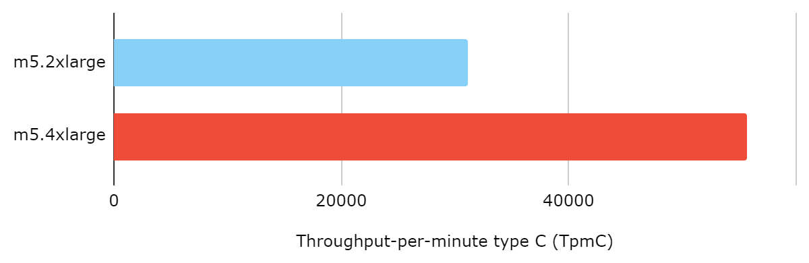
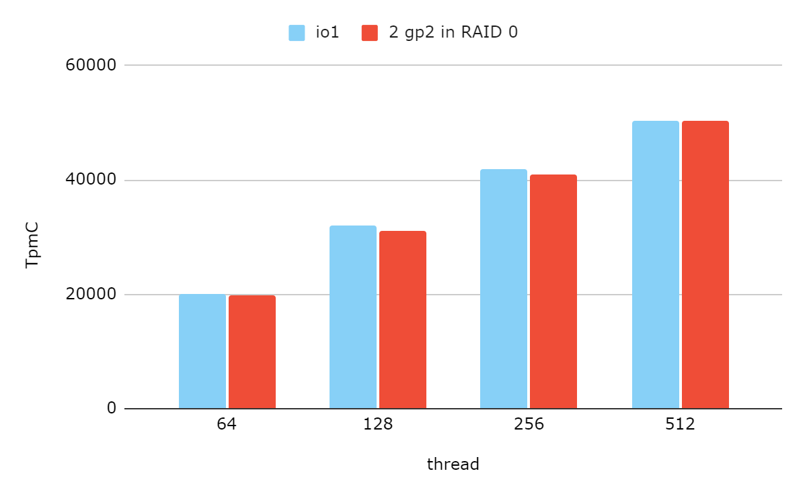
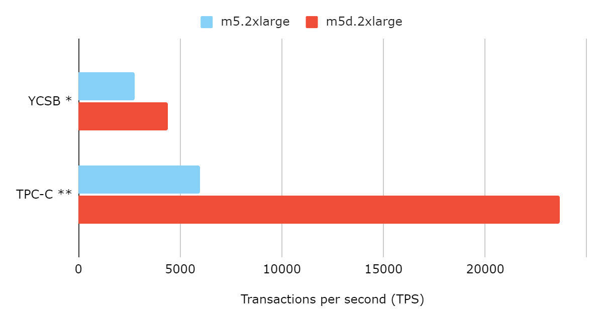
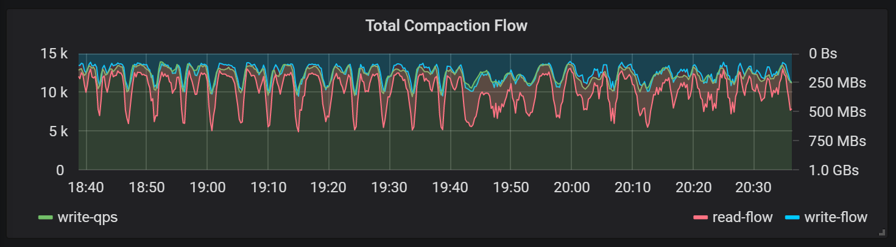
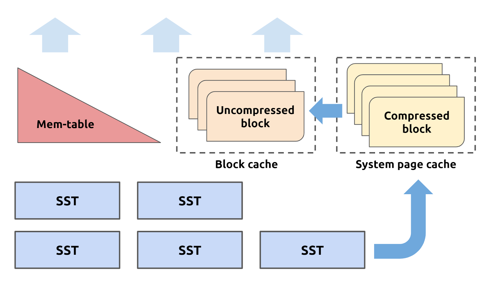

**Author:** [Xinye Tao](https://github.com/tabokie) (Cloud engineer at PingCAP)

**Transcreator:** [Ran Huang](https://github.com/ran-huang); **Editor:** Tom Dewan


Amazon Web Services (AWS) is one of the most popular providers of public cloud services. Running databases on AWS is an essential part of using its cloud services. But how can we best leverage the cloud resources and have the database run at its best performance?

This post demonstrates how we at [PingCAP](https://pingcap.com/) deploy and optimize [TiDB](https://docs.pingcap.com/tidb/stable) for production on AWS Cloud. It's our hope that recommendations provided here will also help you configure the TiDB service most suitable for your own workload.

_To evaluate the performance of different configurations, we ran [TPC-C](http://www.tpc.org/tpcc/) and Yahoo! Cloud Serving Benchmark ([YCSB](https://en.wikipedia.org/wiki/YCSB)) tests on a typical three-node cluster. TPC-C is a common benchmark standard that simulates an intensive online transaction workload, while YCSB covers most common cloud application scenarios. This article discusses the results in detail._

## Cloud storage

When an application is built on top of a persistent database like TiDB, the database eventually translates user interactions into reads and writes on disk storage. This is why this article focuses on how to better utilize AWS cloud storage as a new storage medium for TiDB.

### AWS Elastic Block Storage

In this post, we consider using AWS Elastic Block Storage (EBS) as the primary storage for the TiDB service. Unlike traditional local disks, EBS is:

* Fault-tolerant. On-cloud content is transparently replicated, offering out-of-the-box durability guarantees up to 99.999%.
* Elastic. The storage layer is decoupled from the Elastic Compute Cloud (EC2) instance, and therefore is resilient to host failure and is easy to scale.
* Cloud-friendly. EBS integrates naturally with the AWS cloud ecosystem; for example, it is easy to backup and restore through an S3 snapshot.

Even though EBS has a smaller annual failure rate (AFR) than commodity hardware, it's still not reliable enough for business-critical applications. They require cross-region availability, which is only possible with distributed databases replicated in multiple availability zones (AZ). In this regard, TiDB is a good match for EBS.

#### Define performance limits

EBS volumes are defined by their performance limits, including maximum and sustained Input/Output Operations Per Second (IOPS) and throughput. In certain cases, EBS volumes can "burst" to higher performance for short periods. In order for our product to perform predictably, our post focuses more on the _sustained_ EBS performance.

AWS Cloud takes different approaches to enforce these limits:

* The IOPS limit acts like a hard ceiling. Below the limit, I/O latency is relatively stable with respect to IOPS changes; once IOPS reaches the limit, latency experiences a dramatic penalty, often more than 10 ms.
* Compared to IOPS, the throughput limit is much softer. This means that even below the limit, I/O latency grows proportionally to I/O throughput.
* Different types of SSD-based EBS volumes share comparable access latency.

EBS connects to EC2 instances through a network interface. Therefore, for a given EC2/EBS pair, the actual disk performance is determined not only by the EBS specs, but also by the EC2's capability of dedicated bandwidth to cloud storage. The following table summarizes the performance of several instance types:

| | Baseline Bandwidth <br/>(MiB/s) | Maximum Bandwidth <br/>(MiB/s)<sup>1</sup> | Baseline IOPS | Maximum IOPS<sup>1</sup> |
|:--|--|--|--|--|
| m5.2xlarge | 287.5 | 593.75 | 12,000 | 18,750 |
| m5.4xlarge | 593.75 | 593.75 | 18,750 | 18,750 |
| m5.8xlarge | 850 | 850 | 30,000 | 30,000 |

> 1: As per AWS official document, low-power machines can only reach maximum performance for 30 minutes at least once every 24 hours.

The [Amazon EBS-optimized instances document](https://docs.aws.amazon.com/AWSEC2/latest/UserGuide/ebs-optimized.html) includes detailed specifications on the EC2-to-EBS limit. Generally, EC2's capability is proportional to its computing power. However, larger machines (like `m5.8xlarge` with 32 cores) tend to have fewer resources per core.

The following graphic showcases how EC2 bandwidth limits directly affect service performance. Two clusters are cross compared using different types of instances as node servers; namely, m5.2xlarge and m5.4xlarge. Each cluster node is equipped with a 1 TB AWS provisioned IOPS volume of 6,000 IOPS. In theory, this disk has a maximum throughput of 1,500 MiB/s for 256 KiB I/O, but the actual performance is tightly bounded by EC2 bandwidth. After we switched EC2 instances, the performance doubled with nearly the same CPU usage.


<div class="caption-center">TPC-C 5,000 warehouse on different AWS EC2 instances</div>

#### General purpose SSD (gp2)

For AWS general-purpose SSDs, the IOPS performance scales linearly to the volume size with a ratio of 3 IOPS per GB, until it reaches an upper bound of 3,000 IOPS at 1 TB. This means a gp2 volume larger than 1 TB is not an economically-optimal choice. Theoretically, gp2's bandwidth limit is always 250 MiB/s. However, because internally [EBS splits user requests into 256 KiB chunks](https://aws.amazon.com/premiumsupport/knowledge-center/ebs-calculate-optimal-io-size/), only volumes larger than 334 GB have enough IOPS quota to deliver that amount of throughput.

Notably, gp2 is one of the credit-based burstable instances. Based on the number of credits you have, gb2 can burst from baseline to maximum performance for short periods. This feature could be tempting for users with a highly dynamic workload profile that only demands high performance for a limited time. But for our target user base, **we suggest setting a gp2 volume size greater than 1 TB to avoid unpredictable performance caused by bursting**.

#### Provisioned IOPS SSD (io1/io2)

Compared to gp2, provisioned IOPS SSDs further raise the maximum throughput and IOPS capacity. You can provision IOPS up to 64,000 and throughput up to 1,000 MiB/s. In addition to high performance, the new generation io2 offers 99.999% durability.

For baseline performance, we suggest configuring your io1/io2 volume to 6,000 IOPS per TB. Thanks to the elasticity of cloud storage, you can [dynamically modify](https://docs.aws.amazon.com/AWSEC2/latest/UserGuide/requesting-ebs-volume-modifications.html) your EBS volume performance. This means you can scale the storage performance of individual nodes up or down by different amounts depending on your application's pressure on the storage layer. You can monitor the I/O load of running instances using our Grafana panel or AWS's CloudWatch.

In general, **a provisioned IOPS SSD volume is a perfect fit for large-scale, data-intensive applications that require the best storage performance available on cloud**. To best leverage this storage power, users considering this option should take extra caution in choosing a properly sized EC2 instance.

### Disk striping

One EBS volume has limited performance, but **you can stripe several volumes together as a RAID 0 array to multiply storage power**. According to our benchmark, the performance of a RAID 0 array with two 1 TB gp2 volumes is comparable to io1 provisioned with 6 K IOPS, but with only 40% of the cost.


<div class="caption-center">TPC-C 5,000 warehouse on striped AWS gp2</div>

However, a RAID 0 configuration lacks data redundancy. Therefore, a RAID array's service guarantee is slightly weaker than that of a single volume. For instance, striping two gp2 volumes of 99.8% durability produces an array of 99.6% durability.

Also, resizing a RAID 0 array involves service downtime. So for users adopting disk striping, we suggest you plan the volume size of each storage node before deploying it.

### Recommended storage node configurations

So far, we have discussed the key elements of storage performance on AWS cloud. An application's workload determines the actual performance requirements. More specifically, queries like batch insert or table scan put significant pressure on storage bandwidth, while transactional processing or random reads rely more on storage IOPS resources.

The table below is a list of storage node configurations that we consider cost effective for most common workloads. Think of these configurations as general recommendations or building blocks on which you can create your own custom configurations. Besides this list, users can select from a large range of options provided by AWS, based on the principles proposed here.

| | CPU Core | Capacity (GB) | IOPS<sup>1</sup> | Throughput (MiB/s)<sup>1</sup> | Approximate monthly cost ($)<sup>2</sup> |
|:--|--|--|--|--|--|
| m5.2xlarge + gp2 | 8 | 1,000 | 3,000 | 250 | 376 |
| m5.4xlarge + 2 gp2 in RAID 0 | 16 | 2,000 | 6,000 | 500 | 753 |
| m5.4xlarge + io1 | 16 | 1,000 | 6,000+ | 593.75 | 1,068+ |
| m5.8xlarge + io1 | 32 | 2,000 | 10,000+ | 850 | 2,006+ |

> * 1: Sustained performance
> * 2: The on-demand cost of a single node for deploying TiKV service

## Advanced techniques

For applications that require extra quality of service, we provide several techniques that can further boost baseline performance with minimal cost. However, these strategies require additional maintenance, and, therefore, are only recommended for professional users.

### Raft volume

Logically, TiKV stores the Raft logs separately from key-value data. Because the database only maintains the Raft logs of the most recent transactions, the Raft component has low throughput usage. Compared to sharing a disk with key-value data, **using a separate Raft volume reduces write latency on the critical path.** For this reason, we recommend deploying a separate EBS disk as the Raft volume for latency-sensitive applications.

You can specify the path to a separate Raft volume in the TiKV configuration file:

* `tikv.toml`:

    ```toml
    [raftstore]
    ## The path to RaftDB directory.
    ## If not set, it will be `{data-dir}/raft`.
    ## If there are multiple disks on the machine, storing the data of Raft RocksDB on different disks
    ## can improve TiKV performance.
    # raftdb-path = "/path/to/raft"
    ```

* `topology.yml` for TiUP deployment:

    ```yaml
    server_configs:
      tikv:
        raftstore.raftdb-path: "/path/to/raft"
    ```

* `inventory.ini` for TiDB Ansible deployment:

    ```
    [tikv_servers]
    192.168.0.3 raftdb_path=/path/to/raft
    ```

To guarantee data persistence, Raftstore frequently issues synchronous writes. Therefore, the top priorities for the Raft volume are disk IOPS and fsync frequency. Several types of EBS can meet these needs. For the best system stability, we suggest using a provisioned IOPS SSD with a small volume size; for example, a 40 GB io1 provisioned with 2 K IOPS. For applications that can tolerate some degree of performance fluctuation, it's appropriate to go for a cheaper general purpose SSD with larger size for acceptable baseline IOPS; for example, a 350 GB gp2 capable of 1,050 IOPS.

| | Capacity (GB) | IOPS | Approximate monthly cost ($) |
|:--|--|--|--|
| io1/io2 | 40 | 2,000 | 135 |
| gp2 | 350 | 1,050 <br/> (burst up to 3,000) | 35 |

### SSD caching

Several EC2 types have one or more local [instance stores](https://docs.aws.amazon.com/AWSEC2/latest/UserGuide/InstanceStorage.html) attached. These SSD drives co-locate physically with the instance you create, and therefore perform much better than cloud storage. However, the content in instance stores can't persist or be transferred after the instance is terminated. These limitations make instance stores vulnerable to host failures or updates and unfit for storing critical application data. The following table compares network disk and local instance store, tested with fio on `m5d.2xlarge`:

<table>
  <tr>
   <th rowspan="2">
   </th>
   <th colspan="2" >Bandwidth (MiB/S)
   </th>
   <th colspan="2" >IOPS
   </th>
   <th colspan="2" >Latency (μs)
   </th>
   <th rowspan="2">fsync (per sec)
   </th>
  </tr>
  <tr>
   <th>Write
   </th>
   <th>Read
   </th>
   <th>Write
   </th>
   <th>Read
   </th>
   <th>Write
   </th>
   <th>Read
   </th>
  </tr>
  <tr>
   <td>Instance store (270 GB)
   </td>
   <td>259
   </td>
   <td>2,312
   </td>
   <td>56,800
   </td>
   <td>117,000
   </td>
   <td>37
   </td>
   <td>90
   </td>
   <td>24,400
   </td>
  </tr>
  <tr>
   <td>EBS/gp2 (1 TB)
   </td>
   <td>251
   </td>
   <td>375
   </td>
   <td>3,023
   </td>
   <td>3,020
   </td>
   <td>661
   </td>
   <td>222
   </td>
   <td>1,798
   </td>
  </tr>
</table>

Nonetheless, as a fast tier device, **instance stores can be used as cache to offload read pressure from cloud disks.** Because [RocksDB](https://docs.pingcap.com/tidb/dev/rocksdb-overview) (the storage engine of TiKV) groups on-disk data by their access recency, cache with a least-recently used (LRU) policy naturally benefits from the way data files are organized.

To demonstrate the importance of SSD caching, we use EnhanceIO (an [open-source solution for SSD caching](https://github.com/stec-inc/EnhanceIO)) to optimize several workloads that are bounded by read IOPS.


<div class="caption-center">Benchmark on AWS gp2 with SSD caching</div>

> \* YCSB workload A, uniform distribution
>
> \*\* TPC-C 5000 warehouse, block-size configured to 4 KiB

SSD caching does not bring extra risk to data integrity because we only use local disks as read-only cache. Furthermore, several SSD caching solutions, including EnhanceIO, support hot plugging, so you can dynamically configure the caching strategy while the service stays up.

<div class="trackable-btns">
  <a href="/download" onclick="trackViews('Best Practices for TiDB on AWS Cloud', 'download-tidb-btn-middle')"><button>Download TiDB</button></a>
  <a href="https://share.hsforms.com/1e2W03wLJQQKPd1d9rCbj_Q2npzm" onclick="trackViews('Best Practices for TiDB on AWS Cloud', 'subscribe-blog-btn-middle')"><button>Subscribe to Blog</button></a>
  </div>

### I/O rate limiting

As discussed before, the access latency of EBS is sensitive to I/O throughput. This poses a great threat to performance stability for systems like TiKV that rely on background compaction to provide sustained service. The following graph shows that an increase in the read/write flow causes a decrease in the write operations per second (compaction flow is displayed inverted to illustrate the matching pattern):


<div class="caption-center">The impact of compaction on foreground writes</div>

**To maintain background I/O flow at a stable level, we recommend you set `rate-bytes-per-sec` at a moderately low value.** In TiKV 4.0.8 and later, you can dynamically change the I/O rate limit, and a DBA can optimize this parameter as the workload evolves. Both methods are listed below.

* Method 1: Edit `tikv.toml`

    ```toml
    [rocksdb]
    ## Limit the disk IO of compaction and flush.
    ## Compaction and flush can cause terrible spikes if they exceed a certain threshold. Consider
    ## setting this to 50% ~ 80% of the disk throughput for a more stable result. However, in heavy
    ## write workload, limiting compaction and flush speed can cause write stalls too.
    ## 1. rate-bytes-per-sec is the only parameter you want to set most of the time. It controls the
    ##    total write rate of compaction and flush in bytes per second. Currently, RocksDB does not
    ##    enforce rate limit for anything other than flush and compaction, e.g. write to WAL.
    rate-bytes-per-sec = "100MB"
    ```

* Method 2: Use bash script

    ```shell
    tikv-ctl --host 127.0.0.1:20160 modify-tikv-config -n rocksdb.rate_bytes_per_sec -v "100MB"
    ```

However, constant manual intervention is inconvenient. Our ultimate goal is a more autonomous, "self-driving" database. As a step in that direction, we recently introduced a new auto-tuned algorithm that automatically configures rate limits based on user workload, which will be available in the next major release.

## System configuration

Based on your workload and budget, you now should decide on your specific cluster configurations. This section describes some internal tuning tricks that can better customize the database service for your needs.

### Cache allocation

Underneath TiKV, we use RocksDB as the storage engine. It uses block cache to store recent reads in uncompressed format. Configuring the block cache size essentially adjusts the proportion of uncompressed and compressed content (system page) stored in memory.


<div class="caption-center">RocksDB read path</div>

Reading from block cache is faster than reading from page cache, but it isn't always ideal to allocate large block cache. If you set a relatively small block cache, memory can hold more blocks because they are stored compactly in system page cache, thus avoiding reads to these blocks from hitting disk storage.

When the application workload is read-heavy and the read set can't fit in the block cache (for example, the dataset is too large or the read pattern is too sparse), it's likely that many read requests will fall through to the persistent layer. Users would normally experience an increase in read and update latency and notice high read I/O pressure on the storage monitor. **In these situations, it's advisable to tune down `block-cache-size`.** In the 5 K warehouse TPC-C benchmark, to avoid read IOPS from hitting the EBS limit, we reserve 4 GB for block cache in EC2 instances with 32 GB memory.

`tikv.toml`:

```toml
[storage.block-cache]
## Size of the shared block cache. Normally it should be tuned to 30%-50% of system's total memory.
## When the config is not set, it is decided by the sum of the following fields or their default
## value:
##   * rocksdb.defaultcf.block-cache-size or 25% of system's total memory
##   * rocksdb.writecf.block-cache-size   or 15% of system's total memory
##   * rocksdb.lockcf.block-cache-size    or  2% of system's total memory
##   * raftdb.defaultcf.block-cache-size  or  2% of system's total memory
##
## To deploy multiple TiKV nodes on a single physical machine, configure this parameter explicitly.
## Otherwise, the OOM problem might occur in TiKV.
# capacity = "4GB"
```

### Block size

In RocksDB, a key-value pair is read to memory by first retrieving the physical block it resides in. In this case, the physical I/O size per logical read, also known as the read amplification, is at least the size of one physical block. Decreasing the block size reduces the unnecessary reads involved in a point-get. A downside is that read requests with spatial locality produce more read I/Os. Therefore, **when disk I/O pressure (especially IOPS) is below the EBS limit, users can decrease the block size for better read performance.**

**Block size is also useful in balancing I/O throughput and IOPS.** For example, in the m5.4xlarge+io1 configuration, EC2 limits the I/O throughput to 593 MiB/s, which might not be enough for intensive workloads. In this case, users can decrease the block size to reduce the read throughput. However, this comes at the cost of more read I/Os, which can be satisfied by provisioned IOPS. As a rule of thumb, changing block size from 64 KiB to 4 KiB doubles read IOPS and halves read throughput.

Because block size determines the encoding of disk files, you should do a few test runs with different settings before deciding the best configuration for your application.

`tikv.toml`:

```toml
[rocksdb.defaultcf]
## The data block size. RocksDB compresses data based on the unit of block.
## Similar to page in other databases, block is the smallest unit cached in block-cache. Note that
## the block size specified here corresponds to uncompressed data.
# block-size = "64KB"
[rocksdb.writecf]
# block-size = "64KB"
```

### Thread pool size

To complete user requests, internal executors must conduct different types of work, in specific CPU and I/O operations. On platforms with higher I/O latency like AWS Cloud, these executors spend more time on I/O operations and cannot efficiently process incoming requests. To resolve this problem, the TiKV team is developing a new asynchronous framework that separates I/O operations from request processing loops. Until this feature is production-ready, **we suggest that users set a larger size for the thread pool of critical components to increase TiKV's overall processing efficiency.**

Inadequate thread pool size is likely to cause slow client response time. Under the **TiKV FastTune** Grafana panel, users can monitor the wait duration of different thread pools and make adjustments accordingly.

`tikv.toml`:

```toml
[storage]
## Scheduler's worker pool size, i.e. the number of write threads.
## It should be less than total CPU cores. When there are frequent write operations, set it to a
## higher value. More specifically, you can run `top -H -p tikv-pid` to check whether the threads
## named `sched-worker-pool` are busy.
# scheduler-worker-pool-size = 4
[raftstore]
## Use how many threads to handle log apply
# apply-pool-size = 2
## Use how many threads to handle raft messages
# store-pool-size = 2
```

## What's next

Through a series of in-depth investigations, we have demonstrated the best practices for running TiDB on AWS cloud. By adhering to these practices, you'll be able to have a TiDB cluster with better performance at a reasonable cost. Next, you can try it out by reading our [tutorial](https://docs.pingcap.com/tidb/stable/quick-start-with-tidb) and [Aurora migration guide](https://pingcap.com/blog/how-to-migrate-data-from-amazon-aurora-mysql-to-tidb-cloud/). Feel free to [join us on Slack](https://slack.tidb.io/invite?team=tidb-community&channel=everyone&ref=pingcap-blog) to share your experience and raise questions.
