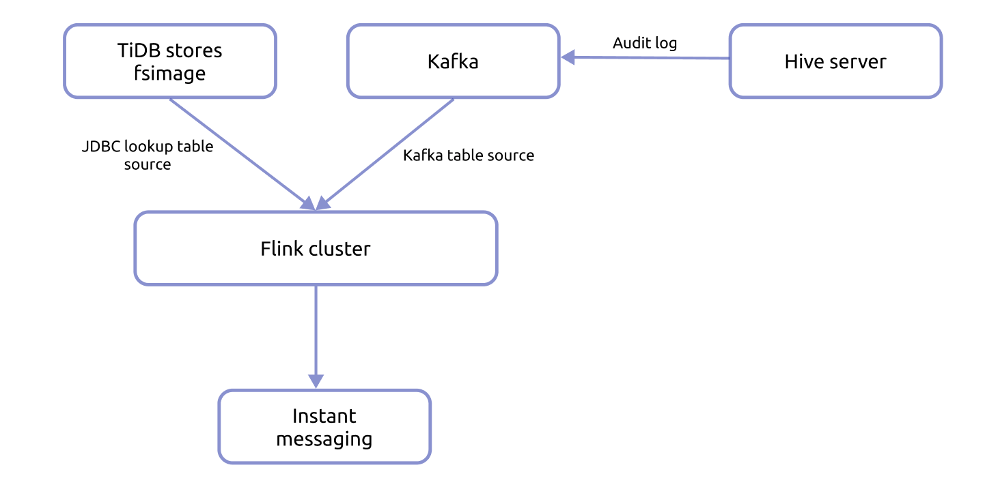
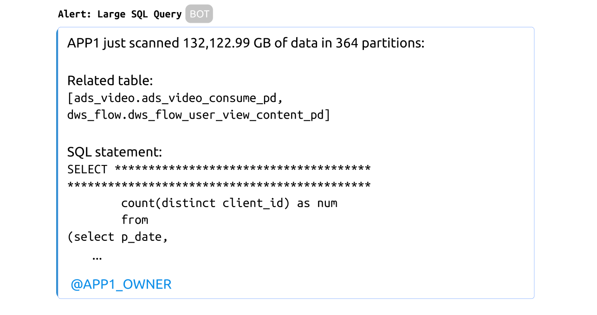

**Industry:** Knowledge Sharing

**Author:** Mengyu Hu (Platform Engineer at Zhihu)

**Transcreator:** [Ran Huang](https://github.com/ran-huang); **Editor:** Tom Dewan


[Zhihu](https://en.wikipedia.org/wiki/Zhihu) is [China's largest knowledge sharing platform](https://walkthechat.com/zhihu-chinas-largest-qa-platform-content-marketers-dream/), with over 220 million registered users and more than 310 million answers on our website. In March 2021, [we went public on the New York Stock Exchange](https://www.reuters.com/article/us-zhihu-ipo-idUSKBN2BI0L6) and were valued at about $5.3 billion.

As our business grew, we wanted to improve our infrastructure. We [horizontally scaled Apache Hive Metastore by migrating from MySQL to TiDB](https://pingcap.com/case-studies/horizontally-scaling-hive-metastore-database-by-migrating-from-mysql-to-tidb), a distributed SQL database, and decided to put TiDB into other big data applications as well. After migration, **the execution time of large queries decreased from 30-40 seconds to 6-7 seconds**. We were thrilled by the power of [TiDB](https://pingcap.com/products/tidb).

In this article, I'll show you two examples of how TiDB boosts the performance of our big data architecture. **You'll see how we use TiDB to build a real-time alert system for large queries in Hive and to accelerate NameNode RPC requests in HDFS.**

## Alert for large queries in Hive

Apache Hive is a data warehouse that allows you to query and analyze data. At Zhihu, we use Hive for extract, transform and load (ETL) tasks and ad-hoc queries.

### Our pain points

For ETL tasks, the SQL statements are fairly stable, while ad-hoc queries often contain erratic SQL statements. It's important to optimize ad-hoc queries; otherwise, the MapReduce job might scan too much data, which slows down task execution and exerts huge pressure on the Hadoop Distributed File System (HDFS). The whole cluster is thus unstable.

This issue frequently comes up when users try to query quarterly or annual data. When Hive serves such queries, the cluster often runs short of resources. Without sufficient resources, ETL tasks get stuck, and the reports are delayed.

### A large query alerting system

To solve this problem, we developed a system to alert users about large queries in real time. When a user sends an SQL statement to Hive, the system:

1. Parses the execution plan and transforms the plan into the table paths and partition paths that Hive needs to scan.
2. Aggregates all the partition paths and calculates the size of data to be scanned.
3. Determines whether the data size exceeds the threshold. If it does, the system alerts the user.

#### Obtain the HDFS paths

After each SQL statement is parsed, we use Hive server's hook mechanism to output an audit log to Kafka. The log format is as follows:

```json
{
 "operation": "QUERY",
 "user": "hdfs",
 "time": "2021-07-12 15:43:16.022",
 "ip": "127.0.0.1",
 "hiveServerIp": "127.0.0.1",
 "inputPartitionSize": 2,
 "sql": "select count(*) from test_table where pdate in ('2021-07-01','2021-07-02')",
 "hookType": "PRE_EXEC_HOOK",
 "currentDatabase": "default",
 "sessionId": "5e18ff6e-421d-4868-a522-fc3d342c3551",
 "queryId": "hive_20210712154316_fb366800-2cc9-4ba3-83a7-815c97431063",
 "inputTableList": [
   "test_table"
 ],
 "outputTableList": [],
 "inputPaths": [
   "/user/hdfs/tables/default.db/test_table/2021-07-01",
   "/user/hdfs/tables/default.db/test_table/2021-07-02"
 ],
 "app.owner": "humengyu"
}
```

Note the following fields:

<table>
  <tr>
   <td><strong>Field</strong>
   </td>
   <td><strong>Description</strong>
   </td>
  </tr>
  <tr>
   <td>operation
   </td>
   <td>The SQL type; for example, QUERY, DROP.
   </td>
  </tr>
  <tr>
   <td>user
   </td>
   <td>The user group that sends the SQL statement.
   </td>
  </tr>
  <tr>
   <td>sql
   </td>
   <td>The SQL statement.
   </td>
  </tr>
  <tr>
   <td>inputPaths
   </td>
   <td>The HDFS paths to be scanned.
   </td>
  </tr>
  <tr>
   <td>app.owner
   </td>
   <td>The person who sends the SQL statement.
   </td>
  </tr>
</table>

#### Calculate the partition size

To calculate the partition size, we needed to know the size of each directory in `inputPaths`. We decided to **parse HDFS `fsimage` every day and calculate the size of each Hive directory, and then save the results in TiDB.**

Because other applications also use `fsimage`, we saved not only the Hive directory, but also the whole HDFS directory, totaling tens of billions of records. TiDB is an excellent choice for storing and indexing large amounts of data.

#### Real-time alerts

After the system calculates the data size, it determines whether to send a real-time alert to the user and let them know the possible risk. In the alerting process:

1. Hive server sends the audit logs to Kafka in real time.
2. Flink consumes data from Kafka and treats Kafka as a streaming table via Kafka Table Source.
3. Flink uses JDBC Lookup Table Source to treat TiDB as a dimensional table.
4. Flink calculates the data size scanned by each SQL query and decides whether to send alerts.


<div class="caption-center">The alerting process</div>

In the end, if a user writes a SQL statement that scans too much data, they receive an alert like this:


<div class="caption-center">A large SQL query alert</div>

## Accelerate NameNode RPC requests

In addition to sending alerts for large queries, we also used TiDB to speed up NameNode performance.

### NameNode performance issue

In the past, many users complained that Hive queries took minutes or even hours. We investigated the issue and found the problem lies in the remote procedure call (RPC). When Hive calls the `getInputSummary` method, it obtains a global lock. No other query can access the data until the lock is released. If Hive executes a large query, calling this method might take a long time. As a result, other query threads must wait.

We read the Hive source code and found that Hive can execute multiple `getInputSummary` methods concurrently. (Internally, this method called HDFS's `getContentSummary` method.) We removed the global lock and replaced it with a thread pool-like approach. Now, `getContentSummary` could be executed with high concurrency.

However, another issue arose. HDFS's `getContentSummary` method is similar to a filesystem disk usage (`du`) operation. **When `getContentSummary`is executed in high concurrency, [NameNode](https://hadoop.apache.org/docs/r1.2.1/hdfs_design.html#NameNode+and+DataNodes) performance may significantly slow.** Because other compute engines also use this method, it's important to optimize it.

### Cache ContentSummary

Early in 2019, Zhihu split the filesystem into HDFS Federation by [using the Router-based Federation](https://hadoop.apache.org/docs/stable/hadoop-project-dist/hadoop-hdfs-rbf/HDFSRouterFederation.html). In this architecture, we introduced a new component called [Router](https://hadoop.apache.org/docs/stable/hadoop-project-dist/hadoop-hdfs-rbf/HDFSRouterFederation.html#Router) that forwards requests to NameNode.

**Our resolution to the NameNode performance issue is adding cache for HDFS content summary in the Router layer.** Specifically, we generate the content summary of all directories every day using `fsimage` and store the cache in TiDB.

When the client sends a request, HDFS tries to look for data in the cache. If it doesn't find the requested data, it fetches data from NameNode and updates the cache. A downside is that because a parent directory cannot detect the changes in a child directory, only leaf directories can be cached. In this implementation, very few requests go to NameNode, so NameNode performance is unaffected.

This solution is convenient because we already generated the content summary when we built the Hive large query alerting system. After we saved the cache in TiDB and created indexes for the requested paths, **the latency for ordinary `getContentSummary` requests dropped from several minutes to less than 10 ms.**

## Our future plans

Thanks to TiDB's horizontal scalability to store tremendous amounts of data and its indexing capabilities to accelerate queries, we successfully stored the HDFS metadata to meet Zhihu's business requirements.

As a hybrid transactional and analytical (HTAP) database, TiDB has a lot of potential that we can tap into. For example, we can cache HDFS file metadata in real time and subscribe to file changes from EditLog. By merging the file changes with `fsimage` in TiDB, we can generate low-latency snapshots of NameNode and use them for online analytics.

Going forward, TiDB will continue to play an important part in Zhihu's infrastructure and support our hyper growth. We look forward to applying it in more of our big data architecture.
