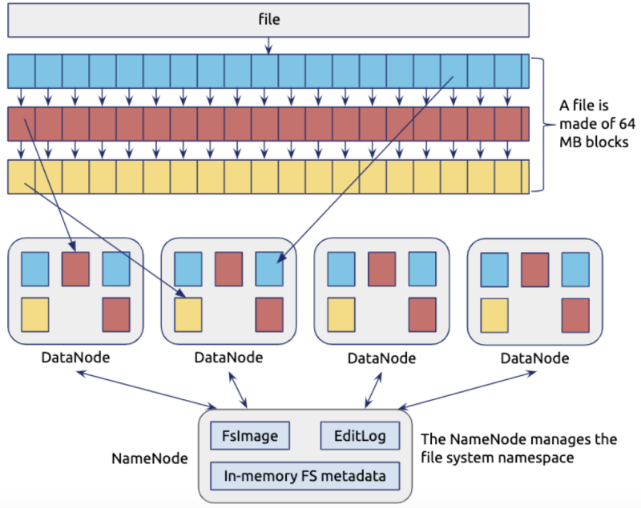
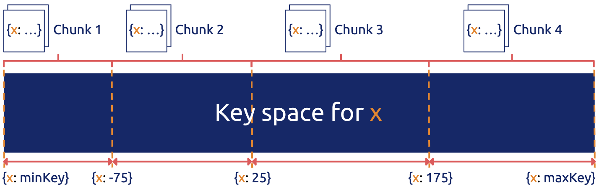
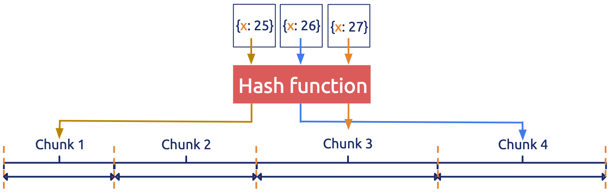
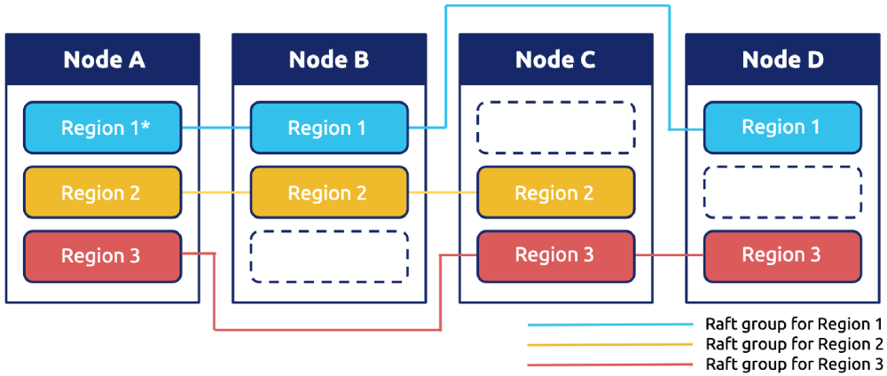

In recent years, building **a large-scale distributed storage system** has become a hot topic. Distributed consensus algorithms like [Paxos](https://en.wikipedia.org/wiki/Paxos_(computer_science)) and [Raft](https://raft.github.io/) are the focus of many technical articles. But those articles tend to be introductory, describing the basics of the algorithm and log replication. They seldom cover how to build a large-scale distributed storage system based on the distributed consensus algorithm. 

Since April 2015, we [PingCAP](https://pingcap.com/en/) have been building [TiKV](https://github.com/tikv/tikv), a large-scale open source distributed database based on Raft. It's the core storage component of [TiDB](https://github.com/pingcap/tidb), an open source distributed NewSQL database that supports Hybrid Transactional and Analytical Processing (HTAP) workloads. Earlier in 2019, we conducted an official Jepsen test on TiDB, and [the Jepsen test report](https://jepsen.io/analyses/tidb-2.1.7) was published in June 2019. In July the same year, we announced that [TiDB 3.0 reached general availability](https://pingcap.com/blog/tidb-3.0-announcement/), delivering stability at scale and performance boost.

In this article, I'd like to share some of our firsthand experience in **designing a large-scale distributed storage system** based on the **Raft consensus algorithm**.

## Scaling a distributed storage system

The first thing I want to talk about is scaling. The core of a distributed storage system is nothing more than two points: one is the sharding strategy, and the other is metadata storage. Keeping applications transparent and consistent in the sharding process is crucial to a storage system with elastic scalability. 

If a storage system only has a static data sharding strategy, it is hard to elastically scale with application transparency. Such systems include MySQL static routing middleware like [Cobar](https://github.com/alibaba/cobar), Redis middleware like [Twemproxy](https://github.com/twitter/twemproxy/), and so on. All these systems are difficult to scale seamlessly.

Before moving on to elastic scalability, I'd like to talk about several sharding strategies.

### Sharding strategies for distributed databases

Sharding is a database partitioning strategy that splits your datasets into smaller parts and stores them in different physical nodes. The unit for data movement and balance is a sharding unit. Each physical node in the cluster stores several sharding units. 

Two commonly-used sharding strategies are range-based sharding and hash-based sharding. The choice of the sharding strategy changes according to different types of systems. A typical example is the data distribution of a Hadoop Distributed File System (HDFS) DataNode, shown in Figure 1 (source: [Distributed Systems: GFS/HDFS/Spanner](http://energystudy.synergylabs.org/courses/15-440-Fall2017/lectures/16-gfs_hdfs_spanner.pdf)).


<div class="caption-center"> Figure 1. Data distribution of HDFS DataNode </div> 

#### Range-based sharding

Range-based sharding assumes that all keys in the database system can be put in order, and it takes a continuous section of keys as a sharding unit. 

It's very common to sort keys in order. HBase keys are sorted in byte order, while MySQL keys are sorted in auto-increment ID order. For some storage engines, the order is natural. In the case of both log-structured merge-tree (LSM-Tree) and B-Tree, keys are naturally in order. 


<div class="caption-center"> Figure 2. Range-based sharding for data partitioning </div> 

In Figure 2 (source: [MongoDB uses range-based sharding to partition data](https://docs.mongodb.com/manual/core/ranged-sharding/)), the key space is divided into (minKey, maxKey). Each sharding unit (chunk) is a section of continuous keys. The advantage of range-based sharding is that the adjacent data has a high probability of being together (such as the data with a common prefix), which can well support operations like `range scan`. For example, HBase Region is a typical range-based sharding strategy.

However, range-based sharding is not friendly to sequential writes with heavy workloads. For example, in the time series type of write load, the write hotspot is always in the last Region. This occurs because the log key is generally related to the timestamp, and the time is monotonically increasing. But relational databases often need to execute `table scan` (or `index scan`), and the common choice is range-based sharding.

#### Hash-based sharding

Hash-based sharding processes keys using a hash function and then uses the results to get the sharding ID, as shown in Figure 3 (source: [MongoDB uses hash-based sharding to partition data](https://docs.mongodb.com/manual/core/hashed-sharding/)).

Contrary to range-based sharding, where all keys can be put in order, hash-based sharding has the advantage that keys are distributed almost randomly, so the distribution is even. As a result, it is more friendly to systems with heavy write workloads and read workloads that are almost all random. This is because the write pressure can be evenly distributed in the cluster. But apparently, operations like `range scan` are almost impossible.


<div class="caption-center"> Figure 3. Hash-based sharding for data partitioning </div> 

Some typical examples of hash-based sharding are [Cassandra Consistent hashing](https://docs.datastax.com/en/archived/cassandra/2.1/cassandra/architecture/architectureDataDistributeHashing_c.html), presharding of Redis Cluster and [Codis](https://github.com/CodisLabs/codis), and [Twemproxy consistent hashing](https://github.com/twitter/twemproxy/blob/master/README.md#features).

#### Hash-Range combination sharding

Note that hash-based and range-based sharding strategies are not isolated. Instead, you can flexibly combine them. For example, you can establish a multi-level sharding strategy, which uses hash in the uppermost layer, while in each hash-based sharding unit, data is stored in order.

### Implementing elastic scalability for a storage system

When it comes to elastic scalability, it's easy to implement for a system using range-based sharding: simply split the Region. Assuming that you have a Range Region [1, 100), you only need to choose a split point, such as 50. Then this Region is split into [1, 50) and [50, 100). After that, move the two Regions into two different machines, and the load is balanced.

Range-based sharding may bring read and write hotspots, but these hotspots can be eliminated by splitting and moving. Splitting and moving hotspots are lagging behind the hash-based sharding. But overall, for relational databases, range-based sharding is a good choice.

In contrast, implementing elastic scalability for a system using hash-based sharding is quite costly. The reason is obvious. Assume that the current system has three nodes, and you add a new physical node. In the hash model, "n" changes from 3 to 4, which can cause a large system jitter. Although you can use a consistent hashing algorithm like [Ketama](https://github.com/RJ/ketama) to reduce the system jitter as much as possible, it's hard to totally avoid it. This is because after a hash function is applied, data is randomly distributed, and adjusting the hash algorithm will certainly change the distribution rule for most data.

### Implementing data consistency and high availability

We chose range-based sharding for TiKV. After choosing an appropriate sharding strategy, we need to combine it with a high-availability replication solution. Different replication solutions can achieve different levels of availability and consistency.

Many middleware solutions simply implement a sharding strategy but without specifying the data replication solution on each shard. Examples include the Redis middleware [twemproxy](https://github.com/twitter/twemproxy) and [Codis](https://github.com/CodisLabs/codis), and the MySQL middleware [Cobar](https://github.com/alibaba/cobar). These middleware solutions only implement routing in the middle layer, without considering the replication solution on each storage node in the bottom layer.

However, this replication solution matters a lot for a large-scale storage system. Generally, the number of shards in a system that supports elastic scalability changes, and so does the distribution of these shards. The system automatically balances the load, scaling out or in. If there is a large amount of data and a large number of shards, it's almost impossible to manually maintain the master-slave relationship, recover from failures, and so on. So it's very important to choose a highly-automated, high-availability solution.

In TiKV, each range shard is called a Region. Because we need to support scanning and the stored data generally has a relational table schema, we want the data of the same table to be as close as possible. Each Region in TiKV uses the Raft algorithm to ensure data security and high availability on multiple physical nodes.


<div class="caption-center"> Figure 4. Raft group in distributed database TiKV </div> 

Several open source Raft implementations, including [etcd](https://coreos.com/etcd/), [LogCabin](https://github.com/logcabin/logcabin), [raft-rs](https://github.com/pingcap/raft-rs) and [Consul](https://www.consul.io/), are just implementations of a single Raft group, which cannot be used to store a large amount of data. So the major use case for these implementations is configuration management. After all, the more participating nodes in a single Raft group, the worse the performance. If physical nodes cannot be added horizontally, the system has no way to scale.

If you use multiple Raft groups, which can be combined with the sharding strategy mentioned above, it seems that the implementation of horizontal scalability is very simple. Taking the replicas of each shard as a Raft group is the basis for TiKV to store massive data. However, it is much more complex to manage multiple, dynamically-split Raft groups than a single Raft group. As far as I know, TiKV is currently one of only a few open source projects that implement multiple Raft groups.

TiKV divides data into Regions according to the key range. When a Region becomes too large (the current limit is 96 MB), it splits into two new ones. This splitting happens on all physical nodes where the Region is located. The newly-generated replicas of the Region constitute a new Raft group.

Then here comes two questions: 

* How do we ensure that the split operation is securely executed on each replica of this Region? 
* How do we guarantee application transparency?

<div class="trackable-btns">
    <a href="/download" onclick="trackViews('Building a Large-scale Distributed Storage System Based on Raft', 'download-tidb-btn-middle')"><button>Download TiDB</button></a>
    <a href="https://share.hsforms.com/1e2W03wLJQQKPd1d9rCbj_Q2npzm" onclick="trackViews('Building a Large-scale Distributed Storage System Based on Raft', 'subscribe-blog-btn-middle')"><button>Subscribe to Blog</button></a>
</div>

**Question #1: How do we ensure the secure execution of the split operation on each Region replica?**

The solution is relatively easy. You can use the following approach, which is exactly what the Raft algorithm does:

1. Take the split Region operation as a Raft log.

2. Let this log go through the Raft state machine. When the log is successfully applied, the operation is safely replicated.

3. Verify that the splitting log operation is accepted.

4. Let the new Region go through the Raft election process. As an alternative, you can use the original leader and let the other nodes where this new Region is located send heartbeats directly.

The split process is coupled with network isolation, which can lead to very complicated cases. For example, assume that there are two nodes named A and B, and the Region leader is on node A: 

1. The leader initiates a Region split request: Region 1 [a, d) → the new Region 1 [a, b) + Region 2 [b, d). Node A first sends the heartbeat of Region 2 to node B. Node A also sends a snapshot of Region 2 to node B because there hasn't been any Region 2 information on node B.

2. At this time, Region 2 is split into the new Region 2 [b, c) and Region 3 [c, d). So the snapshot that node A sends to node B is the latest snapshot of Region 2 [b, c).

3. Now the split log of Region 1 has arrived at node B and the old Region 1 on node B has also split into Region 1 [a, b) and Region 2 [b, d).

4. Then the latest snapshot of Region 2 [b, c) arrives at node B. After the new Region 2 is applied, it must be guaranteed that the [c, d) data no longer exists on Region 2 at node B.

**Question #2: How do we guarantee application transparency?**

Raft does a better job of transparency than Paxos. Specifically, Raft provides a clear configuration change process to make sure nodes can be securely and dynamically added or removed in a Raft group. With this algorithm, the rebalance process can be summarized as follows:

1. Add a replica to a Region.
2. Transfer the leadership.
3. Remove the local replica.

These steps are the standard Raft configuration change process. In TiKV, the implementation is a little bit different:

1. The `conf change` operation is only executed after the `conf change` log is applied.

2. To avoid a disjoint majority, a Region group can only handle one conf change operation each time. This has been mentioned in [Diego Ongaro's paper "Consensus: Bridging Theory and Practice"](https://www.google.com/url?q=https://github.com/ongardie/dissertation/blob/master/online-trim.pdf?raw%3Dtrue&sa=D&ust=1562069112724000&usg=AFQjCNFJ0gqDMqK93RKVqVk5BeOK1NHCFw) (2014). 

The process in TiKV can guarantee correctness and is also relatively simple to implement.

In addition, to implement transparency at the application layer, it also requires collaboration with the client and the metadata management module. After all, when a Region leader is transferred away, the client's read and write requests to this Region are sent to the new leader node.

Note: In this context, "the client" refers to the TiKV software development kit (SDK) client.

When a client reads or writes data, it uses the following process:

1. The client caches a routing table of data to the local storage. The routing table is as follows:

    ```
    {startKey1, endKey1}   ->     {Region1, NodeA}
    {startKey2, endKey2}   ->     {Region2, NodeB}
    {startKey3, endKey3}   ->     {Region3, NodeC}
    …
    ```

2. According to the key accessed by the user, the client checks and obtains the following information:

    * The interval the key belongs to
    * The Region the interval belongs to
    * The physical node the leader is on

3. The client sends the request to the specific node directly. As I mentioned above, the leader might have been transferred to another node. Then the client might receive an error saying "Region not leader."

4. The client returns with the new leader.

5. The client updates its routing table cache.

## Scheduling in a distributed storage system

In this section, I'll discuss how scheduling is implemented in a large-scale distributed storage system.

### Scheduling using Placement Driver

The routing table is a very important module that stores all the Region distribution information. The routing table must guarantee accuracy and high availability.

In addition, to rebalance the data as described above, we need a scheduler with a global perspective. To dynamically adjust the distribution of Regions in each node, the scheduler needs to know which node has insufficient capacity, which node is more stressed, and which node has more Region leaders on it. This is because all nodes are almost stateless, and they cannot migrate the data autonomously. Instead, they must rely on the scheduler to initiate data migration (`raft conf change`).

You might have noticed that you can integrate the scheduler and the routing table into one module. [Google's Spanner database](https://storage.googleapis.com/pub-tools-public-publication-data/pdf/65b514eda12d025585183a641b5a9e096a3c4be5.pdf) uses this single-module approach and calls it the placement driver. We also use this name in TiKV, and call it PD for short. PD is mainly responsible for the two jobs mentioned above: the routing table and the scheduler.

### PD being completely stateless guarantees routing data consistency

Google's Spanner paper does not describe the placement driver design in detail. However, it's certain that one core idea in designing a large-scale distributed storage system is to assume that any module can crash. It's very dangerous if the states of modules rely on each other. This is because once an instance crashes, the standby instance must start immediately, but the state of this newly-started instance might not be consistent with the instance that has crashed. At this time, we must be careful enough to avoid causing possible issues.

Take a simple case as an example. The PD routing table is stored in etcd. However, the node itself determines the split of a Region. This way, the node can quickly know whether the size of one of its Regions exceeds the threshold. When this split event is actively pushed from the node to PD, if PD receives this event but crashes before persisting the state to etcd, the newly-started PD doesn't know about the split. At this point, the information in the routing table might be wrong.

What we do is design PD to be completely stateless. Only through making it completely stateless can we avoid various problems caused by failing to persist the state.

Periodically, each node sends information about the Regions on it to PD using heartbeats. Then, PD takes the information it receives and creates a global routing table. In this way, even if PD crashes, after the new PD starts, it only needs to wait for a few heartbeats and then it can get the global routing information again. In addition, PD can use etcd as a cache to accelerate this process. That is, after the new PD starts, it pulls the routing information from etcd, waits for a few heartbeats, and then provides services.

### The epoch mechanism guarantees the latest information

However, you might have noticed that there is still a problem. If the cluster has partitions in a certain section, the information about some nodes might be wrong.

For example, some Regions re-initiate elections and splits after they are split, but another isolated batch of nodes still sends the obsolete information to PD through heartbeats. So for one Region, either of two nodes might say that it's the leader, and the Region doesn't know whom to trust.

In TiKV, we use an epoch mechanism. With this mechanism, changes are marked with two logical clocks: one is the Raft's configuration change version, and the other is the Region version. For each configuration change, the configuration change version automatically increases. Similarly, for each Region change such as splitting or merging, the Region version automatically increases, too. 

The previous section mentions that a split process with network isolation might result in complicated cases. The epoch mechanism we discuss here is the solution to the example case described above. 

The epoch strategy that PD adopts is to get the larger value by comparing the logical clock values of two nodes. PD first compares values of the Region version of two nodes. If the values are the same, PD compares the values of the configuration change version. The node with a larger configuration change version must have the newer information.

## Conclusion

It's a highly complex project to build a robust distributed system. I've shared some of the key design ideas of building a large-scale distributed storage system based on the Raft consensus algorithm. If you're interested in how we implement TiKV, you're welcome to dive deep by reading our [TiKV source code](https://github.com/tikv/tikv) and [TiKV documentation](https://tikv.org/docs/).

*This article was first published on the [CNCF website](https://www.cncf.io/blog/2019/11/04/building-a-large-scale-distributed-storage-system-based-on-raft/).*
