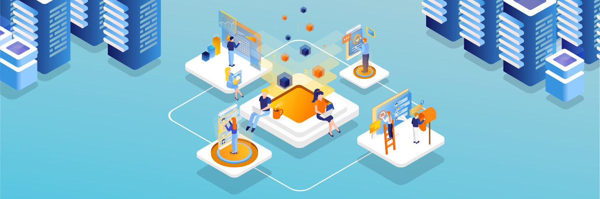
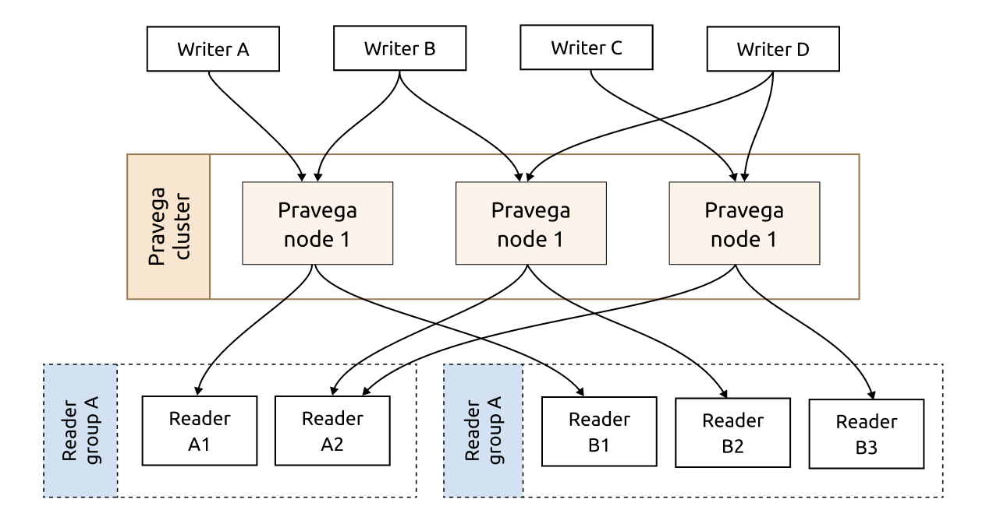
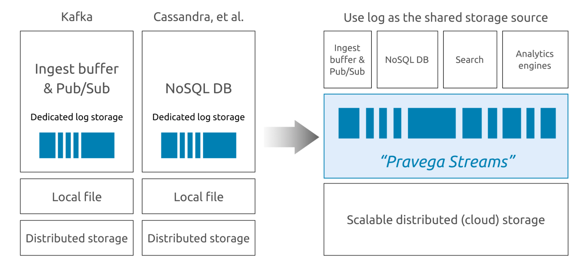
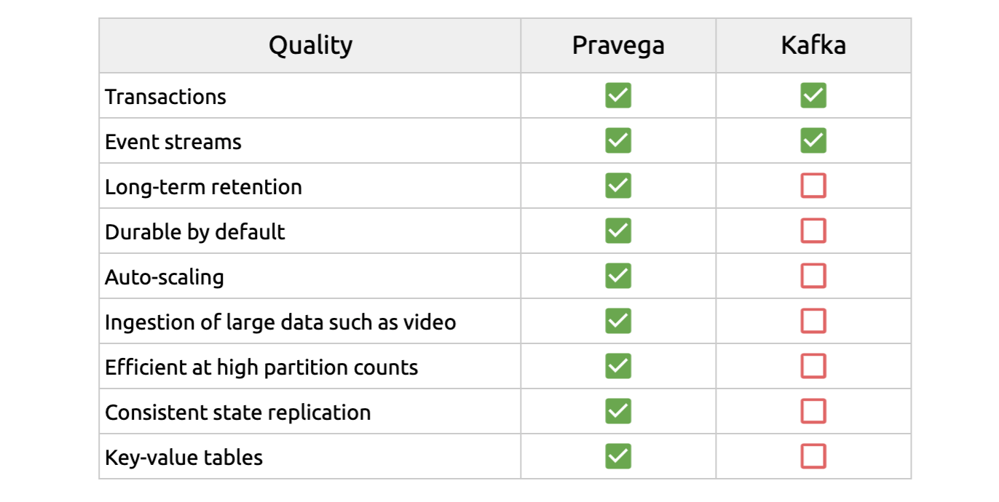
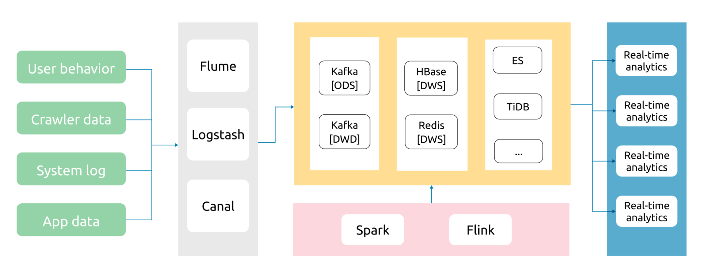
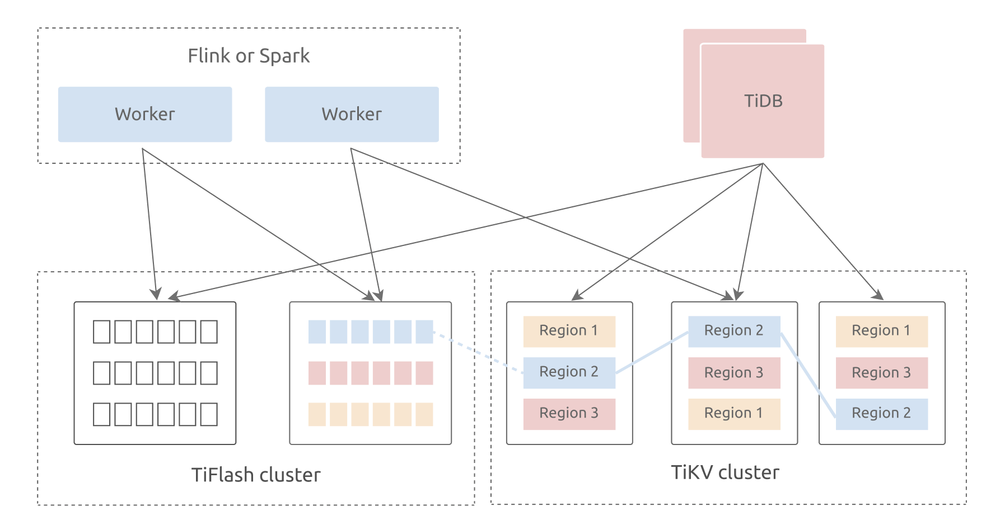
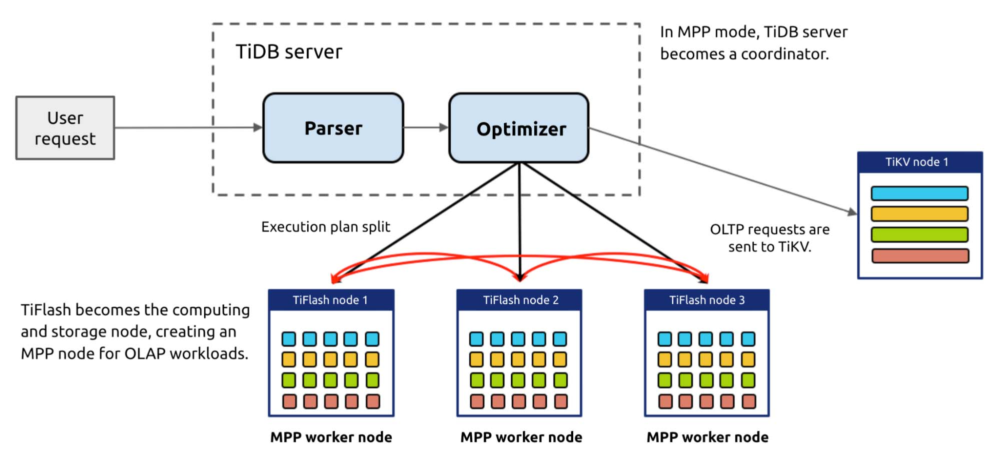

**Author:** [Tianyi Wang](https://github.com/wangtianyi2004) (Database architect at PingCAP)

**Transcreator:** [Ran Huang](https://github.com/ran-huang); **Editor:** Tom Dewan

Companies with a lot of data rely on data warehouses for data processing and analytics. To achieve business agility, **offline data warehouses are no longer sufficient, and real-time data warehouses are gradually taking over.** Currently, real-time data warehouses often use Apache Flink to consume data from Apache Kafka and stream data into a database. However, because Kafka doesn't persist data in disks, in extreme cases, data is lost.

After researching the databases and storage systems on the market, **we found a more efficient and accurate real-time data warehouse solution: [Pravega](https://pravega.io/) + [TiDB](https://pingcap.com/products/tidb).**

In this article, I'll introduce Pravega, a distributed stream storage system, and TiDB, a distributed SQL database. This combination resolves Kafka's data persistence dilemma and provides auto scaling capabilities, improving concurrency, usability, and security for real-time data warehouses. I also provide a [docker-compose demo](https://github.com/wangtianyi2004/tidb-pravega-quick-start) for you to try Pravega and TiDB. I hope you find this article helpful.

## Pravega, a stream storage system

Open sourced by Dell EMC, [Pravega](https://github.com/pravega/pravega) is a stream storage system and a Cloud Native Computing Foundation (CNCF) sandbox project. It is similar to Kafka and Apache Pulsar and provides stream and schema registry. But Pravega offers more functionalities:

* Auto-scaling without application awareness.
* A complete storage interface with stream-based abstraction to support unified access by upper-level compute engines.

Pravega architecture

In distributed systems, client applications and messaging systems often use message queues to asynchronously transfer messages. When it comes to message queues, everyone thinks about Kafka. Kafka is a distributed log system based on Zookeeper. It supports multiple partitions, multiple replicas, and multiple consumers.

Pravega, in contrast, is a new stream storage system, built to solve the problems that Kafka cannot. It refactors the architecture of stream storage. As a real-time stream storage solution, Pravega natively supports long-term data retention. Pravega writes data on the Hadoop Distributed File System (HDFS) or S3, thus eliminating the concerns over data persistence. Moreover, Pravega only stores one copy of data across the whole system.

Pravega's design solves problems Kafka cannot

### Why Pravega prevails over Kafka

You may wonder, "Why reinvent the wheel when there's already Kafka?" When I used Kafka, I was troubled by three problems: data loss, data retention, and consumer rebalance.

Kafka takes in more information than it gives out. After the offset is committed, there are risks for data loss.

* When you set `acks = all`, ACK is returned only when all consumers confirm that the message is saved, so no data is lost.
* When `acks = 1`, ACK is returned if the leader consumer saves the message. If the leader shuts down before it backs up data, data is lost.
* When `acks = 0`, Kafka does not wait for an acknowledgement from the consumers. When the consumers shut down, data is lost.

Kafka doesn't provide a simple and efficient solution for persisting data to HDFS or S3, so data retention becomes a problem. Although Confluent offers the solution, you have to use two sets of storage interfaces to access data from different layers.

* Use Apache Flume to access data through Kafka -> Flume -> HDFS.
* Use kafka-hadoop-loader to access data through Kafka -> kafka-hadoop-loader -> HDFS.
* Use Kafka Connect HDFS to access data through Kafka -> Kafka Connect HDFS -> HDFS.

Consumer rebalancing is also harmful. Because new consumers are added to the queue, the queue might stop consuming messages during the rebalance. Because of the long commit interval, consumers might repeatedly process data. Either way, rebalancing might cause a message backlog, which increases latency.

Compared to Kafka, Pravega offers more features:

Pravega vs. Kafka

Pravega uses Apache BookKeeper to write concurrent, real-time data with low latency.  However, BookKeeper only serves as a cache layer for batch write. All read requests to Pravega are made directly to HDFS or S3 to take advantage of their high throughput capabilities.

In other words, Pravega does not use BookKeeper as a data buffer layer, but provides an HDFS or S3-based storage layer. This storage layer supports abstractions for both **low-latency tailing read and write** **and** **high-throughput catchup read**. Systems that use BookKeeper as a separate layer might perform poorly when data moves between BookKeeper and HDFS or S3. Pravega, by contrast, ensures satisfactory performance.

  <a href="/download" onclick="trackViews('Building a Real-Time Data Warehouse with TiDB and Pravega', 'download-tidb-btn-middle')"><button>Download TiDB</button></a>
  <a href="https://share.hsforms.com/1e2W03wLJQQKPd1d9rCbj_Q2npzm" onclick="trackViews('Building a Real-Time Data Warehouse with TiDB and Pravega', 'subscribe-blog-btn-middle')"><button>Subscribe to Blog</button></a>

### Benefits of Pravega

Usually, DBAs have three main concerns: **data accuracy, system stability, and system usability**.

* Data accuracy is vitally important. Any data loss, corruption, or duplication would be a catastrophe.
* System stability and usability relieve DBAs from tedious maintenance procedures, so they can invest their time on improving the system.

Pravega addresses these DBA concerns. Its long-term retention ensures data safety, exactly-once semantics guarantees data accuracy, and auto-scaling makes system maintenance a breeze.

## Real-time data warehouse architecture

A real-time data warehouse usually has four components: **data collection layer, data storage layer, real-time computing layer, and real-time application layer**. By integrating multiple technologies into a seamless architecture, we can build an extensible big data architecture that supports data analytics and mining, online transactions, and unified batch and stream processing.

Four components in a real-time data warehouse

There are various choices for the data storage layer, but not all of them are suitable for a real-time data warehouse:

* Hadoop or traditional OLAP databases can't provide satisfactory real-time processing.
* NoSQL solutions like HBase can scale and process data in real time, but can't provide analysis.
* Standalone relational databases can't scale out to accommodate massive data.

TiDB, however, addresses all these needs.

### TiDB, a distributed HTAP database

[TiDB](https://pingcap.com/products/tidb) is an open source, distributed SQL database that supports Hybrid Transactional and Analytical Processing (HTAP) workloads. It is MySQL compatible and features horizontal scalability, strong consistency, and high availability.

**Compared to other open source databases, TiDB is more suitable for building real-time data warehouses because of its HTAP architecture.** TiDB possesses a hybrid storage layer consisting of TiKV, a row-based storage engine, and TiFlash, a columnar storage engine. The two storage engines use TiDB as a shared SQL layer. TiDB answers online transactional processing (OLTP) and online analytical processing (OLAP) queries, and fetches data from either engine based on the cost of the execution plan.

TiDB HTAP architecture

Moreover, TiDB 5.0 introduces [the Massively Parallel Processing (MPP) architecture](https://docs.pingcap.com/tidb/stable/release-5.0.0#mpp-architecture). In MPP mode, TiFlash complements TiDB's computing capabilities. When dealing with OLAP workloads, TiDB becomes a master node. The user sends a request to TiDB server, and all TiDB servers perform table joins and submit the result to the optimizer for decision making. The optimizer assesses all the possible execution plans (row-based, column-based, indexes, single-server engine, and MPP engine) and chooses the optimal one.

TiDB's MPP mode

For example, an order processing system may experience a sudden traffic peak during a sales campaign. During that peak, businesses need to perform quick analytics so they can timely react and respond to customer behaviors. Traditional data warehouses can hardly cope with flooding data in a short period of time, and it might take a long time to perform the follow-up data analytical processing.

With the MPP computing engine, **TiDB can anticipate the coming traffic peak and dynamically scale out the cluster to provide more resources for the campaign**. It can then easily respond to aggregation and analytical requests within seconds.

### When TiDB meets Pravega

With the help of Flink, TiDB teams up with Pravega to build a real-time, high-throughput, stable data warehouse. This data warehouse is able to meet various user requirements for big data and handle OLTP and OLAP workloads in one stop.

To better showcase the usage of Pravega and TiDB, we provide a [demo based on docker-compose](https://github.com/wangtianyi2004/tidb-pravega-quick-start), which demonstrates how data flows from Pravega through Flink to TiDB. You can write and commit Flink jobs via Flink SQL client and observe the execution at `<HOST_IP>:8081`.

## Join us!

If you are interested in building a real-time data warehouse using TiDB and Pravega, [join us on Slack](https://slack.tidb.io/invite?team=tidb-community&channel=everyone&ref=pingcap-blog) to explore the latest solution of data warehouses.
