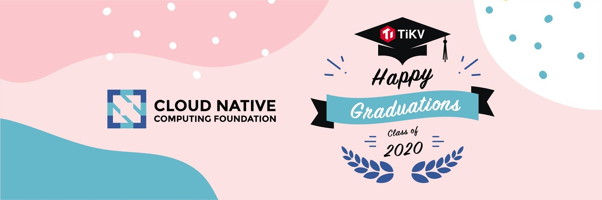

       

The [Cloud Native Computing Foundation](https://www.cncf.io/announcements/2020/09/02/cloud-native-computing-foundation-announces-tikv-graduation/) (CNCF) today just announced that [TiKV](https://docs.pingcap.com/tidb/stable/tidb-architecture#tikv-server) has become the twelfth project to graduate, joining other graduated projects such as Kubernetes, Jaeger, Harbor, etc. With graduation from CNCF, TiKV has demonstrated growing adoption, an open governance process, feature maturity, and a strong commitment to community, sustainability and inclusivity of the project. 

Originally created by [PingCAP](https://pingcap.com/) as the storage backend for [TiDB](https://docs.pingcap.com/tidb/stable/overview),  TiKV is an open source distributed transactional key-value database built in [Rust](https://www.rust-lang.org). It provides transactional key-value APIs with ACID guarantees. The project provides a unifying distributed storage layer for applications that need data persistence, horizontal scalability, distributed transactions, high availability, and strong consistency, making it an ideal database for the next-generation cloud-native infrastructure. TiKV was accepted as a CNCF member project at the Sandbox level in August 2018, and as an incubating project in April 2019. 

"TiKV was one of our first Rust based projects and is truly a flexible and extensible cloud-native key-value store," said Chris Aniszczyk, CTO/COO of the Cloud Native Computing Foundation. "Since the project joined CNCF, we have been impressed with the project growth and desire to cultivate a global open source community."

Since joining CNCF, the [adoption](https://github.com/tikv/tikv/blob/master/docs/adopters.md) of TiKV in production has doubled to about 1,000 companies across multiple industries and continents, and contributors to the core repository have tripled from 78 to 256, with 7,900+ stars received for its core repository. With such a vibrant community, the project has steadily advanced into maturity with stability, performance, and security of production-grade. In the 3rd-party [security audit](https://tikv.org/blog/tikv-pass-security-audit/) funded by CNCF,  the auditing company, Cure 53 concluded that "TiKV should be seen as properly mature and delivering on its security promises; recommended for public deployment, especially when integrated into a containerized solution via Kubernetes and Prometheus for additional monitoring".

As the original founder of the project and an important part of the maintainers of TiKV, we could not be happier and more proud to see TiKV grow from its infancy to the graduation from CNCF. It’s a journey of learning and growing, and thriving with the community. Here are some of their voices:

_"We were amazed by the level of maturity of the ecosystem around this solution. The Kubernetes operator is pretty simple to get started with and helps with common operation tasks. The observability tools are rich. This level of resiliency can be achieved thanks to the rock-solid TiKV implementation. Its graduation is well deserved."_

-- Smaïne Kahlouch, DevOps team leader at Dailymotion

_"TiKV has provided such an excellent foundation to build versatile cloud-native stateful services. TiDB and Zetta Table Store are both built on top of TiKV, and they jointly support all the large table application scenarios of Zhihu and solve many problems caused by limited scalability of MySQL. We are very proud to be part of the community, and we believe TiKV will benefit more users by becoming a graduated project in CNCF."_

-- Xiaoguang Sun, TiKV Maintainer, and director of Infrastructure at Zhihu.com

_"TiKV is a very stable and performant distributed key-value database. Its intelligent and efficient cluster management functions provide great support for our online recommendation service. We adopted TiKV in 2018, and it has become an essential part of our storage system."_

-- Fu Chen, TiKV Maintainer, and distributed storage engineer at Yidian Zixun

"We have been using TiKV in production on the ARM platform since December 2019," said Birong Huang, senior engineer at U-Next. "The scalability and high performance of TiKV enabled us through the unpredictable traffic increase through COVID-19. We are constantly impressed by how active the TiKV community is and would love to contribute back! Congratulations on the graduation!"

As Ed Huang, our CTO at PingCAP put it, "We realized TiKV should be a lot more than just the complementary storage of TiDB back when we created it 5 years ago, so we brought it under the realm and stewardship of CNCF, to enable and empower the next generation of databases by providing a reliable, high quality, practical storage foundation. Graduation from CNCF validates our vision and efforts. We look forward to more innovations and collaborations with the TiKV project. If you feel interested or would like to be a part of this project, see:

* [TiKV website](https://tikv.org/)
* [Github](https://github.com/tikv/tikv)
* [TiKV Community Meeting](https://docs.google.com/document/d/1CWUAkBrcm9KPclAu8fWHZzByZ0yhsQdRggnEdqtRMQ8/edit)
* [Twitter](https://twitter.com/tikvproject)
* [Slack](https://bit.ly/2ZcrVTI)
