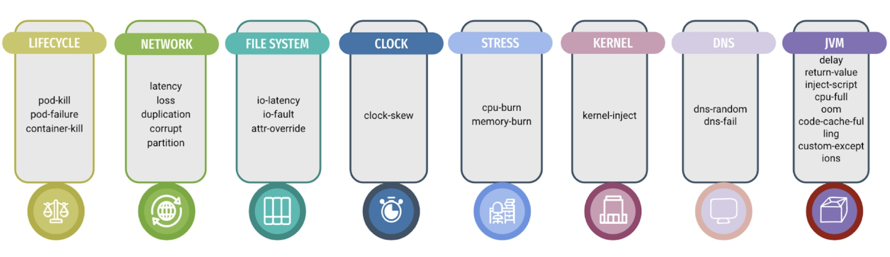
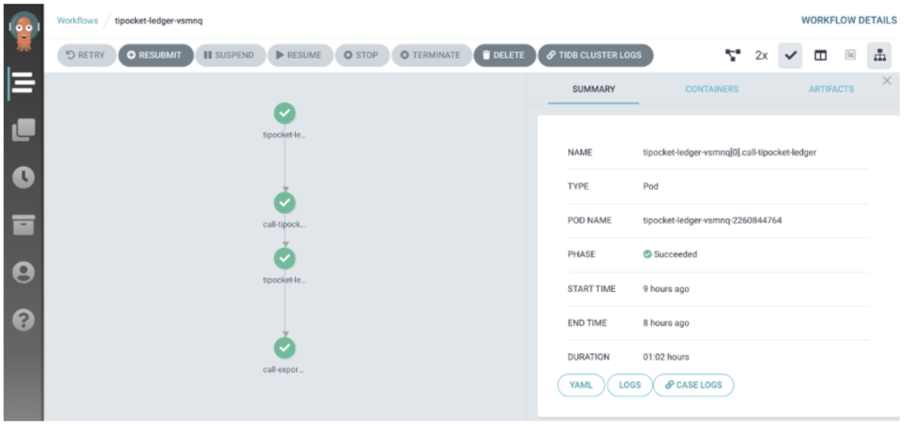

**Authors:** [Cwen Yin](https://github.com/cwen0) (Software Engineer at PingCAP), [Calvin Weng](https://github.com/dcalvin)

**Transcreator:** [Mila Wu](https://github.com/milasuperstar)

It's been a year since Chaos Mesh was first open-sourced on GitHub. Chaos Mesh started out as a mere fault injection tool and is now heading towards the goal of building a chaos engineering ecology. Meanwhile, the Chaos Mesh community was also built from scratch and has helped [Chaos Mesh](https://github.com/chaos-mesh/chaos-mesh) join CNCF as a Sandbox project.

In this article, we will share with you how Chaos Mesh has grown and changed in the past year and also discuss its future goals and plans.

## The project: thrive with a clear goal in mind

In this past year, Chaos Mesh has grown at an impressive speed with the joint efforts of the community. From the very first version to the recently released [v1.1.0](https://github.com/chaos-mesh/chaos-mesh/releases/tag/v1.1.0), Chaos Mesh has been greatly improved in terms of functionality, ease of use, and security.

### Functionality

When first open-sourced, Chaos Mesh supported only three fault types: PodChaos, NetworkChaos, and [IOChaos](https://pingcap.com/blog/how-to-simulate-io-faults-at-runtime). Within only a year, Chaos Mesh can perform all around fault injections into the network, system clock, JVM applications, filesystems, operating systems, and so on.

 Chaos Mesh's functionalities 

After continuous optimization, Chaos Mesh now provides a flexible scheduling mechanism, which enables users to better design their own chaos experiments. This laid the foundation for chaos orchestration.

In the meantime, we are happy to see that a number of users have started to [test Chaos Mesh on major cloud platforms](https://github.com/chaos-mesh/chaos-mesh/issues/1182), such as Amazon Web Services (AWS), Google Kubernetes Engine (GKE), Alibaba Cloud, and Tencent Cloud. We have continuously conducted compatibility testing and adaptations, in order to support [fault injection for specific cloud platforms](https://github.com/chaos-mesh/chaos-mesh/pull/1330).

To better support Kubernetes native components and node-level failures, we developed [Chaosd](https://github.com/chaos-mesh/chaosd), which provides physical node-level fault injection. We're extensively testing and refining this feature for release within the next few months.

### Ease of use

Ease of use has been one of the guiding principles of Chaos Mesh development since day one. You can deploy Chaos Mesh with a single command line. The V1.0 release brought the long-awaited Chaos Dashboard, a one-stop web interface for users to orchestrate chaos experiments. You can define the scope of the chaos experiment, specify the type of chaos injection, define scheduling rules, and observe the results of the chaos experiment—all in the same web interface with only a few clicks.

 Chaos Mesh's dashboard 

Prior to V1.0, many users reported being blocked by various configuration problems when injecting IOChaos faults. After intense investigations and discussions, we gave up the original SideCar implementation. Instead, we used chaos-daemon to dynamically invade the target Pod, which significantly simplifies the logic. This optimization has made dynamic I/O fault injection possible with Chaos Mesh, and users can focus solely on their experiments without having to worry about additional configurations.

### Security

We have improved the security of Chaos Mesh. It now provides a comprehensive set of selectors to control the scope of the experiments and supports setting specific namespaces to protect important applications. What's more, the support of namespace permissions allows users to limit the "explosion radius" of a chaos experiment to a specific namespace.

In addition, Chaos Mesh directly reuses Kubernetes' native permission mechanism and supports verification on the Chaos Dashboard. This protects you from other users' errors, which can cause chaos experiments to fail or become uncontrollable.

## Cloud native ecosystem: integrations and cooperations

In July 2020, Chaos Mesh was successfully [accepted as a CNCF Sandbox project](https://pingcap.com/blog/announcing-chaos-mesh-as-a-cncf-sandbox-project). This shows that Chaos Mesh has received initial recognition from the cloud native community. At the same time, it means that Chaos Mesh has a clear mission: to promote the application of chaos engineering in the cloud native field and to cooperate with other cloud native projects so we can grow together.

### Grafana

To further improve the observability of chaos experiments, we have included a separate [Grafana plug-in](https://github.com/chaos-mesh/chaos-mesh-datasource) for Chaos Mesh, which allows users to directly display real-time chaos experiment information on the application monitoring panel. This way, users can simultaneously observe the running status of the application and the current chaos experiment information.

### Github Action

To enable users to run chaos experiments even during the development phase, we developed the [chaos-mesh-action](https://github.com/chaos-mesh/chaos-mesh-action) project, [allowing Chaos Mesh to run in the workflow of GitHub Actions](https://pingcap.com/blog/chaos-mesh-action-integrate-chaos-engineering-into-your-ci). This way, Chaos Mesh can easily be integrated into daily system development and testing.

### TiPocket

[TiPocket](https://github.com/pingcap/tipocket) is [an automated test platform](https://pingcap.com/blog/building-automated-testing-framework-based-on-chaos-mesh-and-argo) that integrates Chaos Mesh and Argo, a workflow engine designed for Kubernetes. TiPocket is designed to be a fully automated chaos engineering testing loop for [TiDB](https://docs.pingcap.com/tidb/stable), a distributed database. There are a number of steps when we conduct chaos experiments, including deploying applications, running workloads, injecting exceptions, and business checks. To fully automate these steps, Argo was integrated into TiPocket. Chaos Mesh provides rich fault injection, while Argo provides flexible orchestration and scheduling.

 TiPocket 

## The community: built from the ground up

Chaos Mesh is a community-driven project and cannot progress without an active, friendly, and open community. Since it was open-sourced, Chaos Mesh has quickly become one of the most eye-catching open-source projects in the chaos engineering world. Within a year, it has accumulated more than 3k stars on GitHub and 70+ contributors. Adopters include Tencent Cloud, XPeng Motors, Dailymotion, NetEase Fuxi Lab, JuiceFS, APISIX, and Meituan. Looking back on the past year, the Chaos Mesh community was built from scratch, and has laid the foundation for a transparent, open, friendly, and autonomous open source community.

### Becoming part of the CNCF family

Cloud native has been in the DNA of Chaos Mesh since the very beginning. Joining CNCF was a natural choice, which marks a critical step for Chaos Mesh to becoming a vendor-neutral, open and transparent open-source community. Aside from integration within the cloud native ecosystem, joining CNCF gives Chaos Mesh:

* More community and project exposure

    Collaborations with other projects and various cloud native community activities such as Kubernetes Meetup and KubeCon have presented us great opportunities to communicate with the community. We are amazed how the high-quality content produced by the community has also played a positive and far-reaching role in promoting Chaos Mesh.

* A more complete and open community framework

    CNCF provides a rather mature framework for open-source community operations. Under CNCF's guidance, we established our basic community framework, including a Code of Conduct, Contributing Guide, and Roadmap. We've also created our own channel, #project-chaos-mesh, under CNCF's Slack.

### A friendly and supportive community

The quality of the open source community determines whether our adopters and contributors are willing to stick around and get involved in the community for the long run. In this regard, we've been working hard on:

* Continuously enriching documentation and optimizing its structure. So far, we have developed a complete set of documentation for different groups of audiences, including [a user guide](https://chaos-mesh.org/docs/production-installation-using-helm/) and [developer guide](https://chaos-mesh.org/docs/developer-guide-overview/), [quick start guides](https://chaos-mesh.org/docs/quick-start/), [use cases](https://chaos-mesh.org/docs/1.2.4/use_cases/multi_data_centers/), and [a contributing guide](https://github.com/chaos-mesh/chaos-mesh/blob/master/CONTRIBUTING.md). All are constantly updated per each release.
* Working with the community to publish blog posts, tutorials, use cases, and chaos engineering practices. So far, we've produced 26 Chaos Mesh related articles. Among them is an [interactive tutorial](https://chaos-mesh.org/interactive-tutorial), published on O'Reilly's Katakoda site. These materials make a great complement to the documentation.
* Repurposing and amplifying videos and tutorials generated in community meetings, webinars, and meetups.
* Valuing and responding to community feedback and queries.

## Looking ahead

Google's recent global outage reminded us of the importance of system reliability, and it highlighted the importance of chaos engineering. Liz Rice, CNCF TOC Chair, shared [The 5 technologies to watch in 2021](https://twitter.com/CloudNativeFdn/status/1329863326428499971), and chaos engineering is on top of the list. We boldly predict that chaos engineering is about to enter a new stage in the near future.

Chaos Mesh 2.0 is now in active development, and it includes community requirements such as an embedded workflow engine to support the definition and management of more flexible chaos scenarios, application state checking mechanisms, and more detailed experiments reports. Follow along through the project [roadmap](https://github.com/chaos-mesh/chaos-mesh/blob/master/ROADMAP.md).

## Last but not least

Chaos Mesh has grown so much in the past year, yet it is still young, and we have just set sail towards our goal. In the meantime, we call for all of you to participate and help build the Chaos Engineering system ecology together!

If you are interested in Chaos Mesh and would like to help us improve it, you're welcome to join [our Slack channel](https://slack.cncf.io/) or submit your pull requests or issues to our [GitHub repository](https://github.com/chaos-mesh/chaos-mesh).
