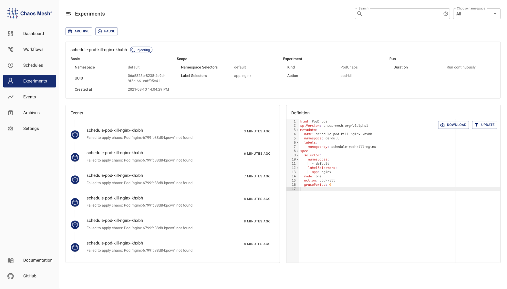
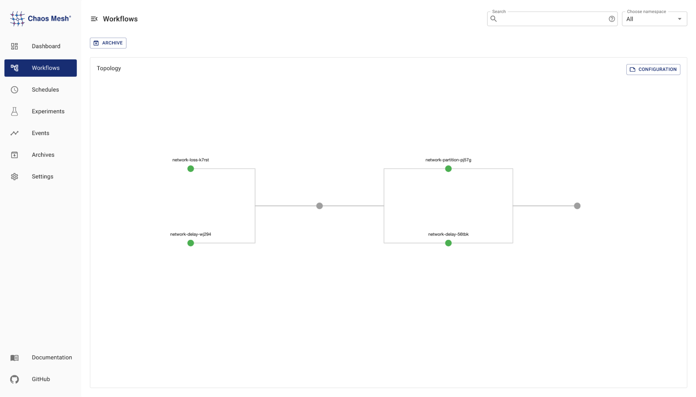
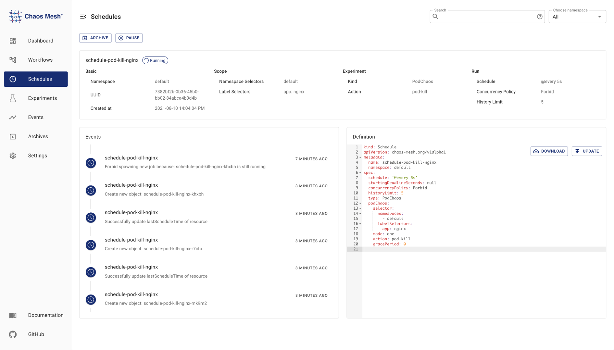

**Author:** [Zhiqiang Zhou](https://github.com/STRRL)

**Transcreator:** [Mila Wu](https://github.com/milasuperstar); **Editor:** [Yajing Wang](https://github.com/anotherrachel)

On July 23, 2021, Chaos Mesh 2.0 was made generally available! It's an exciting release, marking a solid milestone towards the chaos engineering ecology that we hope to build.

Making chaos engineering easier has always been Chaos Mesh's unswerving goal, and this release is a key step. After almost a year of continuous efforts, we have made major improvements in three main areas: ease of use, native experiment orchestration & scheduling, along with the richness of fault injection types.

## Ease of use

We are committed to improving the usability of Chaos Mesh, and a key path to this is Chaos Dashboard, a web interface for users to orchestrate chaos experiments. For Chaos Mesh 2.0, we have improved the Chaos Dashboard in the following ways, further simplifying the complexity of chaos experiments:

* It now supports the creation, viewing, and updating of AWSChaos and GCPChaos, so that conducting chaos experiments in a cloud environment can provide a consistent experience as in Kubernetes;
* It can display more detailed records of each experiment, further enhancing its visibility.

Chaos Dashboard display more details of each experiment

## Native experiment orchestration & scheduling

When conducting chaos experiments, a single experiment is often not enough to simulate a complete testing scenario, and manually starting or stopping the experiment would be a tedious and dangerous thing to do. Previously, we [combined Argo with Chaos Mesh](https://chaos-mesh.org/blog/building_automated_testing_framework) to inject faults automatically as a workflow. However, we later realized that Argo workflow is not the best way to describe declarative chaos experiments, and decided to write another workflow engine. Chaos Mesh 2.0 features native Workflow to support experiment orchestration, which means you can serially or parallely execute multiple experiments. You can even weave in notifications and health checks to simulate more complex experimental scenarios.

Workflow: native experiment orchestration

In previous versions, we used the `cron` and `duration` fields to define chaos experiments that were executed periodically.  It didn't take us long to realize that describing behavior this way was not fitting. For example, a single execution often takes longer than an execution cycle. This definition works fine, but lacks a suitable description for the study of expected behavior. We referred to CronJob and introduced Schedule, a new custom object, to Chaos Mesh. It adds more explicit properties to periodically executed tasks, such as whether multiple experiments are allowed to be executed at the same time, thereby restricting behavior.

Schedule: periodically execute tasks

## Richer fault injection types

Chaos Mesh already supports system-level fault injection types, as well as fault injections into cloud environments such as AWSChaos and GCPChaos. Starting from 2.0, injecting chaos into the application layer has been made possible with the introduction of JVMChaos and HTTPChaos.

### JVMChaos

JVM languages such as Java and Kotlin are widely used in the industry. A JVMChaos can be easily simulated through methods like JVM bytecode enhancement and Java Agent. Currently, JVMChaos uses [chaosblade-exec-jvm](https://github.com/chaosblade-io/chaosblade-exec-jvm), and supports injecting various application-level fault types including method delay, specify return value, OOM and throw custom exception. For more info, you can refer to the document: [Simulate JVM Application Faults](https://chaos-mesh.org/docs/simulate-jvm-application-chaos).

### HTTPChaos

HTTPChaos is a brand new Chaos type supported in the 2.0 version. It can hijack HTTP service requests and responses from the server side, as well as interrupt links, delay injection, or modify Header/Body. It is suitable for all scenarios that use HTTP as the communication protocol. For more information, refer to [Simulate HTTP Faults](https://chaos-mesh.org/docs/simulate-http-chaos-on-kubernetes).

## Chaosd: an fault injection tool for physical nodes

Chaos Mesh is designed for Kubernetes. For physical machine environments, we present [Chaosd](https://github.com/chaos-mesh/chaosd). It evolved from chaos-daemon, a key component in Chaos Mesh, and we have added specific chaos experiments based on the characteristics of physical machines. Currently, Chaosd supports process kill, network, JVM, pressure, disk and a few other types of fault injection onto the physical machine.

## Looking ahead

Chaos Mesh is still under active development, and we have some more powerful features in the works, including:

* To inject JVMChaos at runtime, lowering the cost of JVMChaos and making it more easy-to-use.
* To introduce a plug-in mechanism to build custom chaos experiments, while the Scheduling function remains unimpaired.

In addition, we noticed that chaos experiments can be reused in a number of scenarios, hence we plan to launch a platform, where customized experiments can be turned into templates. This will enable our users to share and reuse not only specific chaos experiments, but also Workflows for different scenarios.

## Try it out!

Try out the [Chaos Mesh 2.0 interactive scenarios](https://chaos-mesh.org/interactive-tutorial) from your browser! There's no need to install or configure, as the complete development environment has been preconfigured with everything you need. Otherwise, you can visit [the Chaos Mesh docs](https://chaos-mesh.org/docs) for more info.

## A big thank you

Thanks to all [Chaos Mesh contributors](https://github.com/chaos-mesh/chaos-mesh/graphs/contributors), Chaos Mesh couldn't have come from 1.0 to 2.0 without all of your efforts!

If you are interested in Chaos Mesh and would like to help us improve it, you're welcome to join [our Slack channel](https://slack.cncf.io/) or submit your pull requests or issues to our [GitHub repository](https://github.com/chaos-mesh/chaos-mesh). Chaos Mesh looks forward to your participation and feedback!
