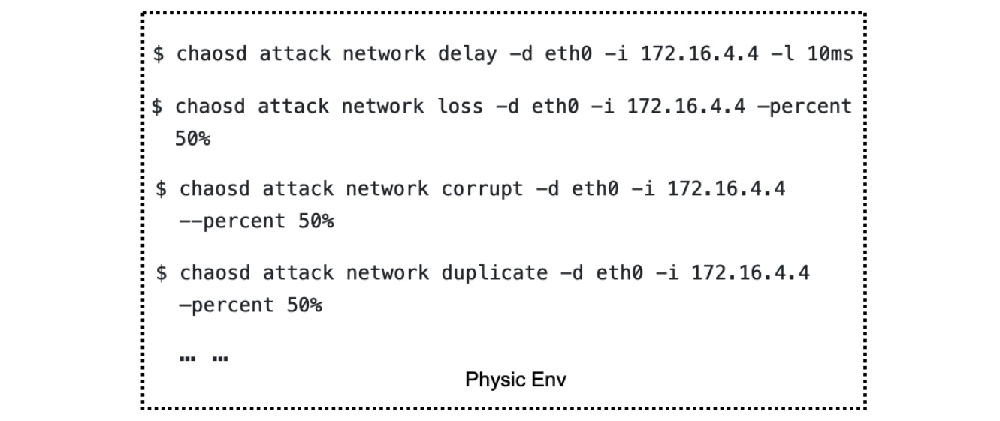
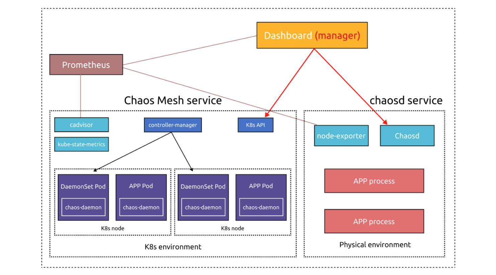
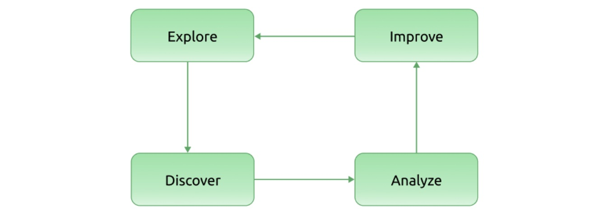

**Authors:**

* Chang Yu (Engineer at Qihoo 360)
* [Xiang Wang](https://github.com/WangXiangUSTC) (Committer of Chaos Mesh, Engineer at PingCAP)

**Transcreator:** [Ran Huang](https://github.com/ran-huang); **Editor:** Tom Dewan

[Chaos Mesh®](https://chaos-mesh.org/) is a cloud-native Chaos Engineering platform that orchestrates chaos in Kubernetes environments. With Chaos Mesh, you can test your system's resilience and robustness on Kubernetes by injecting all types of faults into Pods, network, file system, and even the kernel.

Since it was open-sourced and accepted by the Cloud Native Computing Foundation (CNCF) as a sandbox project, Chaos Mesh has attracted contributors worldwide and helped users test their systems. Yet it still has a lot of room for improvement:

* It needs to improve usability. Some features are complicated to use. For example, when you apply a chaos experiment, you often have to manually check whether the experiment has started.
* It is mostly for Kubernetes environments. Because Chaos Mesh can't manage multiple Kubernetes clusters, you need to deploy Chaos Mesh for each Kubernetes cluster. Though [chaosd](https://github.com/chaos-mesh/chaosd) supports running chaos experiments on physical machines, the features are quite limited, and command line usage is not user friendly.
* It doesn't allow plugins. To apply a customized chaos experiment, you have to alter the source code. Moreover, Chaos Mesh only supports Golang.

Admittedly, Chaos Mesh is a first-rate Chaos Engineering platform, but is still a long way from offering Chaos as a Service (CaaS). Therefore, at [TiDB Hackathon 2020](https://pingcap.com/community/events/hackathon2020/), **we made changes to Chaos Mesh's architecture, moving it one step closer toward CaaS**.

In this article, I'll talk about what CaaS is, how we achieve it with Chaos Mesh, and our plans and lessons learned. I hope you find our experience helpful in building your own Chaos Engineering system.

## What is Chaos as a Service?

As Matt Fornaciari, co-founder of Gremlin, [puts it](https://jaxenter.com/chaos-engineering-service-144113.html), CaaS "means you will get an intuitive UI, customer support, out-of-the-box integrations, and everything else you need to get experimenting in a matter of minutes."

From our perspective, CaaS should offer:

* A unified console for management, where you can edit the configuration and create chaos experiments.
* Visualized metrics for you to see the experiment status.
* Operations to pause or archive experiments.
* Simple interaction. You can easily drag and drop the objects to orchestrate your experiments.

Some companies already adapted Chaos Mesh to meet their own needs, such as [NetEase Fuxi AI Lab](https://pingcap.com/blog/how-a-top-game-company-uses-chaos-engineering-to-improve-testing) and FreeWheel, making it a mock-up for CaaS.

## Developing Chaos Mesh towards CaaS

Based on our understanding of CaaS, we refined the architecture of Chaos Mesh during Hackathon, including improved support for different systems and better observability. You can check out our code in [wuntun/chaos-mesh](https://github.com/wuntun/chaos-mesh/tree/caas) and [wuntun/chaosd](https://github.com/wuntun/chaosd/tree/caas).

### Refactor Chaos Dashboard

The current Chaos Mesh architecture is suited for individual Kubernetes clusters. Chaos Dashboard, the web UI, is bound to a specified Kubernetes environment:

 The current Chaos Mesh architecture 

During this refactor, **to allow Chaos Dashboard to manage multiple Kubernetes clusters, we separate Chaos Dashboard from the main architecture**. Now, if you deploy Chaos Dashboard outside of the Kubernetes cluster, you can add the cluster to Chaos Dashboard via the web UI. If you deploy Chaos Dashboard inside the cluster, it automatically obtains the cluster information through environment variables.

You can register Chaos Mesh (technically, the Kubernetes configuration) in Chaos Dashboard or ask `chaos-controller-manager` to report to Chaos Dashboard via configuration. Chaos Dashboard and `chaos-controller-manager` interact via CustomResourceDefinitions (CRDs). When `chaos-controller-manager` finds a Chaos Mesh CRD event, it invokes `chaos-daemon` to carry out the related chaos experiment. Therefore, Chaos Dashboard can manage experiments by operating on CRDs.

### Refactor chaosd

chaosd is a toolkit for running chaos experiments on physical machines. Previously, it was only a command line tool and had limited features.

 Previously, chaosd was a command line tool 

During the refactoring, **we enabled chaosd to support the RESTful API and enhanced its services so that it can configure chaos experiments by parsing CRD-format JSON or YAML files**.

Now, chaosd can register itself to Chaos Dashboard via configuration and send regular heartbeats to Chaos Dashboard. With the heartbeat signals, Chaos Dashboard can manage the chaosd node status. You can also add chaosd nodes to Chaos Dashboard via the web UI.

Moreover, **chaosd can now schedule chaos experiments at specified time and manage experiment lifecycles, which unifies the user experience on Kubernetes and on physical machines**.

With new Chaos Dashboard and chaosd, the optimized architecture of Chaos Mesh is as follows:

 Chaos Mesh's optimized architecture 

### Improve observability

Another improvement is observability, namely how to tell if an experiment is carried out successfully.

Before the improvement, you had to manually check the experiment metrics. If you injected [StressChaos](https://chaos-mesh.org/docs/simulate-heavy-stress-on-kubernetes/) into a Pod, you had to enter the Pod to see if there was a `stress-ng` process and then use `top` commands to check CPU and memory utilization. These metrics told you whether your StressChaos experiment was created successfully.

To streamline the process, we now integrate `node_exporter` into `chaos-daemon` and chaosd to collect node metrics. We also deploy `kube-state-metrics` in the Kubernetes cluster, combined with cadvisor, to collect Kubernetes metrics. The collected metrics are saved and visualized by Prometheus and Grafana, which provide a simple method for you to check the experiment status.

#### Further improvements needed

Overall, metrics aim to help you:

* Confirm that chaos is injected.
* Observe the chaos impact on the service and make periodic analysis.
* Respond to exceptional chaos events.

To achieve these goals, the system needs to monitor the experiment data metrics, the ordinary metrics, and the experiment events. Chaos Mesh still needs to improve:

* Experiment data metrics, such as the exact latency duration of the injected network latency and the specific load of the simulated workload.
* Experiment events; that is, the Kubernetes events of creating, deleting, and running experiments.

Here is a good example of metrics from [Litmus](https://github.com/litmuschaos/chaos-exporter#example-metrics).

## Other proposals for Chaos Mesh

Because of the limited time at Hackathon, we didn't finish all our plans. Here are some of our proposals for the Chaos Mesh community to consider in the future.

### Orchestration

A closed loop of Chaos Engineering includes four steps: exploring chaos, discovering deficiencies in the system, analyzing root causes, and sending feedback for improvement.

 A closed loop of Chaos Engineering 

However, **most of the current open source Chaos Engineering tools only focus on exploration and do not provide pragmatic feedback.** Based on the improved observability component, we can monitor chaos experiments in real time and compare and analyze the experiment results.

With these results, we will be able to realize a closed loop by adding another important component: orchestration. The Chaos Mesh community already proposed a [Workflow](https://github.com/chaos-mesh/rfcs/pull/10/files) feature, which enables you to easily orchestrate and call back chaos experiments or conveniently integrate Chaos Mesh with other systems. You can run chaos experiments in the CI/CD phase or after a canary release.

**Combining observability and orchestration makes a closed feedback loop for Chaos Engineering.** If you were to launch a 100 ms network latency test on a Pod, you could observe the latency change using the observability component and check if the Pod service is still available using PromQL or other DSL based on orchestration. If the service was unavailable, you may conclude that the service is unavailable when the latency is >= 100 ms.

But 100 ms is not the threshold of your service; you need to know what is the largest latency your service can handle. By orchestrating the value of the chaos experiment, you'll know what is the threshold value you must ensure to meet your service-level objectives. Also, you'll find out the service performance under different network conditions and whether they meet your expectations.

### Data format

Chaos Mesh uses CRDs to define its chaos objects. If we can convert CRDs to JSON files, we can achieve communication between components.

In terms of data format, chaosd just consumes and registers CRD data in JSON format. If a chaos tool can consume CRD data and register itself, it can run chaos experiments in different scenarios.

### Plugins

Chaos Mesh has limited support for plugins. You can only [add a new Chaos](https://chaos-mesh.org/docs/add-new-chaos-experiment-type/) by registering a CRD in Kubernetes API. This brings about two problems:

* You must develop the plugin using Golang, the same language in which Chaos Mesh is written.
* You must merge the extended code into the Chaos Mesh project. Because Chaos Mesh doesn't have a security mechanism like Berkeley Packet Filter (BPF), merging plugin code may introduce extra risks.

To enable full plugin support, we need to explore a new method to add plugins. As Chaos Mesh essentially carries out chaos experiments based on CRD, a chaos experiment only requires generating, listening to, and deleting CRDs. In this regard, we have several ideas worth trying:

* Develop a controller or operator to manage CRDs.
* Handle CRD events uniformly and operate on CRDs via HTTP callback. This method only uses HTTP APIs, with no requirement on Golang. For an example, see [Whitebox Controller](https://github.com/summerwind/whitebox-controller).
* Use WebAssembly (Wasm). When you need to call chaos experiment logic, just call the Wasm program. See Vector's [WASM Transform](https://vector.dev/docs/reference/transforms/wasm/).
* Use SQL to query the chaos experiment status. Because Chaos Mesh is based on CRDs, you can use SQL to operate on Kubernetes. Examples include [Presto connector](https://github.com/xuxinkun/kubesql) and [osquery extension](https://github.com/aquasecurity/kube-query).
* Use SDK-based extensions, such as [Chaos Toolkit](https://docs.chaostoolkit.org/reference/api/experiment/).

### Integration with other Chaos tools

For real-world systems, a single Chaos Engineering tool can hardly exhaust all possible use cases. That's why integrating with other chaos tools can make the Chaos Engineering ecosystem more powerful.

There are numerous Chaos Engineering tools on the market. Litmus's [Kubernetes implementation](https://github.com/litmuschaos/litmus-go/tree/master/chaoslib/powerfulseal) is based on [PowerfulSeal](https://github.com/powerfulseal/powerfulseal), while its [container implementation](https://github.com/litmuschaos/litmus-go/tree/master/chaoslib/pumba) is based on [Pumba](https://github.com/alexei-led/pumba). [Kraken](https://github.com/cloud-bulldozer/kraken) focuses on Kubernetes, [AWSSSMChaosRunner](https://github.com/amzn/awsssmchaosrunner) focuses on AWS, and [Toxiproxy](https://github.com/shopify/toxiproxy) targets TCP. There are also merging projects based on [Envoy](https://docs.google.com/presentation/d/1gMlmXqH6ufnb8eNO10WqVjqrPRGAO5-1S1zjcGo1Zr4/edit#slide=id.g58453c664c_2_75) and Istio.

To manage the various chaos tools, we may need a uniform pattern, such as [Chaos Hub](https://hub.litmuschaos.io/).

## Voices from the community

Here, we'd like to share how a leading cyber security company in China as well as a Chaos Mesh user, adapts Chaos Mesh to meet their needs. Their adaptation has three aspects: physical node, container, and application.

### Physical node

* Support executing scripts on physical servers. You can configure the script directory in CRDs and run your scripts using `chaos-daemon`.
* Simulate reboot, shutdown, and kernel panic using the customized script.
* Shut down the node's NIC using the customized script.
* Create frequent context switching using sysbench to simulate the "noisy neighbor" effect.
* Intercept the container's system call using BPF's `seccomp`. This is achieved by passing and filtering PIDs.

### Container

* Randomly change the number of Deployment replicas to test if the application's traffic is abnormal.
* Embed based on CRD objects: fill Ingress objects in chaos CRDs to simulate the speed limit of the interface.
* Embed based on CRD objects: fill Cilium network policy objects in chaos CRDs to simulate fluctuating network conditions.

### Application

* Support running customized jobs. Currently, Chaos Mesh injects chaos using `chaos-daemon`, which doesn't guarantee fairness and affinity of scheduling. To address this issue, we can use `chaos-controller-manager` to directly create jobs for different CRDs.
* Support running [Newman](https://github.com/postmanlabs/newman) in customized jobs to randomly change HTTP parameters. This is to implement chaos experiments on the HTTP interface, which happens when a user performs exceptional behaviors.

## Summary

Traditional fault testing targets specific points in the system that are anticipated to be vulnerable. It is often an assertion: a specific condition produces a specific result.

**Chaos Engineering is more powerful in that it helps you discover the "unknown unknowns."** By exploring in the broader domain, Chaos Engineering deepens your knowledge of the system being tested and unearths new information.

To sum up, these are some of our personal thoughts and practice on Chaos Engineering and Chaos Mesh. Our Hackathon project is not ready for production yet, but we hope to shed some light on CaaS and draft a promising roadmap for Chaos Mesh. If you're interested in building Chaos as a Service, [join our Slack](https://slack.cncf.io/) (#project-chaos-mesh)!
