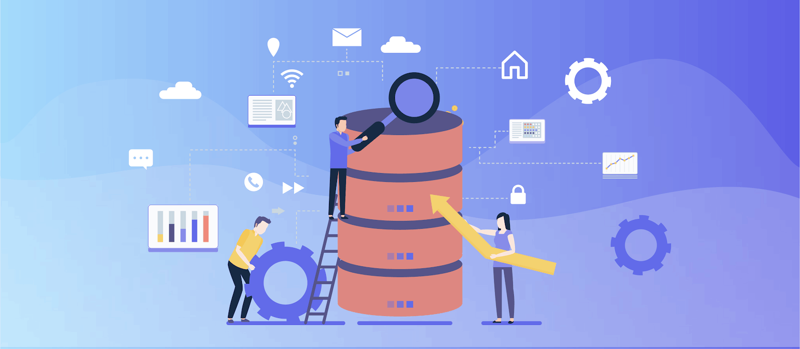

**Industry:** E-Commerce

**Author:** Chunhui Liu and Chao Hong (Database Administrators at Shopee)

[Shopee](https://en.wikipedia.org/wiki/Shopee) is the leading e-commerce platform in Southeast Asia and Taiwan. It is a platform tailored for the region, providing customers with an easy, secure, and fast online shopping experience through strong payment and logistical support.

As our business boomed, our team faced severe challenges in scaling our back-end system to meet the demand. Our [previous article](https://pingcap.com/success-stories/tidb-in-shopee/) introduces how we use [TiDB](https://en.wikipedia.org/wiki/TiDB), an open-source, MySQL-compatible, [hybrid transactional and analytical processing](https://en.wikipedia.org/wiki/Hybrid_transactional/analytical_processing_(HTAP)) (HTAP) database, to scale-out our system so that we can deliver better service for our users without worrying about database capacity.

There are so many databases available in the market. How do you choose the right one? In this post, I'll share our thoughts with you. I hope this post can help you when you're comparing multiple databases and looking for the right fit for your application. 

In this article, I'll discuss:

* [Which databases are we using at Shopee?](#which-databases-are-we-using-at-shopee)
* [The importance of database selection](#the-importance-of-database-selection)
* [Our database selection strategy](#our-database-selection-strategy)
* [Factors to consider when choosing a database](#factors-to-consider-when-choosing-a-database)
* [To shard or not to shard?](#to-shard-or-not-to-shard)
* [Our lessons learned in database selection](#lessons-learned-in-database-selection)
* [How we're using TiDB at Shopee](#how-were-using-tidb-at-shopee)

## Which databases are we using at Shopee?

At Shopee, we use these databases:

* MySQL and [TiDB](https://pingcap.com/docs/stable/) are our relational databases. MySQL stores most of our data, and we are deploying more and more TiDB clusters.
* [Redis](https://en.wikipedia.org/wiki/Redis) is widely used in various Shopee applications.
* Some applications and teams also use other databases such as HBase and [Pika](https://github.com/Qihoo360/pika). But we won't discuss these databases in this article.

## The importance of database selection

Our business is growing fast. This year, we're creating ten times as many databases per week than we did one or two years ago. Every year, the number of logical databases in the production environment grows by about three to five times. In 2019, this number increased more than five times.

Before a database enters the production environment, database administrators (DBAs) and R&D teams give a rough assessment of its physical and logical designs. 

According to our experience, if we make a wrong decision during the design phase, we'll spend a lot of time and energy rectifying it later. Therefore, we must formulate a concise and efficient database selection strategy to ensure that we can make a correct decision most of the time.

## Our database selection strategy

At Shopee, we use this general database selection strategy: 

* We use MySQL by default, but we try to reduce terabyte-scale MySQL instances.
* Where possible, we try to use TiDB. We've used TiDB since 2018, and we especially recommend it in scenarios with large amounts of data that are not suitable for sharding.
* When necessary, we introduce Redis to smooth peak traffic in some relational databases. I'll explain that in detail later.

## Factors to consider when choosing a database

When we're choosing a database from a variety of products, we ask ourselves:

* **Will the data size for our new database exceed 1 TB in the coming 12–18 months?**

    If yes, we should consider MySQL sharding or TiDB.

* **Will a single MySQL table have more than 10 million rows or 10 GB of data?**

    If yes, we can use MySQL sharding or adopt TiDB to achieve [horizontal scalability](https://pingcap.com/docs/stable/key-features/#horizontal-scalability) and avoid laborious sharding. That's because we found that when a single MySQL table contains over 10 million rows of data, or a single table occupies more than 10 GB of disk space, the database might be slower and difficult to maintain. For example, some SQL queries are difficult to optimize and online data definition language (DDL) becomes a big challenge.

* **Will the write queries per second (QPS) for a single MySQL node exceed 1,000 writes per second?**

    If yes, we can try the following approaches: 

    * Apply MySQL sharding to distribute write traffic to multiple MySQL masters.
    * Use TiDB to scatter writes to more nodes.
    * Consider introducing Redis or message queues as the write cache to implement asynchronous writes.

    You might think that 1,000 writes per second is too low a threshold. We set it to 1,000 because:

    * Before we put an application into production, our estimate might be inaccurate. In normal conditions, we have 1,000 writes per second. But when we‘re running a big sales promotion campaign, the write QPS may jump to 10,000 writes per second. It's better to set a conservative reference value. 
    * We allow the R&D team to use large text fields. When the length of a single row increases to a certain point, the write performance for the master database and the replication performance for the slave database may be drastically slower. Thus, we can't expect a high write rate for a single node.

* **Does the application require that the 99th percentile response time be within one millisecond (ms)?**

    If yes, we'd better not directly read or write to the database. We can use Redis as a buffer layer. The front-end directly reads and writes to Redis to ensure high-speed I/O. 

    Based on our experience with MySQL, in most scenarios, after we optimize the MySQL server options, table schema designs, SQL statements, and application code, the 99th percentile response time can be under 10 ms.

    TiDB's computing and storage layers are separated, and multiple components work together to execute SQL statements. Therefore, we expect the 99th percentile response time in TiDB to be about 100 ms.

## To shard or not to shard?

At Shopee, we have a list with dozens of checkpoints to help us assess a new database design, among which "To shard or not to shard" is an important one. For a long time, MySQL sharding was the only way for us to horizontally scale a database. After we introduced TiDB to Shopee, we got a new "no sharding" option.

According to our experience, in some scenarios, MySQL sharding has more cons than pros. We have to bear extra costs for daily development, operations, and maintenance. During the database selection phase, DBAs and R&Ds need to identify the following scenarios and find specific ways to solve problems: 

* **When we cannot accurately estimate a database's capacity**

    For example, the size of incremental data for an online log database in the last three months exceeds that in the past three years. If we implement sharding, we need to reshard this kind of database again and again. Each sharding process is complex and takes a lot of effort. 

    According to our experience, TiDB is an ideal solution to log storage. Currently, at Shopee, it's a common practice to store logs in TiDB. 

* **When we use a database to run multi-dimensional complex queries**

    Take an e-commerce order database as an example. Each subsystem needs to filter data by buyer, seller, order status, and payment method. If we shard by buyer, it will be difficult to query the sellers' information, and vice versa.

    On one hand, we've created separate heterogeneous index databases for the most significant query dimensions. On the other hand, we've implemented order aggregation tables on TiDB to aggregate order data scattered among various shards into a single TiDB table. This lets complicated SQL queries that need a full table scan directly run on TiDB's aggregation table. 

* **When data is unevenly distributed in a database**

    For social application data such as "Like" and "Follow," if we shard the database by user, data might be unevenly distributed. Data volume for a minority of shards might be significantly higher than that for other shards. These shards with large amounts of data are also hotspots for reads and writes. This easily incurs performance bottlenecks. 

    A common practice is resharding: slicing data into more partitions to reduce each shard's data size and read-write traffic.

    Recently, we've begun to migrate some data to TiDB. Theoretically, if TiDB tables' primary keys are sparsely scattered, hot data could be evenly distributed among TiKV [Regions](https://pingcap.com/docs/dev/glossary/#regionpeerraft-group) (the basic unit for data storage in TiKV).  
On the whole, MySQL sharding could solve the horizontal scaling issue for databases, but it leads to some pain points in development, operations, and maintenance. We attempt to mitigate and solve problems under the MySQL sharding framework. Meanwhile, we try to establish TiDB-based solutions in which we don't have to shard a database. In this respect, we've made progress.

## Lessons learned in database selection

So far, I've described Shopee's basic strategy for database selection and related critical metrics. In this section, I'll share with you what we've learned.

### Using MySQL as an in-memory database

At Shopee, we sometimes use MySQL as an in-memory database. After an application comes into the production environment, the R&D team may first focus on the application logic, while the code of the database access layer might not be optimal.

Therefore, during the early phase of a project, slow queries and bursty high-frequency reads and writes are common issues. To address these issues, we try to ensure that the memory space is large enough to load all hot data into the MySQL buffer pool. This helps mitigate some application performance issues. 

According to our statistics, 80% of Shopee's production databases have less than 50 GB of data. Because the memory size of our database servers is larger than 50 GB, we can get through the application trial-and-error period. When we enter the data-outburst phase, we can ask the R&D team to optimize the database.

### Reducing terabyte-scale databases

Of all our production databases, 2.5% have more than 1 TB of data. The average data size of these terabyte-scale databases is 2 TB. The largest has more than 4 TB of data. The DBA's first priority is continually reducing the data volume of those terabyte-scale databases.

To tackle the soaring data size for a database, we can try MySQL sharding and TiDB. We can also archive old data and upgrade hardware resources.

#### Archiving old data

Old data occupies a lot of disk space, but they're not read or written frequently. It means that they're probably not "hot data." If the application owner lets us, we usually archive old data to a separate MySQL instance. The application needs to migrate reads and writes to the new instance. The new instance stores old data by year or month in different tables to avoid a single table being too large. For the new instance, we can also enable InnoDB transparent page compression to decrease disk usage.

TiDB is a good choice for data archiving. Theoretically, a TiDB cluster can infinitely scale out, and users don't need to worry about limited disk capacity. TiDB features elastic horizontal scalability in both the computing and storage layers. Therefore, we can gradually add servers according to the data growth and application read and write traffic. This helps ensure efficient hardware usage and prevents many resources from being idle in the early production stage of an archiving database.

#### Scaling up

You may wonder what happens when MySQL's data size hits 1 TB, and disk space is scarce. Can we double the disk space and increase the memory capacity to win more time for engineers to shard a database? 

Actually, when a database has terabyte-scale data, it might be difficult to implement database sharding for an application that has been there for a long time. If it‘s possible to archive old data to maintain the data volume at a stable level (but the database still stores terabytes of data), we can also upgrade hardware to improve database performance. 

### Using Redis to smooth peak traffic

We have two ways to use Redis to handle high concurrent reads and writes:

* Writing to the cache and then the database
* Writing to the database and then the cache

#### Writing to the cache and then the database 

The application front-end directly reads and writes to Redis. The application back-end smoothly and asynchronously persists data to MySQL or TiDB. In this case, MySQL and TiDB serve as the persistent layer for the Redis data. When we're designing a system, if we predict high concurrent reads and writes in the production environment, it works to use Redis as a buffer layer. 

For some social-related applications at Shopee, their peak traffic during a big promotion campaign is dozens of or even hundreds of times higher than usual. These applications are typical performance-critical applications. If the R&D team doesn't anticipate it and the application still directly reads and writes to the database, the database will crash when the traffic surges in the promotion campaign. In this scenario, Redis is an ideal solution to alleviate the back-end database's peak traffic.

What if the whole Redis cluster goes down? We have two solutions:

* Make the application directly read and write to the database. This may affect the performance, but it keeps the integrity of most data. Some data-critical applications tend to adopt this solution.
* Switch traffic to a new Redis cluster to resume the service and then start to accumulate data. Also, it's possible to run another application to load some old data from the database to Redis. Some applications have high concurrent operations but can tolerate data loss. They can adopt this solution.

#### Writing to the database and then the cache

We still use the application to read and write to the database. We can use Shopee's Data Event Center (DEC), a middleware that continuously parses the MySQL binlog, reorganizes results, and then writes to Redis. This way, intensive read-only traffic could be moved to Redis. This greatly reduces the load on the database.

When we rebuild data into Redis, we can customize data structures for specific query patterns. SQL is not suitable for implementing some queries. Sometimes, using Redis to run these queries is more efficient.

In addition, compared with the application writing data to the database and Redis simultaneously, rebuilding data in Redis by parsing the MySQL binlog is more beneficial. Its application implementation is easy, so developers don't need to be aware of the data replication logic from the database to Redis. 

But its shortcoming is write latency. Data is written to the MySQL master and then sent to Redis. In this process, there may be dozens of milliseconds of latency. If we want to use Redis this way, we need to know whether the application accepts such latency.

When we query new orders in real time, we usually avoid high-frequency read-only queries on MySQL masters by this way. To avoid the impact of slave replication delays, we had to route queries for some critical columns of Shopee order tables to MySQL masters. In a big promotion campaign, the master might be overwhelmed. Therefore, we changed our approach and first wrote new order data to MySQL and then transformed binlog parsing results to Redis. This way, we effectively relieved the pressure on MySQL masters.

### Refactoring data structures and code instead of direct migration

When developers migrate data from MySQL to TiDB, DBAs often remind developers to adapt data structures and code to TiDB.

Here is an example. A system was previously implemented with MySQL sharding. This solution equally divided all data into 1,000 tables. After we migrated to TiDB, we stopped sharding and merged these tables into a single table. 

After we finished migration and the application resumed services, we found that an SQL query's performance jittered severely. In high concurrent traffic, this query even led to the entire TiDB cluster hanging.

We analyzed this query and found that: 

* The query ran quite frequently. It took up 90% of all the read-only queries at peak time.
* The query was a complicated SQL query which needed a full table scan. It was difficult to optimize the query by adding an index. Before migrating to TiDB, MySQL had 1,000 tables. When we executed the query, only one small table was scanned, and we had more than 20 MySQL slaves to serve the query. Even so, as the data size increased and the hot data volume exceeded memory size, all MySQL slaves were overwhelmed. 

    After data was migrated to TiDB and 1,000 tables merged into one, the query had to scan a much bigger table. Large amounts of intermediate result sets were passed from TiKV nodes to SQL nodes. Thus, the performance was undesirable. 

Based on the analysis above, the R&D team introduced Redis. When they transformed binlog parsing results to Redis, they customized a data structure for the query. They switched 90% of the read-only queries to Redis. As a result, the query became faster and more stable, and TiDB's storage and computing nodes were remarkably reduced.

TiDB is [highly compatible with the MySQL syntax](https://pingcap.com/docs/stable/key-features/#mysql-compatible-syntax). This eases the migration from MySQL to TiDB. But TiDB is a new database, and its implementation is totally different from MySQL's. So we need to work out a customized solution according to TiDB's characteristics and the specific application scenarios.

## How we're using TiDB at Shopee

[TiDB](https://pingcap.com/docs/stable/overview/) is an open-source NewSQL database that supports HTAP workloads. It's MySQL compatible and features horizontal scalability, strong consistency, and high availability. See [its architecture](https://pingcap.com/docs/stable/overview/).

This section gives an overview of the TiDB cluster status at Shopee and the scenarios in which we use TiDB.

### Cluster status

* By the end of 2019, Shopee had deployed 20+ TiDB clusters in the production environment. There are 400+ nodes.
* The data size is 200+ TB.
* We mainly use [TiDB 2.1](https://pingcap.com/docs/stable/releases/2.1ga/) in the production environment and are beginning to try [TiDB 3.0](https://pingcap.com/docs/stable/releases/3.0-ga/) in some applications.
* The largest cluster has 40+ nodes, with about 30 TB of data.
* These TiDB clusters run in multiple systems like users, items, orders, and risk control.

### Application scenarios

At Shopee, we use TiDB in three scenarios:

* Log storage

    * Use cases: audit log and risk control system
    * The front-end application writes log data to [Kafka](https://kafka.apache.org/). A back-end application asynchronously consumes Kafka messages and transforms them into TiDB. Applications like admin back-end websites can directly read logs from TiDB.
    * We can add storage and computing nodes as needed. The operations and maintenance are easier than MySQL sharding.

*   Data aggregation for MySQL sharding
    
    * Use cases: order data aggregation and item data aggregation
    * Application data is written to MySQL shards. We developed a middleware called Data Event Center (DEC) to parse the MySQL binlog and asynchronously replicate data to TiDB. Applications such as  business intelligence (BI) and admin back-end systems run complex queries on TiDB. They don't need to consider sharding rules and directly read aggregation tables in TiDB.

*   Applications directly reading and writing to TiDB
    
    * Use case: Shopee chat system
    * The application directly reads and writes to TiDB. We don't need sharding. This makes it easier to implement applications. We have setup [TiDB Binlog](https://pingcap.com/docs/stable/reference/tidb-binlog/overview/) components for some clusters and parsed binlog to Kafka. Then, other applications can subscribe to the data changes.

## Conclusion

This post covered Shopee's thoughts on how to select a relational database and our experience using MySQL, TiDB, and Redis. 

In brief, if your data size is small and your application is in its early stages, MySQL is a good choice for you. You also don't need to compromise your application design for sharding. That's because as your business develops and data volume grows, you can smoothly migrate from MySQL to TiDB. Your application will be horizontally scalable while application development is still flexible. Meanwhile, you can utilize Redis to speed up queries and relieve the pressure on the database, so that you can focus more on throughput and strong consistency.

We chose TiDB because of its open-source, horizontally-scalable, and MySQL- compatible features. In the past two years, we've witnessed TiDB's fast development and notable progress. TiDB is one of the most important database infrastructures at Shopee, and we're using it in more and more scenarios. In the future, TiDB will serve more traffic for Shopee.

We would like to thank PingCAP members and the TiDB community for building TiDB and providing helpful support for us.

## About Shopee

Shopee is the leading e-commerce platform in Southeast Asia and Taiwan. It was launched in 7 markets in 2015 to connect consumers, sellers, and businesses in the region.

Shopee offers an easy, secure, and engaging experience that is enjoyed by millions of people daily. It offers a wide product assortment, supported by integrated payments and logistics, as well as popular entertainment features tailored for each market. Shopee is also a key contributor to the region's digital economy with a firm commitment to helping brands and entrepreneurs succeed in e-commerce.

Shopee is a part of Sea Limited (NYSE:SE), a leading global consumer internet company. In addition to Shopee, Sea's other core businesses include its digital entertainment arm, Garena, and digital financial services arm, SeaMoney. Sea's mission is to better the lives of consumers and small businesses with technology.
