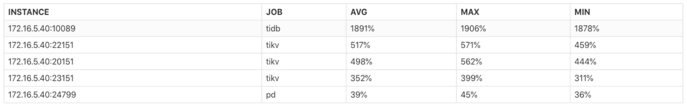
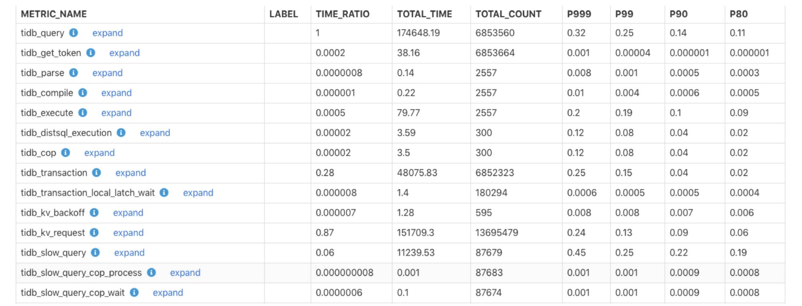
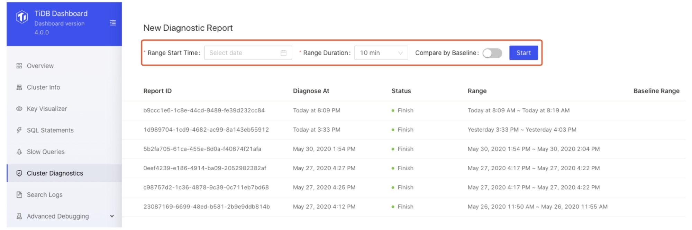
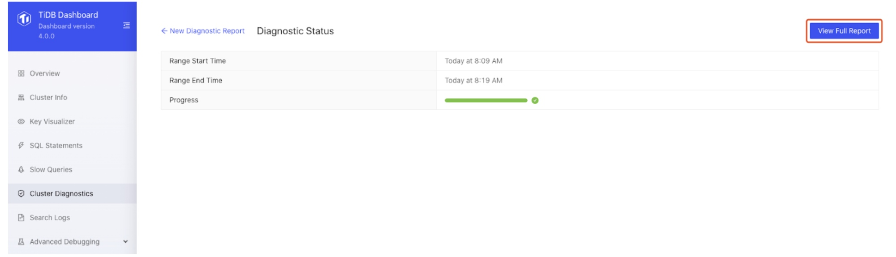
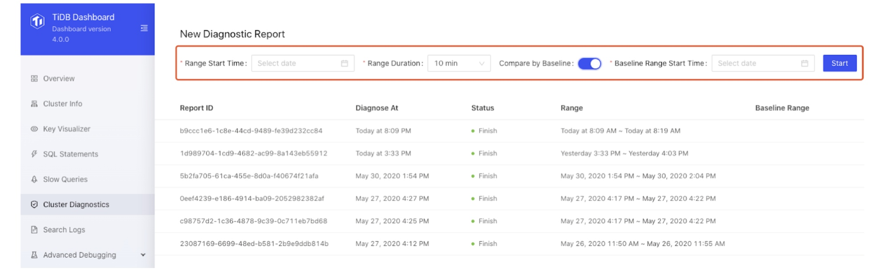
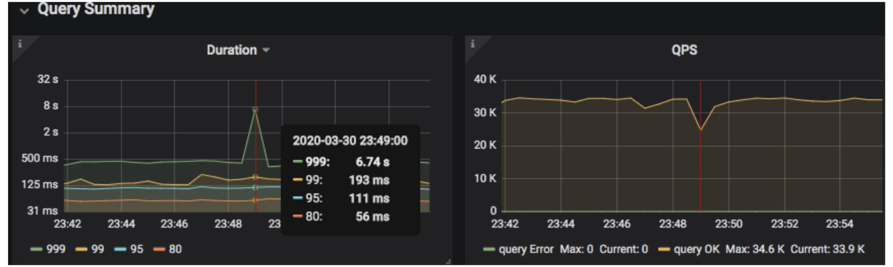
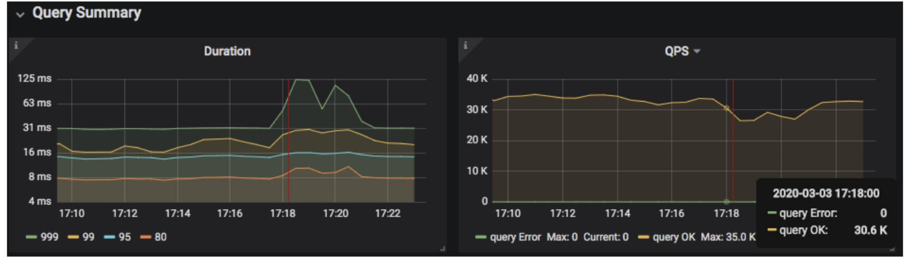
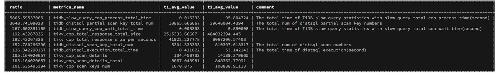

**Authors:** [Heng Long](https://github.com/lonng), [Shuang Chen](https://github.com/crazycs520) (Software Engineers at PingCAP)

**Transcreator:** [Caitin Chen](https://github.com/CaitinChen); **Editor:** Tom Dewan


[TiDB](https://docs.pingcap.com/tidb/dev/overview) is an open-source, distributed SQL database that supports [Hybrid Transactional/Analytical Processing](https://en.wikipedia.org/wiki/HTAP) (HTAP) workloads. Ideally, a TiDB cluster should always be efficient and problem free. It should be stable, load-balanced, and have a reliable rate of queries per second (QPS). There shouldn't be any jitters (either in the cluster or on disk), and no hotspots, slow queries, or network fluctuations.

However, the reality is often unsatisfactory. For external reasons, application traffic may surge and increase the pressure on the cluster. Through a chain reaction of events, the CPU load maxes out, out of memory errors occur, network latency increases, and disk writes and reads slow down.

Before TiDB 4.0, when these problems occurred in the cluster, there was no uniform way to locate them. We had to use various external tools to find problems in the cluster. It was tedious and time-consuming.

Now, TiDB 4.0 introduces a new feature, cluster diagnostics, a built-in widget in TiDB Dashboard, which lets you diagnose cluster problems within a specified time range and summarize the diagnostic results and cluster-related load monitoring information in a diagnostic report.

Our [previous post](https://pingcap.com/blog/easier-troubleshooting-for-distributed-databases/#cluster-diagnostics) gave you a quick peek at this feature. In this post, we'll elaborate on cluster diagnostics's diagnostic reports, and show you examples of how cluster diagnostics can help you quickly find system problems.


<div class="caption-center"> Cluster diagnostic report </div>

## How cluster diagnostics makes your job easier

It's important to provide a consistent user experience and reduce the learning curve. There is a lot of information that is relevant to troubleshooting, including cluster static information and cluster runtime information. We reorganize this information across the entire cluster to make sure that you can access it using SQL queries, without the need for external tools. At the same time, you can extract common SQL statements as scripts and write different troubleshooting scripts for different application scenarios.

## Querying logs with cluster diagnostics

In a TiDB cluster, a single transaction might involve multiple instances of TiDB's storage engine, [TiKV](https://pingcap.com/docs/stable/architecture/#tikv-server). Before TiDB 4.0, if you wanted to view logs related to a specific transaction ID (`txn_id`), you might need to log in to all nodes and view the logs using the grep command. But in TiDB 4.0 and later, we offer cluster log tables. You can view all relevant logs with only one SQL statement. For example:

```
SELECT * FROM information_schema.cluster_log where message like "%{txn_id}%" and time > '2020-03-27 15:39:00' and time < '2020-03-27 15:50:00'
```

Similarly, splitting and merging the basic unit of TiKV storage (the [Region](https://docs.pingcap.com/tidb/v4.0/glossary#regionpeerraft-group)) and the Region [leader](https://docs.pingcap.com/tidb/v4.0/glossary#leaderfollowerlearner) switch usually involve multiple TiKV nodes. You can quickly view all activities in a life cycle of a Region through the log table.

When you query logs, the SQL statement's predicates are pushed down to each log node for filtering, and no program collects all the logs. So the overhead is controllable and is lower than using the grep command. You can do what a distributed grep command can do but with less overhead.

## Cluster diagnostic reports

In TiDB 4.0, if you want to diagnose or inspect the cluster within a time range, or check the load of the cluster, you can generate a diagnostic report for a period of time in TiDB Dashboard. The diagnostic report contains the diagnostic results during this period and monitoring and configuration information for each component in the system.

### The instance CPU usage report

The instance CPU usage report lets you view the average (AVG), maximum (MAX), and minimum (MIN) CPU usage for TiDB, Placement Driver (PD), and TiKV instances. You can use this report to quickly judge whether the cluster's load is balanced or if it has hotspots.


<div class="caption-center"> The instance CPU usage report </div>

### The monitoring execution time report

The monitoring execution time report presents the monitoring time for each component in the cluster and what percentage it is of the total execution time for all queries. You can use this report to quickly determine whether a component's execution time is too long and whether there is a bottleneck.


<div class="caption-center"> The monitoring execution time report </div>

The description for each field is as follows:

* METRIC_NAME: The name for the monitoring item.
* LABEL: The monitoring label information. To get more detailed monitoring information for each label in this monitoring, click **expand**.
* TIME_RATIO: The ratio of the total execution time for this monitoring item to the total execution time for the monitoring item whose TIME_RATIO is 1. For example, the ratio of the total execution time for `tidb_kv_request` to the total execution time for `tidb_query` is: 151709.3/174648.19=0.87.
* TOTAL_TIME: The total execution time, in seconds, for the monitoring item.
* TOTAL_COUNT: The number of times the monitoring item ran.
* P999: The execution time, in seconds, that 99.9% of the monitoring samples fall below.
* P99: The execution time, in seconds, that 99% of monitoring samples fall below.
* P90: The execution time, in seconds, that 90% of monitoring samples fall below.
* P80: The execution time, in seconds, that 80% of monitoring samples fall below.

## How to generate diagnostic reports

To generate a diagnostic report:

1. Choose a time range and click **Start**:


<div class="caption-center"> Choose a time range </div>

2. After a report is generated, click **View Full Report**.


<div class="caption-center"> View the full report </div>

If the system has any abnormal behavior, such as QPS jitters or higher latency, you can generate a comparison report for that time range and for a time range with normal activities. You can easily compare the differences between system metrics of the two time periods, so you can quickly find the problem:


<div class="caption-center"> Generate a comparison report </div>

## Cases for automatic diagnostics and time range comparison

Here are two cases that show how cluster diagnostics helped us quickly find system problems.

### Automatic diagnostics and system inspection

Cluster diagnostics automatically diagnoses system faults and potential problems in the current cluster. This feature lets you inspect the cluster as a whole and analyze the system for bottlenecks. You don't have to check the monitoring information for nodes one by one. Diagnostic results are output to the `information_schema.inspection_result` system table. When you query this table, you trigger diagnostics. When you encounter a problem, you can first query this table to find the cause.

The automatic diagnostics is based on a series of built-in diagnostic rules, and it gives diagnostic results by querying the cluster information.

Currently, diagnostic rules are as follows:

* `config`: Checks configuration consistency. It checks whether the same type of components have the same configurations and whether configuration values are set properly.

* `version`: Checks version consistency. It checks whether versions of the same type of components are consistent.

* `node-load`: Checks server node load. It checks whether CPU, memory, and disk usage are too high.

* `critical-error`: Checks critical errors in the system, such as `server is busy`, component restarting, and failures to write the binlog.

* `threshold-check`: Checks whether some monitoring metrics exceed threshold values, for example:

    * Whether the CPU usage of a thread in TiKV's components exceeds threshold values
    * Whether [leaders](https://docs.pingcap.com/tidb/v4.0/glossary#leaderfollowerlearner) and [Regions](https://docs.pingcap.com/tidb/v4.0/glossary#regionpeerraft-group) (the basic data storage unit in TiKV) are balanced among TiKV instances
    * Whether a TiKV instance has too many Regions and whether a single instance has more than 20,000 Regions

We're still improving the rules cluster diagnostics uses. If you're interested in adding rules, you can file a pull request [on GitHub](https://github.com/pingcap/tidb/).

Let's look at an example. In the following monitoring interface, the query's 999th percentile latency and queries per second (QPS) suddenly jittered and then immediately returned to normal. What caused this phenomenon?


<div class="caption-center"> The 999th percentile latency and QPS suddenly jittered </div>

To diagnose the cluster problem in a specified time range, we used the `time_range` SQL hint to specify it:

```
mysql>select /*+ time_range("2020-03-30 23:45:00", "2020-03-30 23:50:00") */ * from inspection_result;
+----------------+-------------+------+-------------------+-------+-----------+----------+--------------------------------------------------------------------+
| RULE           | ITEM        | TYPE | INSTANCE          | VALUE | REFERENCE | SEVERITY | DETAILS                                                            |
+----------------+-------------+------+-------------------+-------+-----------+----------+--------------------------------------------------------------------+
| critical-error | server-down | tikv | 172.16.5.40:23151 |       |           | critical | tikv 172.16.5.40:22151 restarted at time '2020/03/30 23:48:38.763' |
+----------------+-------------+------+-------------------+-------+-----------+----------+--------------------------------------------------------------------+
```

The above result showed that the `172.16.5.40:23151` TiKV instance restarted at 23:48:38.763 on March 30, 2020. This time roughly matched when the QPS jittered. Based on this finding, we could investigate the issue further.

### Comparing two time ranges to quickly find system problems

Automatic diagnostics does not always pinpoint the problem. More often than not, you need to find the problem based on monitoring and other information. However, a TiDB cluster has many monitoring metrics. To quickly identify abnormal monitoring items, you can compare two time ranges.

Let's see another example. In the monitoring interface below, the query's 999th percentile latency and QPS suddenly dropped at 17:18:00 on March 3, 2020 and, after a few minutes, returned to normal status. Why?


<div class="caption-center"> The query's 999th percentile latency and QPS suddenly dropped </div>

In TiDB 4.0, the `metrics_summary` monitoring system table contains TiDB, PD, and TiKV instances and some monitoring items of the server node. We can use this table to compare all system monitorings when the system is normal against when the system has a problem to quickly find the monitoring item with the biggest difference during the two time ranges:

* The time range t1 with a normal cluster status: ("2020-03-03 17:08:00", "2020-03-03 17:11:00")
* The time range t2 with an abnormal cluster status: ("2020-03-03 17:18:00", "2020-03-03 17:21:00")

We used the following SQL statement to join the monitorings of the two time periods based on the monitoring metric name and sorted them according to the gap value. Note that `TIME_RANGE` is a hint that specifies the query time:

```
SELECT GREATEST(t1.avg_value,t2.avg_value)/LEAST(t1.avg_value,
         t2.avg_value) AS ratio,
         t1.metrics_name,
         t1.avg_value as t1_avg_value,
         t2.avg_value as t2_avg_value,
         t2.comment
FROM
    (SELECT /*+ time_range("2020-03-03 17:08:00", "2020-03-03 17:11:00")*/ *
    FROM information_schema.metrics_summary ) t1
JOIN
    (SELECT /*+ time_range("2020-03-03 17:18:00", "2020-03-03 17:21:00")*/ *
    FROM information_schema.metrics_summary ) t2
    ON t1.metrics_name = t2.metrics_name
ORDER BY  ratio DESC limit 10;
```


<div class="caption-center"> Query results </div>

The query results above showed that:

* The `tidb_slow_query_cop_process_total_time` (`cop process`s' execution time in TiDB slow queries) in t2 was about 5,866 times that in t1.
* The `tidb_distsql_partial_scan_key_total_num` (the number of keys scanned by TiDB's `distsql` requests) in t2 was about 3,648 times that in t1.
* The `tidb_slow_query_cop_wait_total_time` (`cop` requests' waiting time in TiDB slow queries) in t2 was about 267 times that in t1.
* The `tikv_cop_total_response_size` (the size of the result returned by TiKV's `cop` requests) in t2 was about 192 times that in t1.
* The `tikv_cop_scan_details` (the number of scans of TiKV's `cop` requests) in t2 was about 105 times that in t1.

According to the statistics above, we knew that t2 had more `cop` requests than t1. As a result, TiKV Coprocessor was overloaded and `cop task` waited. The reason might be that there were a lot of large queries in t2. We could use `CLUSTER_SLOW_QUERY` to query whether there were unexpected queries during the t2 time period.

At last, we found the root of the problem. During t1 and t2, we were running the `go-ycsb` stress test, and 20 `tpch` queries were running during t2. Therefore, `tpch` large queries led to too many `cop` requests.

## Summary

The cluster diagnostics feature simplifies and streamlines TiDB cluster monitoring. Say goodbye to multiple tools and multiple learning curves. Further, you can monitor and analyze the entire cluster at the same time. No more checking each node individually.

Cluster diagnostics is a work in progress. We're still adding some diagnostic rules, and we look forward to feedback and advice from the open-source community. If you'd like to help us, join our [community on Slack](https://slack.tidb.io/invite?team=tidb-community&channel=everyone&ref=pingcap-blog) and share your idea with us.
