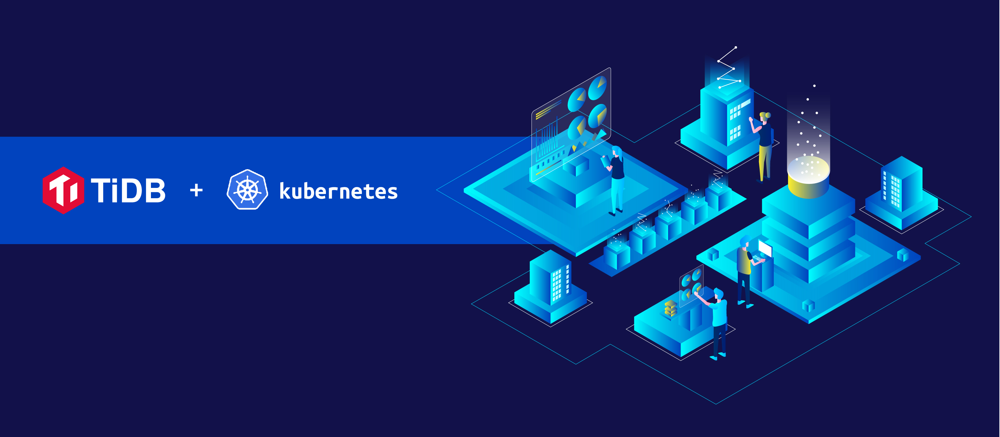
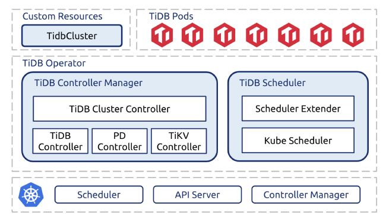

Last August, we open-sourced [TiDB Operator](https://github.com/pingcap/tidb-operator)—a project that lets you automatically deploy and maintain [TiDB](https://github.com/pingcap/tidb) database clusters in [Kubernetes](https://kubernetes.io/). Since then, we have continuously improved its ease of use based on user feedback, and increased its reliability by rigorous stability testing. Today, we are proud to announce that TiDB Operator 1.0 is ready for General Availability!

Deploying transactional databases like TiDB in Kubernetes for production has always been challenging because stateful applications like databases need interchangeability, consistency, availability, redundancy, etc. As the team behind TiDB, an open-source distributed NewSQL database with MySQL compatibility, we take it as our mission to simplify the deployment and management so that our community users can enjoy the best TiDB can offer without bringing in additional operational cost. Now, with TiDB Operator 1.0, running TiDB database clusters has never been easier.

## What is TiDB Operator

TiDB Operator is a system that automates the operation and maintenance of TiDB clusters in Kubernetes. TiDB Operator covers the full range of TiDB management tasks from deployment, upgrades, scaling, to backup, recovery, and configuration changes.

 *TiDB Operator 1.0 architecture* 

With TiDB Operator, TiDB can run seamlessly in Kubernetes clusters deployed on public cloud platforms or privately-deployed Kubernetes clusters.

## What makes TiDB Operator unique

As the first GA version, TiDB Operator 1.0 has the following highlights.

### Easier TiDB operation and maintenance

Because TiDB is a relatively complex distributed system, you often need professional knowledge to deploy, operate, and maintain TiDB clusters. 

To make these tasks easier, we developed TiDB Operator. It injects professional TiDB operation and maintenance knowledge into Kubernetes through custom resources, custom controllers, and the scheduler extender, and lets you manage TiDB clusters through Kubernetes' declarative API style.

More importantly, the standardized cluster management API lets you deeply integrate the internal toolchain or platform as a service (PaaS) with TiDB cluster management. Working with TiDB becomes easier than ever!

### Stability and reliability

To ensure that all the automatic operations and maintenance are stable and reliable, we designed a specific stability test for TiDB Operator to observe whether it behaves as expected. In this test, we add large read and write loads and continuously perform various operations and maintenance tasks. Meanwhile, we simulate the failure of hosts, containers, disks, networks, Kubernetes components, and TiDB Operator components. Through such 24x7 stability tests, we found and fixed many issues, including [Two Linux Kernel Bugs](https://pingcap.com/blog/try-to-fix-two-linux-kernel-bugs-while-testing-tidb-operator-in-k8s/). Before this 1.0 GA release, the TiDB Operator stability test has run smoothly for months.

### Support for multiple cloud platforms

TiDB Operator provides Terraform deployment scripts so you can deploy TiDB clusters on Amazon Web Services (AWS), Google Cloud, and Alibaba Cloud. With these scripts, you can create a Kubernetes cluster and deploy one or more production TiDB clusters on it within 20 minutes. 

As you manage the cluster, the Terraform script not only operates the TiDB cluster but also operates related cloud resources at the same time. For example, when you scale out a TiDB cluster, the Terraform script automatically creates more cloud servers to satisfy the resource requirements after scaling.

## Try TiDB Operator

Currently, you can use TiDB Operator to quickly deploy a TiDB cluster on 

* [AWS EKS (Elastic Kubernetes Service)](https://pingcap.com/docs/v3.0/tidb-in-kubernetes/deploy/aws-eks/)
* [GKE (Google Kubernetes Engine)](https://pingcap.com/docs/v3.0/tidb-in-kubernetes/get-started/deploy-tidb-from-kubernetes-gke/)
* [Alibaba Cloud ACK (Container Service for Kubernetes)](https://pingcap.com/docs/v3.0/tidb-in-kubernetes/deploy/alibaba-cloud/)

You can also learn how to [deploy a TiDB cluster on general Kubernetes clusters](https://pingcap.com/docs/v3.0/tidb-in-kubernetes/deploy/general-kubernetes/) and try [TiDB Operator](https://pingcap.com/docs/v3.0/tidb-in-kubernetes/deploy/tidb-operator/) on any Kubernetes cluster. 

TiDB Operator is also available on OperatoHub.io, check out [TiDB Operator](https://operatorhub.io/operator/tidb-operator).

## One more thing...

We would like to thank all the [TiDB Operator contributors](https://github.com/pingcap/tidb-operator/graphs/contributors) for helping us reach this important milestone. Without them, we couldn’t have gone this far. If you also want to contribute to TiDB Operator, you can [file issues](https://github.com/pingcap/tidb-operator/issues) or refer to the [contributing guide](https://github.com/pingcap/tidb-operator/blob/master/docs/CONTRIBUTING.md) to commit code directly. You’re welcome to join this community and help shape what TiDB Operator will be tomorrow!
