**Author:** Wan Wei (Database Engineer at PingCAP, specializing in database storage engine development and system performance optimization)

Traditionally, transactional and analytical data are managed in separate systems. To derive business insights to support important business decisions, enterprises have to use [extract, transform, load](https://en.wikipedia.org/wiki/Extract,_transform,_load) (ETL) tools and processes to migrate data from an [online transaction processing](https://en.wikipedia.org/wiki/Online_transaction_processing) (OLTP) database to an [online analytical processing](https://en.wikipedia.org/wiki/Online_analytical_processing) (OLAP) database. This approach involves complex software, and leads to issues like stale or inconsistent data. Any insights gained from this stale data are of limited value.

In 2014, [Gartner Inc.](https://en.wikipedia.org/wiki/Gartner) coined a term: [HTAP](https://en.wikipedia.org/wiki/Hybrid_transactional/analytical_processing_(HTAP)), short for **Hybrid Transactional/Analytical Processing**. An HTAP database aims to break the wall between transaction processing and analytics. In 2015, we at [PingCAP](https://pingcap.com/en/) began to develop [TiDB](https://en.wikipedia.org/wiki/TiDB), an open-source MySQL-compatible HTAP database, to meet both OLTP and OLAP requirements in a single system. To further strengthen our OLAP capabilities, we're now building TiFlash, an extended analytical engine and a columnar store for TiDB, which has currently increased the scan performance for massive data by four to nine times.

A TiDB database that incorporated TiFlash lets users perform **real-time analytics**, which means analyzing data immediately after that data enters the system. In such case, there is a near-zero latency between data ingestion and processing. By exploiting real-time data to power predictive analytics, enterprises can identify emerging marketing opportunities or make business decisions as soon as data comes in. This way, they can stay ahead of fierce market competition. 

In this post, I'll deep dive into why we need an HTAP database like TiDB, what TiFlash is, and how TiFlash fuels TiDB to evolve into a true HTAP database.

## Why we need an HTAP database

This section describes why OLTP and OLAP were originally separated and the disadvantages of this architecture.

### Reasons for separating OLTP and OLAP systems

Before the Internet data surge, the amount of data in enterprises was generally not large. Especially for the core business, a single standalone database was adequate to store the data. At that time, storage architectures were not complicated. We could run OLTP and OLAP workloads on the same database. 

However, as the business became more complex, and the amount of data kept increasing, a notable problem occurred: it was difficult to process only OLTP requests in a standalone database, not to mention handling analytical queries simultaneously. **Running OLTP and OLAP tasks in the same database might cause might cause a huge impact on OLTP workloads.**

We could use the master-slave model or sharding to relieve the problem, but it would be hard to implement application requirements.

In this context, the big data technology represented by [Apache Hadoop](https://en.wikipedia.org/wiki/Apache_Hadoop) began to flourish. This technology builds a data analysis platform with many relatively inexpensive x86 machines, and uses parallel capabilities to solve computing problems of big data sets. In addition, architects **divide the storage system into two modules: online transactions and data analysis**. 

As shown in the following figure, the application data is extracted by the ETL tool, and then imported into a data analysis platform. The application database focuses on OLTP workloads, and the analysis platform on OLAP workloads.

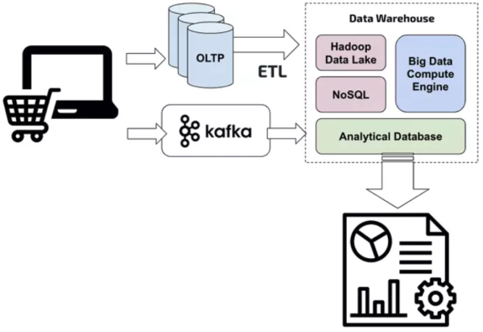

 Traditional data platform 
 

### Disadvantages of separating OLTP and OLAP systems

The traditional data platform's architecture seems perfect, but it has the following disadvantages:

* **It results in high operational costs**. The ETL process itself is very tedious. Because data storage is divided into two systems, it inevitably brings higher integration costs, maintenance costs, and users' learning costs. If you use a mix of open-source Big Data tools to build a data analytics platform, you will encounter compatibility problems with these tools, and intermingling of good and undesirable tools might cause quality issues.

* **It can't deliver real-time data analytics**. The more up-to-date the data is, the greater its value will be. Many application scenarios require the low latency of real-time data. For example, a risk monitoring system continuously analyzes data, and responds immediately after any risk occurs. But ETL is a periodic operation, and data for ETL is streamed once an hour or once a day. Thus, the data used for reporting is never the most up to date.

* **It can't guarantee data consistency**. Consistency is an important concept in the database field, and the database transaction is used to ensure consistency. If data is stored in two different systems, it is difficult to ensure data consistency. The query result of the OLAP system can't correctly correspond to the online transaction. Then, these two systems can't cooperate well. For example, users can't access the data of the two systems simultaneously in a single transaction. 

Because of the above limitations for the traditional data processing platform, we developed **TiDB**, an open-source MySQL-compatible HTAP database, which serves as a one-stop solution for both OLTP and OLAP. Our users needn't worry about the complex architecture of the data platform, or feel anxious when they have to select a product from various OLTP-specific and OLAP-specific options.

## Challenges in building an HTAP database

To build an HTAP database system like TiDB, we had to conquer several engineering problems. Building an HTAP system is a tough task due to the following reasons:

* OLTP and OLAP systems have different design philosophies:
    
    * In OLTP scenarios, we focus on transaction correctness. Their performance metrics are [queries per second](https://en.wikipedia.org/wiki/Queries_per_second) (QPS) and latency. OLTP systems often deal with point writes or point selects.
    * In OLAP scenarios, we're more concerned with the query throughput, the processing capability, and the costs for large batches of data. In many cases, to do an analytics query, the system must scan millions of rows of data, and join more than 10 tables.

* OLTP systems usually use row-oriented storage (or row stores), like [InnoDB](https://en.wikipedia.org/wiki/InnoDB) and [RocksDB](https://en.wikipedia.org/wiki/RocksDB), while OLAP systems usually use column-oriented storage (or column stores). To implement these two in the same system, it's difficult for the architect to make tradeoffs between row stores and column stores. 

* OLAP queries are resource-consuming. If they are not isolated well from OLTP queries, OLTP performance will be affected.

## What is TiDB

The TiDB platform is a collection of components that when used together become a NewSQL database with HTAP capabilities.

 TiDB platform architecture 
 

Inside the TiDB platform, the main components are as follows:

* **[TiDB server](https://github.com/pingcap/tidb)** is a stateless SQL layer that processes users' SQL queries, accesses data in the storage layer, and returns the corresponding results to the application. It is MySQL-compatible and sits on top of TiKV.

* **[TiKV server](https://github.com/pingcap/tikv)** is the distributed transactional key-value storage layer where the data persists. Designed specially for **processing OLTP workloads**, it uses the [Raft](https://raft.github.io/) consensus protocol for replication to ensure strong data consistency and high availability.

* **[Placement Driver (PD) server](https://github.com/pingcap/pd)** is a metadata cluster powered by [etcd](https://github.com/etcd-io/etcd) that manages and schedules TiKV.

* **[TiSpark](https://github.com/pingcap/tispark) cluster** also sits on top of TiKV. It is an [Apache Spark](https://spark.apache.org/docs/latest/index.html) plugin that works with the TiDB platform to **support complex OLAP queries for business intelligence (BI) analysts and data scientists**.

Beyond these main components, TiDB also has an ecosystem of tools, such as [Ansible scripts](https://github.com/pingcap/tidb-ansible) for quick deployment, [Syncer](https://www.pingcap.com/docs/tools/syncer/) and [TiDB Data Migration](https://github.com/pingcap/dm) for seamless migration from MySQL, and [TiDB Binlog](https://github.com/pingcap/tidb-binlog) for ​collecting the logical changes made to a TiDB cluster and providing incremental backup and replication to the downstream (TiDB, Kafka, or MySQL)​.

## Why we build TiFlash

As an HTAP database, TiDB targets both OLTP and OLAP scenarios. TiDB is highly compatible with MySQL protocols, so it can be used as a linearly scalable MySQL. Its architecture design fulfills OLTP requirements. 

In 2017, we released TiSpark, which directly accesses the data in TiKV (the storage layer of TiDB), and exploits the powerful computing capability of Apache Spark to boost TiDB's OLAP capability. 

However, TiKV is designed specially for **OLTP scenarios**. It has a limited capability to extract and analyze large volumes of data. For many OLAP queries, column-oriented databases outperform row-oriented databases. Therefore, we introduced TiFlash to promote TiDB's OLAP capabilities and power TiDB to become a true HTAP database.

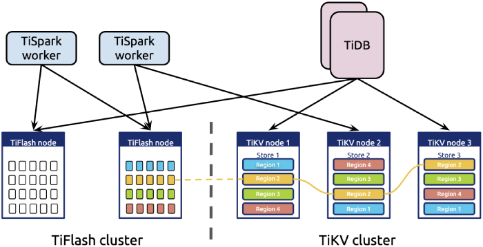

 TiFlash architecture 
 

## What is TiFlash

TiFlash is an extended analytical engine for TiDB. 

* TiFlash and TiKV nodes are deployed separately to store data. The computing nodes in the top layer, including TiSpark and TiDB nodes, can access TiKV and TiFlash.

* TiFlash can not only store data, but also push down some computing logic.

* Data is replicated from TiKV to TiFlash via the Raft learner protocol.

* Because TiFlash and TiKV nodes are deployed independently, using TiFlash to tackle heavy computing workloads doesn't affect OLTP tasks.

* Unlike TiKV, TiFlash uses a columnar and vectorized execution engine. This is optimized for OLAP scenarios.

* TiFlash has a high-performance computing capability, because it's partially based on the vectorized engine of [ClickHouse](https://en.wikipedia.org/wiki/ClickHouse).

## TiFlash's internals 

This section shows details of TiFlash's core technologies, including column-oriented storage, low-cost data replication, strong consistency, and high frequency update support.

### Column-oriented storage

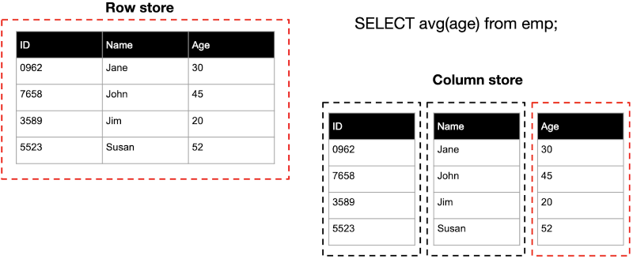

 Row-oriented storage vs. column-oriented storage 
 

Generally, OLAP systems use column-oriented storage, and so does TiFlash. TiFlash performs scan operations 10 times faster than TiKV because the columnar format has the following characteristics:

* Columns that are not needed for the query result are skipped. This provides better utilization of available I/O and CPU-memory bandwidth. 

* Data is stored by column. Thus, it's possible to achieve a high compression ratio and scan throughput.

* It works naturally with a vectorized engine without need of transformation.

    <a href="/download" onclick="trackViews('Delivering Real-time Analytics and True HTAP by Combining Columnstore and Rowstore', 'download-tidb-btn-middle')"><button>Download TiDB</button></a>
    <a href="https://share.hsforms.com/1e2W03wLJQQKPd1d9rCbj_Q2npzm" onclick="trackViews('Delivering Real-time Analytics and True HTAP by Combining Columnstore and Rowstore', 'subscribe-blog-btn-middle')"><button>Subscribe to Blog</button></a>

In contrast, row-oriented storage is more suitable for OLTP scenarios, which are characterized by point query access patterns. In these scenarios, only a small amount of data must be read, and operations are performed at smaller I/O granularity. High QPS and low latencies can be implemented in most index-based queries. 

We have integrated TiFlash and TiKV inside TiDB, so users can choose which storage method to use. After data is written to TiKV, users determine whether to replicate the data (currently by table or database) to TiFlash to process analytic queries faster. 

### Low-cost data replication

Data replication is one of the most significant issues in distributed systems. TiKV is a storage layer in TiDB, and its data must be replicated to TiFlash in real time. We use the [Raft algorithm](https://raft.github.io/) to replicate data from TiKV to TiFlash. 

In a Raft group, TiFlash is a Raft learner instead of a Raft leader or follower, because TiFlash currently doesn't support direct writes from the SQL client (TiDB or TiSpark). We'll support this feature in the near future.

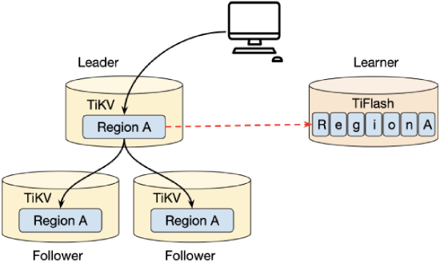

 Data replication for a Raft learner 
 

To speed up data replication, replicating Raft logs from a leader to a follower or learner could be performed asynchronously. When a log entry is replicated to the majority of nodes (leader and followers), it is considered committed. 

The majority doesn't include the learner. This means that writes don't need the learner's acknowledgement. Therefore, data on a learner node might be out of date. But as an advantage, this mechanism sharply reduces data replication overhead costs caused by introducing TiFlash. Note that if data replication latency is high, it indicates there might be network problems or machine write performance issues. If latency is high, an alert prompt displays to guide users about what to do next.

### Strong consistency

As mentioned above, the leader node asynchronously replicates logs to learners. Then how to guarantee read consistency? Generally, logs on the leader node are the most up to date, so we read data only on this node. We can't directly read data on TiFlash, because it serves as a learner node in the Raft cluster, and its updates might be delayed. 

A Region is the basic unit for data storage, and multiple Region replicas form a Raft group. Based on the Raft log offset and global timestamp, we use the Raft follower/learner reads mechanism to support data reading on TiFlash nodes:

1. The local Region on TiFlash nodes obtains the latest committed index from the leader Region on TiKV nodes, based on the timestamp (`ts`) when the request is initiated.

2. For all Regions, if the Raft log of the local Region replica has been committed to the latest index, it's safe to directly read this Region replica.

3. For each unique key, the system selects all versions with the commit `ts` no greater than the read `ts`. Among these versions, the one with the latest committed `ts` is the version we should read.

How does the learner know that the current Region replica is sufficiently new? The answer is: before reading data, the learner with its read `ts` sends a request to the leader to obtain the Raft log offset that ensures the Region replica is sufficiently new. 

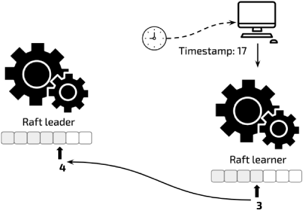

 Raft learner sends a request to the leader 

When serving a read request, the Raft learner sends the leader a request to obtain the latest committed index. Then, the leader returns the latest committed index (for example, 4) to the learner.

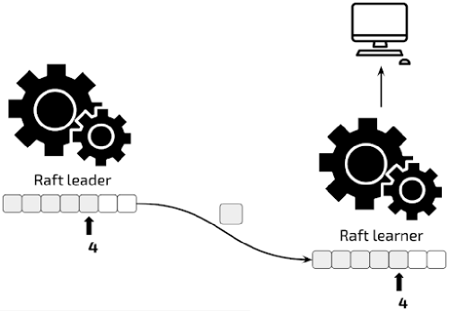

 Leader sends the Raft log to the learner 

The learner waits until the leader sends it the Raft log (for example, the tenth Raft log). The learner reads the log on the local node, and then returns data to the client.

Currently, before the local Region replica is updated to sufficiently new, TiFlash waits until a timeout. In the future, we'll add a new strategy, such as the learner proactively asking the leader to replicate log entries.

### Update support

All changes on the TiKV table are replicated to TiFlash. When you replicate data between systems with different structures, it's natural to encounter thorny issues. One typical issue is how to replicate transactional updates in TiKV to TiFlash in real time. Generally, it's more difficult to update the columnar storage format than the row storage format due to the following reasons:

* In the columnar storage format, chunks are usually used for compression. In general cases, column compression chunks are larger than row compression chunks, and might increase [write amplification](https://en.wikipedia.org/wiki/Write_amplification). 
* Columnar storage can cause more small random I/O requests.
* OLAP applications perform a lot of scans. When updates are frequent, it's difficult to ensure scan performance.

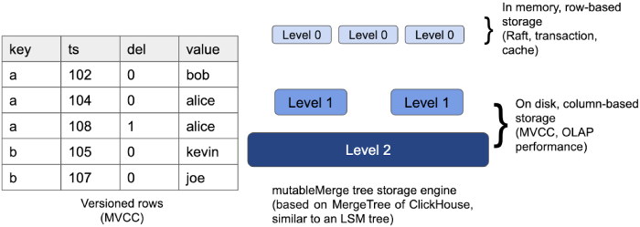

 Update support 

As a solution, TiFlash uses a storage engine similar to a [log-structured merge-tree](https://en.wikipedia.org/wiki/Log-structured_merge-tree) (LSM tree) and [multiversion concurrency control](https://en.wikipedia.org/wiki/Multiversion_concurrency_control) (MVCC) to implement the same isolation level with TiDB. The LSM tree architecture can handle OLTP high-frequency small I/O writes well. And its partially ordered property could benefit the scan operation.

## What's possible with TiFlash

Using TiFlash with TiDB lets you do the following:

*   Use TiDB in more scenarios.
*   Minimize the effects of OLAP applications on OLTP applications.
*   Integrate TiFlash and TiKV for killer performance.
*   Hide system complexity and simplify your application architecture. 

### Using TiDB in more scenarios

TiFlash endows TiDB with true OLAP capabilities, giving you storage and computing specially optimized for OLAP systems. By adding or removing nodes, we can dynamically increase or decrease TiDB's OLTP or OLAP capabilities. We no longer need to manually replicate data between two separate systems. What's more, operations are performed in real time and are ACID compliant. **TiDB becomes immensely flexible and can fit more of your scenarios**.

### Minimizing the effect of OLAP applications on OLTP applications

**TiDB isolates OLAP and OLTP applications, minimizing the effect of OLAP on OLTP.**

Because TiFlash is deployed independently from TiKV, it's possible to isolate hardware resources. TiDB uses labels to manage different types of storage nodes.

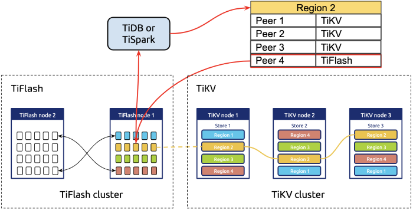

 Isolation of OLAP and OLTP applications 

In the TiDB system, both TiFlash and TiKV are the storage layer. However, when they start, they report different node labels to the managing component of the TiDB cluster (the Placement Driver). Based on the node label, TiDB routes requests of different types to the corresponding nodes. 

If users choose to have a clean isolation between transactional and analytical workloads, they can set configurations to guide TiDB which storage engine to read from. This ensures that heavy I/O requests and computing operations won't affect TiKV's OLTP applications.

### Integrating TiFlash and TiKV for killer performance

TiFlash nodes do more than just getting replicated data from TiKV nodes. Further cooperation of TiFlash and TiKV **helps achieve the effect of "1 + 1 > 2."** Inside the TiDB project, the computing layer (TiDB server or TiSpark) can read data from TiFlash and TiKV simultaneously, as shown in the figure below.

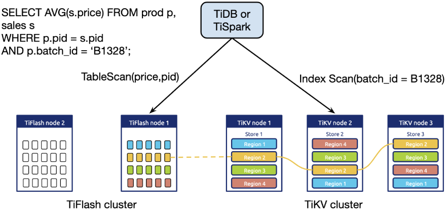

 Integrating TiFlash and TiKV 

For example, an SQL statement needs to join two pieces of data: one needing a full table scan and the other to be queried by index. Obviously, we can simultaneously use TiFlash's powerful scan operations and TiKV's point queries. It's worth mentioning that users usually deploy three or five replicas in TiKV, and to save costs, they might deploy only one replica in TiFlash. When one TiFlash node fails, we need to replicate data from TiKV again.

The figure below compares the performance of  TiSpark+TiFlash and [Spark](https://en.wikipedia.org/wiki/Apache_Spark)+[Parquet](https://en.wikipedia.org/wiki/Apache_Parquet). As you can see, the performance of TiSpark+TiFlash is comparable to that of Spark+Parquet; TiSpark+TiFlash supports real-time updates and transactional consistency while Spark+Parquet does not.

 TiFlash vs. Parquet 

TiFlash is iterating fast. Compared to the figure above, the latest version has considerably boosted performance. In addition, we're now developing a new storage engine specifically designed for TiFlash, which will increase the scan performance by 50%.

### Hiding system complexity to simplify the application architecture

To meet their application requirements, companies must often integrate multiple technologies.  However, this approach requires a complicated ETL pipeline to copy data from one or more sources to a destination system. It often takes a long time to finish an ETL process, and this hinders companies' ability to do real-time data analysis. 

We've designed TiDB to hide system complexity and simply your application architecture.

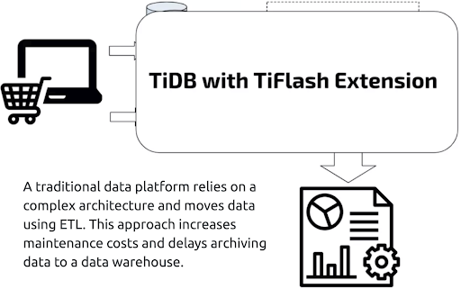

 TiDB hides system complexity 

## What's next

As a data analytics extension, TiFlash fosters TiDB's OLAP capabilities, and, accordingly, shapes TiDB into a true HTAP database. Our users can do predictive analytics using real-time data to make business decisions more quickly than their competitors. This gives them a crucial head start in the market. 

We also plan to add [massive parallel processing](https://en.wikipedia.org/w/index.php?title=Massive_parallel_processing&redirect=no) (MPP) support and direct write support on the columnar engine without the need of a Raft learner.

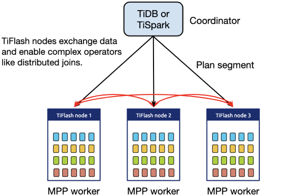

 TiFlash MPP cluster 

Direct write support on the columnar engine will enable the product to be useful in a lot more cases. For example, user can build a data warehouse directly on TiFlash storage, or combining TiFlash with TiKV to form a lambda architecture within TiDB by moving historical data from TiKV to TiFlash.

Currently, we're running a [proof of concept](https://en.wikipedia.org/wiki/Proof_of_concept) (PoC) for TiFlash internally with some of our partners. We expect to release TiFlash's general availability (GA) version by the end of 2019. Please stay tuned.

Finally, we would like to extend our appreciation for the excellent work of the ClickHouse team. Without their work, we couldn't have sailed our TiFlash journey so smoothly.

If you're interested in TiFlash technologies, you can contact me at [weiwan@pingcap.com](mailto:weiwan@pingcap.com).

<!--[if lte IE 8]>

<![endif]-->

