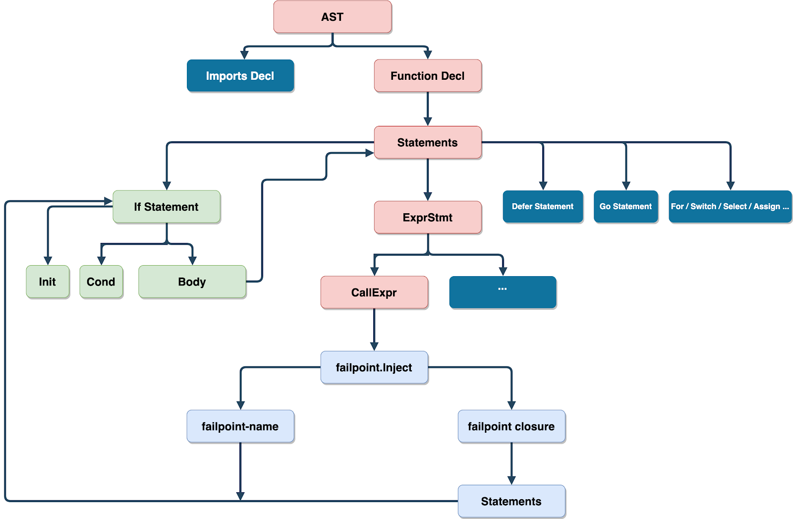

Generally, a large complex system consists of multiple components. To test this system, it is essential to simulate faults in each component. Further, we should integrate fault simulation into the automated testing system without being intrusive to the testing system. We judge the correctness and stability of the system by automatically activating fault points in automated testing to simulate faults and observing whether the final result meets our expectations.

Manual testing can be expensive or lack the fine-grained control we need. For example, it could be disastrous to simulate a network anomaly by plugging and unplugging the network cable in a distributed system or to simulate a disk failure by damaging the disks in a storage system. Therefore, we need some automated methods to perform deterministic fault testing.

The [Failpoint project](https://github.com/pingcap/failpoint) was created just for this purpose. It is an implementation of [FreeBSD](https://en.wikipedia.org/wiki/FreeBSD) [failpoints](http://www.freebsd.org/cgi/man.cgi?query=fail) for Golang. Failpoints let us inject errors or abnormal behaviors into the code and trigger these abnormal behaviors by environment variables or code. A failpoint simulates error handling in various complex systems to improve their fault tolerance and stability.

You can use failpoints to simulate any error a component produces. Some typical application scenarios include the following:

- Random service delays or unavailable services in the microservice architecture.
- Increases in disk I/O latency, insufficient I/O throughput, and long times to persist data to the disk in the storage system.
- Hotspots in the scheduling system and failure of executing some scheduling instructions.
- A third party repeatedly requests the callback interface of a successful charge in the charging system.
- Instability, framedrops, and high latency in a game player's network, and various anomalous inputs (plug-in requests) in game developing.

## Why "reinvent the wheel"?

Although the [etcd](https://github.com/etcd-io/etcd) team developed [gofail](https://github.com/etcd-io/gofail/) in 2016 that has greatly simplified fault injection, and we introduced gofail to perform fault injection testing in 2018, we still want to improve its features and make it easier to use. Therefore, we decided to invent a better "wheel."

Before introducing our new wheel, let's first see how to use the old one.

### How to use gofail?

1. Inject a failpoint in the program by adding code comments.

    ```
    // gofail: var FailIfImportedChunk int
    // if merger, ok := scp.merger.(*ChunkCheckpointMerger); ok && merger.Checksum.SumKVS() >= uint64(FailIfImportedChunk) {
    // rc.checkpointsWg.Done()
    // rc.checkpointsWg.Wait()
    // panic("forcing failure due to FailIfImportedChunk")
    // }
    // goto RETURN1

    // gofail: RETURN1:

    // gofail: var FailIfStatusBecomes int
    // if merger, ok := scp.merger.(*StatusCheckpointMerger); ok && merger.EngineID >= 0 && int(merger.Status) == FailIfStatusBecomes {
    // rc.checkpointsWg.Done()
    // rc.checkpointsWg.Wait()
    // panic("forcing failure due to FailIfStatusBecomes")
    // }
    // goto RETURN2

    // gofail: RETURN2:
    ```

2. Use the `gofail enable` command to convert the comments to code.

    ```
    if vFailIfImportedChunk, __fpErr := __fp_FailIfImportedChunk.Acquire(); __fpErr == nil { defer __fp_FailIfImportedChunk.Release(); FailIfImportedChunk, __fpTypeOK := vFailIfImportedChunk.(int); if !__fpTypeOK { goto __badTypeFailIfImportedChunk}
        if merger, ok := scp.merger.(*ChunkCheckpointMerger); ok && merger.Checksum.SumKVS() >= uint64(FailIfImportedChunk) {
            rc.checkpointsWg.Done()
            rc.checkpointsWg.Wait()
            panic("forcing failure due to FailIfImportedChunk")
        }
        goto RETURN1; __badTypeFailIfImportedChunk: __fp_FailIfImportedChunk.BadType(vFailIfImportedChunk, "int"); };

    /* gofail-label */ RETURN1:

    if vFailIfStatusBecomes, __fpErr := __fp_FailIfStatusBecomes.Acquire(); __fpErr == nil { defer __fp_FailIfStatusBecomes.Release(); FailIfStatusBecomes, __fpTypeOK := vFailIfStatusBecomes.(int); if !__fpTypeOK { goto __badTypeFailIfStatusBecomes}
        if merger, ok := scp.merger.(*StatusCheckpointMerger); ok && merger.EngineID >= 0 && int(merger.Status) == FailIfStatusBecomes {
            rc.checkpointsWg.Done()
            rc.checkpointsWg.Wait()
            panic("forcing failure due to FailIfStatusBecomes")
        }
        goto RETURN2; __badTypeFailIfStatusBecomes: __fp_FailIfStatusBecomes.BadType(vFailIfStatusBecomes, "int"); };

    /* gofail-label */ RETURN2:
    ```

### Issues while using gofail

While using gofail, we encountered the following issues:

- If we inject a failpoint in the program by modifying code comments and there is no compiler to detect errors, we may introduce errors in the code.
- Our failpoints are globally valid. To shorten the time of automated testing, large projects usually introduce parallel testing. In this case, different parallel projects interfere with each other.
- We need to write some hacking code to avoid unnecessary error logs. Taking the above code as an example, we must write `// goto RETURN2` and `// gofail: RETURN2:` with a blank line between them. (To understand the reason for this approach, review the above generated code.)

## What kind of failpoints should we design?

### What should an ideal failpoint look like?

An ideal failpoint should be defined by the code and not be intrusive to the application logic. In a language that supports macros (like [Rust](https://github.com/rust-lang/rust)), we can define a failpoint by defining a `fail_point` macro as follows:

```
fail_point!("transport_on_send_store", |sid| if let Some(sid) = sid {
    let sid: u64 = sid.parse().unwrap();
    if sid == store_id {
        self.raft_client.wl().addrs.remove(&store_id);
    }
})
```

However, we face the following difficulties:

- Golang does not support macros.
- Golang does not support compiler plug-ins.
- Golang tags cannot be implemented elegantly (`go build --tag="enable-failpoint-a"`).

### Failpoint design principles

We designed a failpoint based on the following principles:

- A failpoint should be defined by the Golang code instead of comments or other techniques.

- The failpoint code shouldn't have extra overhead.

  - It shouldn't affect the normal feature logic or be intrusive to any feature code.
  - Injecting the failpoint code shouldn't lead to performance regression.
  - The failpoint code can't appear in the finally released binary files.

- The failpoint code should be easy to read and write, and can be checked by an introduced compiler.

- The finally generated failpoint code should be readable.
- For the generated code, the line number of the feature logic code should remain the same for the convenience of debugging.
- Parallel testing should be supported, and we should be able to control whether a specific failpoint is activated using `context. Context`.

### How to implement a failpoint macro in Golang?

We can use an abstract syntax tree ([AST](https://en.wikipedia.org/wiki/Abstract_syntax_tree)) to rewrite the code to implement failpoints that meet the above design principles in Golang. The rationale diagram is as follows:



For any Golang source file, we can parse its syntax tree to traverse the whole syntax tree, find the injection points of all failpoints, and rewrite and convert the syntax tree to the logic we want.

## Related concepts

### Failpoint

A failpoint is a code snippet, and it is executed only when the corresponding failpoint name is activated. If we disable a failpoint using `failpoint.Disable("failpoint-name-for-demo")`, this failpoint isn't triggered. Failpoint code snippets aren't compiled in the final binary files.

Look at the following example. Assume that we simulate the file system permission control:

```
func saveTo(path string) error {
    failpoint.Inject("mock-permission-deny", func() error {
         // It's OK to access outer scope variable
                    return fmt.Errorf("mock permission deny: %s", path)
    })
}
```

If we just want to simulate no privilege for the specific directory, for example, `/etc/` and `/usr/`, we can define `GO_FAILPOINTS=mock-permission-deny=return("/etc/,/usr/")`.

```
func saveTo(path string) error {
    failpoint.Inject("mock-permission-deny", func(val failpoint.Value) {
        deniedPath := strings.Split(val.(string), ",")
        for _, d := range deniedPath {
            if strings.HasPrefix(path, d) {
                err := fmt.Errorf("mock permission deny: %s", path)
                                    failpoint.Return(err)
            }
        }
    })
}
```

### The Marker function

It marks the part that needs rewriting during the AST rewriting phase and has the following features:

- Hints Rewriter to rewrite an equivalent `if` statement.

  - Parameters of the Marker function are used in the rewriting process.
  - The Marker function is an empty function. It is inline in the compiling process and can then be eliminated.
  - The failpoint injected in the Marker function is a closure. If the closure visits an external variable and the closure syntax allows capturing an external variable, compiling errors don't occur. The converted code is an `if` statement and no issues occur when this statement visits an external variable. Closure capturing is simply a way to validate the syntax and doesn't cause extra overhead.

- It's easy to read and write.
- It introduces compiler testing. If the Marker function parameters are incorrect, the program can't be compiled successfully. This ensures the correctness of converted code.

### Currently supported Marker functions

- `func Inject(fpname string, fpblock func(val Value)) {}`
- `func InjectContext(fpname string, ctx context.Context, fpblock func(val Value)) {}`
- `func Break(label ...string) {}`
- `func Goto(label string) {}`
- `func Continue(label ...string) {}`
- `func Return(results ...interface{}) {}`
- `func Fallthrough() {}`
- `func Label(label string) {}`

<div class="trackable-btns">
    <a href="/download" onclick="trackViews('Try to Fix Two Linux Kernel Bugs While Testing TiDB Operator in K8s', 'download-tidb-btn-middle')"><button>Download TiDB</button></a>
    <a href="https://share.hsforms.com/1e2W03wLJQQKPd1d9rCbj_Q2npzm" onclick="trackViews('Try to Fix Two Linux Kernel Bugs While Testing TiDB Operator in K8s', 'subscribe-blog-btn-middle')"><button>Subscribe to Blog</button></a>
</div>

## How to inject a failpoint in the program

You can call `failpoint.Inject` to inject a failpoint to the call site, and `failpoint.Inject` is rewritten as an `if` statement. In the `if` statement, `mock-io-error` is used to judge whether to trigger a failpoint and after a failpoint is triggered, the logic of failpoint-closure is executed.

For example, if we inject an I/O error into a function that reads a file:

```
failpoint.Inject("mock-io-error", func(val failpoint.Value) error {
    return fmt.Errorf("mock error: %v", val.(string))
})
```

The converted code is as follows:

```
if ok, val := failpoint.Eval(_curpkg_("mock-io-error")); ok {
    return fmt.Errorf("mock error: %v", val.(string))
}
```

Next, we activate failpoints in the program via `failpoint.Enable("mock-io-error", "return("disk error")")`. If `failpoint.Value` needs to be granted a customized value, we need to pass a failpoint expression, like `return("disk error")`. For more syntax, see [failpoint syntax](https://www.freebsd.org/cgi/man.cgi?query=fail).

The closure can be nil. For example, `failpoint.Enable("mock-delay", "sleep(1000)")` means that the code sleeps for one second at the injection point, and no extra logic needs to be executed.

```
failpoint.Inject("mock-delay", nil)
failpoint.Inject("mock-delay", func(){})
```

The above code outputs the following code:

```
failpoint.Eval(_curpkg_("mock-delay"))
failpoint.Eval(_curpkg_("mock-delay"))
```

If we just want to execute a panic in a failpoint and don't need to receive `failpoint.Value`, we can ignore this value in the closure parameters. For example:

```
failpoint.Inject("mock-panic", func(_ failpoint.Value) error {
    panic("mock panic")
})
// OR
failpoint.Inject("mock-panic", func() error {
    panic("mock panic")
})
```

The best practice is as follows:

```
failpoint.Inject("mock-panic", nil)
// GENERATED CODE
failpoint.Eval(_curpkg_("mock-panic"))
```

This approach uses `failpoint.Enable("mock-panic", "panic")` to activate the failpoint in the program. It is more flexible. For example, if we want to simulate a pause or sleep, we don't need to modify the code. We just need to update the failpoint expression to `failpoint.Enable("mock-panic", "pause")` or `failpoint.Enable("mock-panic", "sleep(2000)")`.

To prevent different testing tasks from interfering with each other in parallel testing, we can include a callback function in `context.Context` to subtly control activating and closing a failpoint.

```
failpoint.InjectContext(ctx, "failpoint-name", func(val failpoint.Value) {
    fmt.Println("unit-test", val)
})
```

The converted code is as follows:

```
if ok, val := failpoint.EvalContext(ctx, _curpkg_("failpoint-name")); ok {
    fmt.Println("unit-test", val)
}
```

The following example shows how to use `failpoint.WithHook`:

```
func (s *dmlSuite) TestCRUDParallel() {
    sctx := failpoint.WithHook(context.Backgroud(), func(ctx context.Context, fpname string) bool {
        return ctx.Value(fpname) != nil // Determine by ctx key
    })
    insertFailpoints = map[string]struct{} {
        "insert-record-fp": {},
        "insert-index-fp": {},
        "on-duplicate-fp": {},
    }
    ictx := failpoint.WithHook(context.Backgroud(), func(ctx context.Context, fpname string) bool {
        _, found := insertFailpoints[fpname] // Only enables some failpoints.
        return found
    })
    deleteFailpoints = map[string]struct{} {
        "tikv-is-busy-fp": {},
        "fetch-tso-timeout": {},
    }
    dctx := failpoint.WithHook(context.Backgroud(), func(ctx context.Context, fpname string) bool {
        _, found := deleteFailpoints[fpname] // Only disables failpoints.
        return !found
    })
    // Other DML parallel test cases.
    s.RunParallel(buildSelectTests(sctx))
    s.RunParallel(buildInsertTests(ictx))
    s.RunParallel(buildDeleteTests(dctx))
}
```

If we use a failpoint in the loop, we might use other Marker functions:

```
failpoint.Label("outer")
for i := 0; i < 100; i++ {
    inner:
        for j := 0; j < 1000; j++ {
            switch rand.Intn(j) + i {
            case j / 5:
                failpoint.Break()
            case j / 7:
                failpoint.Continue("outer")
            case j / 9:
                failpoint.Fallthrough()
            case j / 10:
                failpoint.Goto("outer")
            default:
                failpoint.Inject("failpoint-name", func(val failpoint.Value) {
                    fmt.Println("unit-test", val.(int))
                    if val == j/11 {
                        failpoint.Break("inner")
                    } else {
                        failpoint.Goto("outer")
                    }
                })
        }
    }
}
```

The converted code is as follows:

```
outer:
    for i := 0; i < 100; i++ {
    inner:
        for j := 0; j < 1000; j++ {
            switch rand.Intn(j) + i {
            case j / 5:
                break
            case j / 7:
                continue outer
            case j / 9:
                fallthrough
            case j / 10:
                goto outer
            default:
                if ok, val := failpoint.Eval(_curpkg_("failpoint-name")); ok {
                    fmt.Println("unit-test", val.(int))
                    if val == j/11 {
                        break inner
                    } else {
                        goto outer
                    }
                }
            }
        }
    }
```

Why are there Marker functions related to `label`, `break`, `continue`, and `fallthrough`? Why not use keywords? The answers are as follows:

- If Golang doesn't use a particular variable or label, the code can't be compiled successfully.

    ```
    label1: // compiler error: unused label1
        failpoint.Inject("failpoint-name", func(val failpoint.Value) {
            if val.(int) == 1000 {
                goto label1 // illegal to use goto here
            }
            fmt.Println("unit-test", val)
        })
    ```

- You can only use `break` and `continue` in a loop and closure.

### Complex injection examples

#### Example #1: Inject a failpoint in `INITIAL` and `CONDITIONAL` of the `if` statement

```
if a, b := func() {
    failpoint.Inject("failpoint-name", func(val failpoint.Value) {
        fmt.Println("unit-test", val)
    })
}, func() int { return rand.Intn(200) }(); b > func() int {
    failpoint.Inject("failpoint-name", func(val failpoint.Value) int {
        return val.(int)
    })
    return rand.Intn(3000)
}() && b < func() int {
    failpoint.Inject("failpoint-name-2", func(val failpoint.Value) {
        return rand.Intn(val.(int))
    })
    return rand.Intn(6000)
}() {
    a()
    failpoint.Inject("failpoint-name-3", func(val failpoint.Value) {
        fmt.Println("unit-test", val)
    })
}
```

The converted code is as follows:

```
if a, b := func() {
    if ok, val := failpoint.Eval(_curpkg_("failpoint-name")); ok {
        fmt.Println("unit-test", val)
    }
}, func() int { return rand.Intn(200) }(); b > func() int {
    if ok, val := failpoint.Eval(_curpkg_("failpoint-name")); ok {
        return val.(int)
    }
    return rand.Intn(3000)
}() && b < func() int {
    if ok, val := failpoint.Eval(_curpkg_("failpoint-name-2")); ok {
        return rand.Intn(val.(int))
    }
    return rand.Intn(6000)
}() {
    a()
    if ok, val := failpoint.Eval(_curpkg_("failpoint-name-3")); ok {
        fmt.Println("unit-test", val)
    }
}
```

#### Example #2: Inject a failpoint in the case of the `SELECT` statement to dynamically control whether a case is blocked

```
func (s *StoreService) ExecuteStoreTask() {
    select {
    case <-func() chan *StoreTask {
        failpoint.Inject("priority-fp", func(_ failpoint.Value) {
            return make(chan *StoreTask)
        })
        return s.priorityHighCh
    }():
        fmt.Println("execute high priority task")

    case <- s.priorityNormalCh:
        fmt.Println("execute normal priority task")

    case <- s.priorityLowCh:
        fmt.Println("execute normal low task")
    }
}
```

The converted code is as follows:

```
func (s *StoreService) ExecuteStoreTask() {
    select {
    case <-func() chan *StoreTask {
        if ok, _ := failpoint.Eval(_curpkg_("priority-fp")); ok {
            return make(chan *StoreTask)
        })
        return s.priorityHighCh
    }():
        fmt.Println("execute high priority task")

    case <- s.priorityNormalCh:
        fmt.Println("execute normal priority task")

    case <- s.priorityLowCh:
        fmt.Println("execute normal low task")
    }
}
```

#### Example #3: Dynamically inject a `switch` case

```
switch opType := operator.Type(); {
case opType == "balance-leader":
    fmt.Println("create balance leader steps")

case opType == "balance-region":
    fmt.Println("create balance region steps")

case opType == "scatter-region":
    fmt.Println("create scatter region steps")

case func() bool {
    failpoint.Inject("dynamic-op-type", func(val failpoint.Value) bool {
        return strings.Contains(val.(string), opType)
    })
    return false
}():
    fmt.Println("do something")

default:
    panic("unsupported operator type")
}
```

The converted code is as follows:

```
switch opType := operator.Type(); {
case opType == "balance-leader":
    fmt.Println("create balance leader steps")

case opType == "balance-region":
    fmt.Println("create balance region steps")

case opType == "scatter-region":
    fmt.Println("create scatter region steps")

case func() bool {
    if ok, val := failpoint.Eval(_curpkg_("dynamic-op-type")); ok {
        return strings.Contains(val.(string), opType)
    }
    return false
}():
    fmt.Println("do something")

default:
    panic("unsupported operator type")
}
```

In addition to the three examples above, you can create more complex cases. For example:

- A loop with an `INITIAL` statement, a `CONDITIONAL` expression, and a `POST` statement
- The `FOR RANGE` statement
- The `SWITCH INITIAL` statement
- The construction and index of a slice
- Dynamic initialization of a structure

Actually, you can inject a failpoint anywhere you can call a function. Just imagine more cases.

## Best practices for failpoint naming

In the generated code in Example #3 above, a `_curpkg_` call is added automatically in `failpoint-name`. Because the name is global, the package name is included in the final name of the failpoint to avoid naming conflicts.

`_curpkg_` is like a macro and expands automatically using the package name in operation. You don't need to implement `_curpkg_` in your application, because `_curpkg_` is automatically generated and added when `failpoint-ctl` is enabled and `_curpkg_` is deleted when `failpoint-ctl` is disabled.

```
package ddl // ddl's parent package is `github.com/pingcap/tidb`

func demo() {
// _curpkg_("the-original-failpoint-name") will be expanded as `github.com/pingcap/tidb/ddl/the-original-failpoint-name`
if ok, val := failpoint.Eval(_curpkg_("the-original-failpoint-name")); ok {...}
}
```

Because all failpoints in the same package are in the same naming space, we need to name them carefully to avoid naming conflicts. Some tips for naming are as follows:

- A name in one package should be unique.
- Use a self-descriptive name.

We can activate a failpoint using an environment variable.

```
GO_FAILPOINTS="github.com/pingcap/tidb/ddl/renameTableErr=return(100);github.com/pingcap/tidb/planner/core/illegalPushDown=return(true);github.com/pingcap/pd/server/schedulers/balanceLeaderFailed=return(true)"
```

## Acknowledgement

- Thanks to [gofail](https://github.com/etcd-io/gofail) for the initial implementation of failpoints. Inspired by them, we can traverse failpoints standing on the shoulders of giants.
- Thanks to FreeBSD for the [syntactic rules](https://www.freebsd.org/cgi/man.cgi?query=fail).
