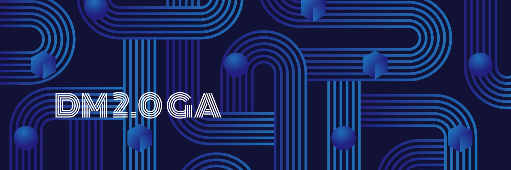

Our digital society produces vast amounts of data, and traditional databases such as MySQL face performance and capacity bottlenecks. One solution, database sharding, is complex and brings high operation and maintenance costs.

[TiDB](https://docs.pingcap.com/tidb/stable/overview) is an open-source, distributed, Hybrid Transactional/Analytical Processing (HTAP) database. It is an enterprise-level NewSQL database that separates the computing and storage layers. TiDB can elastically scale based on the needs of your applications, making them more real-time and intelligent. TiDB provides [TiDB Data Migration](https://docs.pingcap.com/tidb-data-migration/stable) (DM) to help users migrate data from MySQL to TiDB and effectively reduce migration costs and risks.

[DM](https://github.com/pingcap/dm) is an integrated data migration task management platform that supports full data migration and incremental data replication from MySQL or MariaDB to TiDB. DM 2.0 has reached general availability (GA), and it supports new enterprise-level features:

* Highly available migration tasks
* Shard merging and migration in optimistic mode

In addition, DM is now easier to use. DM 2.0 guarantees that you can smoothly switch your original database to TiDB, without worrying about failures or data loss caused by migration.

## DM 2.0's new features

### High availability of data migration tasks

DM 2.0 supports [highly available data migration tasks](https://docs.pingcap.com/tidb-data-migration/v2.0/overview#high-availability). Even if some DM-master or DM-worker nodes fail, data migration tasks can run normally.

When you deploy multiple DM-master nodes, they use the embedded etcd to form a cluster. The DM-master cluster stores metadata such as cluster node information and the task configuration. At the same time, a [leader](https://docs.pingcap.com/tidb/stable/glossary#leaderfollowerlearner) node is elected through etcd. The leader node provides various cluster management and data migration task management services. If the number of available DM-master nodes exceeds half of the deployed nodes, the nodes can elect a leader, and the DM cluster can normally provide services.

If there are more DM-worker nodes than upstream MySQL or MariaDB nodes, the extra DM-worker nodes are idle by default. If a DM-worker node goes offline or is isolated from the DM-master leader, DM-master automatically schedules the data migration tasks of the original DM-worker node to run on the other idle DM-worker nodes. (If a DM-worker node is isolated, it automatically stops its data migration tasks.) If there are no available idle DM-worker nodes, the data migration tasks on the original DM-worker cannot be performed.

 DM 2.0's highly available architecture 

### Merging and migrating sharded tables in optimistic mode

DM 1.0 can execute data definition language (DDL) statements on sharded tables online, and it uses pessimistic mode by default. In this mode, when a DDL statement is received from an upstream sharded table, DM pauses the data migration of this table until the same DDL statement is received from all other sharded tables. Only then does DM execute this DDL statement in the downstream and data migration resumes.

Pessimistic mode guarantees that the data migrated to the downstream is always correct. This approach has downsides, however. Pausing the migration is bad for making [A/B](https://en.wikipedia.org/wiki/A/B_testing) changes upstream, and it increases the latency of incremental replication.

DM 2.0 supports optimistic mode. In this mode, a DDL statement received from a sharded table is automatically converted to a statement that is compatible with other sharded tables, and it is then immediately migrated to the downstream. The DDL statement does not block any sharded table from executing data manipulation language (DML) migration. Optimistic mode is good for making A/B changes upstream, and it decreases the latency of incremental replication.

To learn more about how we implement optimistic mode, see [Merge and Migrate Data from Sharded Tables in Optimistic Mode](https://docs.pingcap.com/tidb-data-migration/v2.0/feature-shard-merge-optimistic). For more information on the differences between pessimistic mode and optimistic mode, see the summary table in [Merge and Migrate Data from Sharded Tables](https://docs.pingcap.com/tidb-data-migration/stable/feature-shard-merge#contrast).

In addition, DM 2.0 experimentally supports migrating data from MySQL 8.0 to TiDB. It also provides Transport Layer Security (TLS) support to build a comprehensive data security system. This feature ensures that all connections and transmissions are secure: both internally between DM components and externally between DM and databases. This protects you from data loss, leakage, and tampering and guarantees data privacy compliance in the data life cycle.

### Better usability

#### Application continuity

You can use PingCAP's component manager, [TiUP](https://docs.pingcap.com/tidb/stable/tiup-documentation-guide), to [deploy and maintain DM 2.0](https://docs.pingcap.com/tidb-data-migration/stable/maintain-dm-using-tiup) and also [import and upgrade DM 1.0 to 2.0](https://docs.pingcap.com/tidb-data-migration/stable/maintain-dm-using-tiup#import-and-upgrade-a-dm-10-cluster-deployed-using-dm-ansible). In DM 2.0, DM-workers can dynamically register, so you can scale them in or out without restarting the DM-masters. Your application stays up for maximum continuity.

For managed MySQL provided by cloud vendors such as AWS Aurora or Alibaba Cloud Relational Database Service (RDS), users usually can't obtain the `SUPER` privilege. Therefore, when they export full data, they can't obtain consistent snapshots. DM 2.0 does not have this limitation. It records the binlog position range from the beginning to the end of the full export process and automatically enables [safe mode](https://docs.pingcap.com/tidb-data-migration/stable/glossary#safe-mode) during incremental replication. It guarantees that the data is eventually consistent without manual intervention. In addition, DM 2.0 is more compatible with Aurora's `SELECT INTO S3` privilege.

#### Ease of use

Besides DM 2.0's new features, it is also easier to use. You can use TiUP to:

* Import and upgrade DM 1.0 to DM 2.0
* Install DM 2.0 in a new environment

Beside DM-workers register automatically, you don't have to restart DM-masters, and your applications stay up through the entire process. 

#### Improved exception handling and task automation

In DM 2.0, you can use the [`query-status`](https://docs.pingcap.com/tidb-data-migration/stable/query-status) command to identify potential exceptions during data migration. For some common exceptions, you can get "Workaround" information on how to handle them. DM 2.0 introduces the [`handle-error`](https://docs.pingcap.com/tidb-data-migration/stable/handle-failed-sql-statements) command to replace DM 1.0's `sql-skip` and `sql-replace` commands. This simplifies the handling process for incorrect SQL statements during data migration.

In addition, DM 2.0 automatically processes the corresponding `sql_mode` in the fully exported data and incremental binlog data. This greatly reduces the need for manual configuration and intervention. DM 2.0 makes a series of features easier to use, including:

* Automatic cleaning for fully exported files
* Optimization for configuration parameters
* Optimization for monitoring panels
* Optimization for log display

## Real-world case studies

### WeBank

[WeBank](https://en.wikipedia.org/wiki/WeBank_(China)) is China's first privately-owned bank. It is backed by reputable companies such as Tencent. It's devoted to offering a variety of convenient and high-quality financial services to underbanked individuals as well as small- and medium-sized enterprises.

WeBank uses TiDB with several applications in which batch tasks and flow log archiving are highly dependent on DM's table merging features. 

* In the batch task processing scenario, WeBank uses DM to merge shards with the same schema of MySQL upstream into TiDB downstream. TiDB's horizontal scalability makes batch processing more efficient. 
* In the flow log archiving scenario, WeBank uses DM to merge the shards with the same schema in the same manner and uses TiDB's horizontal scalability to achieve theoretically unlimited storage capacity.

When WeBank used DM 1.0, they encountered these problems: 

* When a DM-worker failed, data migration was suspended. To resume the task, engineers needed to manually intervene. The operation was cumbersome and increased data migration latency. 
* In financial scenarios, to update table schemas, the A/B change method is usually adopted. That is, if there are multiple upstream MySQL instances, and their shards have the same schema, users perform A/B changes on only one of the instances. After a few days of observation, if no abnormality occurs, users will update the table schema for the remaining shards. In DM 1.0, this blocks data migration tasks and increases data migration latency.

To solve these issues, the WeBank database team conducted in-depth discussions with [PingCAP](https://pingcap.com/) and developed and optimized a series of features. Now, DM 2.0 supports enterprise-level features such as high availability for components and support for A/B changes, which meet the data migration requirements of financial scenarios. In addition, DM 2.0 has several optimizations to improve product usability, such as:

* Easily using TiUP to deploy and maintain multiple DM clusters
* Simplified upstream source configurations for DM-workers
* Clearer and easier-to-read error messages

### Li Auto 

[Li Auto](https://en.wikipedia.org/wiki/Li_Auto) is a Chinese electric vehicle manufacturer, backed by China's consumer service delivery giants [Meituan-Dianping](https://en.wikipedia.org/wiki/Meituan) and [Bytedance](https://en.wikipedia.org/wiki/Bytedance). In October 2020, it announced that it [delivered 20,000 Li ONE SUVs in only 10 months](http://autonews.gasgoo.com/new_energy/70017646.html)—a record for the fastest delivery among China's vehicle startups.

Li Auto's more than 400 applications are built on microservices, covering the Internet of vehicles, order stores, vehicle production, after-sales, and logistics. In the microservice architecture, each individual microservice corresponds to an independent MySQL database (based on a public cloud RDS). 

Li Auto uses DM to replicate data from multiple MySQL databases to a TiDB cluster in real time to meet the following application requirements:

* TiDB satisfies the need for real-time data `JOIN` queries across multiple MySQL databases. TiDB uses TiFlash's HTAP capabilities to provide real-time application analytical reports.
* TiDB performs real-time data backup for multiple MySQL databases in the public cloud. This improves application availability while reducing additional database resource costs required to balance the load in the public cloud RDS read-write separation scenario.

Because Li Auto's applications heavily depend on DM, they used TiUP to upgrade DM 1.0 to 2.0 and conducted in-depth tests on DM 2.0's high availability feature, including:

* High availability of DM-master and DM-worker nodes
* Automatic scheduling and accuracy of migration tasks
* DM-master's scalability after DM upgrades from 1.0 to 2.0

DM 2.0 reduces the risks of replicating data from MySQL to TiDB in real time, avoids data loss during data replication, and guarantees service high availability.

## Give DM 2.0 a try

You can [use TiUP to quickly deploy a DM cluster](https://docs.pingcap.com/tidb-data-migration/v2.0/deploy-a-dm-cluster-using-tiup) and [create a data migration task](https://docs.pingcap.com/tidb-data-migration/v2.0/quick-start-create-task) to migrate data from MySQL to TiDB. If you're using a DM 1.0 cluster, you can [use TiUP to import and upgrade it to 2.0](https://docs.pingcap.com/tidb-data-migration/v2.0/maintain-dm-using-tiup#import-and-upgrade-a-dm-10-cluster-deployed-using-dm-ansible).

If you are interested in DM's development plan, you can check out its [roadmap](https://github.com/pingcap/dm/blob/master/roadmap.md) on GitHub. You're welcome to contribute pull requests and open issues to DM. You can also join our [community on Slack](https://slack.tidb.io/invite?team=tidb-community&channel=everyone&ref=pingcap-blog) and send us your feedback.

