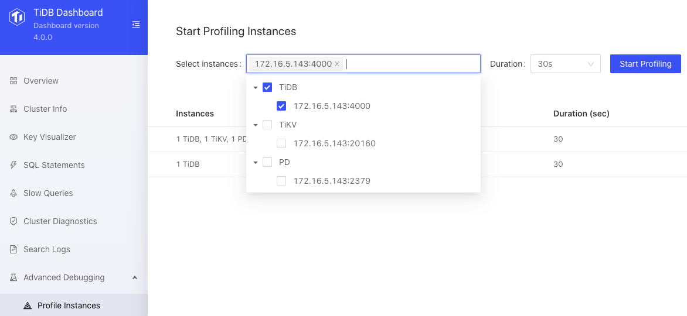
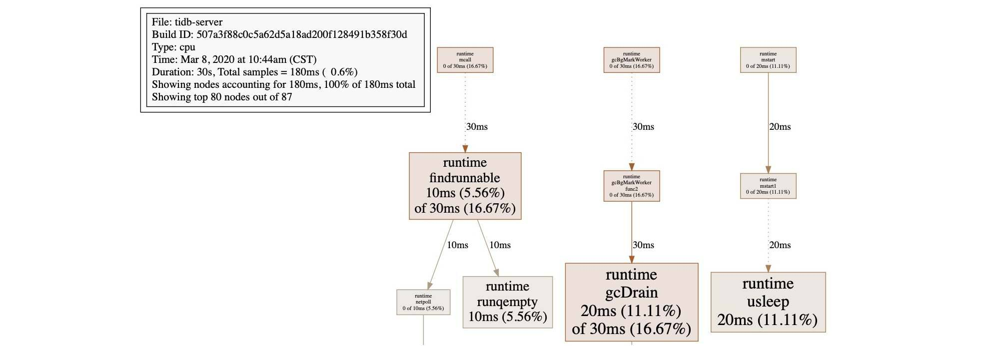
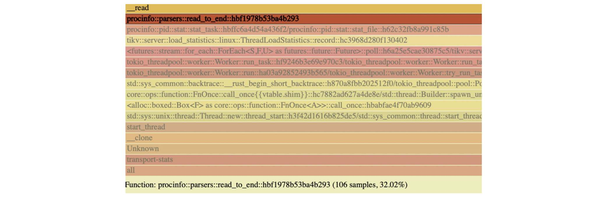

---
title: 'TiDB Dashboard: Easier Troubleshooting for Distributed Databases'
author: [Wenxuan Shi, Ming Zhang, Shuang Chen]
date: 2020-05-28
summary: TiDB 4.0 introduces TiDB Dashboard, which provides various built-in widgets in a graphical interface that let you easily diagnose, monitor, and manage your clusters in one place. Now you can troubleshoot TiDB clusters more easily. 
tags: ['Troubleshooting', 'Distributed SQL database']
categories: ['Engineering']
image: /images/blog/troubleshoot-distributed-database.jpg
--- 


It's challenging to troubleshoot issues in a distributed database because the information about the system is scattered in different machines. 

[TiDB](https://pingcap.com/docs/stable/) is an open-source, distributed SQL database that supports [Hybrid Transactional/Analytical Processing](https://en.wikipedia.org/wiki/HTAP) (HTAP) workloads. Before version 4.0, it could be difficult to efficiently troubleshoot TiDB's system problems. To diagnose a TiDB cluster's issues, even an experienced database administrator (DBA) needed to understand TiDB's basic architecture, get familiar with thousands of TiDB monitoring metrics, and gain experience in the field to ensure that when they encountered similar problems next time, they could fix them more quickly.

But all this is about to change. As our [previous post](https://pingcap.com/blog/tidb-4.0-preview-easier-to-use-production-ready-htap-database/) discussed, TiDB 4.0 introduces TiDB Dashboard, **a graphical interface with** **various built-in widgets that let you easily diagnose, monitor, and manage your clusters**. In a single interface, you can check a distributed cluster's runtime status and manage the cluster, including:

* Quickly finding cluster hotspots
* Analyzing SQL statements' execution performance
* Viewing slow queries
* Generating cluster diagnostic reports
* Searching and exporting logs
* Profiling instances

In this post, we'll walk you through the dashboards's main widgets: Key Visualizer, SQL statement analysis, slow query viewing, cluster diagnostics, log search, and instance profiling. If you're a DBA or database developer, we hope you can apply this knowledge to your own work. For example, if you're a developer, you could adopt TiDB and TiDB Dashboard for your own applications, or even design a similar tool to troubleshoot your system.


<div class="caption-center"> TiDB Dashboard </div>

## Key Visualizer

As our [previous post](https://pingcap.com/blog/observe-distributed-databases-to-discover-unknowns/) described, Key Visualizer is a visual diagnostic widget that lets you observe your TiDB cluster's read and write volume over time and gain deep insights into your applications. It provides a graphical representation of application status. If you are concerned about data privacy, note that the data powering the Key Visualizer doesn't contain confidential information about the application.


<div class="caption-center"> Key Visualizer </div>

## SQL statement analysis

For SQL statement performance issues, TiDB Dashboard provides the SQL statement analysis widget to monitor SQL statements. Statements that only differ in parameters are considered to be of the same type. TiDB Dashboard displays information for each type of SQL statement such as:

* Total execution time
* Average execution latency
* Number of executions
* Average memory resources consumed

With this information, you can analyze which types of SQL statements take too long to execute and consume too much memory, and thus find performance problems.


<div class="caption-center"> SQL statement analysis </div>

## Slow query viewing

TiDB Dashboard can list the slow queries in your cluster. It displays each query's SQL statement, its execution end time, query latency, and maximum memory usage.


<div class="caption-center"> Slow query viewing </div>

## Cluster diagnostics

The cluster diagnostics widget lets you diagnose cluster problems within a specified time range and summarize the diagnostic results and cluster-related load monitoring information into a diagnostic report. 

The diagnostic report is a web page form. After you download it from the browser, you can view it offline. If you choose two time ranges for comparison, you can get a comparison report about cluster issues for different periods.


<div class="caption-center"> Cluster diagnostic report </div>

TiDB Dashboard generates cluster diagnostic reports based on a series of preset rules about configuration, SQL execution time, monitoring information, and hardware conditions. This widget is still in its early stage, and we're still improving the rules it uses. We hope that it can grow into a powerful assistant for DBAs, so that even inexperienced DBAs can quickly find causes of common cluster problems.

## Log search

The log search widget lets you search for logs on all instances in the cluster, preview search results, and export logs. 

Before TiDB 4.0, to search for logs, you had to use the Secure Shell (SSH) protocol to connect to each remote server, but now you just need a few clicks.


<div class="caption-center"> Search and export logs </div>

## Instance profiling

Instance profiling analysis lets you collect internal profiling data for each TiDB, TiKV, and Placement Driver (PD) instance, without having to restart the instance. 

You can display profiling data as a flame graph or a directed acyclic graph. These graphs visualize various internal operations an instance performed during the profiling data collection period and the proportion of the operation execution time in this period. This way, you can quickly understand the main CPU resource the instance consumes.


<div class="caption-center"> Instance profiling </div>

For example, this figure shows each function's execution time in a TiDB instance:


<div class="caption-center"> Function execution time in TiDB </div>

And the following flame graph shows CPU usage in a TiKV instance. It visually shows the proportion of time the process spends on various internal functions during the profiling data collection period. You can better understand what the instance is doing.


<div class="caption-center"> CPU usage in TiKV </div>

## Try out the TiDB Dashboard

TiDB Dashboard is directly built into the PD component of the TiDB 4.0 cluster, so you don't need to deploy anything extra. If your TiDB cluster is version [4.0.0-rc.1](https://pingcap.com/docs/stable/releases/release-4.0.0-rc.1/) or later, you can give TiDB Dashboard a try. 

As our [previous post](https://pingcap.com/blog/get-tidb-cluster-up-in-only-one-minute/) described, TiDB 4.0 introduces [TiUP](https://github.com/pingcap-incubator/tiup), a component manager that streamlines installing and configuring a TiDB cluster into a few easy commands. You can [use TiUP to quickly set up a TiDB 4.0 cluster](https://pingcap.com/docs/stable/production-deployment-using-tiup/) on your local machine, and then:

1. Use TiUP to start the nightly version of the test cluster on your local Mac or Linux machine:

    ```shell
    tiup playground nightly --monitor
    ```

2. Visit [http://127.0.0.1:2379/dashboard](http://127.0.0.1:2379/dashboard) to try TiDB Dashboard.

You're welcome to join our [community on Slack](https://slack.tidb.io/invite?team=tidb-community&channel=everyone&ref=pingcap-blog) and send us your feedback.
