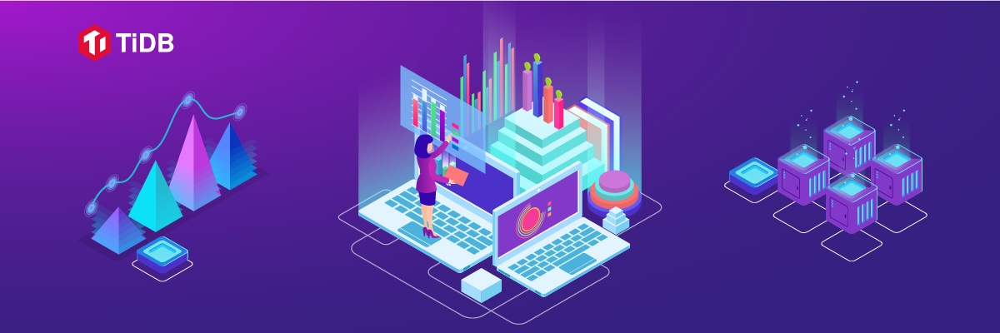
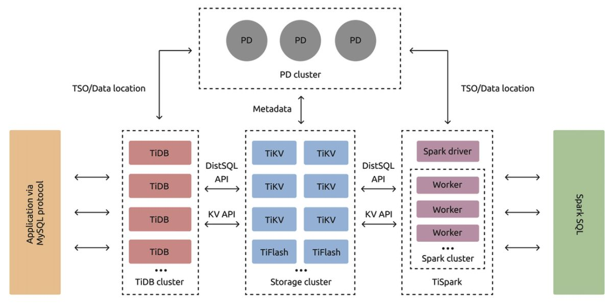
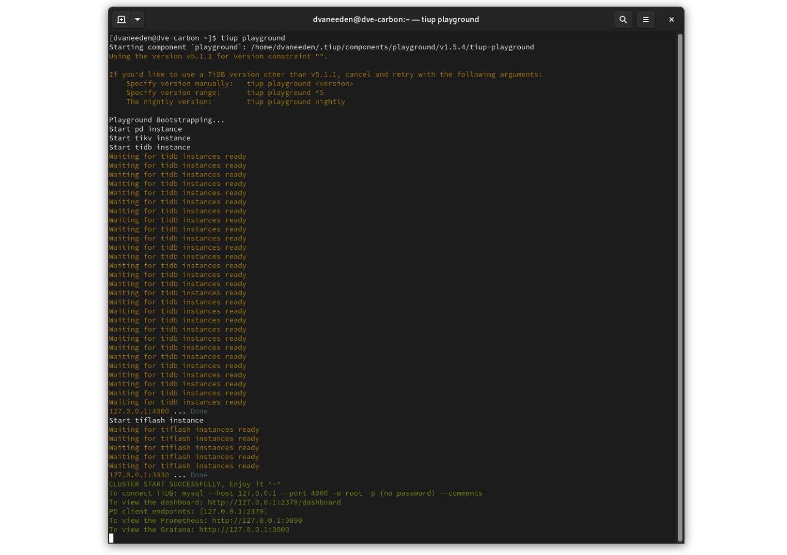
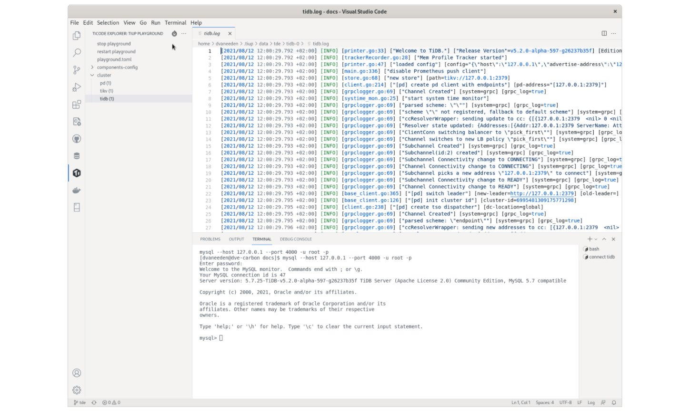

**Author:** [Daniël van Eeden](https://github.com/dveeden) (Technical Support Engineer at PingCAP)

**Editors:** Tom Dewan, [Caitin Chen](https://github.com/CaitinChen)



When you develop an application, you begin by coding and testing in your local environment. Many applications interface with a database, so in this early stage you might use SQLite rather than the database brand used in production. This is an issue, however, because ideally you want to develop the application with the production database in mind.

When using a distributed system setting up and starting/stopping the components needed for this can become error prone and time consuming.

In this article, I'll explain how you can develop your application locally and use the type of database used in production. In this case, [TiDB](https://docs.pingcap.com/tidb/stable), a distributed SQL database platform that features horizontal scalability, strong consistency, and high availability, is an excellent choice.

## A quick overview of TiDB

TiDB is a relational database that is compatible with the MySQL protocol and syntax and can easily scale beyond a single machine by dividing the data over multiple machines. This also makes it resilient to machine failures.

If you have seen pictures of the [TiDB architecture](https://docs.pingcap.com/tidb/stable/tidb-architecture), you know that it consists of many components, including the TiDB server, TiKV, a transaction, key-value database, and the Placement Driver (PD), which manages metadata. For a production setup you'll need multiple instances of each component.


<div class="caption-center"> TiDB architecture </div>

A scalable, highly available distributed system like TiDB runs multiple components on multiple hosts. For production setups this is not a problem as there are good tools to manage this: TiDB Operator for Kubernetes and [TiUP Cluster](https://docs.pingcap.com/tidb/stable/tiup-component-cluster).

When you develop and test your work, you may have a cluster that has a similar setup as production. However, if you want to test against new versions of TiDB or if your development interferes with what other developers are doing, this may not work. Also, if you are traveling you may not have an internet connection or have an unreliable connection.

Setting up a local copy of a distributed system can be a complex task because there are multiple components and there also might be OS settings to manage. Also, running multiple instances of a component can easily result in conflicts on TCP ports or filesystem paths.

Another good use of a local cluster is to test certain operations before doing them in production. This includes learning basic tasks like upgrading your application and backing and restoring the database.

So let's look into some of the options for local development. Some of these can also be used for CI jobs where you need a database.

## Install TiUP and start a TiDB Playground

TiUP is the tool to use to manage TiDB installations, both in production and for local development. One of the things TiUP can do is to set up a playground, with this TiUP will download the components that you need and configure and start them so that you get a local environment. This works on macOS, Linux and on Windows with WSL.

The playground gives you a TiDB installation to work with including the TiDB Dashboard and a set of Grafana dashboards.

To install TiUP run:

```
curl --proto '=https' --tlsv1.2 -sSf https://tiup-mirrors.pingcap.com/install.sh | sh
```

Once TiUP is installed you can start a playground:

```
tiup playground
```

These steps are available on [https://tiup.io](https://tiup.io/).


<div class="caption-center"> TiUP Playground </div>

In the output of the `tiup playground` command as shown above you can see the information about how to connect to the playground with a MySQL client and also the URLs for the TiDB Dashboard and Grafana.

Additional tips for working with playgrounds:

* You can specify the version you want to run with `tiup playground v4.0.14` for example.
* With `tiup -T myapp playground` you can put a nametag on the playground. This is useful when you use multiple playgrounds. This also allows you to more easily find the data directory of the playground to inspect the logs etc. For example with the "myapp" tag you can find the datadir on `~/.tiup/data/myapp` with subdirectories for the various components. Setting a tag also lets you keep the data after stopping the playground.
* The `tiup playground` command has options to set the number of instances per component. This can be used to set the number of TiFlash instances to 0 in case you for example don't intend to use the HTAP functionality.
* You can add `--monitor=false` if you don't want to use monitoring tools like Grafana and Prometheus. This is useful if you want to save resources on your local machine.

<div class="trackable-btns">
  <a href="/download" onclick="trackViews('Easy Local Development with TiDB', 'download-tidb-btn-middle')"><button>Download TiDB</button></a>
  <a href="https://share.hsforms.com/1e2W03wLJQQKPd1d9rCbj_Q2npzm" onclick="trackViews('Easy Local Development with TiDB', 'subscribe-blog-btn-middle')"><button>Subscribe to Blog</button></a>
</div>

## TiDE: a Visual Studio Code extension for TiDB

If you use Visual Studio Code, our [TiDE](https://marketplace.visualstudio.com/items?itemName=dragonly.ticode) extension lets you work with TiUP Playground, TiUP clusters, and Kubernetes clusters right from your IDE.


<div class="caption-center"> TiDE showing a MySQL prompt and logging </div>

This extension gives you a Ti icon on the sidebar of VS Code. If you click this icon you get presented with options for starting a playground and an overview of any running playgrounds. TiDE also supports clusters deployed with TiUP, vagrant, and TiDB Operator for Kubernetes. Besides starting and stopping playgrounds you can also use this to inspect the logs, change the configuration of components and open a MySQL client session right in the terminal pane of VS Code.

## Set up your containers with Docker Compose

Use [TiDB Docker Compose](https://github.com/pingcap/tidb-docker-compose) to set up your containers. This is a useful tool if you already use Docker Compose to manage the containers of the application you are developing.

To setup a set of containers with this tool run the following:

```
git clone https://github.com/pingcap/tidb-docker-compose.git
cd tidb-docker-compose && docker-compose pull 
docker-compose up -d
```

Now you can connect with a MySQL client:

```
mysql -h 127.0.0.1 -P 4000 -u root --comments
```

## Use TiDB Operator with minikube or kind

If you run TiDB on Kubernetes in production, a good option is to use minikube or kind for local development. This approach teaches you how to work with TiDB Operator. For detailed information on setting up TiDB Operator, see [Getting Started with TiDB Operator on Kubernetes](https://docs.pingcap.com/tidb-in-kubernetes/stable/get-started).

## A simple option: run a single TiDB instance

You can run one instance of TiDB server without TiKV, Placement Driver, TiFlash or any of the other components. In this case, TiDB uses unistore, a local storage engine, as a backend instead of TiKV. By default, TiDB stores data in `/tmp/tidb`. For TiDB server you only need a single binary, so this makes deployment easy. However, this approach is quite limited: you won't have access to TiDB Dashboard, Grafana, or TiFlash.

To download, extract, and start TiDB server, enter:

```
wget -q -O - https://download.pingcap.org/tidb-v5.1.1-linux-amd64.tar.gz | tar --strip-components 2 -zxf - tidb-v5.1.1-linux-amd64/bin/tidb-server
./tidb-server
```

## Conclusion

Having a complex distributed system doesn't need to prevent you from doing local development in the way that fits your needs. There are multiple methods to set up local development environments.

If you have any questions, feel free to contact us on [the TiDB Community Slack channel](https://slack.tidb.io/invite?team=tidb-community&channel=everyone&ref=pingcap).
