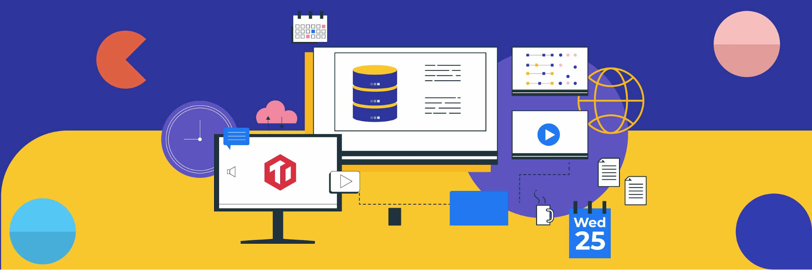
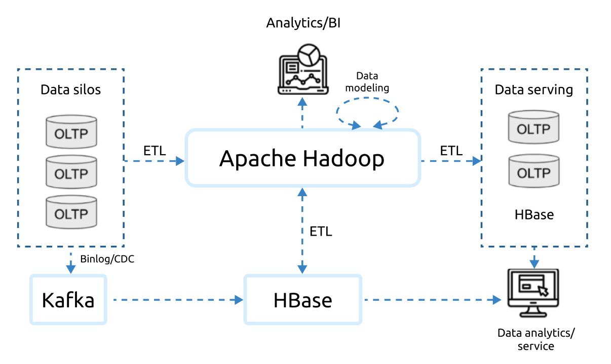
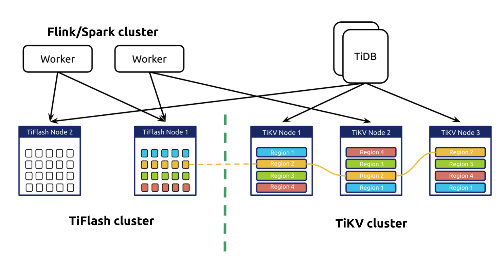
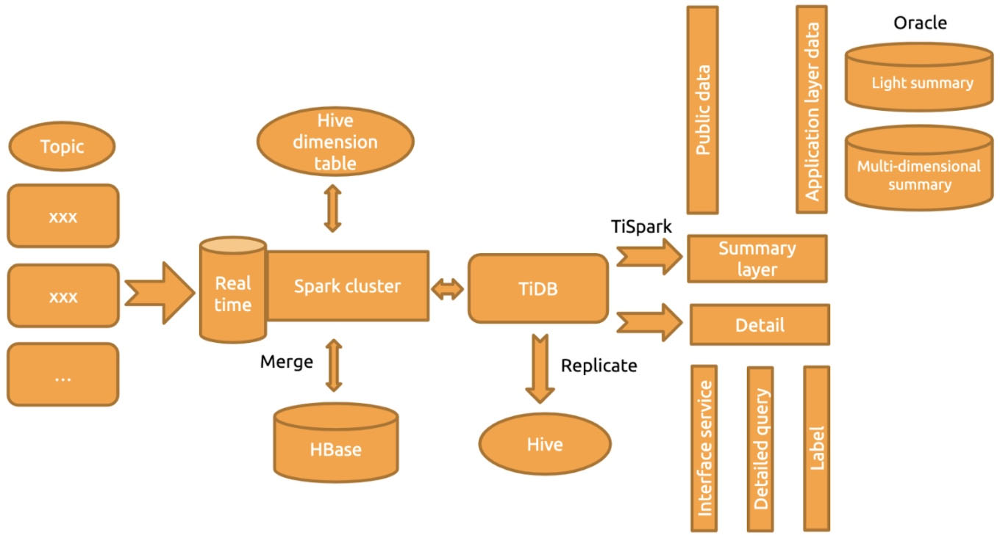

**Authors:**

* Yueyue Zhou (Product Expert at PingCAP)
* Dan Su (Product Expert at PingCAP)

**Transcreator:** [Ran Huang](https://github.com/ran-huang); **Editor:** Tom Dewan

Big data, in recent years, is not just a buzzword, but also a growing need for ambitious companies. With skyrocketing data scale and stringent requirements on data freshness, big data-related scenarios are becoming complicated and multi-dimensional. Thus, many companies use real-time data warehouses to meet their business demand.

But data warehouses are not the only option. An emerging category of databases, [Hybrid Analytical/Transactional Processing](https://en.wikipedia.org/wiki/Hybrid_transactional/analytical_processing) (HTAP) databases, can serve you just as well as data warehouses, if not better. HTAP databases can handle Online Transactional Processing (OLTP) workloads and respond quickly to big data analytical requests in real time.

In this post, **we will share the usage, cost, and technology selection of real-time big data analytics**. We'll also introduce **[TiDB](https://docs.pingcap.com/), an open-source HTAP database designed for massive data**. We hope this will help you in your search for a big data architecture for your organization.

## Why real-time analytics + big data

For different roles in an organization, real-time data analytics plays a different part in their decision-making process:

* **Senior executives** **need to know the current status of their company and chart a course for the next few years**. They'd like to analyze the company's financial conditions by querying the real-time reports and income statements for the past few years, predict the revenue for the next few years based on the existing data models, and determine the company's future plans. In this process, they may need to query data in a fine-grained manner such as per month, per day, or even per hour.
* **Managers of a specific business line need to know the revenue, traffic peaks, and health of their business.** They may want to see the visualized business data, real-time reporting, and revenue projections for any point in the past few years.
* **Security directors need to keep constant tabs on any information security issues.** They may also need to query the risk data for a given time period in the past week or month.

These three roles often need real-time data analytics to make decisions. In addition, because they query long time spans, the data scale must be taken into account. It is challenging for the infrastructure software to provide real-time data analytics on a large data scale.

## Current big data solutions

As the business evolves, users are no longer satisfied with performing data analytics on only offline data. They want to base their analytics on fresher data—even on data on the fly. To perform analytics on fresh data, their Online Transactional Processing (OLAP) architecture needs an OLAP-oriented warehouse on top of it.

### Technical limitations

The current data solutions each have their own problems:

* Traditional data warehouse solutions based on Hadoop cannot support real-time analytics well.
* NoSQL solutions such as HBase, though they are scalable and support real-time queries, can't provide the analytical capabilities required.
* Standalone databases do not scale.
* Online Transactional Processing (OLTP) databases usually use row-based storage, which can't perform very well with OLAP workloads.

In addition, the existing big data platforms based on the above technologies have several disadvantages: **complicated extract, transform, load (ETL), high storage costs, lengthy data transfer processes, and convoluted tech stacks**.

 The traditional big data platform 

### High costs

In an effort to build and maintain a system like the one above, users must bear the high costs of a fully-functional data team:

* Development team
  * **Data development engineers** for ETL, back end, and front end. They will build, operate, and maintain the big data platform and data warehouse.
  * **Data analysts** who aggregate company-wide business data and perform data analytics.
  * **Data algorithm engineers** who build mathematical models to meet the business requirements. These highly-paid talents are hard to acquire.
* Product and operations team
  * **Data product managers** who try to solve business pain points by data-driven tactics. They identify and assess various requirements and meld them into a standard product.
  * **Data operations specialists** who help the business team use the data products.

Building a team that covers all these positions will cost the company a fortune, not to mention that some high-level talents are rare in the labor market. Building the team might take six months to a year, and developing the data platform another one to two years. In this process, you might need to introduce various technologies and increase the maintenance complexity.

## How TiDB prevails

TiDB is an open-source, distributed database that supports HTAP workloads. It features horizontal scalability, strong consistency, high availability, and real-time data analytics. In addition, TiDB is MySQL compatible and easy to manage.

### Powerful features

One of **TiDB's biggest strengths is its HTAP architecture**. In TiDB, the row store and column store can coexist and provide service for different kinds of queries.

* It provides complete indexes and highly concurrent data access.
* It has a high-performance [massively parallel processing](https://en.wikipedia.org/wiki/Massively_parallel) (MPP) framework and an updatable columnar storage engine. Every time the data is updated, TiDB updates the columnar storage engine accordingly so that the OLAP requests can always read the latest data.
* Its HTAP architecture handles both OLTP and OLAP workloads. The optimizer decides which storage engine to use, thus simplifying the architecture.

 TiDB's HTAP architecture 

TiDB also **supports elastic scaling**:

* When TiDB is running, you can elastically scale out or scale in the cluster components without affecting the production environment.
* TiBD's architecture separates computing and storage, so you can scale computing nodes and storage nodes independently.

TiDB **supports standard SQL syntax and the MySQL protocol**:

* It uses standard SQL syntax including aggregate and window functions, join, sort, DML, and online DDL.
* If you already use MySQL or its peripheral tools, adopting TiDB would be seamless with little code change.

TiDB is **easy to manage**:

* You can easily spin up a TiDB cluster using the [TiUP](https://docs.pingcap.com/tidb/dev/tiup-documentation-guide) cluster manager.
* TiDB doesn't rely on other systems, and its maintenance is simple.
* TiDB provides a built-in monitoring dashboard for performance analysis and troubleshooting.

### Ecosystem tools

TiDB provides a variety of tools to import, export, backup, and restore data:

* For data import, you can use [TiDB Data Migration](https://docs.pingcap.com/tidb-data-migration/stable) for **full and incremental data replication from MySQL to TiDB**. The migration doesn't affect online data read and write requests. [TiDB Lightning](https://docs.pingcap.com/tidb/stable/tidb-lightning-overview) enables you to **quickly import large volumes of data** into TiDB.
* For data export, you can use [TiCDC](https://docs.pingcap.com/tidb/stable/ticdc-overview) or [TiDB Binlog](https://docs.pingcap.com/tidb/stable/tidb-binlog-overview) to **replicate data into TiDB or third-party downstream platforms** for further processing.
* For backup and restore, you have [Backup & Restore](https://docs.pingcap.com/tidb/stable/backup-and-restore-tool) to **perform full and incremental backup and restore**.

By default, these tools operate on all tables. However if you only need a subset of tables, they also support [table filters](https://docs.pingcap.com/tidb/stable/table-filter) to specify the subsets.

### Learning resources

TiDB users enjoy many community resources:

* TiDB provides comprehensive [documentation](https://docs.pingcap.com/tidb/stable) for each active version of the product, including a user manual, product specification, and troubleshooting tutorials.
* TiDB engineers write [blog](https://pingcap.com/blog) posts that dive deeply into many aspects of database technology.
* Users across industries write [case studies](https://pingcap.com/case-studies) to share their use scenarios and experience.
* TiDB has an active developer and user community. Whenever you need help, you can always find them on [GitHub](https://github.com/pingcap/tidb/issues) and [Slack](https://slack.tidb.io/invite?team=tidb-community&channel=everyone&ref=pingcap-blog).

## Adopting TiDB in OLAP scenarios

Many companies have adopted TiDB to empower their business with HTAP capabilities. One example is ZTO Express.

### ZTO Express: from Oracle Exadata to TiDB

[ZTO Express](https://www.crunchbase.com/organization/zto-express) is a leading express delivery company in China and one of the largest express delivery companies in the world. They used to use Oracle Exadata, but as their business quickly developed, it no longer met their requirements:

* **Exadata's storage capacity faced big challenges**. The data storage period in Exadata became shorter and shorter, while the application team required the data storage time to be longer and longer.
* **The sharding solution wasn't suitable for real-time data analytics**. Data analytics relied on stored procedures, and the system was very hard to scale and maintain.
* At peak hours, **Exadata had high risks of standalone machine performance bottlenecks and single-point failures**. Data was replicated in T+1 mode, so they couldn't perform data analytics in real time.

To build a real-time data warehouse, they tested HBase and Kudu. But Kudu was not compatible with the existing technology stack, and HBase had very limited support for multi-dimensional queries. Finally, they adopted TiDB to solve their problems.

ZTO Express built their system based on TiDB as follows:

 TiDB architecture at ZTO Express 

This new database infrastructure has brought them the following benefits:

* The supported data storage period extended from 15 days to 45 days.
* TiDB supports online **horizontal scalability**. To scale out or scale in, they can add or remove nodes in the storage or computing layer at any time. The scaling process is transparent to application operations and maintenance staff.
* TiDB has **high performance for OLTP workloads**. Its performance might be slightly lower than that of Oracle, but this is because TiDB is a distributed database.
* **OLTP and OLAP workloads are separated**, and the pressure on a single node is gone.
* TiDB supports **more flexible data analytics from various angles**.
* Our **hardware cost is reduced**.

For more details on how ZTO Express uses TiDB, read [their story](https://pingcap.com/case-studies/3x-it-efficiency-boost-use-a-scale-out-htap-database-for-near-real-time-analytics) about their 300% IT efficiency boost.

## Summary

As an HTAP database, TiDB can provide better real-time analytics and data warehouse service than OLTP databases. With its row-based and columnar storage engines, its analytical capabilities go way beyond simply locating data in high concurrency. It also covers large-scale interactive business intelligence (BI) queries.

You can use TiDB independently to build your own real-time data analytics system, but you can also integrate it with big data tools to establish an offline and real-time data warehouse. Some users [connect Apache Flink with TiDB](https://pingcap.com/blog/apache-flink-+-tidb-a-scale-out-real-time-data-warehouse-for-analytics-within-seconds) to adapt to more scenarios.

If you are interested in TiDB's solutions for real-time analytics, feel free to [join our Slack channel](https://slack.tidb.io/invite?team=tidb-community&channel=everyone&ref=pingcap-blog) and explore more with us.
