**Author:** Jia Lin (Leader of Real-time Application team at the NetEase Gaming Billing Data Center, Contributor of Apache Flink)

**Transcreator:** [Ran Huang](https://github.com/ran-huang); **Editor:** Tom Dewan

**[TiDB](https://pingcap.com/products/tidb) is a distributed SQL database that supports Hybrid Transactional and Analytical Processing (HTAP) workloads.** It is MySQL compatible and features horizontal scalability, strong consistency, and real-time Online Analytical Processing (OLAP). **Apache Flink is the most popular, open source computing framework.** It provides high-throughput, low-latency data computing and exactly-once semantics.

At [NetEase](https://www.crunchbase.com/organization/netease-com), these two powerful softwares provide reliable, convenient support for our real-time gaming applications. In this article, **I'll share our pain points when using Flink, how Flink guarantees exactly-once semantics, and how we implement it on TiDB.** I hope you enjoy this article and find our experience helpful.

## Flink pain points

The following data records represent an online real-time table, with four fields: `ts`, `account_id`, `buy_item`, and `buy_count`. The data increases monotonically.

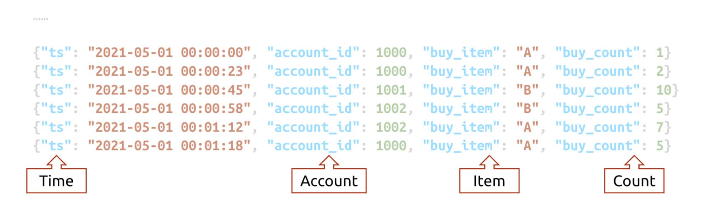

An online real-time table

To analyze the data, you can use Flink or another real-time computing framework and process data in groups. For example, you can group the data by `account_id` or by `buy_item`, and then group that into different time windows. After that, you can get contiguous data as follows:

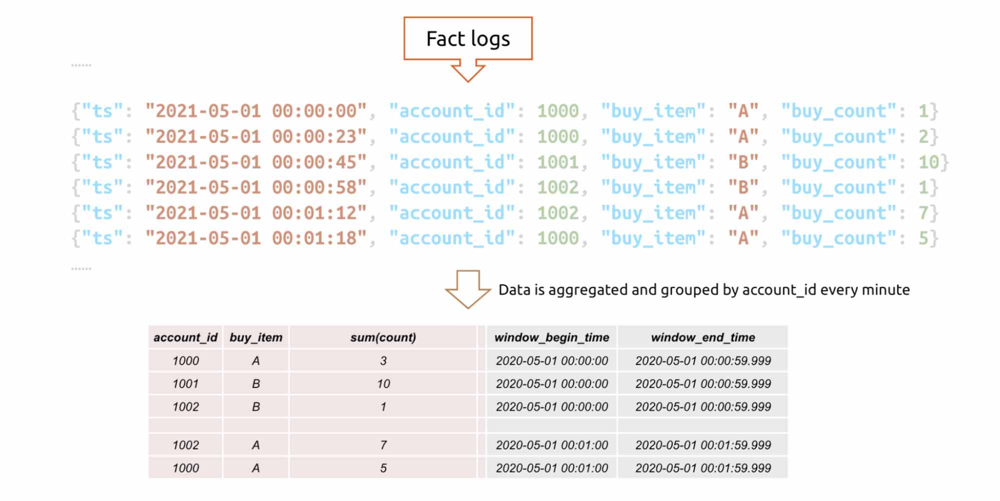

Data is grouped by `account_id`

**If Flink writes the contiguous data into TiDB, this table can be joined with the existing account information and item detail table in TiDB. This way, you can quickly extract valuable information from the statistics.** By analyzing the information with visualization tools, you may even gain more insights into the fast-changing business.

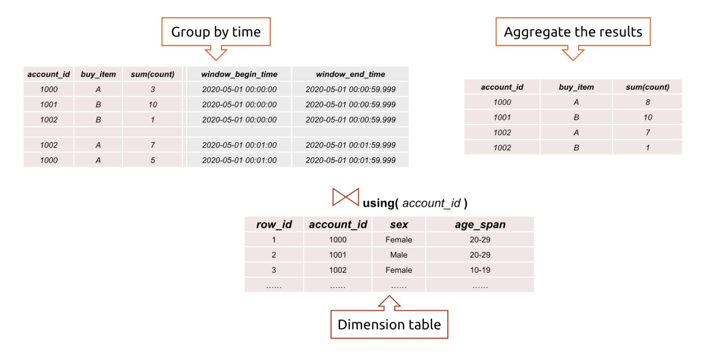

Join tables to extract information

The process is simple and elegant. Flink computes data, and TiDB stores it. In the real world, however, things don't go this smoothly. Online data can come from multiple sources, in multiple formats, and not in the correct order.

To address these problems, we encapsulate a framework called JFlink-SDK. Based on Flink, JFlink-SDK encapsulates common features into configurable modules, such as extract-transform-load (ETL), out-of-order processing, and group aggregation. By configuring the online data sources, we can obtain the statistics or data and import them into TiDB.

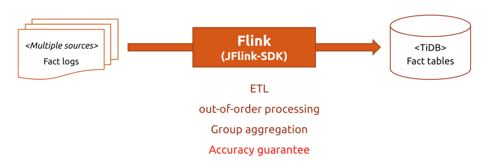

JFlink-SDK encapsulates common features

However, another issue arises: the real-time aggregation value. When Flink processes the above data, it saves the operator state via checkpointing. Between two checkpoints, the result may be flushed to TiDB. If a failure occurs then, Flink rolls back to the first checkpoint so the data returns to the last correct state.

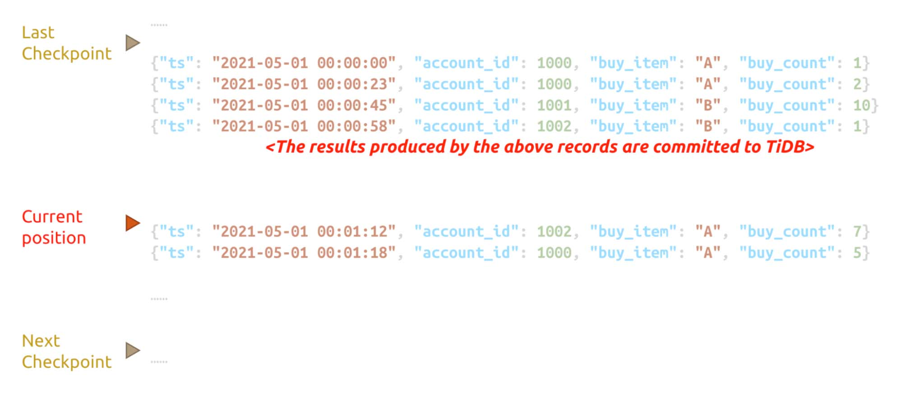

Data is flushed to TiDB between two checkpoints

When Flink rolls back, the records that are already flushed to TiDB are recalculated and updated to TiDB again. If, unfortunately, the update behavior is not reentrant, the `buy_count` values are then mistakenly added twice. Therefore, the data in TiDB is inaccurate.

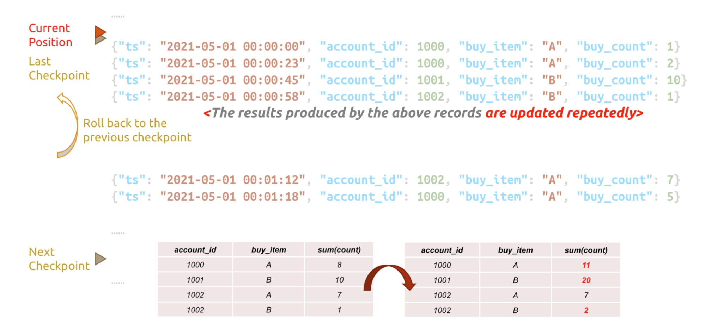

Data is repeatedly updated because of rolling back

This is a possible trap when we use Flink on TiDB. We must find a way to fix it.

## Flink's accuracy guarantee

To come up with a solution, we need to understand how Flink guarantees data accuracy.

### Checkpoint

Flink guarantees accuracy by the checkpoint mechanism. A checkpoint, similar to a MySQL savepoint, is an automatic snapshot taken during real-time data processing. Checkpoints help Flink quickly recover from faults.

Checkpointing in Flink supports two guarantee levels: _exactly-once_ and _at-least-once_. However, in the case above, even if you choose exactly-once, the values are added repeatedly.

The reason lies in how Flink guarantees exactly-once. "Exactly-once" semantics means that each event in the stream affects the results exactly once. Assume that you are carrying out a simple execution plan directed acyclic graph (DAG), which has only one source. Data is flushed to the TiDB sink using a map. During this process, Flink processes data linearly and inserts checkpoint barriers into the data stream. The checkpoint barriers flow with the data stream. Wherever the barrier arrives, the operators snapshot their state in the linear execution plan.

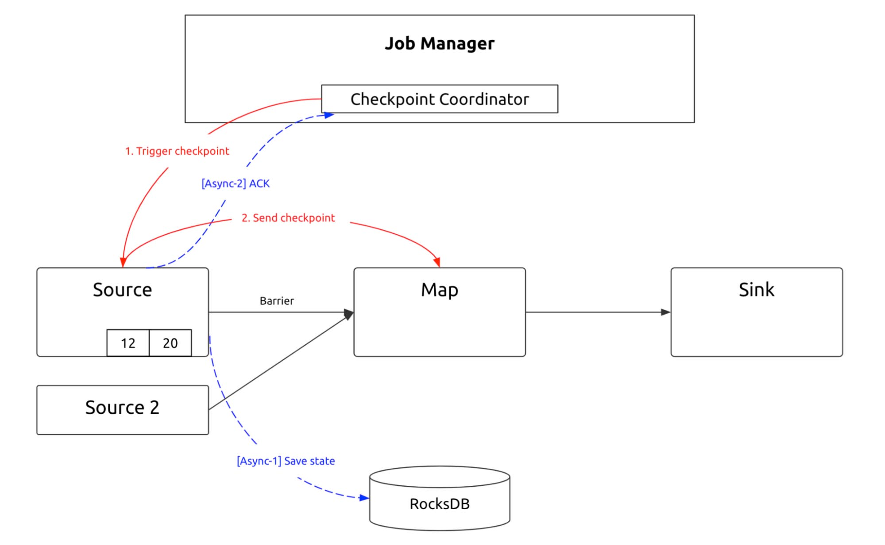

Checkpointing process 1

If the operator starts at the source, it saves the source state. If Kafka is the source, it saves Kafka's current consumer position. After the node saves the state, the next operator starts to snapshot its state. If the Map performs bucketing calculation after a `keyBy` operator, the saved data is already stored.

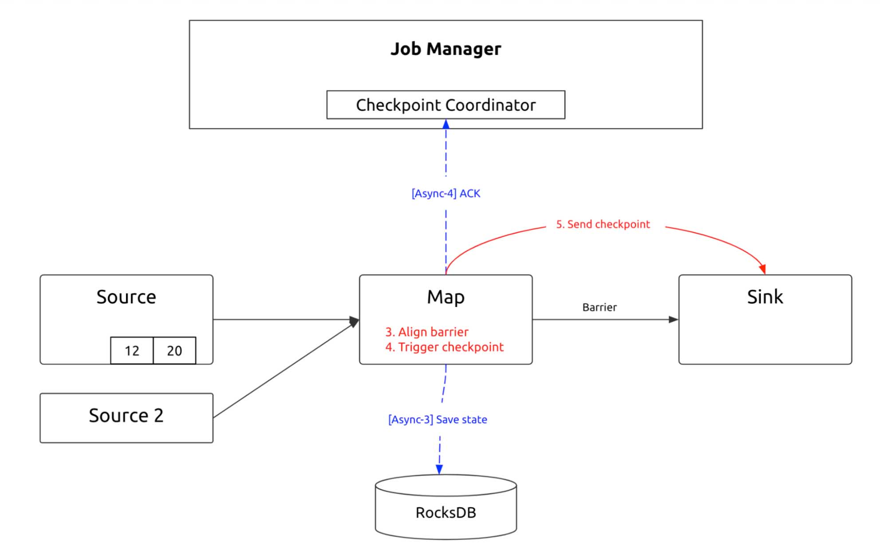

Checkpointing process 2

After that, the checkpoint barrier arrives at the sink, and the sink saves the corresponding state. By now, the checkpoint is completed. After the Job Manager makes sure that all subtasks are finished, it dispatches a "Complete" message.

In effect, this is a two-phase commit (2PC) protocol. Each distributed subtask commits their own transaction, and then the Job Manager commits the whole transaction. The state is stored in RocksDB, so in the event of a failure, data is recovered from RocksDB, and the process restarts from the checkpoint.

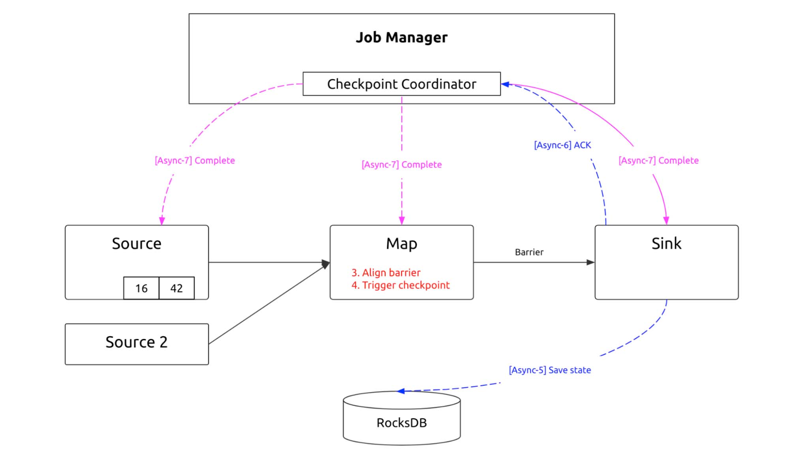

Checkpointing process 3

### Exactly-once semantics

From the code below, we can see that the exactly-once checkpointing only guarantees exactly once for Flink operators, but not the end-to-end behavior for external systems. Therefore, when Flink writes data into TiDB, if TiDB doesn't take part in the checkpointing mechanism, Flink doesn't guarantee end-to-end exactly once semantics.

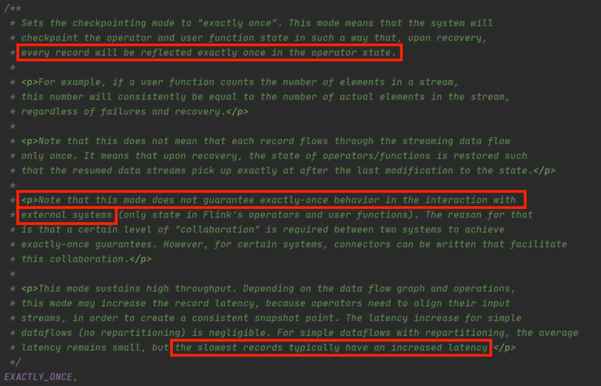

In contrast to Flink, Kafka supports end to end. It exposes the 2PC interface and allows users to control the Kafka transaction's 2PC process by manually adjusting the interface. Thus, users can make use of the checkpointing mechanism to avoid miscalculation.

But what if users cannot manually control the process? In the following process, account 1000 buys item A, and the record is written to TiDB. The SQL statement `INSERT VALUES ON DUPLICATE UPDATE` is generated. Unfortunately, when the checkpoint occurs, Flink can't guarantee the statement is executed in TiDB. Without special treatment, there's no way to ensure this SQL statement is executed. If the statement is not executed, an error is reported, and Flink rolls back and resumes the previous checkpoint. The value is not calculated repeatedly. However, if the value is already written into TiDB, when Flink rolls back to the previous checkpoint, the value is then added repeatedly.

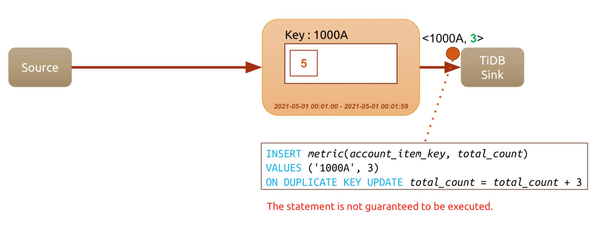

The generated SQL might not be executed

To solve this problem, Flink provides an interface that allows users to manually implement `SinkFunction`. Users can control a transaction's beginning, pre-commit, commit, and roll back.

As we have mentioned above, the checkpointing process is a 2PC protocol. When the distributed operators execute internal transactions, the operators are associated with pre-commit. When the operators receive the "Complete" message from the Job Manager, operators commit the transaction. The transaction must be successful.

If other operators fail to commit, Flink needs to roll back the transaction and make sure it is not committed to the remote. If we have a 2PC `SinkFunction` plus XA transaction semantics, _exactly once_ is achieved.

However, not every sink supports 2PC. TiDB uses the 2PC protocol to manage its distributed transactions internally, but it doesn't allow users to manually control the protocol.

  <a href="/download" onclick="trackViews('Flink on TiDB: Reliable, Convenient Real-Time Data Service', 'download-tidb-btn-middle')"><button>Download TiDB</button></a>
  <a href="https://share.hsforms.com/1e2W03wLJQQKPd1d9rCbj_Q2npzm" onclick="trackViews('Flink on TiDB: Reliable, Convenient Real-Time Data Service', 'subscribe-blog-btn-middle')"><button>Subscribe to Blog</button></a>

### Idempotent operation

Then how does Flink ensure the application data is persisted in TiDB exactly once? **The solution is _at least once_ semantics plus the unique key, namely the idempotent operation.**

If the data has a unique identifier, you can choose that as the unique key. For example:

* If the data has a unique ID, when Flink replicates data from one table to another, you can deduplicate the result by using `insert ignore` or `replace into` on its primary key.
* If the data is in a log, you can choose the attributes specific for log files.
* If you calculate the aggregation results using Flink, you can use the aggregation key plus the window threshold value, or any other idempotent method, to calculate the result as the unique key for the final calculation.

In this way, the results are reentrant. Because the results are reentrant, and because the checkpoint can be rolled back, you can combine Flink with TiDB to achieve _exactly once_ write.

## How we optimize Flink on TiDB

At NetEase, we build our own JFlink framework to support Flink on TiDB. In this section, I'll elaborate on how we integrate TiDB with it.

### Connector

First of all, we designed a database connector. Flink's support for TiDB (and other RDBMSs) is relatively slow. Flink JDBC connector is only released in v1.11.

Currently, we use TiDB as the data source, process data in Flink, and then replicate data to Kafka. Kafka is a streaming data pipeline, which consumes and processes data and then again replicates data to Flink for processing. TiDB provides a change data capture (CDC) tool that listens to the data change in TiDB.

However, not all the application data can be processed via CDC. Some applications need to add complex filter conditions when writing data, some need to read configuration tables periodically, and some need to know external configurations before obtaining the split conditions. These situations require us to customize the source.

When we encapsulate JFlink, we actually encapsulate the monotonic tables of some fields to read their slices. "Monotonic tables" means the table has a field that changes monotonously or is "append only."

We add "JFlink TiDB Connect" between TiDB and Flink. It creates connections with TiDB via a connection pool. Then it fetches data using an async thread and controls the data flow using a blocking queue.

### At least once for source

Flink's main thread listens for non-empty signals on the blocking queue. When a non-empty signal is received, the main thread fetches the data and uses it as an object for the entire real-time processing framework through the deserializer. It is then docked to various modularized user-defined functions (UDFs).

If you use the checkpoint mechanism, implementing at-least-once semantics for sources can be quite simple. The table at issue is a monotonic table. When data is sliced on the monotonic table, the current slice position is recorded. In the event of a failure, the data flow rolls back to the previous checkpoint, and the source also rolls back to the last slice position.

In this way, we guarantee that no data from the source is missed, achieving _at least once_ for the source.

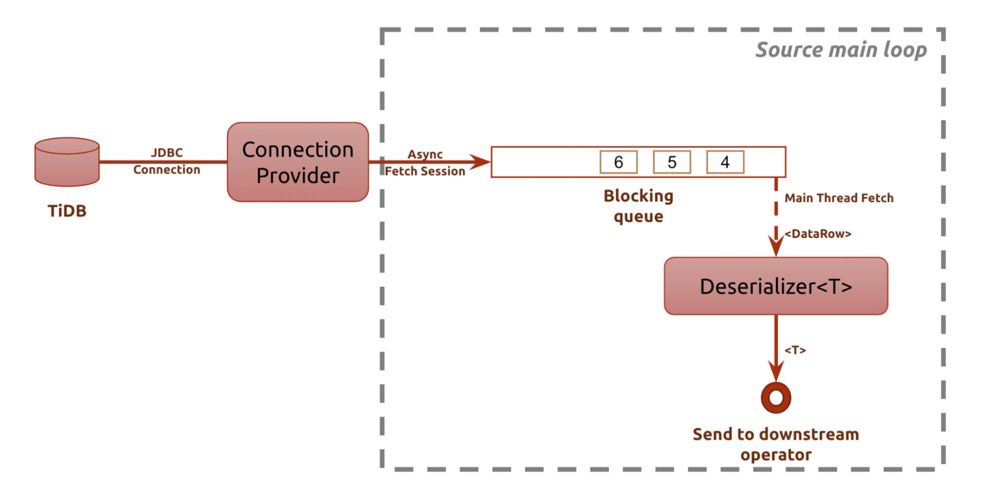

Source main loop

### At least once for sink

Flink provides the official JDBC sink, but the implementation is simple, and it uses synchronous batch insert. When the data volume is large and there is no strict FIFO semantics, synchronous batch insert doesn't perform well. If we enable async commit, TiDB's distributed feature is fully utilized. High-concurrency, small transactions can help improve queries per second (QPS), so the performance will increase greatly.

Flink writes the main thread into a buffer page. When the page is full, Flink changes the page and creates a thread to flush data to TiDB.

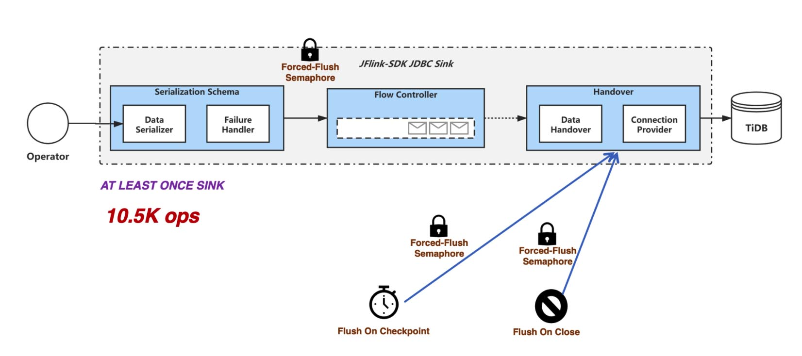

Flink's synchronous flush

Our sink implementation is different. We use a blocking queue for flow control. Data is written into a buffer page. When the page is full, an async thread is immediately created to flush data to TiDB. This improves QPS performance when the application doesn't require FIFO semantics. Our test shows that our performance increases from the official 10,000+ QPS to 30,000+.

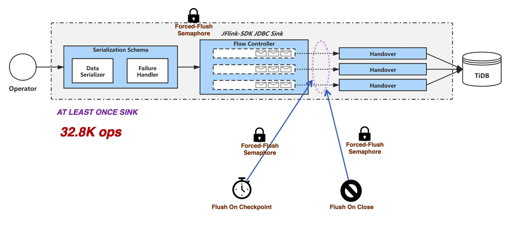

Our async flush

Implementing at-least-once for the sink is more complicated. If we want to make sure data is written to the sink at least once, we must ensure that when the checkpoint is completed, the sink is clean (all data is flushed). We need to include the checkpoint thread, the main thread for flush, and the page-changing thread. The checkpoint is only completed when all the data is flushed to the sink. In this design, once the checkpoint is completed, the sink is definitely clean and all the data is correctly updated in TiDB.

Moreover, for `INSERT ON DUPLICATE KEY UPDATE` statements, if the application supports async batch transaction commit, we can perform a `KeyBy` operation on the unique key before the data goes to the sink. This operation resolves transaction conflict in advance and avoids the probable conflict caused by async commit. The preprocessing significantly raises the sink's throughput to 150,000 OPS.

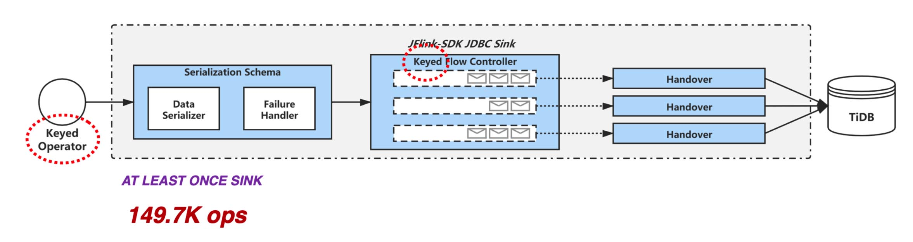

KeyBy to resolve conflict

An application team that used to see fluctuating request duration tried the solution above and reduced the request duration by an order of magnitude. The 999th percentile dropped from 4 seconds to lower than 20 milliseconds.

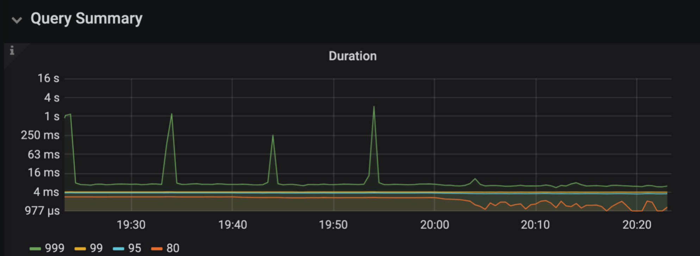

Request duration improved

### How we use Flink on TiDB

Currently, we use Flink on TiDB for many scenarios at the NetEase data center:

* Real-time formatization of massive application log data
* Analytics and statistics based on large-scale data
* Real-time payment link analysis on a TiDB + Kafka connection
* Connected data map
* Time series data

Many of our applications use the Flink + TiDB combination. These two technologies help support real-time data services across our business. We believe in their potential and suggest that you give them a try.
