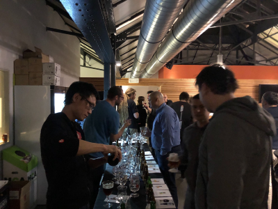
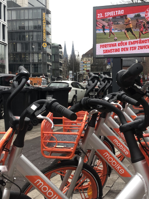

On the heels of a successful TiDB DevCon in Beijing, where [more than 700 people](https://www.pingcap.com/blog/tidb-3.0-beta-stability-at-scale/) attended this annual TiDB user conference, Team PingCAP trekked halfway around the world to Brussels, Belgium, to participate in the largest developer conference in Europe, [FOSDEM](https://fosdem.org/2019/). We had three talks to deliver, one in the MySQL, MariaDB and Friends DevRoom and two in the Rust DevRoom. Even though TiDB as an open-source NewSQL database is growing in popularity and global reach, our team knows that a truly global technology hinges on the support of local communities. After all, globalization is localization, and there's no better place to "localize" a technology for thousands of developers than FOSDEM.

## Early Bird Gets the Beer

Our FOSDEM activities got started early with the [pre-FOSDEM MySQL community day](https://lefred.be/content/pre-fosdem-mysql-day-2019/), where technologists from across the MySQL community gathered for a day of technical talks about the present and future of MySQL. As the team that created and drives the development of TiDB, which is MySQL compatible, we were attentive, engaged, and eager to learn.

A full day of technical presentations was followed by a festive community dinner, an annual pre-FOSDEM tradition, where attendees continue their technical (and non-technical) discussion over (16 kinds of) Belgian beers. I had the enviable job of "bartending" the event, which meant pouring beers in the proper Belgian way for a room of people who were both MySQL experts and beer aficionados.

 *Me pouring Belgian beers at the MySQL community dinner* 
 

## Day 1 - MySQL DevRoom

The official first day of FOSDEM 2019 was cold and snowy, and we made the unwise decision of walking to the Université Libre de Bruxelles to get some exercise. What resulted was wet shoes and cold feet for the whole day. But that didn't dampen our spirit -- the sight of more than 8000 developers gathered from around the world was energizing. As a FOSDEM rookie, the sheer number of talks, topics, and people overwhelmed me. I immediately gave up trying to go to all the talks I found interesting on the schedule; it was physically impossible to go to them all!

I stuck around mostly in the MySQL DevRoom to deepen my learning from the previous day, and to cheer on my colleague Morgan Tocker, who gave a fantastic presentation on TiDB's horizontal scalability and MySQL compatibility. Even though we had [a flooding incident](https://twitter.com/kevinsxu/status/1091700168502771713) that forced us to move to a different room two hours before his talk, close to 100 people still came to learn about TiDB.

If you missed Morgan's presentation, here's the recording.

<iframe width="640" height="400" src="https://player.vimeo.com/video/315525849" frameborder="0" allowFullScreen mozallowfullscreen webkitAllowFullScreen></iframe>

## Day 2 - Rust DevRoom

The second day of FOSDEM was less snowy, but no less crowded. The Rust DevRoom was especially so given the growing popularity the programming language. As one of the largest production Rust users, our team had a lot of learning to share with the community, and the organizers were generous in giving us two presentation slots.

Our first talk was a joint presentation by Ana Hobden and Jay Lee, two of our database engineers, in front of a jam-packed room of almost 200 Rustaceans. The talk shared ideas and advice on improving development posture in Rust based on their work building [TiKV](https://github.com/tikv/tikv), the distributed transactional key-value store that we started building with Rust almost three years ago. If you missed their talk, here's the recording.

<iframe width="640" height="400" src="https://player.vimeo.com/video/315526372" frameborder="0" allowFullScreen mozallowfullscreen webkitAllowFullScreen></iframe>

Our second talk was by Wish Shi, another one of our database engineers, who introduced a [Rust implementation of Prometheus](https://github.com/pingcap/rust-prometheus), which our team maintains. Prometheus is a popular open-source monitoring system used by us and hundreds of other organizations. We also maintain other Rust crates for [gRPC](https://github.com/pingcap/grpc-rs), the [Raft](https://github.com/pingcap/raft-rs) consensus algorithm, and one that does [failure injection](https://github.com/pingcap/fail-rs), in addition to TiKV. If you missed Wish's talk, here's the recording.    	 

<iframe width="640" height="400" src="https://player.vimeo.com/video/315527475" frameborder="0" allowFullScreen mozallowfullscreen webkitAllowFullScreen></iframe>

## Post-FOSDEM -- Cologne, Germany

Brussels wasn't our only stop. Reaching local communities is part of our global strategy, so we always try to attend local meetups during long trips whenever schedules allow. This time the folks at [Giant Swarm](https://giantswarm.io/) graciously hosted us in Cologne, Germany, where I gave a talk to the [local Kubernetes + Docker meetup](https://www.meetup.com/Kubernetes-Meetup-Cologne/events/258123715/) on how we leverage the Operator pattern to run TiDB in the cloud. Since the Operator pattern is relatively new but [gaining prominence](https://thenewstack.io/databases-operators-bring-stateful-workloads-to-kubernetes/), the audience was engaged and appreciative that we came all this way to share our learning.

After my talk, over pizza and more beer (German beer this time), I learned about the lively local tech scene -- a sizable insurance technology community, enterprise companies like Giant Swarm, and fellow open-source database company ArangoDB. It was also awesome to see big TiDB user, [Mobike](https://www.pingcap.com/success-stories/tidb-in-mobike/), on every busy street corner of Cologne.

 *Mobike on the streets of Cologne, Germany* 
 

TiDB's presence truly global. You just have to go local to see it.