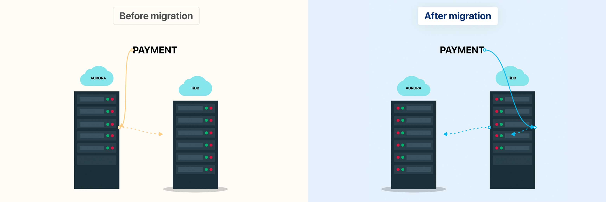
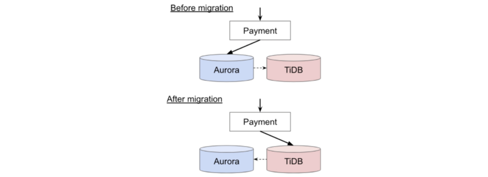

**Industry:** Mobile Payment

**Authors:**
- George Li (Platform Engineer)
- Shinnosuke (Platform Engineer)

> PayPay is the dominant player in Japan's QR code payment market. Its payment system processes thousands of requests per second and has zero-tolerance for errors. To meet such challenges, we migrated the core payment DB to [TiDB](https://docs.pingcap.com/tidb/stable/overview/). The migration was completed during COVID-19 by teams located in 3 different countries. This post was written by myself and my teammate Shinnosuke.

- George Li, Platform Engineer

## Introduction

With 33M users, [PayPay](https://paypay.ne.jp/?pid=official_sns&utm_source=twitter&shortlink=34a78924&utm_medium=social&af_adset=profile&af_ad=201905&utm_campaign=twitter_01&af_channel=twitter&c=twitter_01) has strict requirements on the payment system's response time. During PayPay's rapid growth, the core payment service was experiencing performance issues due to the increased processing time in its Aurora database. Such performance issues would be limiting PayPay's business growth, and thus we had to solve this problem before the system traffic reaches the tipping point.

After research and PoC, we [migrated the core payment database from Aurora to TiDB](https://pingcap.com/case-studies/japan-largest-mobile-payment-company-migrates-from-aurora-to-a-scale-out-database), a scalable distributed database with high availability and cross-region replicas. We finished the migration in 3 months, and since the migration, the payment system can now **support 3 times throughput compared to before**.

## Background

PayPay uses a microservice architecture and hosts its infrastructure on AWS. Payment service is the core service that processes all user payments. Therefore, its performance has a direct impact on user experience.

 The payment service architecture 

Payment service ran on Aurora and in a while it served us well at the beginning, with PayPay growing explosively, we found that Aurora was not enough to handle the projected load, even after upgrading to the highest hardware spec. Due to this, we had to look into a different database (DB) solution as we projected the app's growth to continue.

## Why TiDB

Here are some of the main reasons why we decided to move forward with migrating to TiDB:

1. It supports distributed transactions with strong consistency. This was a key requirement for the transactional payment system.
2. Compatible with MySQL protocol. We just reused the same MySQL client/library for the service and didn't experience any issues.
3. Can scale-out on demand. We have done scaling out in production and the whole process takes less than 3 hours.
4. No sharding means no intrusion to business logic.
5. Many existing [clients](https://pingcap.com/case-studies/Financial-Services) in the financial industry with proven records.

## How the migration was done

### Data integrity check

To verify the reliability and correctness of TiDB, we performed a data integrity check-in 2 ways.

1. Database level check: We capture the JDBC query by p6spy, persist in Apache Kafka, and replay the queries against both Aurora and TiDB. In the end, we compare data in Aurora and TiDB to make sure query execution results are the same.
2. Domain level check: We run Amazon EMR/Hadoop jobs to compare the data in TiDB with data in other microservices. The comparison logic is based on the domain logic so that we know the data remains consistent from the customer's point of view.

We had integrity checks running for 2 months before the migration and 1 month after the migration to ensure that absolutely no data is corrupted during and after the migration.

### Performance test

We used the same set of load testing suites with Gatling against both Aurora and TiDB, and verified that **TiDB can support 3x the throughput compared to Aurora while maintaining < 1-second P99 latency SLA**.

### Disaster recovery drills

We simulated 30+ disaster cases, including instance failure, availability zone (AZ) failure, and region failure. We confirmed that **TiDB could maintain system availability even when a whole AZ is down.**

When a whole region is down, e.g., a power outage in the whole of Tokyo, our recovery point objective (RPO) is close to 0. However, due to the volume of data we have, our recovery time objective (RTO) remains high. A newer version of TiDB has a solution to resolve this RTO issue for us.

### Switching traffic

For read-only DB, DB migration is commonly done by incremental traffic switching between the two DBs. However, payment DB is a write-heavy DB. This means that incremental traffic switches will introduce massive intrusions to domain code. Thus, we had to use a one-shot migration approach.

 Migrating from Amazon Aurora to TiDB 

To mitigate the risk of one-shot migration, we have to ensure that we can roll back immediately if we discover any problem. Therefore, we set up the topology as follows:

1. Before the migration, we had binlog replication from Aurora to TiDB.
2. After the migration, we reversed the binlog replication direction.

Before the production migration, we performed multiple drills with the involvement of business teams. **The actual production migration concluded in 2 hours without any issue.**

## Conclusion

TiDB went online in March, and PayPay has experienced no issue since. This scalable distributed database gave us **3 times the throughput compared to Aurora, with increased reliability and performance**.

_This post was originally published on [Paytm Labs Blog](https://paytmlabs.com/blog/2020/12/tidb-migration-pay-pay/)._
