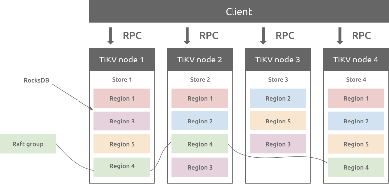

**Author:** Herald Yu (Director of Marketing at Juicedata)

**Editor:** [Ran Huang](https://github.com/ran-huang)


As a cloud-native distributed storage system, [JuiceFS](https://juicefs.com/?hl=en) was designed into a plug-in structure at the beginning of its birth to ensure that new technologies can be continuously integrated into the JuiceFS ecosystem. According to your needs, you can flexibly choose two core components, the data storage engine and the metadata engine, according to their needs.

The data storage engine is mainly object storage. It supports almost all public and private cloud object storage services, as well as KV storage, WebDAV, and local disks. The metadata engine supports databases such as Redis, MySQL, PostgreSQL, and SQLite.

The newly released JuiceFS v0.16 officially supports TiKV, a distributed key-value database, which further meets the requirements for elastic scaling in high-performance, large-scale data storage.

In this article, I'll share with you how to use JuiceFS and select TiKV as a metadata engine.

## TiKV, a highly scalable KV database

TiKV is a distributed transactional key-value database featuring high scalability, low latency, and ease of use. It easily processes over a trillion rows of data in petabytes.

TiKV supports unlimited horizontal scaling and provides a distributed transaction interface that meets ACID compliance. It also ensures data consistency and high availability of multiple replicas using the [Raft protocol](https://raft.github.io/raft.pdf).


<div class="caption-center">TiKV architecture</div>

TiKV was developed by [PingCAP](https://pingcap.com/about) and is a graduated project of the Cloud Native Computing Foundation (CNCF).

## Install TiKV

PingCAP provides TiUP, a package manager, which can easily install TiKV on Linux or macOS.

### Install TiUP

This command downloads and installs the appropriate TiUP version to your system.

```shell
curl --proto '=https' --tlsv1.2 -sSf https://tiup-mirrors.pingcap.com/install.sh | sh
```

For the settings to take effect, you can open a new terminal, or manually declare the global environment variable as follows:

```shell
source .bash_profile
```

Now try to execute the command `tiup -v` and see the version information similar to the following, which means the installation is successful.

```shell
tiup -v

1.5.4 tiup
Go Version: go1.16.6
Git Ref: v1.5.4
GitHash: b629670276269cd1518eb28f362a5180135cc985
```

#### Deploy a TiKV cluster

For testing purposes, we'll use the TiUP `playground` component to install a minimal TiKV test cluster in the local environment.

```shell
tiup playground --mode tikv-slim
```

After the deployment is successful, the terminal displays a message similar to the following:

```
PD client endpoints: [127.0.0.1:2379]
To view the Prometheus:[ http://127.0.0.1:9090](http://127.0.0.1:9090/)
To view the Grafana:[ ](http://127.0.0.1:3000/)http://127.0.0.1:3000
```

Among them, `<127.0.0.1:2379>` is the [Placement Driver](https://github.com/tikv/pd) (PD) address, which manages and schedules the TiKV cluster. JuiceFS will interact with TiKV through this address. The other two addresses are Prometheus and Grafana services, which are used for monitoring and data visualization of TiKV clusters.

**Note**: The playground component of TiUP is mainly used to quickly build a minimal test cluster of TiDB and TiKV in the local environment. For production environment deployment, please refer to [TiKV Official Document](https://tikv.org/docs/5.1/deploy/install/install/).

## Install JuiceFS

JuiceFS supports Linux, Windows, and macOS systems. You only need to download the corresponding version of the client program and place it in the executable path of the system. For example, I use a Linux distribution, so I can install the latest version of the client by executing the following commands in sequence.

Check the current system information and set temporary environment variables:

```shell
JFS_LATEST_TAG=$(curl -s https://api.github.com/repos/juicedata/juicefs/releases/latest | grep 'tag_name' | cut -d '"' -f 4 | tr -d 'v')
```

Download the latest version of the JuiceFS client corresponding to your system:

```shell
wget "https://github.com/juicedata/juicefs/releases/download/v${JFS_LATEST_TAG}/juicefs-${JFS_LATEST_TAG}-linux-amd64.tar.gz"
```

Unzip the package:

```shell
mkdir juice && tar -zxvf "juicefs-${JFS_LATEST_TAG}-linux-amd64.tar.gz" -C juice
```

Install JuiceFS client to `/usr/local/bin`:

```shell
sudo install juice/juicefs /usr/local/bin
```

Execute the command and see the help information returned, which means that the client is installed successfully.

```shell
juicefs

NAME:
  juicefs - A POSIX file system built on Redis and object storage.

USAGE:
  juicefs [global options] command [command options] [arguments...]

VERSION:
  0.16.1 (2021-08-16 2edcfc0)

COMMANDS:
  format   format a volume
  mount    mount a volume
  umount   unmount a volume
  gateway  S3-compatible gateway
  sync     sync between two storage
  rmr      remove directories recursively
  info     show internal information for paths or inodes
  bench    run benchmark to read/write/stat big/small files
  gc       collect any leaked objects
  fsck     Check consistency of file system
  profile  analyze access log
  stats    show runtime stats
  status   show status of JuiceFS
  warmup   build cache for target directories/files
  dump     dump metadata into a JSON file
  load     load metadata from a previously dumped JSON file
  help, h  Shows a list of commands or help for one command

GLOBAL OPTIONS:
  --verbose, --debug, -v  enable debug log (default: false)
  --quiet, -q             only warning and errors (default: false)
  --trace                 enable trace log (default: false)
  --no-agent              Disable pprof (:6060) and gops (:6070) agent (default: false)
  --help, -h              show help (default: false)
  --version, -V           print only the version (default: false)

COPYRIGHT:
  AGPLv3
```

You can also visit the [JuiceFS GitHub Releases](https://github.com/juicedata/juicefs/releases) page to select other versions for manual installation.

<div class="trackable-btns">
  <a href="/download" onclick="trackViews('Getting Started with JuiceFS Using TiKV', 'download-tidb-btn-middle')"><button>Download TiDB</button></a>
  <a href="https://share.hsforms.com/1e2W03wLJQQKPd1d9rCbj_Q2npzm" onclick="trackViews('Getting Started with JuiceFS Using TiKV', 'subscribe-blog-btn-middle')"><button>Subscribe to Blog</button></a>
  </div>

## Use TiKV in JuiceFS

Here I refer to [JuiceFS Quick Start Guide](https://github.com/juicedata/juicefs/blob/main/docs/en/quick_start_guide.md#2-object-storage), and build a MinIO object storage locally. The access address is <http://127.0.0.1:9000>, and `Access Key ID` and `Access Key Secret` are both `minioadmin`.

### Create a file system

The following command uses the `format` subcommand provided by the JuiceFS client to create a file system named `mystor`. In this command, [TiKV database address format](https://github.com/juicedata/juicefs/blob/main/docs/en/databases_for_metadata.md#TiKV) uses the PD address of the TiKV cluster:

```shell
juicefs format \
    --storage minio \
    --bucket[ http://127.0.0.1:9000/mystor](http://127.0.0.1:9000/mystor) \
    --access-key minioadmin \
    --secret-key minioadmin \
    tikv://127.0.0.1:2379/mystor \
    mystor
```

Parameter Description:

* `--storage`: Specifies the data storage engine, here is `minio`.
* `--bucket`: Specifies the bucket access URL. In this case, it is the bucket `mystor` I created in advance on MinIO.
* `--access-key` and `--secret-key`: Specifies the secret key for accessing the object storage service API.
* When you use TiKV to store metadata, set the PD address of the cluster. When multiple file systems or applications share the same TiKV, it is recommended to add a prefix. In this case, the prefix `mystor` is specified in the PD address.

If you see output similar to the following, the file system was created successfully:

```
2021/08/12 23:28:36.932241 juicefs[101222] <INFO>: Meta address: tikv://127.0.0.1:2379/mystor
[2021/08/12 23:28:36.932 +08:00] [INFO] [client.go:214] ["[pd] create pd client with endpoints"] [pd-address="[127.0.0.1:2379]"]
[2021/08/12 23:28:36.935 +08:00] [INFO] [base_client.go:346] ["[pd] switch leader"] [new-leader=http://127.0.0.1:2379] [old-leader=]
[2021/08/12 23:28:36.935 +08:00] [INFO] [base_client.go:126] ["[pd] init cluster id"] [cluster-id=6995548759432331426]
[2021/08/12 23:28:36.935 +08:00] [INFO] [client.go:238] ["[pd] create tso dispatcher"] [dc-location=global]
2021/08/12 23:28:36.936892 juicefs[101222] <INFO>: Data uses minio://127.0.0.1:9000/mystor/mystor/
2021/08/12 23:28:36.976722 juicefs[101222] <INFO>: Volume is formatted as {Name:mystor UUID:0c9594a8-fe2c-463c-a4b6-eb815f38c843 Storage:minio Bucket:http://127.0.0.1:9000/mystor AccessKey:minioadmin SecretKey:removed BlockSize:4096 Compression:none Shards:0 Partitions:0 Capacity:0 Inodes:0 EncryptKey:}
```

### Mount the file system

Use the `mount` subcommand to mount the file system to the `jfs` directory under the current user's home directory:

```shell
sudo juicefs mount -d tikv://127.0.0.1:2379/mystor ~/jfs
```

The `sudo` command is used here to mount the file system as a super user. The purpose is to allow JuiceFS to create and use the /var/jfsCache directory to cache data.

If you see output similar to the following, the file system is mounted successfully:

```
2021/08/12 23:34:44.288136 juicefs[101873] <INFO>: Meta address: tikv://127.0.0.1:2379/mystor
[2021/08/12 23:34:44.288 +08:00] [INFO] [client.go:214] ["[pd] create pd client with endpoints"] [pd-address="[127.0.0.1:2379]"]
[2021/08/12 23:34:44.291 +08:00] [INFO] [base_client.go:346] ["[pd] switch leader"] [new-leader=http://127.0.0.1:2379] [old-leader=]
[2021/08/12 23:34:44.291 +08:00] [INFO] [base_client.go:126] ["[pd] init cluster id"] [cluster-id=6995548759432331426]
[2021/08/12 23:34:44.291 +08:00] [INFO] [client.go:238] ["[pd] create tso dispatcher"] [dc-location=global]
2021/08/12 23:34:44.296270 juicefs[101873] <INFO>: Data use minio://127.0.0.1:9000/mystor/mystor/
2021/08/12 23:34:44.296768 juicefs[101873] <INFO>: Disk cache (/var/jfsCache/0c9594a8-fe2c-463c-a4b6-eb815f38c843/): capacity (1024 MB), free ratio (10%), max pending pages (15)
2021/08/12 23:34:44.800551 juicefs[101873] <INFO>: OK, mystor is ready at /home/herald/jfs
```

Use the `df` command to see the mounting status of the file system:

```
df -Th
File system    type             capacity used usable used%  mount point
JuiceFS:mystor fuse.juicefs       1.0P   64K  1.0P    1%   /home/herald/jfs
```

After mounting, you can now store data in the `~/jfs` directory just like using a local hard disk.

### View file system information

The `status` subcommand can view the basic information and connection status of a file system.

```shell
juicefs status tikv://127.0.0.1:2379/mystor

{
 "Setting": {
   "Name": "mystor",
   "UUID": "9f50f373-a7ec-4d5b-b790-3defbf6d0509",
   "Storage": "minio",
   "Bucket": "http://127.0.0.1:9000/mystor",
   "AccessKey": "minioadmin",
   "SecretKey": "removed",
   "BlockSize": 4096,
   "Compression": "none",
   "Shards": 0,
   "Partitions": 0,
   "Capacity": 0,
   "Inodes": 0
 },

 "Sessions": [
   {
     "Sid": 2,
     "Heartbeat": "2021-08-13T10:43:35+08:00",
     "Version": "0.16-dev (2021-08-12 a871c3d)",
     "Hostname": "herald-manjaro",
     "MountPoint": "/home/herald/jfs",
     "ProcessID": 6309
   }
 ]
}
```

In the output, you can learn more about the data storage engine used by the file system and the status of the host that the file system mounts on.

In addition, v0.16 and above can also learn the detailed configuration of the file system by viewing the `.config` virtual file in the root directory of the mount point:

```shell
sudo cat ~/jfs/.config

{
"Meta": {
 "Strict": true,
 "Retries": 10,
 "CaseInsensi": false,
 "ReadOnly": false,
 "OpenCache": 0,
 "MountPoint": "jfs",
 "Subdir": ""
},

"Format": {
 "Name": "myabc",
 "UUID": "e9d8373c-7ced-49d9-a033-75f6abb44854",
 "Storage": "minio",
 "Bucket": "http://127.0.0.1:9000/mystor",
 "AccessKey": "minioadmin",
 "SecretKey": "removed",
 "BlockSize": 4096,
 "Compression": "none",
 "Shards": 0,
 "Partitions": 0,
 "Capacity": 0,
 "Inodes": 0
},

"Chunk": {
 "CacheDir": "/var/jfsCache/e9d8373c-7ced-49d9-a033-75f6abb44854",
 "CacheMode": 384,
 "CacheSize": 1024,
 "FreeSpace": 0.1,
 "AutoCreate": true,
 "Compress": "none",
 "MaxUpload": 20,
 "Writeback": false,
 "Partitions": 0,
 "BlockSize": 4194304,
 "GetTimeout": 60000000000,
 "PutTimeout": 60000000000,
 "CacheFullBlock": true,
 "BufferSize": 314572800,
 "Readahead": 0,
 "Prefetch": 1
},

"Version": "0.16.1 (2021-08-16 2edcfc0)",
"Mountpoint": "jfs"
}
```

**Notice**: It is important to note that this article uses a local demo environment. If you need to share and mount the same JuiceFS file system on multiple hosts, make sure that the deployed object storage and TiKV cluster can be accessed by all hosts.

### Unmount the file system

You can use the `umount` subcommand to unmount the file system, for example:

```shell
sudo juicefs umount ~/jfs
```

**Warning**: [Force the unmount of the file system in use](https://github.com/juicedata/juicefs/blob/main/docs/en/quick_start_guide.md#7-unmount-juicefs) may cause data damage or loss, please be careful.

### Mount at boot

If you don't want to manually remount JFS on every reboot, you can set up auto mounting.

First, rename the `juicefs` client to `mount.juicefs` and copy it to the `/sbin/` directory:

```shell
sudo cp /usr/local/bin/juicefs /sbin/mount.juicefs
```

Edit the `/etc/fstab` configuration file and add a new record:

```
tikv://127.0.0.1:2379/mystor    /home/herald/jfs       juicefs     _netdev,cache-size=20480     0  0
```

In the mount option, `cache-size=20480` means allocating 20GB of local disk space to JuiceFS cache. Please determine the allocated size according to the actual hardware conditions. Generally speaking, the more cache space for JuiceFS, the better performance.

You can adjust the [FUSE mount options](https://github.com/juicedata/juicefs/blob/main/docs/en/fuse_mount_options.md) in the above configuration according to your needs.

## Benchmarking TiKV, MySQL, and Redis

To understand the differences between TiKV and other backends, we benchmarked the performance of TiKV, MySQL, and Redis using Golang's benchmarking tools. In the same environment, the three databases' performance varies a lot:


The figures in the table refer to the duration (in microseconds) of each operation, so the smaller duration, the better performance. The digits in parentheses are the ratio to that of Redis-Always.

Both Redis and MySQL have only one replica in the benchmarking, while TiKV uses a three-replica distributed architecture. **Even though TiKV has three replicas, it still performs better than MySQL.** TiKV is 2~3 times slower than Redis in terms of metadata operations alone. However, when it comes to data storage, object storage latency takes large proportions, so in real-life business, the latency gap between TiKV and Redis is much smaller, and, more importantly, TiKV outperforms Redis in terms of reliability and scalability.

## Summary

For JuiceFS, the support for TiKV as a metadata engine is a milestone. As a new choice for JuiceFS users, TiKV provides easier horizontal scaling than Redis and better performance than MySQL and PostgreSQL.

JuiceFS is an open-source project under the AGPLv3, and its development is inseparable from everyone's contribution. An article, a page of documentation, an idea, a suggestion, a report, or a bug fix, no matter how big or small the contribution is, is the driving force for the progress of an open-source project.

If you're interested in JuiceFS, here is what you can do for the community:

* Starring the [project](https://github.com/juicedata/juicefs) on GitHub
* Post your opinion on the [Forum](https://github.com/juicedata/juicefs/discussions)
* Pick a task from [Issues](https://github.com/juicedata/juicefs/issues)
* Improve our [document](https://github.com/juicedata/juicefs/tree/main/docs)
* Share anything about JuiceFS on your blog, Twitter, Vlog, or other social media.
* Join our [Slack channel](https://juicefs.slack.com/)
* Tell more people about JuiceFS

We sincerely welcome everyone who loves open source to join our community and make JuiceFS better together!

*An original version of this article was published on [Medium](https://juicefs.medium.com/getting-started-with-juicefs-using-tikv-database-b1a585633b1d).*
