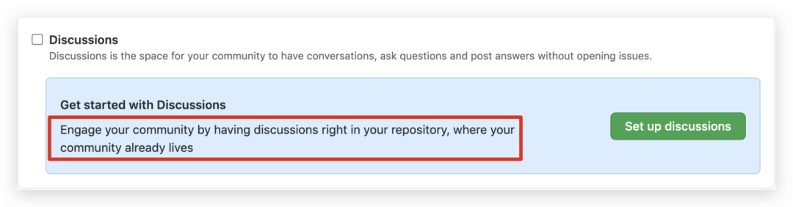
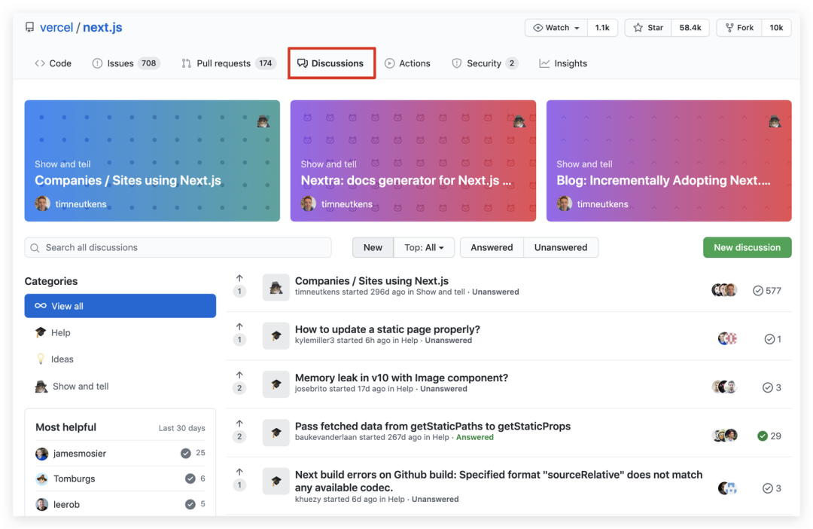
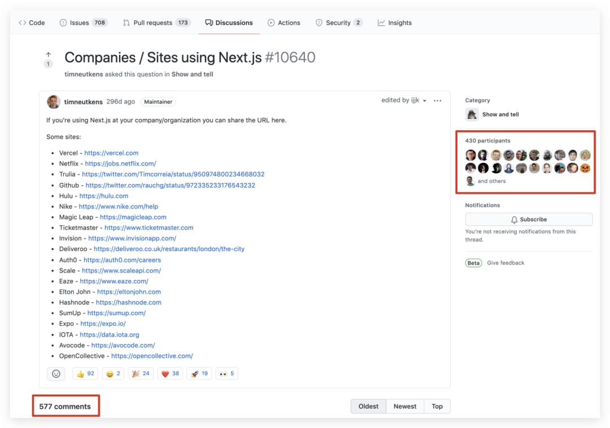
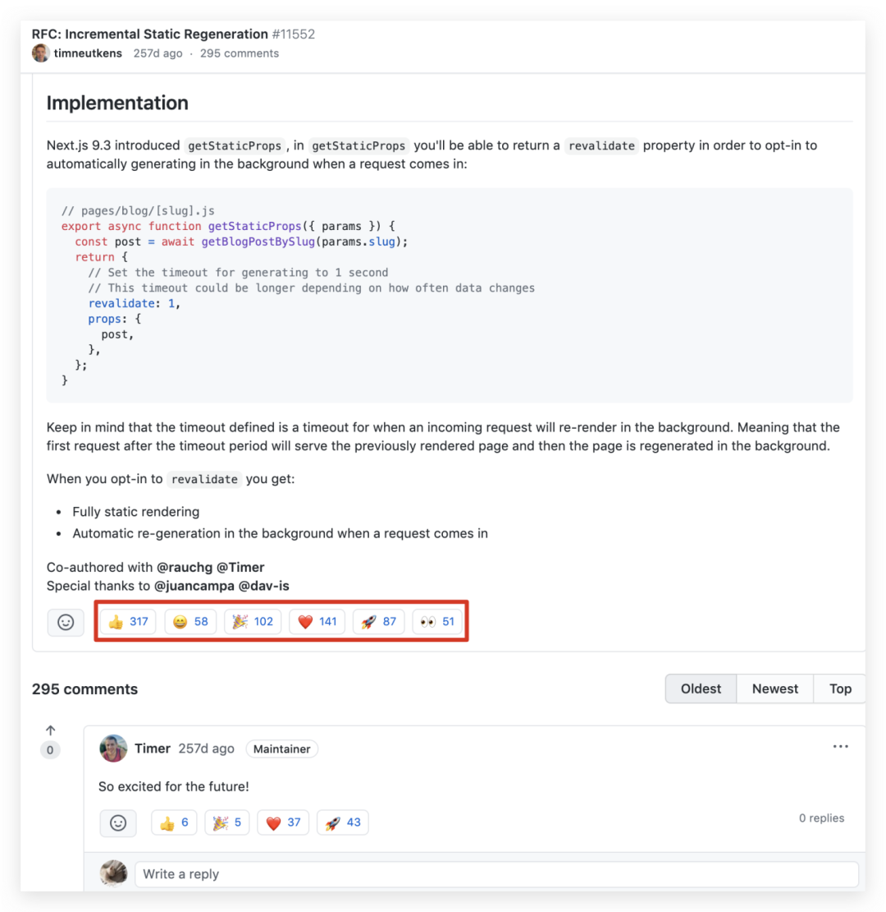
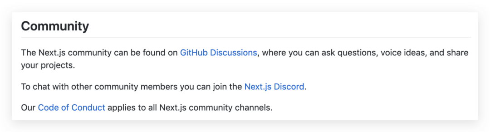

I use open source projects on GitHub every day, and I've often wondered:

 Where do open source communities live? 

Previously for different projects, I might have different answers in mind:

* **GitHub:** because that's where the source code is and I can contribute to the project by opening issues and pull requests.
* **Slack/Gitter/Google Groups/Self-hosted forums:** because that's where I chat and discuss with other contributors and feel belonged to a community.
* **Stack Overflow:** because sometimes it's the only place that I can get quick support for my usage questions.

It wasn't until GitHub recently introduced the Discussions feature that I found my only answer:

 For an open source project on GitHub, its community can be right on GitHub. 

In this post, I'll explain why the open source community was scattered around the Internet, how GitHub Discussions brings the community closer together, and why the open source community's future tends to be all in GitHub. In the final part, I'll provide a different viewpoint to encourage you to think beyond the feature itself.

## GitHub: organized software but a scattered community

> "People around the world are turning to open source—and to GitHub. It is becoming not only the home for developers, but a platform where people in many roles, doing diverse work, come to learn, engage with the community, and contribute to projects that advance the greater good." GitHub Octoverse 2020 Report

GitHub is a world-leading developer platform as well as a community-based project collaboration platform.

GitHub has over 56 million developers worldwide and they have added more than 1.9 billion contributions to GitHub projects over the last year.

Significantly, most of these contributions came from open source communities.

**"Open source" is a way people interact, learn, and create with each other in the community.**

**However, is GitHub good enough to be the home base for open source communities where members can do all these things?**

Whether you are a project maintainer or user, this question is worth pondering.

If you are a project maintainer, ask yourself:

* How do you talk with the community?
* How do community members talk with each other?
* How do you organize community members to make better contributions?

If you are a user of open source projects, ask yourself:

* How can you get quick responses to your questions?
* How do you know the latest progress and news about a project?
* How do you connect with a project and contribute as much as you can?

To achieve these things, an open source community should have at least three components:

* **A place for members to communicate**
* **An official bulletin board**
* **A community knowledge base**

Previously, GitHub only provided Issues and Pull Requests for communities to interact.

Both pages are **linearly organized**, making them suitable for quickly merging code, but not for **multi-threaded communication** or building a **community knowledge base**.

Also, GitHub's Wiki is not a good place to collect fragmented content.

To conclude, **GitHub itself was not able to provide the infrastructure for an open source community.**

As a result, **a project's community is scattered around the Internet.**

Take a software project as an example:

* Daily chat may happen in Gitter or Slack.
* Usage issues may exist on Stack Overflow or GitHub Issues.
* In-depth discussions are in self-built forums or Google Groups.
* The latest project progress and news are released on wiki pages or official websites.

**The interaction of community members is so "distributed" that high-quality discussions and other content are dispersed across many platforms. The community is thus likely to become loose and unorganized, making it harder for newcomers to learn from the community.**

If you have the same frustrations as I do, you can now breathe a sigh of relief.

GitHub recently introduced a new feature, **Discussions**, to bring together the "stray" parts of a community and put them closer to the source code—right in the project repository itself.

## Overview of Discussions

> "Software communities don't just write code together. They brainstorm feature ideas, help new users get their bearings, and collaborate on best ways to use the software. …Conversations need their own place—that's what GitHub Discussions is for." [GitHub Blog: New from Satellite 2020](https://github.blog/2020-05-06-new-from-satellite-2020-github-codespaces-github-discussions-securing-code-in-private-repositories-and-more/)

Discussions is a beta feature that GitHub launched earlier 2020. At first, it was only open to a few select projects, such as Next.js and Office 365 CLI.

**On Dec 8, 2020, GitHub announced that Discussions is officially available in beta for public repositories.**

Every public repository can now enable it in **Settings>Options>Features>Discussions**.

 The Settings page for enabling Discussions 

When Discussions is enabled, it appears as a new tab in the repository page. (See the red box below.) It works like a unified forum where people share information, ask for help, and interact with the project maintainers.

 The Discussions page in the next.js repo 

A discussion page is similar to an issue page, but Discussions also provides some additional features:

* **Customize the category of discussions**, such as Q&A, ideas, show and tell, and help-wanted.
* **Migrate existing issues to discussions.**
* **Mark a reply as a solution to a question**, which is similar to Stack Overflow.
* **Start a thread for a conversation**, which is similar to Slack.
* **Pin up to four discussions on the Discussions homepage** as official bulletin boards.

## Upsides and downsides

**For project maintainers**, Discussions can bring them the following benefits:

* **A complete open source community with the attributes of a social network**

    Discussions tightly integrates with other repository features, and it compensates for the lack of certain social media features.

    Now the "map" seems complete. Maintainers can use:

    * Issues for collecting bug reports and feature requests
    * Pull Requests for accepting contributions
    * Projects and Kanban for project collaboration and management
    * Actions for continuous integration
    * Sponsors for getting funding from the community
    * Wiki for publishing important documents
    * Discussions for community interaction

* **Less "noise" in Issues**

    Big projects' repositories tend to have thousands of issues, including bug reports, feature requests, usage questions, and general discussions. Issues pile up and become a mess, making it difficult to manage.

    But now, maintainers can migrate all issues other than bug reports and feature requests to Discussions for clearer categorization. Community members can help each other solve problems in Discussions, and thus ease maintainers' burden.

* **An entrance for newcomers and home to all members**

    Maintainers can place general project information on Discussions homepage, such as learning materials, contribution guidelines, code samples, and blog links, to help newcomers quickly get familiar with the project and the community.

    As members learn, discuss, and communicate in Discussions, they also build a home base around the project.

    For example, in the following discussion page, the next.js project maintainer invites everyone to complete the adopter list, cultivating a sense of ownership in the community:

 The adopter list discussion page in the next.js project 

However, Discussions also has some downsides:

* Discussions makes it easier to communicate, so the number of discussions is likely to increase a lot, which means the maintainer has more things to manage. This might not be good news—especially for amateur project maintainers.
* Maintainers need to help users understand the differences between Discussions and Issues because the distinction is unclear.

For **users of open source projects**, as far as I see, this feature seems only to be a good thing.

In the past, when project users had a problem, they might have taken these steps:

* Run into a problem.
* Search in Google.
* Browse Stack Overflow or GitHub Issues.
* If they can't find the answer, create a new question.

But now, their problem-solving procedure is probably like this:

* Run into a problem.
* Search it in the project Discussions.
* If they can't find an answer, create a new discussion.

**Discussions is expected to become the first place where users seek solutions, because this is the only dedicated community for the project.**

## The future of open source communities

> "The strongest communities support growth and participation by engaging newcomers and contributors while also helping provide sustainable work for maintainers." GitHub Octoverse 2020 Report

Now that there is Discussions, what will the GitHub open source communities look like in the future?

It is hard to answer, but we may get a glimpse of the future by reviewing the projects which already used Discussions for a long time.

In March 2020, Office 365 CLI team [announced](https://twitter.com/climicrosoft365/status/1243829613282893825?s=20) that they were going to disband their Gitter channel and migrate all future discussions to their Discussions page on GitHub.

According to the GitHub Octoverse 2020 Report, the next.js repository started using Discussions in January, 2020. By October, community members had opened over 3,000 discussions to communicate and collaborate. Almost half of those who have contributed to the repository used Discussions.

To encourage community members to discuss new features, next.js even migrated Request for Comments (RFC) proposals from Issues to Discussions.

See the members' reactions outlined in the red box below? This is a real "alive" community!

 The Discussions RFC page 

Currently, the next.js repository README only leads its community members to two places: Discussions and Discord. Discussions is for asking questions, discussing ideas, and sharing new projects, and Discord is for chatting.

 The Community section on the next.js repository homepage 

The above examples are a sign that **the shape of open source communities is changing from scattered to more unified.**

**Having the community running in just one platform not only reduces the cost of participation for community members, but also, to some extent, relieves the stress on project maintainers.**

It seems hopeful to me that the future of open source communities would be:

 All in GitHub 

* **GitHub Issues** is for collecting bug reports and feature requests.
* **GitHub Discussions** is for anything that requires agile communication, including at least three types:
    * RFCs for new features
    * Learning materials and project announcements
    * Q&A and other types of communication
* **GitHub Projects** is for tracing development progress. Community members can participate in the collaboration.
* **GitHub Pull Request** is for committing code. Community members can take part in the code review.

With Discussions, **project information alignment becomes centralized, transparent, and faster**.

Every question and answer made by community members is a contribution to the community knowledge base, and every "👍" they left in the RFC discussion page takes its part in the project's decision making.

Every author of an open source project has probably dreamed of building an active, self-governed, and contributing open source community that accelerates good iterations of the project.

It seems that we are now one step closer to that dream.

## Thinking beyond the feature

GitHub is an awesome product. It has introduced more useful and thoughtful features since its acquisition by Microsoft in 2018.

As a fan of GitHub, I am very glad that this company keeps expanding the possibilities of its product.

On [Hacker News](https://news.ycombinator.com/item?id=22388639), however, some developers expressed their concern about the expansion of the "GitHub Kingdom":

> GitHub is slowly eating the surrounding cities. Github pages replaced our hosted sites. Projects replaced Trello/Waffle and friends. Actions replaced Travis/CircleCI. Sponsors is about to hit Patreon, and now Discussions aims for a piece of StackOverflow pie…
>
> I think they are doing great in terms of performance and UI. It's hard to resist the convenience of having everything linked together in a coherent way. But this will probably backfire in the future.

As more projects enable the Discussions feature, I expect that there will be more discussions regarding this concern and some backup plan to solve it.

For now, we need more time to see if this feature will blossom.

Let's wait and see. :-)
