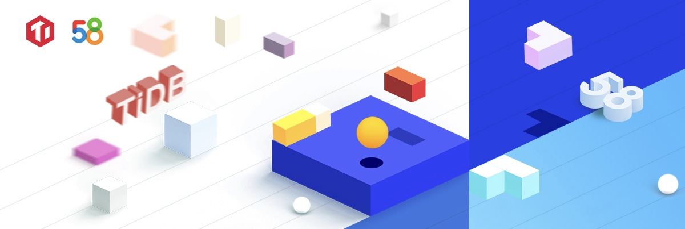
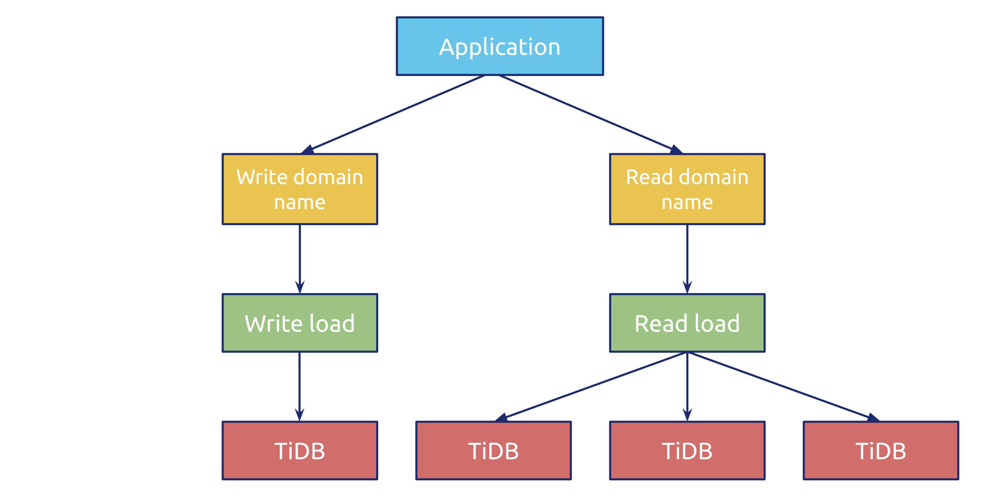

**Industry:** Advertising

**Authors:**

* Chunlei Liu (Senior DBA at 58.com)
* Kai Xuan (Former Senior DBA at 58.com)

**Transcreator:** [Caitin Chen](https://github.com/CaitinChen); **Editor:** Tom Dewan

[58.com](https://www.crunchbase.com/organization/58-com) is China's leading online marketplace for classifieds covering various categories, such as jobs, real estate, automotive, financing, used goods, and local services. Merchants and consumers can publish their advertisements on our online platform so that they can connect, share information, and conduct business. By the end of 2018, we had more than 500 million users, and our total revenue in 2019 was nearly US $2.23 billion.

As our businesses grew, large amounts of data flooded into our databases. But **standalone MySQL databases couldn't store so much data,** and MySQL sharding was an undesirable solution. To achieve MySQL high availability, we needed an external tool. **To perform Online Analytical Processing (OLAP), we had to use complicated and tedious extract, transform, load (ETL) jobs.** We looked for a scalable, easy-to-maintain, highly available database to solve these issues.

After an investigation, we adopted [TiDB](https://docs.pingcap.com/tidb/stable/overview), an open-source, distributed, Hybrid Transactional/Analytical Processing (HTAP) database. Now, our production environment has **52 TiDB clusters** that **store 160+ TB of data**, with **320+ servers** running in **15 applications**. To maintain such large-scale clusters, we **only need two DBAs**.

In this post, we'll deep dive into why we migrated from MySQL to TiDB and how we use TiDB to scale out our databases, perform real-time analytics, and achieve high availability.

## Our pain points

We stored our private cloud monitoring data in MySQL. Because our data size was huge, we needed to regularly clean our tables. This was a lot of work for our DBAs.

When we used MySQL, we encountered these problems:

* **A standalone MySQL database has limited capacity.** It can't store enough data to meet our needs.
* **Sharding was troublesome.** At 58.com, we didn't have a middleware team, and our developers needed to operate and maintain sharding scenarios by themselves. After we sharded our database, it took a lot of work to aggregate the data.
* **To perform OLAP analytics, we must do complex and boring ETL tasks.** An ETL process was time-consuming, and this hindered our ability to do real-time data analytics.
* **To achieve high availability, MySQL relies on an external tool.** We used Master High Availability (MHA) to implement MySQL high availability, but it increased our maintenance cost.
* **In the primary-secondary database framework, MySQL has high latency on the secondary database.** When we performed data description language (DDL) operations, high latency occurred in the secondary database. This greatly affected real-time reads.
* **A standalone MySQL database couldn't support large amounts of writes.** When our writes in a standalone MySQL database reached about 15,000 rows of data, we encountered a database performance bottleneck.

Therefore, we looked for a new database solution with the following capabilities:

* **It has an active community.** If its community is not active, when we find issues or bugs, we can't get solutions.
* **It's easy to operate and maintain.**
* **It can solve our current problems**, such as issues brought by sharding and lots of writes and deletes.
* **It is suitable for many application scenarios and provides multiple solutions.**

## Why we chose TiDB, a NewSQL database

[TiDB](https://docs.pingcap.com/tidb/stable/overview) is an open-source, cloud-native, distributed SQL database built by [PingCAP](https://pingcap.com/) and its open-source community. It is MySQL compatible and features horizontal scalability, strong consistency, and high availability. It's a one-stop solution for both Online Transactional Processing (OLTP) and OLAP workloads. You can learn more about TiDB's architecture [here](https://docs.pingcap.com/tidb/v4.0/architecture).

We adopted TiDB, because it met all our requirements for the database:

* **TiDB uses distributed storage, and it can easily scale out.** We no longer need to worry that a single machine's capacity is limited.
* **TiDB is highly available.** We don't need to use an additional high-availability service. So TiDB helps us eliminate extra operation and maintenance costs.
* **TiDB supports writes from multiple nodes.** This prevents a database performance bottleneck when we write about 15,000 rows of data to a single node.
* **TiDB provides data aggregation solutions for sharding**. With TiDB, we no longer need to shard databases.
* **TiDB has a complete monitoring system.** We don't need to build our own monitoring software.

## How we're using TiDB as an alternative to MySQL

So far, we've deployed **52 TiDB clusters** in the production environment to **store 160+ TB of data**, with **320+ servers** running in **15 applications.** Our databases have **5.5 billion daily visits**. To maintain such large-scale clusters, we **only need two DBAs**, and, meanwhile, they're also managing MySQL databases.

### TiDB's architecture at 58.com

In a TiDB cluster, our application separates read and write domain names, and the backend uses load balancers to balance read and write loads. By default, a single cluster has four TiDB nodes, one for writes and three for reads. If write performance becomes a bottleneck, we can add TiDB nodes.

 TiDB's architecture at 58.com 

### From TiDB 2.0 to TiDB 4.0.2

The following table summarizes how we've used TiDB over the years and how our reliance on TiDB has grown.

<table>
  <tr>
   <td><strong>Date</strong>
   </td>
   <td><strong>TiDB version</strong>
   </td>
   <td><strong>Environment</strong>
   </td>
  </tr>
  <tr>
   <td>April 2018
   </td>
   <td>TiDB 2.0 was introduced in production
   </td>
   <td>
<ul>

<li>Migrated our monitoring log to TiDB</li>

<li>About 2,000 visits per second</li>

<li>7 TB–8 TB of data
</li>
</ul>
   </td>
  </tr>
  <tr>
   <td>December 2018
   </td>
   <td>Upgraded to TiDB 2.1
   </td>
   <td>Four TiDB clusters in production storing all our private cloud's log system data
   </td>
  </tr>
  <tr>
   <td>September 2019
   </td>
   <td>Upgraded to TiDB 3.02 in production and test environments
   </td>
   <td>
<ul>

<li>80 TiDB physical machines storing 40 TB of data</li>

<li>1 billion daily visits</li>

<li>2,300 MySQL clusters and 11 TiDB clusters</li>

<li>(We gradually migrated from MySQL to TiDB.)
</li>
</ul>
   </td>
  </tr>
  <tr>
   <td>September 2020
   </td>
   <td>Upgraded all TiDB clusters to 4.0.2
   </td>
   <td>
<ul>

<li>The Technology and Engineering Group (TEG) Payment Management Center (PMC) order statement application is our core business, and we guarantee that not a single row of its data would be lost. It stored 20 TB of data, with 4,000 read queries per second (QPS) and 1,000 write QPS.</li>

<li><strong>It took us only 9 minutes to upgrade our 20 TB cluster!</strong>
</li>
</ul>
   </td>
  </tr>
</table>

### Our applications running on TiDB

We're running **242 TiDB databases in 15 applications**. To name a few:

<table>
  <tr>
   <td><strong>TiDB clusters</strong>
   </td>
   <td><strong>Applications</strong>
   </td>
   <td><strong>Application details</strong>
   </td>
   <td><strong>Detailed information</strong>
   </td>
   <td><strong>Comment</strong>
   </td>
  </tr>
  <tr>
   <td rowspan="3" >TEG
   </td>
   <td>WList management backend and audio configuration
   </td>
   <td>WList is a general-purpose distributed key-list storage platform developed by the 58 Architecture Platform Department
   </td>
   <td>Data size: 6.3 billion rows of data
   </td>
   <td rowspan="3" >
<ul>

<li>7.2 TB</li>

<li>In the past 6 months, 7 flash memory cards have been damaged in these applications. But <strong>thanks to TiDB's high availability, they didn't affect our businesses</strong>.
</li>
</ul>
   </td>
  </tr>
  <tr>
   <td>WTable management backend
   </td>
   <td>The WTable cluster application accesses monitoring data such as machine CPU, I/O, and network
   </td>
   <td>Data size: 26.2 billion rows of data
   </td>
  </tr>
  <tr>
   <td>Search index
   </td>
   <td>It stores data about user search terms used in the last year
   </td>
   <td>
<ul>

<li>Current data size: 300 million rows of data</li>

<li>Daily increase: 500 thousand to 800 thousand rows of data
</li>
</ul>
   </td>
  </tr>
  <tr>
   <td rowspan="2" >Anjuke (a real estate information service platform)
   </td>
   <td>Operation log
   </td>
   <td>Operation log
   </td>
   <td>Daily increase: 40 million rows of data
   </td>
   <td>
   </td>
  </tr>
  <tr>
   <td>Statement log
   </td>
   <td>Statement log
   </td>
   <td>
<ul>

<li>QPS: 10 thousand at peak</li>

<li>Disk: 1 TB
</li>
</ul>
   </td>
   <td>
   </td>
  </tr>
  <tr>
   <td>User growth
   </td>
   <td>58 information
   </td>
   <td>News
   </td>
   <td>
<ul>

<li>Data size: 50 million rows of data</li>

<li>Disk: 1 TB
</li>
</ul>
   </td>
   <td>
   </td>
  </tr>
  <tr>
   <td>Information security
   </td>
   <td>Verification center
   </td>
   <td>Verification center
   </td>
   <td>Daily increase: 1 million rows of data
   </td>
   <td>
   </td>
  </tr>
  <tr>
   <td>Financial company
   </td>
   <td>The financial real-time data warehouse's underlying data storage
   </td>
   <td>The financial real-time data warehouse's underlying data storage
   </td>
   <td>Thousands of tables
   </td>
   <td>
   </td>
  </tr>
</table>

## Conclusion

Thanks to TiDB's horizontal scalability, high availability, and HTAP capabilities, we could say goodbye to troublesome MySQL sharding and time-consuming ETL. It's so easy to scale out our databases and maintain such large-scale clusters.

Now, at 58.com, we use databases including MySQL, Redis, MongoDB, Elasticsearch, and TiDB. We receive about 800 billion visits per day. We have 4,000+ clusters, with 1,500+ physical servers.

If you have any questions or you'd like to learn more about our experience with TiDB, you can join the [TiDB community on Slack](https://slack.tidb.io/invite?team=tidb-community&channel=everyone&ref=pingcap-blog).
